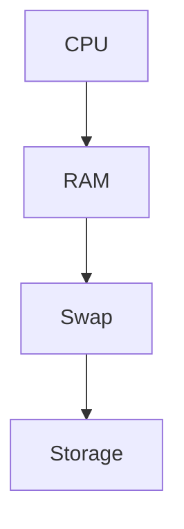
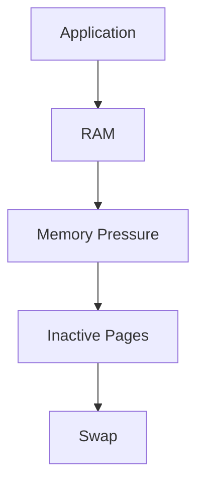
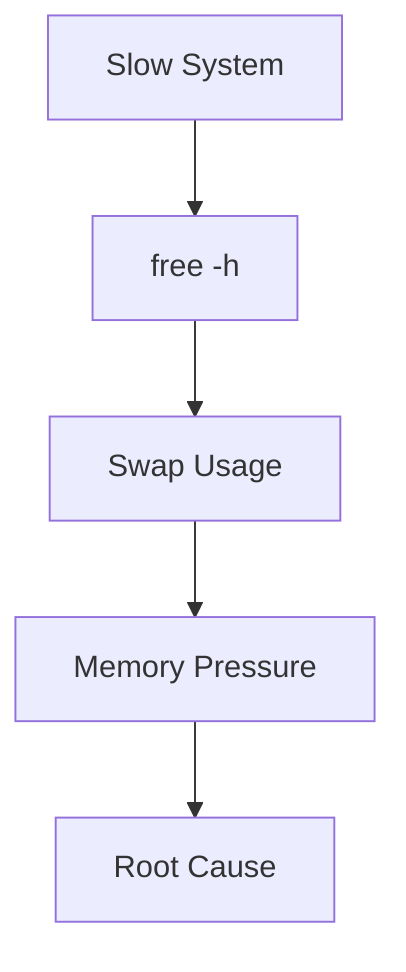

# Swap

> Swap is one of Linux's oldest survival mechanisms.
>
> Great Linux engineers don't think:
>
> "Swap is extra RAM."
>
> They think:
>
> "Swap is an emergency overflow area for memory management."
>
> Swap exists because RAM is finite and applications are greedy.

---

# Why This File Exists

Imagine a server.

```text
16 GB RAM

↓

Applications

↓

RAM Full
```

Now what?

Without swap:

```text
Out Of Memory

↓

OOM Killer

↓

Processes Die
```

Problem.

Linux needed another strategy.

That's why swap exists.

---

# Problem It Solves

This file answers:

```text
What is swap?

Why does swap exist?

Is swap extra RAM?

How does Linux use swap?

Why is swap slow?

Why do cloud engineers still use it?

Why do databases dislike it?
```

---

# Mental Model: A Working Desk

Imagine your desk.

```text
Desk

↓

Fast Workspace
```

You also have a storage cabinet.

```text
Cabinet

↓

Slow Storage
```

When your desk becomes crowded:

```text
Move old papers

↓

Cabinet
```

Linux does exactly this.

```text
RAM

↓

Swap
```

---

# First Principles

RAM is expensive.

RAM is finite.

Applications are greedy.

Question:

```text
What happens when RAM fills up?
```

Options:

```text
Kill applications

or

Move unused memory elsewhere
```

Linux chooses both depending on the situation.

---

# What Is Swap?

Definition:

> Swap is disk space that Linux uses as overflow space for inactive memory pages.

Simple definition:

```text
Swap = Memory Overflow Area
```

---

# Important Rule

Swap is NOT:

```text
Extra RAM
```

Swap IS:

```text
Emergency Overflow Space
```

Huge difference.

---

# Memory Hierarchy

Memorize this forever.

```text
CPU Cache

↓

RAM

↓

Swap

↓

Storage
```

Speed decreases as we go down.

---

# Linux Memory Architecture



---

# Why Linux Needs Swap

Question:

Why not only RAM?

Because workloads change.

Examples:

```text
Chrome Tabs

Databases

Containers

AI Models

Virtual Machines
```

All consume memory.

---

# The Big Idea

Linux classifies memory pages.

```text
Active Pages

Inactive Pages
```

Inactive pages are candidates for swap.

---

# Mental Model: Office Desk

Visual:

```text
Desk

↓

Frequently Used Files


Cabinet

↓

Rarely Used Files
```

Linux:

```text
RAM

↓

Frequently Used Pages


Swap

↓

Rarely Used Pages
```

---

# What Is A Memory Page?

Linux does not swap applications.

Linux swaps pages.

Typically:

```text
4 KB
```

per page.

Visual:

```text
Application

↓

Memory Pages

↓

Swap Candidates
```

---

# What Linux Moves To Swap

Examples:

```text
Unused Browser Tabs

Idle Background Processes

Inactive Application Data
```

Linux tries to avoid swapping active workloads.

---

# Data Flow

Suppose RAM becomes full.

Visual:



---

# Swap In And Swap Out

Two operations exist.

## Swap Out

```text
RAM

↓

Swap
```

Move pages to disk.

---

## Swap In

```text
Swap

↓

RAM
```

Bring pages back.

---

# Why Swap Is Slow

Question:

Why?

Because disks are much slower than RAM.

Approximate speed comparison.

```text
CPU Cache

↓

Nanoseconds

RAM

↓

~100 Nanoseconds

NVMe

↓

Microseconds

SSD

↓

Hundreds of Microseconds

HDD

↓

Milliseconds
```

Huge difference.

---

# RAM vs Swap

| Feature | RAM | Swap |
|---------|-----|------|
| Speed | Extremely Fast | Slow |
| Hardware | Memory Chips | Disk |
| Purpose | Active Data | Overflow Data |
| Performance | Excellent | Poor |
| Ideal Usage | Continuous | Occasional |

---

# Swap Partition vs Swap File

Two approaches exist.

---

# Swap Partition

Dedicated partition.

Visual:

```text
Disk

↓

Swap Partition
```

Example:

```text
/dev/sda3
```

Advantages:

```text
Simple

Traditional

Reliable
```

---

# Swap File

Regular file.

Visual:

```text
Filesystem

↓

swapfile
```

Advantages:

```text
Flexible

Easy

Modern
```

Most modern systems use swap files.

---

# Linux Workflow

Memorize this.

```text
Memory Pressure

↓

Kernel

↓

Page Selection

↓

Swap

↓

Recovery
```

---

# Core Commands

## Show Memory

```bash
free -h
```

---

## Show Swap Devices

```bash
swapon --show
```

---

## Show Detailed Memory

```bash
cat /proc/meminfo
```

---

## Disable Swap

```bash
sudo swapoff -a
```

---

## Enable Swap

```bash
sudo swapon -a
```

---

# Creating A Swap File

Step 1

Create file.

```bash
sudo fallocate -l 4G /swapfile
```

Step 2

Permissions.

```bash
sudo chmod 600 /swapfile
```

Step 3

Format.

```bash
sudo mkswap /swapfile
```

Step 4

Enable.

```bash
sudo swapon /swapfile
```

Step 5

Persist.

Add to:

```text
/etc/fstab
```

```text
/swapfile none swap sw 0 0
```

---

# Swappiness

Very important concept.

Question:

How aggressively should Linux use swap?

Parameter:

```text
vm.swappiness
```

Range:

```text
0 → Avoid swap

100 → Aggressive swap
```

Check:

```bash
cat /proc/sys/vm/swappiness
```

Typical:

```text
60
```

Adjust:

```bash
sudo sysctl vm.swappiness=10
```

---

# Modern Workload Recommendations

## Developer Laptop

```text
4-16 GB RAM

↓

Small Swap

↓

Useful
```

---

## Cloud Server

```text
Small Swap

↓

Useful Safety Net
```

---

## Database Server

```text
Minimal Swap
```

Reason:

```text
Databases hate latency
```

---

## AI Server

Large models consume lots of RAM.

Swap may save crashes.

But performance suffers.

---

# Docker Example

Containers share host memory.

Host memory pressure:

```text
Containers

↓

RAM

↓

Swap
```

Can become dangerous.

---

# Kubernetes Example

Kubernetes generally dislikes swap.

Reason:

```text
Predictability
```

Many Kubernetes deployments disable swap.

---

# Cloud Perspective

Cloud providers often recommend:

```text
Small Swap

1 GB

2 GB

4 GB
```

as a safety net.

---

# OOM Killer

Very important.

Without enough memory:

```text
RAM Full

↓

OOM Killer

↓

Process Terminated
```

Swap can delay this.

But not prevent it forever.

---

# Swap Thrashing

One of the worst situations.

Visual:

```text
RAM

↓

Swap

↓

RAM

↓

Swap

↓

RAM

↓

Swap
```

Constant movement.

System becomes unusable.

Symptoms:

```text
100% Disk Usage

Slow System

Frozen UI
```

---

# Performance Considerations

Questions engineers ask:

```text
Do I actually need more RAM?

Is swap being overused?

Is memory leaking?

Are workloads too large?
```

Usually:

```text
More RAM > More Swap
```

---

# Security Considerations

Swap may contain:

```text
Passwords

Secrets

Tokens

Application Data
```

Encrypt swap on sensitive systems.

---

# Observability Tools

Useful commands.

```bash
free -h

swapon --show

cat /proc/meminfo

vmstat
```

---

# Troubleshooting Workflow

System slow?

Ask:

```text
RAM Full?

↓

Swap Used?

↓

Swap Thrashing?

↓

Memory Leak?

↓

Need More RAM?
```

Visual:



---

# Common Mistakes

## Mistake 1

Thinking swap is RAM.

Wrong.

---

## Mistake 2

Using huge swap to compensate for tiny RAM.

Wrong solution.

---

## Mistake 3

Ignoring swappiness.

Very common.

---

## Mistake 4

Allowing databases to swap heavily.

Bad idea.

---

## Mistake 5

Ignoring swap thrashing.

Very dangerous.

---

# Engineering Mindset

Whenever you hear swap, visualize:

```text
Applications

↓

RAM

↓

Memory Pressure

↓

Swap

↓

Storage
```

Do not think:

```text
Extra RAM
```

Think:

```text
Memory Emergency System
```

That's how engineers think.

---

# Interview Questions

## Beginner

1. What is swap?

2. Why does Linux need swap?

3. Is swap extra RAM?

4. Why is swap slow?

---

## Intermediate

5. Explain swap in and swap out.

6. Explain swappiness.

7. Explain swap files vs swap partitions.

8. Explain OOM killer.

---

## Advanced

9. Explain swap thrashing.

10. Explain Kubernetes and swap.

11. Explain database swap problems.

12. Explain memory management architecture.

---

# Cheat Sheet

```text
Memory Hierarchy

CPU Cache

↓

RAM

↓

Swap

↓

Storage


Useful Commands

free -h

swapon --show

vmstat

cat /proc/meminfo


Golden Rules

Swap ≠ RAM

More RAM > More Swap

Avoid Swap Thrashing

Monitor Memory Pressure
```
