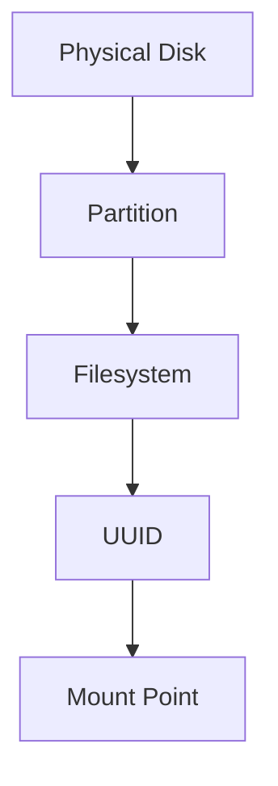
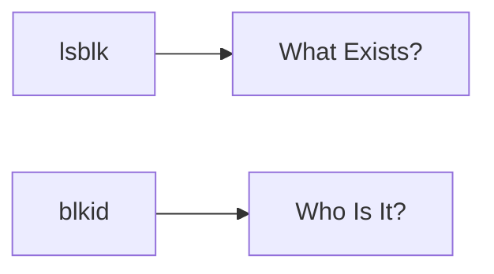
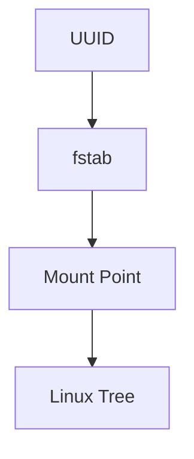
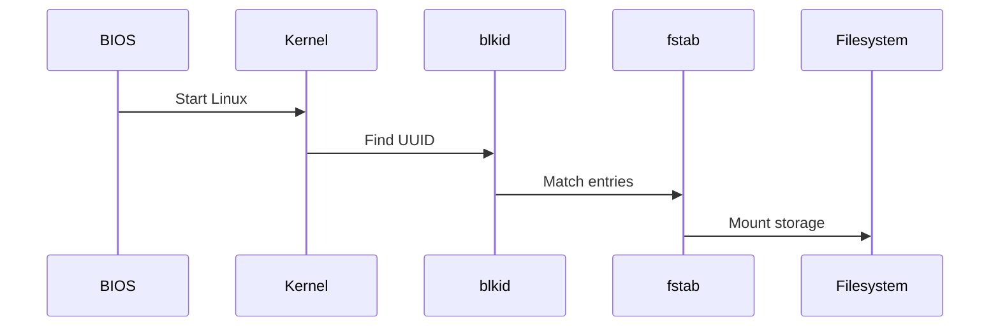
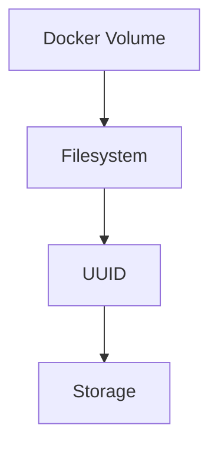
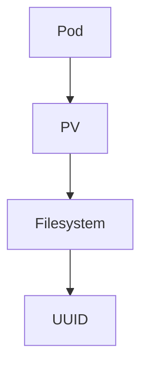
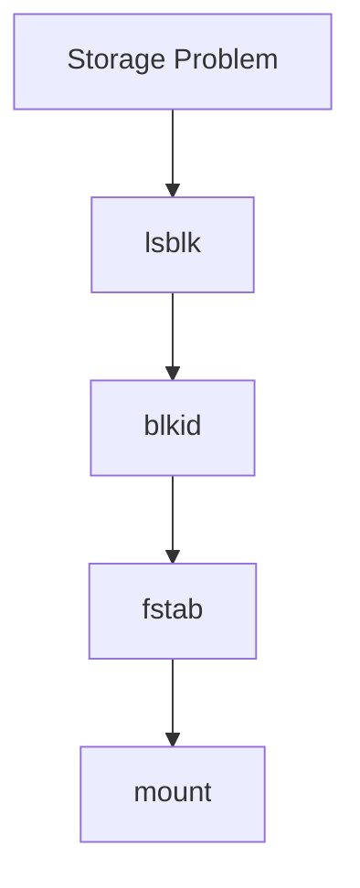

# blkid

> `blkid` is Linux's storage identity system.
>
> Great Linux engineers don't identify storage by names.
>
> They identify storage by identities.
>
> `blkid` answers one question:
>
> **"Who exactly is this storage device?"**

---

# Why This File Exists

Many beginners think:

```text
/dev/sda

↓

My SSD
```

Then one day:

```text
/dev/sda

↓

becomes

↓

/dev/sdb
```

and everything breaks.

Why?

Because device names are not permanent.

Linux needed a better system.

That's why `blkid` exists.

---

# Problem It Solves

This file answers:

```text
What is blkid?

What is UUID?

Why does Linux use UUID?

Why not use /dev/sda?

How does Linux remember disks after reboot?

How does Linux mount storage automatically?

How does Linux boot correctly?
```

---

# Mental Model

Think about humans.

Imagine this.

```text
Two people named John.
```

Problem:

```text
Who is John?
```

Solution:

```text
Government ID
```

Storage has the same problem.

Linux cannot trust names.

Linux needs IDs.

Visual:

```text
Storage Device

↓

Identity Card

↓

UUID
```

---

# What Does blkid Mean?

```text
blk

↓

Block Device


id

↓

Identity
```

Full meaning:

```text
Block Device Identifier
```

---

# First Principles

Linux storage names are dynamic.

These are labels.

```text
/dev/sda

/dev/sdb

/dev/nvme0n1
```

Labels can change.

Identity should not.

---

# The Problem With Device Names

Suppose your computer has:

```text
SSD

HDD
```

Linux today:

```text
SSD

↓

/dev/sda


HDD

↓

/dev/sdb
```

Tomorrow:

```text
HDD

↓

/dev/sda


SSD

↓

/dev/sdb
```

Names changed.

Identity did not.

---

# Why Names Change

Linux detects hardware during boot.

Boot order can change because:

```text
BIOS updates

USB devices

External drives

Cloud infrastructure

Virtual machines

Hardware changes
```

Linux assigns names dynamically.

---

# The Identity Solution

Linux creates:

```text
UUID

Universally Unique Identifier
```

Visual:

```text
Disk

↓

UUID

↓

5f7a4e09-8d57-4b66-b813-a4c4d8f4d0b
```

Think:

```text
Passport Number

↓

Storage Device
```

---

# Big Picture

Visual:



---

# Basic Command

```bash
sudo blkid
```

Example:

```text
/dev/sda1: UUID="7A9B-2C3D" TYPE="vfat"

/dev/sda2: UUID="7fa29f1a-5e74-4a57-bc76-6d1a43c8d761" TYPE="ext4"

/dev/sdb1: UUID="9b2d6f7c-e12d-4bc1-a5af-87bcdf543210" TYPE="xfs"
```

---

# Reading The Output

Example:

```text
/dev/sda2

↓

UUID

↓

TYPE
```

Visual:

```text
Storage Device

↓

Identity

↓

Filesystem Type
```

---

# Mental Model: Human Identity Card

```text
Person

↓

Name

↓

Government ID


Storage

↓

Device Name

↓

UUID
```

Never trust names.

Trust identities.

---

# Important Fields

## UUID

Permanent identity.

Example:

```text
UUID="7fa29f1a-5e74-4a57-bc76-6d1a43c8d761"
```

---

## TYPE

Filesystem type.

Examples:

```text
ext4

xfs

btrfs

vfat
```

---

## LABEL

Human-friendly name.

Example:

```text
LABEL="DataDisk"
```

---

## PARTUUID

Partition identifier.

Different from filesystem UUID.

We'll discuss this later.

---

# Device Name vs UUID

Never confuse these.

## Device Name

```text
/ dev/sda2
```

Properties:

```text
Dynamic

Can change

Temporary
```

---

## UUID

```text
7fa29f1a-5e74-4a57-bc76-6d1a43c8d761
```

Properties:

```text
Stable

Persistent

Reliable
```

---

# Why UUID Exists

Imagine:

```text
Laptop

↓

Linux

↓

External SSD
```

Without UUID:

```text
External SSD unplugged

↓

Device order changed

↓

Boot failure
```

With UUID:

```text
Linux finds storage

↓

By identity

↓

Boot succeeds
```

---

# Most Useful Commands

## Show Everything

```bash
sudo blkid
```

---

## Show One Device

```bash
sudo blkid /dev/sda1
```

---

## Show Specific UUID

```bash
sudo blkid -o value -s UUID /dev/sda1
```

Output:

```text
7fa29f1a-5e74-4a57-bc76-6d1a43c8d761
```

---

## Show Filesystem Type

```bash
sudo blkid -o value -s TYPE /dev/sda1
```

Output:

```text
ext4
```

---

## Show Labels

```bash
sudo blkid -o value -s LABEL
```

---

# The Relationship Between Tools

Visual:



Think:

```text
lsblk

↓

Storage Map


blkid

↓

Storage Identity
```

---

# How Linux Boots

This is extremely important.

During boot:

```text
Power On

↓

BIOS

↓

Bootloader

↓

Kernel

↓

Find Root Filesystem

↓

Mount Root
```

Question:

```text
How does Linux find root?
```

Answer:

```text
UUID
```

---

# Linux Boot Example

Example:

```text
UUID=7fa29f1a-5e74-4a57-bc76-6d1a43c8d761
```

Kernel:

```text
Find this exact storage.
```

Not:

```text
Find /dev/sda2
```

Very important difference.

---

# How fstab Uses UUID

Example:

```text
UUID=7fa29f1a-5e74-4a57-bc76-6d1a43c8d761 / ext4 defaults 0 1

UUID=9b2d6f7c-e12d-4bc1-a5af-87bcdf543210 /mnt/data ext4 defaults 0 2
```

Visual:



---

# The /dev/disk System

Linux creates additional identity systems.

Explore:

```text
/ dev/disk/by-uuid

/ dev/disk/by-label

/ dev/disk/by-id

/ dev/disk/by-partuuid
```

Visual:

```text
Storage

↓

Many identities
```

---

# Data Flow Example

Suppose Linux boots.

Visual:



---

# Production Example 1

Developer Laptop

Bad:

```text
/ dev/sda2
```

Good:

```text
UUID
```

---

# Production Example 2

Cloud VM

Cloud providers dynamically attach disks.

Always use:

```text
UUID
```

---

# Production Example 3

Database Server

Separate:

```text
OS

Database Data

Logs

Backups
```

Identify all using:

```text
UUID
```

---

# Docker Connection

Docker eventually relies on Linux storage identities.

Visual:



---

# Kubernetes Connection

Kubernetes volumes eventually become Linux storage.

Visual:



---

# Performance Considerations

`blkid` itself does not measure performance.

It helps with:

```text
Reliable automation

Persistent mounting

Storage consistency
```

---

# Security Considerations

Protect:

```text
fstab

Encrypted disks

Sensitive partitions
```

Never expose unnecessary storage metadata publicly.

---

# Troubleshooting Workflow

Storage not mounting?

Ask:

```text
Disk detected?

↓

Filesystem exists?

↓

UUID exists?

↓

fstab correct?

↓

Mount successful?
```

Visual:



---

# Common Mistakes

## Mistake 1

Using `/dev/sda`.

Wrong.

Use:

```text
UUID
```

---

## Mistake 2

Confusing UUID and LABEL.

Wrong.

```text
UUID

↓

Permanent


LABEL

↓

Human Friendly
```

---

## Mistake 3

Ignoring `blkid`.

Production engineers use it constantly.

---

## Mistake 4

Thinking UUID belongs to disks.

Not exactly.

UUID usually belongs to filesystems.

---

# Engineering Mindset

Do not ask:

```text
What disk is this?
```

Ask:

```text
What is this disk's identity?
```

That is how Linux engineers think.

---

# Interview Questions

## Beginner

1. What does `blkid` do?

2. What is UUID?

3. Why not use `/dev/sda`?

4. What is LABEL?

---

## Intermediate

5. Explain Linux storage identities.

6. Difference between UUID and PARTUUID?

7. Why does `fstab` use UUID?

8. Why can device names change?

---

## Advanced

9. Explain Linux boot storage discovery.

10. Explain persistent mounting.

11. Explain cloud storage identities.

12. Explain storage automation best practices.

---

# Cheat Sheet

```text
Basic

sudo blkid


Single Device

sudo blkid /dev/sda1


Get UUID

sudo blkid -o value -s UUID /dev/sda1


Get Filesystem

sudo blkid -o value -s TYPE /dev/sda1


Golden Rule

Never trust names.

Trust identities.
```
