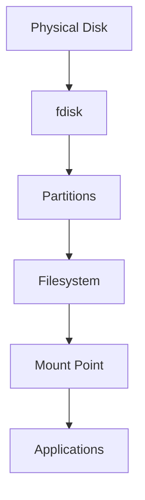
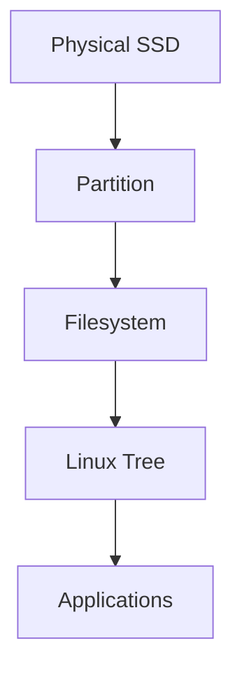
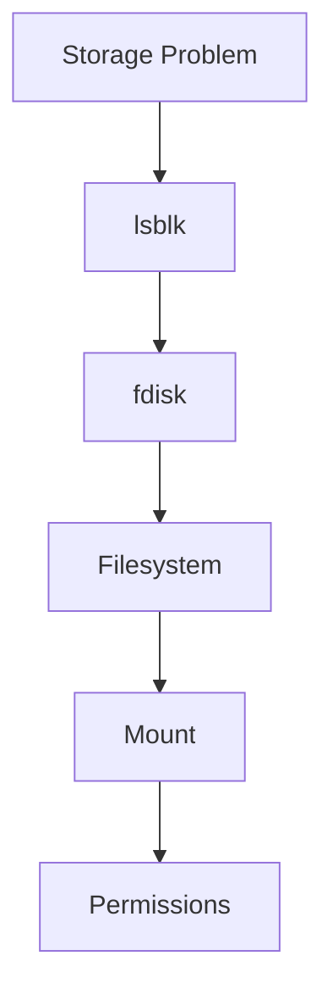

# fdisk

> `fdisk` is one of Linux's oldest and most important storage management tools.
>
> It is not a filesystem tool.
>
> It is not a mounting tool.
>
> It is a **disk partitioning tool**.
>
> Great Linux engineers use `fdisk` to answer one question:
>
> **"How should I divide this physical storage device?"**

---

# Why This File Exists

Many beginners think:

```text
Disk

↓

Immediately store files
```

Wrong.

Linux storage requires layers.

```text
Disk

↓

Partition

↓

Filesystem

↓

Mount Point

↓

Applications
```

`fdisk` operates at:

```text
Disk

↓

Partition
```

and nowhere else.

---

# Problem It Solves

This file answers:

```text
What is fdisk?

Why partition disks?

How does fdisk work?

When should I use fdisk?

When should I avoid fdisk?

How does fdisk fit into Linux architecture?
```

---

# Mental Model

Think of buying empty land.

Initially:

```text
1 Acre Land

↓

Nothing organized
```

You divide it.

```text
Living Area

Garden

Parking

Storage Area
```

Linux does the same.

Visual:

```text
Physical Disk

┌───────────────────────┐

│       1 TB SSD        │

└───────────────────────┘

↓

Partitioned

┌──────────┬──────────┬──────────┐

│ Root     │ Home     │ Data     │

│ 100 GB   │ 400 GB   │ 500 GB   │

└──────────┴──────────┴──────────┘
```

`fdisk` creates those boundaries.

---

# Where fdisk Fits In Linux Storage



`fdisk` only manages partitions.

It does NOT create:

```text
Files

Directories

Users

Permissions
```

---

# What Does fdisk Mean?

```text
f

↓

Fixed


disk

↓

Disk
```

Historically:

```text
Fixed Disk Utility
```

---

# First Principles

Question:

```text
Why partition a disk?
```

Because storage needs organization.

Benefits:

```text
Isolation

Management

Security

Recovery

Performance
```

---

# fdisk Responsibilities

`fdisk` can:

```text
Create partitions

Delete partitions

Resize (limited)

Change partition type

View partition tables
```

`fdisk` cannot:

```text
Create filesystems

Mount storage

Copy files

Format storage
```

---

# The Big Picture Workflow

Whenever adding storage:


This workflow appears everywhere.

---

# Step 1: Discover Storage

Always observe before modifying.

Never start with fdisk.

First:

```bash
lsblk
```

Example:

```text
NAME        SIZE TYPE

sda         500G disk

sdb           1T disk
```

Question:

```text
Which disk am I modifying?
```

Very important.

---

# Step 2: Open fdisk

Syntax:

```bash
sudo fdisk /dev/sdb
```

Never run on:

```text
Wrong Disk
```

Production engineers verify 2-3 times.

---

# Interactive Mode

You enter interactive mode.

Example:

```text
Command (m for help):
```

This is a mini partition editor.

---

# Most Important Commands

## m → Help

```text
m

↓

Show all commands
```

Always start here.

---

## p → Print Partition Table

```text
p

↓

Show current partitions
```

Example:

```text
Disk /dev/sdb

Partition 1

Partition 2
```

Safe operation.

---

## n → New Partition

```text
n

↓

Create partition
```

Questions asked:

```text
Primary partition?

Start sector?

End sector?

Size?
```

---

## d → Delete Partition

```text
d

↓

Delete partition
```

Dangerous.

Deletion removes partition metadata.

---

## t → Change Type

```text
t

↓

Partition Type
```

Examples:

```text
Linux

Swap

EFI
```

---

## w → Write Changes

Most important command.

```text
w

↓

Save changes
```

Until then:

```text
Nothing is permanent
```

---

## q → Quit

```text
q

↓

Exit

↓

Discard changes
```

Safe exit.

---

# The Workflow Engineers Use

Visual:

```text
lsblk

↓

fdisk

↓

mkfs

↓

mount

↓

fstab

↓

Verify
```

Memorize this.

---

# Example Scenario

Suppose:

```text
1 TB SSD

↓

/dev/sdb
```

Goal:

```text
Create 500 GB partition
```

Step 1:

```bash
sudo fdisk /dev/sdb
```

Step 2:

```text
n
```

Step 3:

```text
Select size

500G
```

Step 4:

```text
w
```

Done.

New device appears.

```text
/dev/sdb1
```

Notice:

```text
sdb

↓

Disk


sdb1

↓

Partition
```

---

# Partition Table Concepts

fdisk modifies partition tables.

Two systems exist.

```text
MBR

GPT
```

---

# MBR (Older)

Visual:

```text
Disk

↓

MBR

↓

4 Partitions
```

Limitations:

```text
2 TB maximum

4 primary partitions
```

---

# GPT (Modern)

Visual:

```text
Disk

↓

GPT

↓

128 partitions
```

Advantages:

```text
Modern

Reliable

Scalable
```

Linux today mostly uses GPT.

---

# Real World Example 1

Developer Laptop

```text
1 TB SSD

↓

100 GB /

↓

400 GB /home

↓

500 GB data
```

---

# Real World Example 2

Database Server

Do NOT do this:

```text
1 Partition

↓

Everything
```

Better:

```text
OS

↓

Database Data

↓

Logs

↓

Backups
```

---

# Real World Example 3

Docker Host

Separate:

```text
/

↓

/var
```

Because:

```text
Docker images

Volumes

Logs
```

grow rapidly.

---

# Data Flow After fdisk

Visual:



`fdisk` only affects one layer.

---

# Modern World Connections

## Docker

Docker eventually depends on partitions.

Visual:

```text
Container

↓

Docker Volume

↓

Filesystem

↓

Partition

↓

Disk
```

---

## Kubernetes

Visual:

```text
Pod

↓

Persistent Volume

↓

Filesystem

↓

Partition

↓

Disk
```

---

## Databases

Databases heavily depend on storage layout.

```text
Database

↓

Filesystem

↓

Partition

↓

NVMe
```

---

# Performance Considerations

Partitioning itself does NOT make systems faster.

But good partitioning helps.

Examples:

Separate:

```text
Logs

Containers

Databases

Backups
```

Benefits:

```text
Isolation

Predictability

Stability
```

---

# Security Considerations

Sensitive systems often isolate:

```text
/var

/tmp

/home
```

Reasons:

```text
Contain attacks

Prevent disk exhaustion

Reduce blast radius
```

---

# Troubleshooting Workflow

Problem:

```text
Cannot use storage
```

Ask:

```text
Is disk detected?

↓

Did fdisk create partition?

↓

Filesystem created?

↓

Mounted?

↓

Permissions okay?
```

Visual:



---

# Common Mistakes

## Mistake 1

Running fdisk on the wrong disk.

Very dangerous.

Always verify.

```bash
lsblk
```

first.

---

## Mistake 2

Thinking fdisk formats storage.

Wrong.

It only partitions.

---

## Mistake 3

Forgetting to save.

```text
w

↓

Required
```

---

## Mistake 4

Thinking partition = filesystem.

Wrong.

```text
Disk

↓

Partition

↓

Filesystem
```

Three different layers.

---

# Engineering Mindset

Do not think:

```text
I need fdisk.
```

Think:

```text
I need to design storage boundaries.
```

That is the real job.

---

# Interview Questions

## Beginner

1. What is fdisk?

2. What problem does fdisk solve?

3. Difference between disk and partition?

4. Difference between fdisk and mkfs?

---

## Intermediate

5. Explain the storage workflow.

6. Explain fdisk commands.

7. Explain MBR vs GPT.

8. Why partition disks?

---

## Advanced

9. Design storage for a Docker host.

10. Design storage for a database server.

11. Explain partition isolation.

12. Explain production storage workflows.

---

# Cheat Sheet

```text
Observe

lsblk


Partition

sudo fdisk /dev/sdb


Important Commands

m → help

p → print

n → new

d → delete

t → type

w → save

q → quit


Workflow

Disk

↓

fdisk

↓

Filesystem

↓

Mount

↓

fstab


Golden Rule

fdisk creates boundaries.

It does not create filesystems.
```
