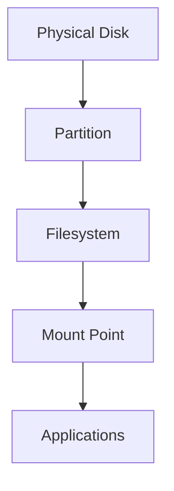
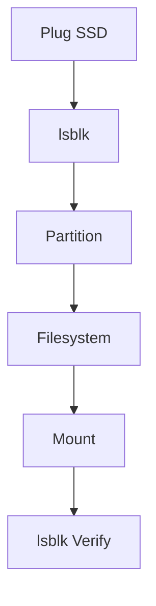
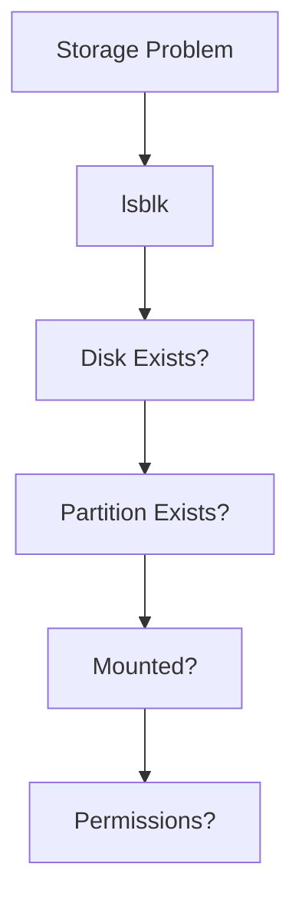

# lsblk

> `lsblk` is one of the most important Linux storage visualization tools.
>
> It allows you to see the relationships between physical disks, partitions, filesystems, mount points, and storage abstractions.
>
> Great Linux engineers use `lsblk` to answer one question:
>
> **"How is my storage system connected?"**

---

# Why This File Exists

Many Linux beginners see:

```text
/dev/sda

/dev/sda1

/dev/sda2

/dev/nvme0n1

/dev/mapper
```

and become confused.

Questions appear:

```text
What are these?

Which one is the disk?

Which one is the partition?

Which one contains Linux?

Which one is mounted?

Which one stores my data?
```

`lsblk` answers all of these.

---

# Problem It Solves

`lsblk` helps answer:

```text
What storage devices exist?

How are devices connected?

What partitions exist?

What filesystems exist?

Where are they mounted?

How is LVM connected?

How is RAID connected?
```

---

# Mental Model

Think of `lsblk` as Google Maps for storage.

Without it:

```text
Storage

↓

Unknown black box
```

With it:

```text
Storage

↓

Visualized hierarchy
```

---

# What Does lsblk Mean?

```text
ls

↓

List


blk

↓

Block Devices
```

Full meaning:

```text
List Block Devices
```

---

# What Is A Block Device?

A block device stores data in fixed-size chunks called blocks.

Examples:

```text
HDD

SSD

NVMe

USB Drive

LVM Volumes

RAID Arrays
```

Linux exposes them under:

```text
/ dev
```

Examples:

```text
/dev/sda

/dev/sdb

/dev/nvme0n1
```

---

# The Big Picture

Remember our storage architecture.



`lsblk` helps visualize this hierarchy.

---

# Basic Command

```bash
lsblk
```

Example:

```text
NAME        MAJ:MIN RM   SIZE RO TYPE MOUNTPOINTS

sda           8:0    0   500G  0 disk

├─sda1        8:1    0   512M  0 part /boot/efi

├─sda2        8:2    0   100G  0 part /

└─sda3        8:3    0   399G  0 part /home

sdb           8:16   0     1T  0 disk

└─sdb1        8:17   0     1T  0 part /mnt/data
```

---

# Read The Tree Carefully

Visual:

```text
sda

├─sda1

├─sda2

└─sda3
```

Means:

```text
Physical Disk

↓

3 partitions
```

This tree is extremely important.

---

# Mental Model: Family Tree

Think of storage as a family tree.

```text
Disk

↓

Children

↓

Partitions
```

Visual:

```text
sda

├── sda1

├── sda2

└── sda3
```

Parent:

```text
sda
```

Children:

```text
sda1

sda2

sda3
```

---

# Understanding Each Column

Example:

```text
NAME MAJ:MIN RM SIZE RO TYPE MOUNTPOINTS
```

---

# NAME

Device name.

Examples:

```text
sda

sda1

nvme0n1
```

---

# MAJ:MIN

Kernel device numbers.

Example:

```text
8:0
```

Meaning:

```text
Major

↓

Device driver

Minor

↓

Specific device
```

We will cover this later.

---

# RM

Removable device.

```text
0

↓

No


1

↓

Yes
```

Examples:

```text
USB

External HDD
```

---

# SIZE

Storage capacity.

Examples:

```text
512M

100G

1T
```

---

# RO

Read only.

```text
0

↓

Writable


1

↓

Read only
```

---

# TYPE

Device type.

Common values:

```text
disk

part

lvm

raid

rom
```

---

# MOUNTPOINTS

Where Linux attached it.

Examples:

```text
/

/home

/mnt/data
```

---

# Linux Storage Hierarchy Example

Visual:

```mermaid
flowchart TD

A[sda 500GB]

A --> B[sda1 EFI]

A --> C[sda2 Root]

A --> D[sda3 Home]

B --> E[/boot/efi]

C --> F[/]

D --> G[/home]
```

---

# Common Device Types

## disk

Physical storage device.

Examples:

```text
sda

sdb

nvme0n1
```

---

## part

Partitions.

Examples:

```text
sda1

sda2

sda3
```

---

## lvm

Logical volumes.

Example:

```text
vg0-root
```

---

## raid

RAID arrays.

Example:

```text
md0
```

---

## rom

Read-only devices.

Example:

```text
CD/DVD
```

---

# Most Useful Commands

## Show Everything

```bash
lsblk
```

---

## Show Filesystem Information

```bash
lsblk -f
```

Example:

```text
NAME FSTYPE LABEL UUID MOUNTPOINT

sda1 vfat

sda2 ext4

sda3 ext4
```

This is extremely useful.

---

## Show Specific Columns

```bash
lsblk -o NAME,SIZE,TYPE,MOUNTPOINTS
```

Output:

```text
NAME SIZE TYPE MOUNTPOINTS

sda 500G disk

sda1 512M part /boot

sda2 100G part /

sda3 399G part /home
```

---

## Show Full Paths

```bash
lsblk -p
```

Output:

```text
/ dev/sda

/ dev/sda1

/ dev/sda2
```

---

## Show File Systems Only

```bash
lsblk -f
```

Useful for mounting operations.

---

## Show UUIDs

```bash
lsblk -o NAME,UUID
```

Useful for:

```text
fstab

Persistent mounting
```

---

# Practical Workflow

Suppose you attach a new SSD.

Step 1:

```bash
lsblk
```

See:

```text
sdb

↓

New disk
```

Step 2:

Create partition.

```text
sdb1
```

Step 3:

Create filesystem.

```text
ext4
```

Step 4:

Mount it.

```text
/ mnt/data
```

Step 5:

Verify.

```bash
lsblk
```

Visual:



---

# LVM Example

`lsblk` becomes extremely useful.

Example:

```text
sda

└─sda3

  └─vg0-root

      /

```

Visual:

```mermaid
flowchart TD

A[sda]

A --> B[sda3]

B --> C[Volume Group]

C --> D[Logical Volume]

D --> E[/]
```

---

# RAID Example

Example:

```text
sda

└─md0

sdb

└─md0
```

Visual:

```mermaid
flowchart TD

A[sda]

A --> C[RAID md0]

B[sdb]

B --> C

C --> D[Filesystem]

D --> E[/data]
```

---

# Docker Connection

Docker stores data under:

```text
/var/lib/docker
```

Use:

```bash
lsblk
```

to discover where `/var` lives.

Visual:

```mermaid
flowchart TD

A[Container]

A --> B[/var/lib/docker]

B --> C[Filesystem]

C --> D[Partition]

D --> E[Disk]
```

---

# Kubernetes Connection

Kubernetes stores data in:

```text
/var/lib/kubelet

/var/lib/containerd
```

Use:

```bash
lsblk
```

to see where those directories ultimately live.

---

# Production Examples

## Example 1: Developer Laptop

```text
sda

├─sda1 EFI

├─sda2 /

└─sda3 /home
```

---

## Example 2: Docker Host

```text
sda

├─sda1 /

└─sda2 /var
```

---

## Example 3: Database Server

```text
nvme0n1

↓

Database data


nvme1n1

↓

WAL logs


sdb

↓

Backups
```

---

# Performance Considerations

`lsblk` itself does not measure performance.

Use it to understand architecture.

Then use:

```bash
iostat

iotop

vmstat
```

for performance analysis.

---

# Security Considerations

Use `lsblk` to verify:

```text
Sensitive data location

Encrypted volumes

Dedicated partitions
```

Never guess storage architecture.

Always inspect it.

---

# Troubleshooting Workflow

Cannot find data?

Ask:

```text
Is disk visible?

↓

Is partition visible?

↓

Is filesystem present?

↓

Is it mounted?
```

Visual:



---

# Common Mistakes

## Mistake 1

Thinking `lsblk` shows files.

Wrong.

It shows storage hierarchy.

---

## Mistake 2

Thinking `sda1` is the disk.

Wrong.

```text
sda

↓

Disk


sda1

↓

Partition
```

---

## Mistake 3

Ignoring mount points.

Always check:

```text
MOUNTPOINTS
```

---

## Mistake 4

Memorizing output instead of relationships.

Understand the tree.

---

# Engineering Mindset

Do not run:

```bash
lsblk
```

and think:

```text
Cool.
```

Instead ask:

```text
What is the disk?

What are the partitions?

What filesystem exists?

Where is storage mounted?

What applications depend on it?
```

---

# Interview Questions

## Beginner

1. What does `lsblk` do?

2. What is a block device?

3. Difference between disk and partition?

4. What is a mount point?

---

## Intermediate

5. Explain `lsblk` output.

6. Explain MAJ:MIN.

7. Explain TYPE values.

8. Why use `lsblk -f`?

---

## Advanced

9. Explain how `lsblk` helps with LVM.

10. Explain how `lsblk` helps with RAID.

11. Explain how Docker uses Linux storage.

12. Explain production storage debugging using `lsblk`.

---

# Cheat Sheet

```text
Basic

lsblk


Filesystems

lsblk -f


Specific Columns

lsblk -o NAME,SIZE,TYPE,MOUNTPOINTS


Full Paths

lsblk -p


Golden Rule

lsblk = Google Maps for Linux storage.
```
