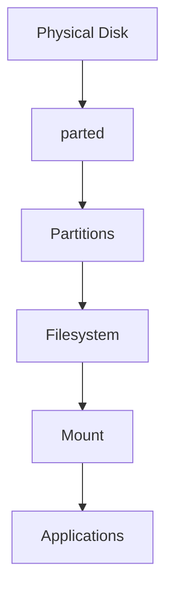
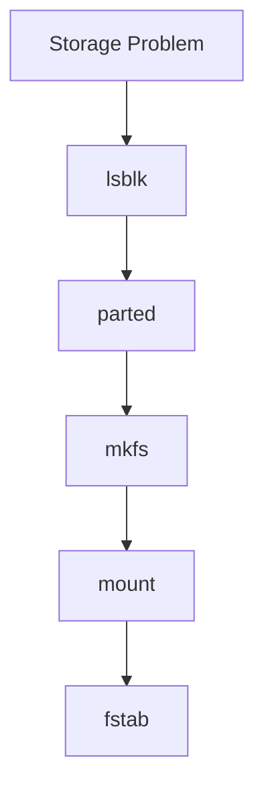

# parted

> `parted` is a modern Linux disk partitioning tool designed for large disks, GPT partition tables, and automation.
>
> If `fdisk` is a traditional partition editor, `parted` is a modern storage engineering tool.
>
> Great Linux engineers use `parted` to answer one question:
>
> **"How can I safely and efficiently manage modern storage systems?"**

---

# Why This File Exists

Many beginners learn:

```bash
fdisk
```

Then they discover:

```bash
parted
```

Questions appear.

```text
Why are there two tools?

Which one should I use?

Why does parted exist?

When should I use parted instead of fdisk?

Which tool do cloud engineers use?
```

This file answers those questions.

---

# Problem It Solves

This file answers:

```text
What is parted?

Why was it created?

How is it different from fdisk?

When should I use it?

How do engineers use it?
```

---

# Mental Model

Think about city planning.

`fdisk`

```text
Small town planner

↓

Interactive

↓

Manual work
```

`parted`

```text
Modern city planner

↓

Large scale

↓

Automation friendly

↓

Future ready
```

Both can create partitions.

Their philosophies differ.

---

# First Principles

Question:

```text
Why create partitions?
```

Answer:

```text
Organization

Isolation

Security

Performance

Management
```

Question:

```text
Why create parted?
```

Answer:

```text
Large disks

GPT support

Automation

Modern infrastructure
```

---

# Where parted Fits In Linux Storage

```text
Physical Disk

↓

parted

↓

Partitions

↓

Filesystem

↓

Mount Point

↓

Applications
```

`parted` works at one layer.

```text
Disk

↓

Partition
```

---

# Big Picture Architecture



---

# fdisk vs parted Philosophy

## fdisk

Traditional.

```text
Human

↓

Interactive Menu

↓

Partition
```

---

## parted

Modern.

```text
Human

↓

Commands

↓

Automation

↓

Partition
```

---

# Why Modern Systems Prefer GPT

Older systems:

```text
MBR

↓

2 TB limit

↓

4 partitions
```

Modern systems:

```text
GPT

↓

Huge disks

↓

128 partitions

↓

Redundancy
```

`parted` was built with modern systems in mind.

---

# fdisk vs parted Comparison

| Feature             | fdisk   | parted    |
| ------------------- | ------- | --------- |
| Interactive         | Yes     | Yes       |
| Automation          | Limited | Excellent |
| GPT Support         | Good    | Excellent |
| Large Disk Support  | Good    | Excellent |
| Beginner Friendly   | Good    | Medium    |
| Cloud Friendly      | Medium  | Excellent |
| Production Friendly | Good    | Excellent |

---

# Basic Syntax

```bash
sudo parted /dev/sdb
```

Interactive shell:

```text
GNU Parted 3.x

(parted)
```

Now you're inside a partition editor.

---

# Most Useful Commands

## print

Show storage information.

```bash
(parted) print
```

Example:

```text
Disk /dev/sdb

Partition Table: gpt

1 EFI

2 Linux
```

Safe operation.

---

# mklabel

Create a partition table.

```bash
(parted) mklabel gpt
```

Visual:

```text
Raw Disk

↓

GPT Structure
```

Supported:

```text
gpt

msdos
```

Be careful.

This destroys existing partition information.

---

# mkpart

Create a partition.

Syntax:

```bash
(parted) mkpart primary ext4 1MiB 100GiB
```

Meaning:

```text
Partition Name

↓

Filesystem Type Hint

↓

Start

↓

End
```

---

# rm

Delete partition.

```bash
(parted) rm 1
```

Dangerous.

Always verify first.

---

# quit

Exit.

```bash
(parted) quit
```

---

# Example Workflow

Suppose:

```text
1 TB SSD

↓

/dev/sdb
```

Goal:

```text
500 GB Data Partition
```

Workflow:

Step 1

Observe.

```bash
lsblk
```

Step 2

Open parted.

```bash
sudo parted /dev/sdb
```

Step 3

Create GPT.

```bash
mklabel gpt
```

Step 4

Create partition.

```bash
mkpart primary ext4 1MiB 500GiB
```

Step 5

Verify.

```bash
print
```

---

# The Engineering Workflow

Memorize this.

```text
Observe

↓

Partition

↓

Filesystem

↓

Mount

↓

Persist

↓

Verify
```

Commands:

```text
lsblk

↓

parted

↓

mkfs

↓

mount

↓

fstab

↓

lsblk
```

---

# Partition Alignment

This is where `parted` shines.

Question:

```text
Why start at 1MiB?
```

Because modern SSDs need alignment.

Bad:

```text
Misaligned

↓

Extra work

↓

Lower performance
```

Good:

```text
Aligned

↓

Optimal performance
```

Visual:

```text
Bad

|Block|Block|Block|

     |Partition|

Misaligned


Good

|Block|Block|Block|

|Partition|
```

---

# Real World Example 1

Developer Laptop

```text
1 TB SSD

↓

1 GB EFI

↓

150 GB /

↓

700 GB /home

↓

149 GB free
```

---

# Real World Example 2

Docker Host

Separate:

```text
/

↓

/var
```

Because:

```text
Docker Images

Docker Volumes

Container Logs
```

grow rapidly.

---

# Real World Example 3

Database Server

Better architecture:

```text
Disk 1

↓

OS


Disk 2

↓

Database Data


Disk 3

↓

Logs


Disk 4

↓

Backups
```

---

# Real World Example 4

Cloud VM

Common setup:

```text
Disk 1

↓

OS


Disk 2

↓

Application Data
```

Cloud engineers frequently automate this.

---

# Why Cloud Engineers Like parted

Because automation is easy.

Example:

```bash
parted -s /dev/sdb mklabel gpt
```

`-s`

```text
Silent Mode
```

Useful for:

```text
Cloud init

Terraform

Ansible

Provisioning Scripts
```

---

# Docker Connection

Docker eventually reaches Linux storage.

```text
Container

↓

Docker Volume

↓

Filesystem

↓

Partition

↓

Disk
```

---

# Kubernetes Connection

```text
Pod

↓

Persistent Volume

↓

Filesystem

↓

Partition

↓

Disk
```

---

# Database Connection

Database writes eventually reach partitions.

```text
Application

↓

Database

↓

Filesystem

↓

Partition

↓

Disk
```

---

# Performance Considerations

Good partitioning helps:

```text
Isolation

Predictability

Recovery

Stability
```

It does NOT magically increase speed.

Avoid:

```text
Everything on one partition
```

for large systems.

---

# Security Considerations

Separate sensitive workloads.

Examples:

```text
Logs

Secrets

Databases

Containers
```

Protect critical data.

---

# Troubleshooting Workflow

Cannot use storage?

Ask:

```text
Disk detected?

↓

Partition created?

↓

Filesystem created?

↓

Mounted?

↓

Persisted?
```

Visual:



---

# Common Mistakes

## Mistake 1

Using parted on the wrong disk.

Always verify first.

```bash
lsblk
```

---

## Mistake 2

Forgetting that `mklabel` destroys partition information.

Very dangerous.

---

## Mistake 3

Thinking parted creates filesystems.

Wrong.

It creates partitions.

---

## Mistake 4

Ignoring alignment.

Especially on SSDs.

---

## Mistake 5

Using MBR on modern systems unnecessarily.

Prefer:

```text
GPT
```

---

# When To Use fdisk vs parted

Use fdisk when:

```text
Learning Linux

Small systems

Simple partitioning

Interactive workflows
```

Use parted when:

```text
Modern systems

Large disks

GPT

Automation

Cloud

Production
```

---

# Engineering Mindset

Do not ask:

```text
Which command should I memorize?
```

Ask:

```text
Which tool fits this system architecture?
```

That is how engineers think.

---

# Interview Questions

## Beginner

1. What is parted?

2. Why does parted exist?

3. Difference between fdisk and parted?

4. Why use GPT?

---

## Intermediate

5. Explain partition alignment.

6. Why is GPT preferred?

7. Why do cloud engineers use parted?

8. Explain the storage workflow.

---

## Advanced

9. Design storage for a Docker host.

10. Design storage for a Kubernetes node.

11. Explain automation with parted.

12. Explain production storage architecture.

---

# Cheat Sheet

```text
Observe

lsblk


Partition

sudo parted /dev/sdb


Important Commands

print

mklabel

mkpart

rm

quit


Workflow

Disk

↓

parted

↓

Filesystem

↓

Mount

↓

fstab


Golden Rule

parted is a modern partition architect.

Not a filesystem tool.
```
