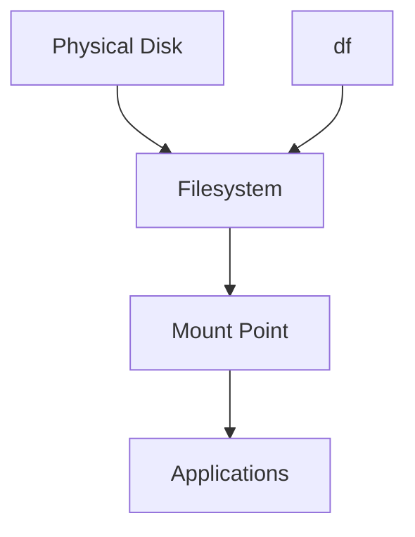
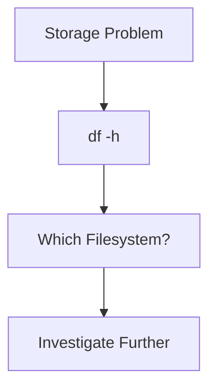
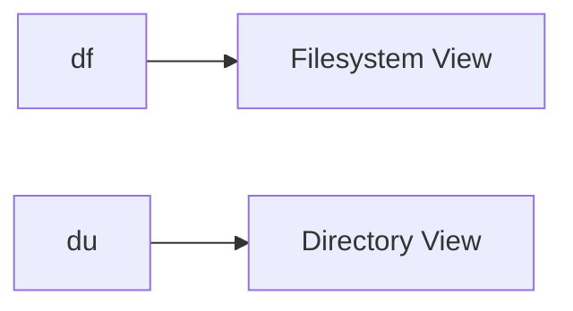
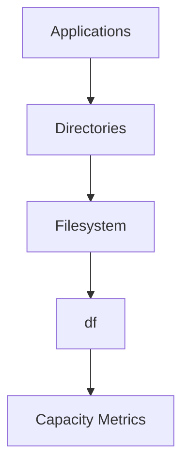
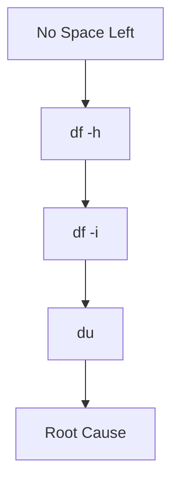

# df (Disk Filesystem)

> `df` is one of Linux's most important observability tools.
>
> Great Linux engineers don't ask:
>
> "How much storage does my computer have?"
>
> They ask:
>
> "Which filesystems are consuming capacity, how much remains, and which workloads are at risk?"
>
> `df` is not a storage tool.
>
> It is a filesystem observability tool.

---

# Why This File Exists

Most beginners eventually see this.

```text
No space left on device
```

Then immediately run:

```bash
df -h
```

But they don't understand:

```text
What is df showing?

What is a filesystem?

What does 100% actually mean?

Why is storage full?

What should I investigate next?
```

This file answers those questions.

---

# Problem It Solves

This file answers:

```text
What is df?

Why does df exist?

What is a filesystem capacity?

How do engineers use df?

Why does Linux become full?

What should we investigate after running df?
```

---

# Mental Model: Apartment Building Occupancy

Imagine an apartment building.

Question:

```text
How many rooms exist?

How many are occupied?

How many are available?
```

That's exactly what `df` does.

Linux:

```text
Filesystem

↓

Total Space

↓

Used Space

↓

Available Space
```

---

# First Principles

Remember this storage pipeline.

```text
Physical Disk

↓

Partition

↓

Filesystem

↓

Mount Point

↓

Applications
```

`df` observes:

```text
Filesystem
```

NOT:

```text
Individual Files

Individual Directories
```

Very important.

---

# What Does df Mean?

```text
d

↓

Disk


f

↓

Filesystem
```

Meaning:

```text
Disk Filesystem
```

Think:

```text
Filesystem Capacity Dashboard
```

---

# Where Does df Fit?

Memorize this.

```text
Storage Device

↓

Filesystem

↓

Mount Point

↓

Applications
```

`df` observes:

```text
Filesystem Capacity
```

---

# Big Picture Architecture



---

# What df Measures

`df` answers:

```text
How much exists?

How much is used?

How much remains?

Where is it mounted?
```

It does NOT answer:

```text
Which file?

Which folder?

Which application?
```

We'll use `du` for that.

---

# Basic Command

```bash
df
```

Example:

```text
Filesystem     1K-blocks      Used Available Use% Mounted on

/dev/sda2       104857600  52428800  47185920  53% /

/dev/sda3       419430400 104857600 314572800  25% /home
```

---

# Human Readable Output

Always use:

```bash
df -h
```

Output:

```text
Filesystem      Size Used Avail Use% Mounted on

/dev/sda2       100G  52G   45G  53% /

/dev/sda3       400G 100G  300G  25% /home
```

Much easier.

---

# Reading The Columns

Example:

```text
Filesystem

Size

Used

Avail

Use%

Mounted On
```

---

# Filesystem

What storage is attached?

Examples:

```text
/ dev/sda2

/ dev/nvme0n1p2
```

Or:

```text
tmpfs
```

---

# Size

Total filesystem size.

Example:

```text
100G
```

---

# Used

Consumed storage.

Example:

```text
52G
```

---

# Available

Free storage.

Example:

```text
45G
```

---

# Use%

Percentage consumed.

Example:

```text
53%
```

---

# Mounted On

Where Linux attached it.

Examples:

```text
/

/home

/mnt/data
```

---

# Visualizing Filesystem Capacity

```text
100 GB Filesystem

┌─────────────────────┐

███████████░░░░░░░░░░

52 GB Used

48 GB Free

└─────────────────────┘
```

---

# Mental Model: Fuel Gauge

Think:

```text
Car

↓

Fuel Gauge

↓

Remaining Fuel
```

Linux:

```text
Filesystem

↓

df

↓

Remaining Capacity
```

---

# Engineer Workflow

Suppose:

```text
No space left on device
```

Do this.

```bash
df -h
```

Question:

```text
Which filesystem is full?
```

Visual:



---

# The Most Useful Commands

## Human Readable

```bash
df -h
```

Most common.

---

## Show Inodes

```bash
df -i
```

Very important.

Example:

```text
Filesystem

Inodes

IUsed

IFree

IUse%
```

We'll discuss this shortly.

---

## Specific Filesystem Type

```bash
df -T
```

Example:

```text
Filesystem

Type

Size
```

---

## Show Everything Together

```bash
df -hT
```

Very useful.

---

# Inode Observability

This is extremely important.

Disk may show:

```text
500 GB free
```

Yet Linux says:

```text
No space left on device
```

Why?

No inodes left.

Visual:

```text
Filesystem

Storage

✓ Available

Inodes

✗ Exhausted
```

---

# df vs du

Beginners confuse these constantly.

`df`

```text
Filesystem Capacity
```

`du`

```text
Directory Consumption
```

Visual:



---

# Example Investigation

Step 1

Problem:

```text
Disk Full
```

Step 2

Run:

```bash
df -h
```

Suppose:

```text
/var

95%
```

Question:

```text
Why?
```

Now switch tools.

```bash
du
```

to investigate deeper.

---

# Production Example: Docker Host

Docker often fills:

```text
/var
```

Growth sources:

```text
Images

Volumes

Layers

Logs
```

Visual:

```text
Docker

↓

/var/lib/docker

↓

Filesystem

↓

df
```

---

# Production Example: Kubernetes Node

Growth sources:

```text
Container Images

Pod Logs

Caches
```

Locations:

```text
/var/lib/containerd

/var/lib/kubelet

/var/log
```

---

# Production Example: Database Server

Growth sources:

```text
Rows

Indexes

WAL Logs

Backups
```

Good architecture:

```text
OS

Database

Logs

Backups
```

Separate filesystems.

---

# Production Example: AI Server

Growth sources:

```text
Models

Datasets

Embeddings

Caches
```

Monitor continuously.

---

# Capacity Planning Mindset

Don't ask:

```text
How much free space exists?
```

Ask:

```text
What is growing?

How fast?

What workload owns it?

When will it fail?
```

---

# Data Flow Mindset

Visual:



---

# Performance Considerations

Questions engineers ask:

```text
How fast is storage growing?

Which filesystem is at risk?

How much growth per day?

How much capacity is needed next month?
```

---

# Security Considerations

Storage exhaustion is a security issue.

Examples:

```text
Log Explosion

Malicious Uploads

Backup Duplication

Container Abuse
```

Storage attacks are real.

---

# Troubleshooting Workflow

System says:

```text
No space left on device
```

Workflow:

```text
df -h

↓

Filesystem Full?

↓

df -i

↓

Inodes Full?

↓

du

↓

Directory Full?
```

Visual:



---

# Common Mistakes

## Mistake 1

Thinking df shows files.

Wrong.

It shows filesystems.

---

## Mistake 2

Thinking df shows directories.

Wrong.

Use:

```text
du
```

---

## Mistake 3

Ignoring inode exhaustion.

Very common.

---

## Mistake 4

Panic deleting random files.

Always investigate first.

---

# Engineering Mindset

Whenever you run:

```bash
df -h
```

Visualize:

```text
Filesystem

↓

Capacity

↓

Risk

↓

Growth

↓

Future Failure
```

This is how engineers think.

---

# Interview Questions

## Beginner

1. What does df do?

2. What does df stand for?

3. What is a filesystem?

4. Why use df -h?

---

## Intermediate

5. Explain df vs du.

6. Explain inode exhaustion.

7. Explain filesystem capacity.

8. Explain storage troubleshooting.

---

## Advanced

9. Explain Docker storage growth.

10. Explain Kubernetes storage growth.

11. Explain capacity planning.

12. Explain production storage observability.

---

# Cheat Sheet

```text
Basic

df


Human Readable

df -h


Inodes

df -i


Filesystem Type

df -T


Most Useful

df -hT


Golden Rule

df = Filesystem View

du = Directory View
```
