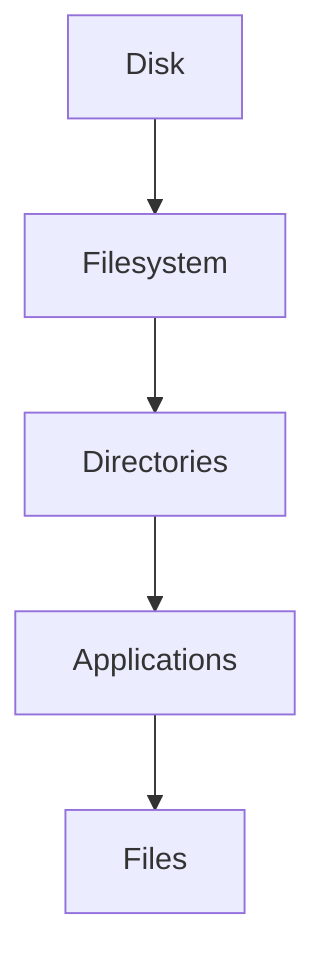
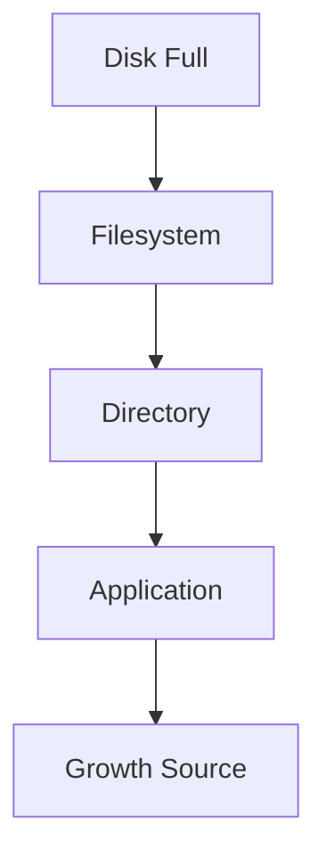

# Disk Usage

> Great Linux engineers don't ask:
>
> "How much disk space is left?"
>
> They ask:
>
> "Where is storage growing, why is it growing, and what will happen if it continues to grow?"
>
> Disk usage is not a storage problem.
>
> It is a capacity planning problem.

---

# Why This File Exists

Most beginners eventually see this.

```text
No space left on device
```

Then panic.

Questions appear.

```text
My disk is 1 TB.

Where did the space go?

Why is Linux full?

What is growing?

How do engineers prevent this?
```

This file answers those questions.

---

# Problem It Solves

This file answers:

```text
What is disk usage?

Why do disks become full?

What consumes storage?

How do engineers analyze growth?

What is capacity planning?

How do Docker, Kubernetes and databases affect storage?
```

---

# Mental Model: A Water Tank

Imagine a water tank.

```text
Tank

↓

Water Added

↓

Tank Fills

↓

Overflow
```

Storage is similar.

```text
Disk

↓

Data Added

↓

Disk Fills

↓

System Problems
```

The goal is not simply to empty the tank.

The goal is to understand the flow.

---

# First Principles

Storage is finite.

Visual:

```text
1 TB SSD

┌─────────────────────────────┐

│ Finite Space               │

└─────────────────────────────┘
```

Everything competes for it.

Examples:

```text
Operating System

Applications

Logs

Databases

Containers

Backups

User Files
```

---

# The Big Question

When a system says:

```text
Disk Full
```

The real question is:

```text
What workload is growing?
```

Not:

```text
What command should I run?
```

---

# Where Storage Is Consumed

Think in layers.

```text
Physical Disk

↓

Filesystem

↓

Directories

↓

Applications

↓

Files
```

Every layer consumes space.

---

# Mental Model: A City

Imagine a city.

```text
Land

↓

Districts

↓

Buildings

↓

People
```

Linux storage is similar.

```text
Disk

↓

Directories

↓

Applications

↓

Files
```

---

# The Linux Storage Tree

Everything eventually exists here.

```text
/

├── home

├── var

├── etc

├── usr

├── tmp

└── opt
```

Some directories grow much faster than others.

---

# Common Storage Consumers

## User Files

Examples:

```text
Downloads

Videos

Documents

Images
```

Usually:

```text
/ home
```

---

# Logs

Logs grow continuously.

Examples:

```text
Application Logs

System Logs

Audit Logs
```

Usually:

```text
/var/log
```

---

# Containers

Containers consume enormous amounts of storage.

Examples:

```text
Images

Layers

Volumes

Container Logs
```

Usually:

```text
/var/lib/docker
```

---

# Databases

Databases continuously grow.

Examples:

```text
Data Files

Indexes

WAL Logs

Snapshots
```

Examples:

```text
/var/lib/postgresql

/var/lib/mysql
```

---

# Package Managers

Package caches grow.

Examples:

```text
apt

dnf

yum
```

Cache locations:

```text
/var/cache
```

---

# Temporary Files

Often forgotten.

Examples:

```text
tmp

cache

sessions
```

Locations:

```text
/tmp

/var/tmp
```

---

# Linux Disk Usage Architecture



---

# Why Systems Become Full

Usually because one workload grows.

Examples:

```text
Logs

Containers

Databases

Backups

User Uploads

AI Datasets
```

Rarely:

```text
Operating System
```

---

# The Four Questions Engineers Ask

Question 1

```text
What is growing?
```

Question 2

```text
How fast is it growing?
```

Question 3

```text
What depends on it?
```

Question 4

```text
When will it become a problem?
```

---

# Capacity Planning Mindset

Bad thinking:

```text
Disk full

↓

Delete random files
```

Good thinking:

```text
Growth Rate

↓

Prediction

↓

Expansion Plan
```

---

# Example

Suppose:

```text
1 TB SSD

Used

800 GB
```

Growth:

```text
20 GB per day
```

Question:

```text
How long until failure?
```

Answer:

```text
200 GB left

↓

10 days remaining
```

This is capacity planning.

---

# The Growth Formula

Think:

```text
Remaining Space

÷

Daily Growth

=

Days Remaining
```

This mindset is used everywhere.

---

# Modern Workloads That Grow Fast

## Docker

Growth sources:

```text
Images

Layers

Volumes

Logs
```

---

## Kubernetes

Growth sources:

```text
Pod Logs

Images

Volumes

Caches
```

---

## Databases

Growth sources:

```text
Rows

Indexes

WAL Logs

Backups
```

---

## AI Systems

Growth sources:

```text
Datasets

Models

Embeddings

Caches
```

---

# Storage Hotspots

Pay attention to these.

```text
/var

/home

/tmp

/opt
```

These are frequent offenders.

---

# Modern Production Example: Docker Host

Visual:

```text
500 GB SSD

↓

100 GB OS

↓

350 GB Docker

↓

50 GB Free
```

Without monitoring:

```text
Outage
```

---

# Modern Production Example: Database Server

Visual:

```text
Disk 1

↓

Operating System


Disk 2

↓

Database Data


Disk 3

↓

WAL Logs


Disk 4

↓

Backups
```

This isolates growth.

---

# Modern Production Example: AI Server

Visual:

```text
Disk 1

↓

Operating System


Disk 2

↓

Datasets


Disk 3

↓

Models


Disk 4

↓

Backups
```

---

# Linux Capacity Layers

Think in layers.

```text
Physical Capacity

↓

Filesystem Capacity

↓

Application Capacity

↓

Business Capacity
```

This is engineering thinking.

---

# Storage Bottlenecks

Storage problems are not always:

```text
0 GB free
```

Problems can be:

```text
Too many files

Too many logs

Too many images

Too many backups
```

Different problem.

Different solution.

---

# Inode Exhaustion

This is extremely important.

Disk may show:

```text
500 GB free
```

Yet Linux says:

```text
No space left on device
```

Why?

No inodes left.

Visual:

```text
Disk Capacity

✓ Available


Inodes

✗ Exhausted
```

Very common.

---

# The Disk Usage Workflow

Engineers think:

```text
Storage Problem

↓

What Filesystem?

↓

What Directory?

↓

What Application?

↓

What Workload?

↓

What Growth Pattern?
```

Memorize this.

---

# Observability Mindset

Storage is an observable system.

Track:

```text
Total Capacity

Used Capacity

Growth Rate

Largest Consumers

Growth Trends
```

---

# Important Tools

This file does NOT teach these deeply.

We have dedicated files.

```text
df

du

lsblk

findmnt

mount
```

We'll study them later.

---

# Docker Connection

Visual:

```text
Container

↓

Volume

↓

Filesystem

↓

Disk
```

Everything eventually consumes storage.

---

# Kubernetes Connection

Visual:

```text
Pod

↓

Persistent Volume

↓

Filesystem

↓

Disk
```

---

# Cloud Connection

Cloud storage is still Linux storage.

Examples:

```text
AWS EBS

Azure Managed Disk

Google Persistent Disk
```

Eventually:

```text
Cloud Disk

↓

Filesystem

↓

Linux
```

---

# Performance Considerations

Questions engineers ask:

```text
How fast is data growing?

Which workload is growing?

How many writes per second?

How much storage is needed next month?
```

---

# Security Considerations

Protect against:

```text
Log Explosions

Malicious Uploads

Backup Duplication

Container Sprawl
```

Storage exhaustion is a security risk.

---

# Troubleshooting Workflow

Disk full?

Never panic.

Ask:

```text
Filesystem full?

↓

Directory growing?

↓

Application growing?

↓

Expected growth?

↓

Bug?
```

Visual:



---

# Common Mistakes

## Mistake 1

Thinking storage problems are storage problems.

Often they are application problems.

---

## Mistake 2

Ignoring logs.

Logs are huge offenders.

---

## Mistake 3

Ignoring Docker growth.

Very common.

---

## Mistake 4

Ignoring backups.

Backups can silently consume storage.

---

## Mistake 5

Ignoring inode exhaustion.

Very common production issue.

---

# Engineering Mindset

Whenever you hear:

```text
Disk Full
```

Visualize:

```text
Application

↓

Workload

↓

Files

↓

Filesystem

↓

Disk
```

Always trace upward.

---

# Interview Questions

## Beginner

1. What is disk usage?

2. Why do disks become full?

3. What directories grow the most?

4. Why is /var important?

---

## Intermediate

5. Explain capacity planning.

6. Explain storage growth analysis.

7. Explain inode exhaustion.

8. Explain Docker storage growth.

---

## Advanced

9. Design storage monitoring for a Docker host.

10. Design storage architecture for a database server.

11. Explain storage observability.

12. Explain capacity forecasting.

---

# Cheat Sheet

```text
Storage Workflow

Disk

↓

Filesystem

↓

Directories

↓

Applications

↓

Files


Ask Four Questions

What is growing?

How fast?

What depends on it?

When will it fail?


Big Growth Sources

Logs

Containers

Databases

Backups

AI Data


Golden Rule

Disk usage is a growth problem.

Not a delete-files problem.
```
