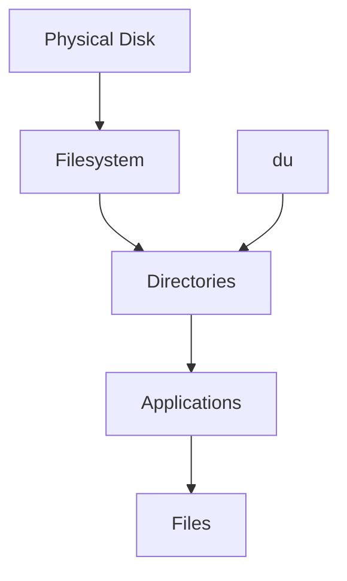
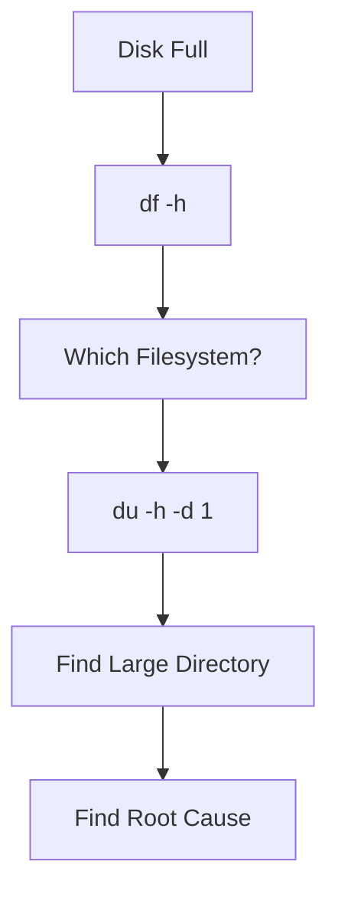
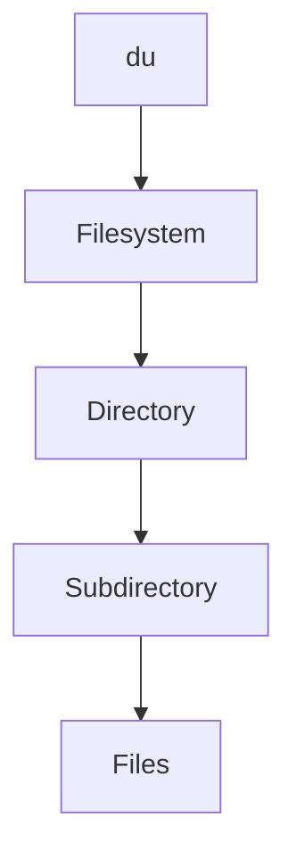
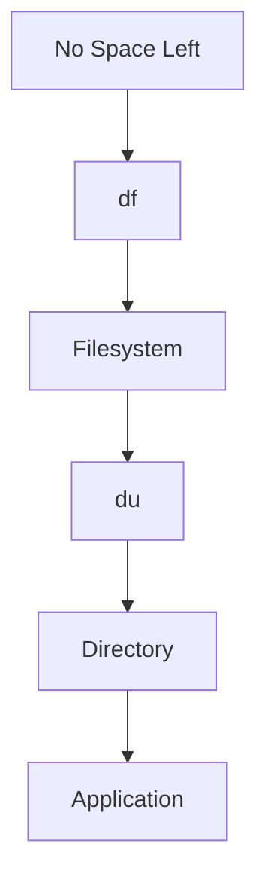

# du (Disk Usage)

> `du` is one of Linux's most important investigative tools.
>
> Great Linux engineers don't ask:
>
> "Why is my disk full?"
>
> They ask:
>
> "Exactly which directories, files, and workloads are consuming storage?"
>
> `du` is not a disk tool.
>
> It is a storage detective tool.

---

# Why This File Exists

Most engineers eventually see this.

```text
No space left on device
```

Then they run:

```bash
df -h
```

Output:

```text
Filesystem

95% full
```

But `df` cannot answer:

```text
What is causing this?

Which application?

Which directory?

Which files?
```

That's why `du` exists.

---

# Problem It Solves

This file answers:

```text
What is du?

Why does du exist?

How do engineers investigate storage?

How do we find large directories?

How do we find large files?

How do Docker and databases affect storage?
```

---

# Mental Model: Detective Investigation

Imagine a city.

Question:

```text
Who is consuming electricity?
```

The city only tells you:

```text
95% consumed
```

Not useful.

You investigate building by building.

Linux is similar.

```text
Filesystem

↓

Directories

↓

Applications

↓

Files
```

`du` investigates the hierarchy.

---

# First Principles

Remember this.

```text
Physical Disk

↓

Filesystem

↓

Directories

↓

Applications

↓

Files
```

`du` works here.

```text
Directories

↓

Files
```

Very important.

---

# du vs df

This confusion causes many problems.

`df`

```text
Filesystem Capacity
```

`du`

```text
Directory Consumption
```

Memorize this forever.

---

# Big Picture Architecture



---

# What Does du Mean?

```text
d

↓

Disk


u

↓

Usage
```

Meaning:

```text
Disk Usage
```

Simple definition:

```text
du = Directory Storage Analyzer
```

---

# Mental Model: Tree Traversal

Imagine Linux as a giant tree.

```text
/

├── home

├── var

├── usr

└── tmp
```

`du` walks the tree.

At every branch it asks:

```text
How much space?
```

---

# What du Measures

`du` answers:

```text
How large is this directory?

How large are its children?

How much storage is inside?
```

It does NOT answer:

```text
Filesystem capacity

Remaining disk space
```

`df` does that.

---

# Basic Command

```bash
du
```

Example:

```text
4 ./documents

8 ./downloads

20 .
```

Difficult to read.

Engineers rarely use plain `du`.

---

# Human Readable Output

Most common:

```bash
du -h
```

Output:

```text
4K documents

200M videos

2G projects
```

Much better.

---

# The Most Useful Command

Engineers use this constantly.

```bash
du -sh *
```

Example:

```text
50M Downloads

10G Videos

2G Projects

100M Documents
```

Very useful.

---

# Understanding The Flags

## -h

Human readable.

```text
KB

MB

GB

TB
```

Instead of:

```text
1048576
```

---

## -s

Summary.

Show one total.

```bash
du -sh /var
```

Output:

```text
8.2G /var
```

---

## -a

Show files too.

```bash
du -ah
```

---

## -d

Limit depth.

Example:

```bash
du -h -d 1 /var
```

Show one level only.

Extremely useful.

---

# The Investigation Workflow

Imagine:

```text
Disk Full
```

Step 1

```bash
df -h
```

Question:

```text
Which filesystem?
```

Suppose:

```text
/var

95%
```

Now switch tools.

Step 2

```bash
du -h -d 1 /var
```

Output:

```text
2G log

40G lib

500M cache
```

Now we have clues.

---

# Storage Investigation Flow



---

# Engineer Workflow

Memorize this.

```text
System Alert

↓

df

↓

Filesystem

↓

du

↓

Directory

↓

Application

↓

Root Cause
```

This workflow is used everywhere.

---

# Example: User Home Investigation

Command:

```bash
du -sh /home/*
```

Output:

```text
10G alice

20G bob

1G guest
```

Easy to spot issues.

---

# Example: Log Investigation

Command:

```bash
du -sh /var/log/*
```

Output:

```text
25G nginx

2G audit

500M journal
```

Problem found.

---

# Example: Docker Investigation

Command:

```bash
du -sh /var/lib/docker/*
```

Output:

```text
30G volumes

20G overlay2

10G containers
```

Very common production issue.

---

# Example: Kubernetes Investigation

Command:

```bash
du -sh /var/lib/kubelet/*
```

Output:

```text
20G pods

15G volumes
```

Common SRE task.

---

# Example: AI Server Investigation

Command:

```bash
du -sh /datasets/*
```

Output:

```text
500G images

300G embeddings

1T videos
```

Very useful.

---

# The Hierarchy Mindset

Think like this.

```text
Filesystem

↓

Directory

↓

Subdirectory

↓

Application

↓

Files
```

`du` walks downward.

---

# Why du Can Be Slow

Question:

Why?

Because `du` must inspect:

```text
Every directory

Every subdirectory

Every file
```

Large systems:

```text
Millions of files
```

can take time.

---

# Data Flow Visualization



---

# Production Example: Docker Host

Common offender:

```text
/var/lib/docker
```

Growth sources:

```text
Images

Layers

Volumes

Logs
```

---

# Production Example: Kubernetes Node

Growth sources:

```text
Pod Logs

Images

Volumes
```

Locations:

```text
/var/lib/containerd

/var/lib/kubelet

/var/log
```

---

# Production Example: Database Server

Growth sources:

```text
Database Data

Indexes

WAL Logs

Backups
```

Investigate separately.

---

# Production Example: CI/CD Servers

Growth sources:

```text
Artifacts

Build Cache

Temporary Files

Logs
```

Very common.

---

# Capacity Planning Mindset

Don't ask:

```text
How much storage exists?
```

Ask:

```text
Who is growing?

How fast?

Is it expected?

Is it a bug?

Will it continue?
```

---

# Performance Considerations

`du` can be expensive.

On large systems:

```text
Millions of files

↓

Millions of metadata lookups
```

Be careful.

Avoid running huge scans repeatedly.

---

# Security Considerations

Investigate suspicious growth.

Examples:

```text
Log Explosion

Malicious Uploads

Container Abuse

Backup Duplication

Ransomware
```

Storage anomalies matter.

---

# Useful Investigation Commands

## Human Readable

```bash
du -h
```

---

## Summary

```bash
du -sh
```

---

## One Level Deep

```bash
du -h -d 1
```

---

## Home Directories

```bash
du -sh /home/*
```

---

## Logs

```bash
du -sh /var/log/*
```

---

## Docker

```bash
du -sh /var/lib/docker/*
```

---

# Troubleshooting Workflow

System says:

```text
No space left on device
```

Workflow:

```text
df -h

↓

Filesystem

↓

du -h -d 1

↓

Large Directory

↓

Large Application

↓

Root Cause
```

Visual:



---

# Common Mistakes

## Mistake 1

Using du instead of df.

Wrong tool.

---

## Mistake 2

Running du on entire systems unnecessarily.

Can be slow.

---

## Mistake 3

Ignoring Docker storage.

Very common.

---

## Mistake 4

Ignoring log growth.

Very common.

---

## Mistake 5

Deleting files without investigation.

Always understand the root cause.

---

# Engineering Mindset

Whenever you run:

```bash
du
```

Visualize:

```text
Filesystem

↓

Directories

↓

Applications

↓

Files
```

You are investigating ownership of storage.

Not storage itself.

---

# Interview Questions

## Beginner

1. What does du do?

2. Difference between du and df?

3. Why use du?

4. Why use -h?

---

## Intermediate

5. Explain storage investigation workflow.

6. Explain why du is slower than df.

7. Explain directory observability.

8. Explain Docker storage analysis.

---

## Advanced

9. Explain Kubernetes storage analysis.

10. Explain storage troubleshooting.

11. Explain production storage investigations.

12. Explain capacity planning.

---

# Cheat Sheet

```text
Basic

du


Human Readable

du -h


Summary

du -sh


One Level

du -h -d 1


Golden Workflow

df

↓

Filesystem

↓

du

↓

Directory

↓

Application

↓

Root Cause


Golden Rule

df tells you WHERE.

du tells you WHO.
```
