# Modern World Storage Patterns


> **Storage stopped being a place to save files. Storage became the nervous system of modern software systems.**

This is one of the most important files in the entire storage section.

This file upgrades your thinking from:

> "Where should I save data?"

to

> "How does the entire modern world move, transform, protect, distribute, and consume data?"

---

# Why This Exists

Many engineers learn storage in isolated pieces.

They learn:

```text
Linux Storage

↓

Docker Volumes

↓

Kubernetes PVC

↓

Cloud Storage

↓

Databases
```

But real systems don't work this way.

Modern systems combine many storage patterns simultaneously.

Instagram doesn't use one storage system.

Netflix doesn't use one storage system.

Uber doesn't use one storage system.

OpenAI doesn't use one storage system.

Modern systems are storage ecosystems.

---

# The Big Mindset Shift

Old thinking:

```text
Application

↓

Database

↓

Disk
```

Modern thinking:

```text
Users

↓

Applications

↓

Caches

↓

Databases

↓

Object Storage

↓

Data Pipelines

↓

AI Systems

↓

Analytics Systems

↓

Archives
```

Data constantly moves.

Storage is now a data movement problem.

---

# The Universal Data Lifecycle

Every piece of data eventually follows this journey.

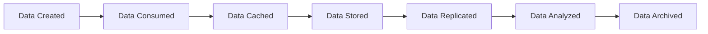

This lifecycle appears everywhere.

---

# First Principles

Every modern company solves the same 10 storage problems.

```text
Store data

Move data

Share data

Protect data

Scale data

Analyze data

Archive data

Recover data

Observe data

Delete data
```

Every storage pattern exists to solve one or more of these.

---

# The Modern Storage Pyramid

```text
                 AI Systems

             Analytics Systems

            Data Lakes/Warehouses

              Object Storage

          Databases + Search

               Cache Layer

             Applications

                 Users
```

Every layer depends on the layers below it.

---

# The 15 Modern Storage Patterns

```text
1. Data Locality Pattern

2. Cache-Aside Pattern

3. Immutable Pattern

4. Separation of Compute and Storage

5. Storage Tiering

6. Multi-Layer Storage

7. Polyglot Persistence

8. Event Storage

9. Data Lake Pattern

10. Streaming Storage

11. Search Storage

12. Edge Storage

13. AI Storage

14. Archival Storage

15. Data Mesh Pattern
```

These patterns appear everywhere.

---

# Pattern 1: Data Locality Pattern

# Problem

Data far from compute becomes slow.

---

# Wrong


---

# Correct


Keep data close.

---

# Real Examples

```text
Redis

CDN

Edge Computing

Local Cache
```

---

# Pattern 2: Cache Aside Pattern

The most common storage optimization pattern.

---

# Architecture


---

# Flow

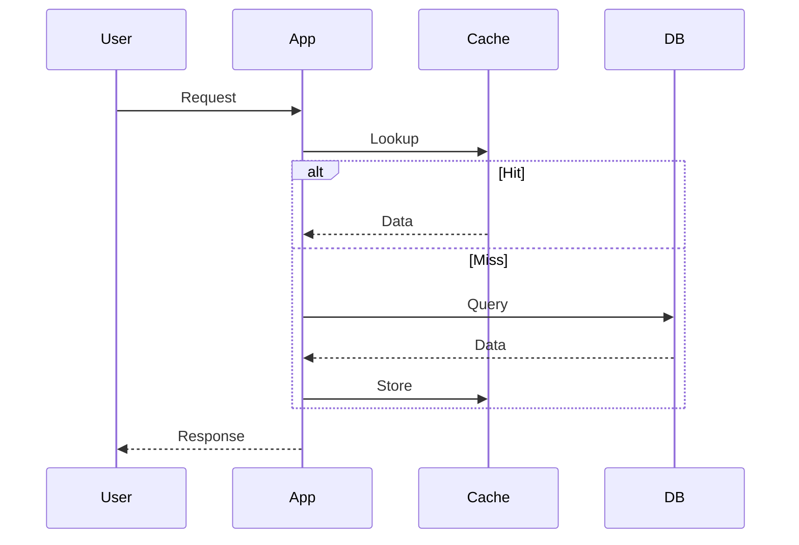

Examples:

```text
Redis

Memcached
```

---

# Pattern 3: Immutable Data Pattern

Never update.

Always create new versions.

Examples:

```text
Docker Images

Git

Backups

S3 Versioning
```

---

# Architecture

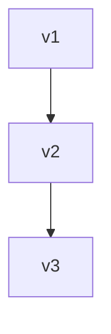

Benefits:

```text
Rollback

Auditing

Safety

Reproducibility
```

---

# Pattern 4: Separation Of Compute And Storage

This pattern dominates cloud computing.

Old world:

```text
Server

↓

CPU

RAM

SSD
```

Modern world:

```text
Compute Cluster

↓

Storage Cluster
```

---

# Architecture


Examples:

```text
Snowflake

BigQuery

Databricks
```

Benefits:

```text
Independent scaling
```

---

# Pattern 5: Storage Tiering

Not all data deserves expensive storage.

---

# Architecture

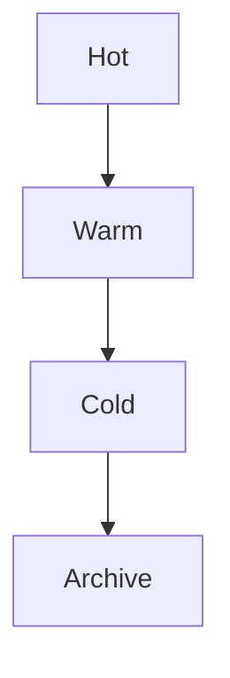

Examples:

```text
Recent logs

↓

Monthly reports

↓

Old backups

↓

Compliance data
```

---

# Pattern 6: Multi-Layer Storage

Modern applications never use one storage system.

Example Instagram.

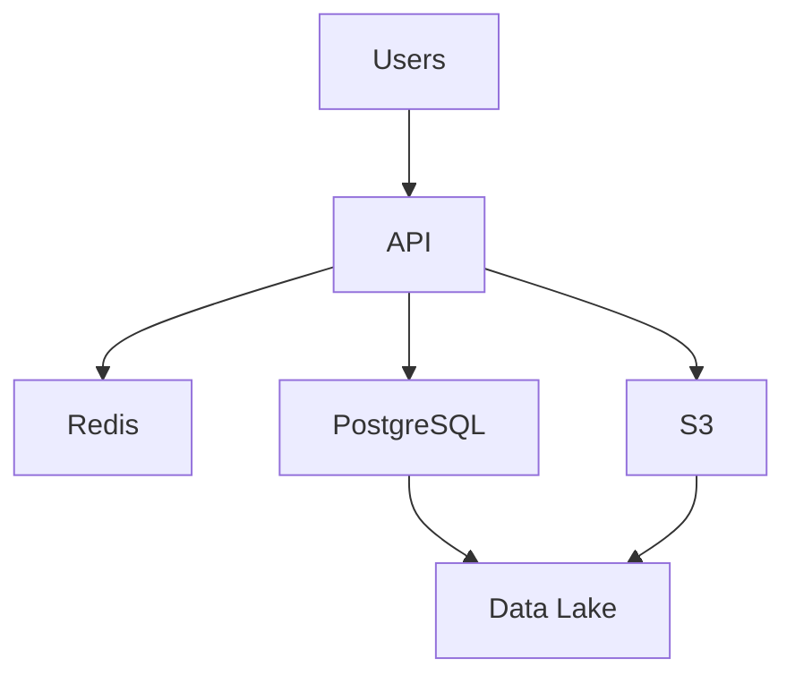

Each layer solves different problems.

---

# Pattern 7: Polyglot Persistence

Different data needs different databases.

Wrong:

```text
Everything in PostgreSQL
```

Correct:

```text
PostgreSQL -> Transactions

Redis -> Cache

Elasticsearch -> Search

S3 -> Images

Data Lake -> Analytics
```

---

# Architecture

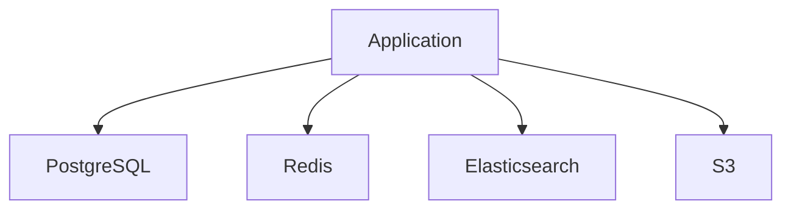

---

# Pattern 8: Event Storage Pattern

Store events instead of state.

Example:

```text
UserCreated

AddressUpdated

SubscriptionAdded
```

---

# Architecture

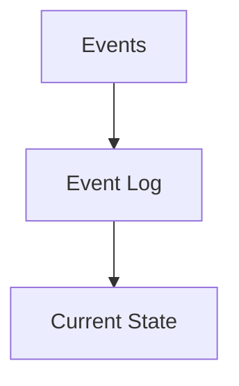

Examples:

```text
Kafka

Event Sourcing
```

---

# Pattern 9: Data Lake Pattern

Store everything.

Analyze later.

---

# Architecture

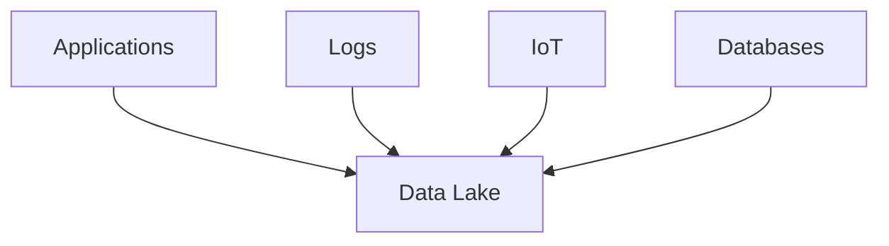

Examples:

```text
AWS S3

Delta Lake

Apache Iceberg
```

---

# Pattern 10: Streaming Storage

Continuous data flow.

Examples:

```text
Uber

Netflix

Stock exchanges
```

---

# Architecture


---

# Pattern 11: Search Storage

Search systems are specialized storage systems.

Examples:

```text
Elasticsearch

OpenSearch
```

---

# Architecture

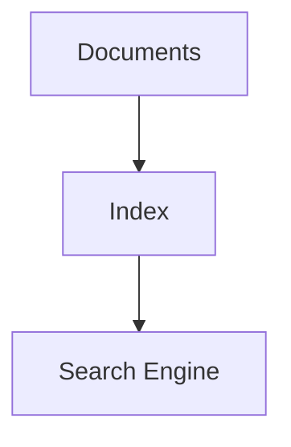

---

# Pattern 12: Edge Storage

Move storage near users.

---

# Architecture

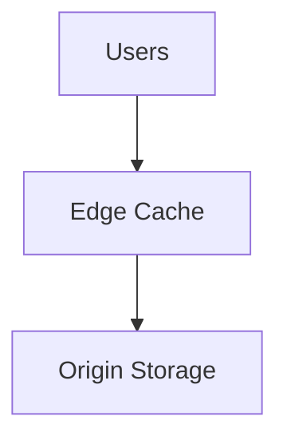

Examples:

```text
Cloudflare

Fastly

Akamai
```

---

# Pattern 13: AI Storage Pattern

AI fundamentally changed storage.

AI systems consume:

```text
Datasets

Embeddings

Vectors

Checkpoints

Models

Logs
```

---

# Architecture

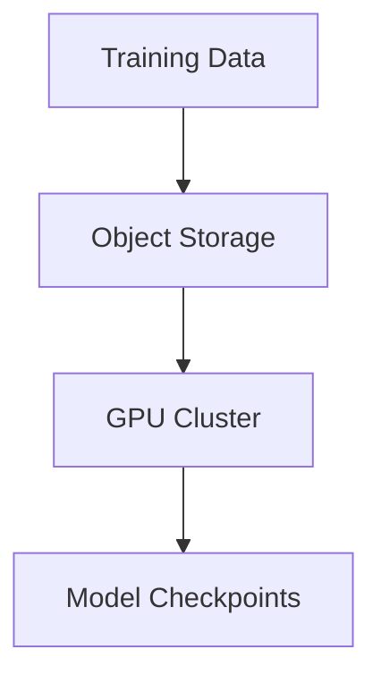

---

# Pattern 14: Archival Pattern

Store rarely accessed data cheaply.

Examples:

```text
AWS Glacier

Azure Archive

Google Archive
```

---

# Architecture

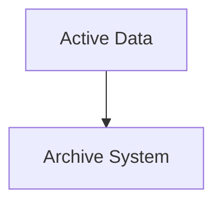

---

# Pattern 15: Data Mesh Pattern

Large organizations decentralize data ownership.

Instead of:

```text
One giant team
```

Each domain owns data.

---

# Architecture

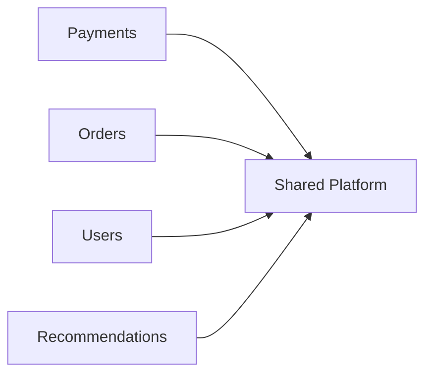

---

# Modern Company Examples

# Netflix

```text
Users

↓

CDN

↓

API

↓

Cache

↓

Databases

↓

Object Storage
```

---

# Instagram

```text
Users

↓

API

↓

Redis

↓

PostgreSQL

↓

S3

↓

Data Lake
```

---

# Uber

```text
Drivers

↓

Kafka

↓

Services

↓

Databases

↓

Analytics
```

---

# OpenAI-Style AI Systems

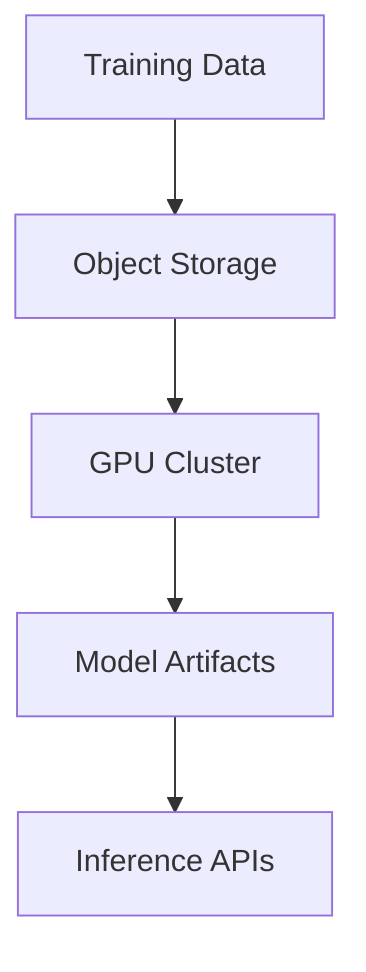

---

# Data Gravity

This is a very important modern concept.

Large data attracts systems.

Instead of:

```text
Move data
```

We often:

```text
Move compute to data
```

because data is expensive to move.

---

# Storage Is Becoming Software

Old world:

```text
Buy disks
```

Modern world:

```text
Program data movement
```

Storage engineers are becoming software engineers.

---

# Modern Engineering Decision Tree

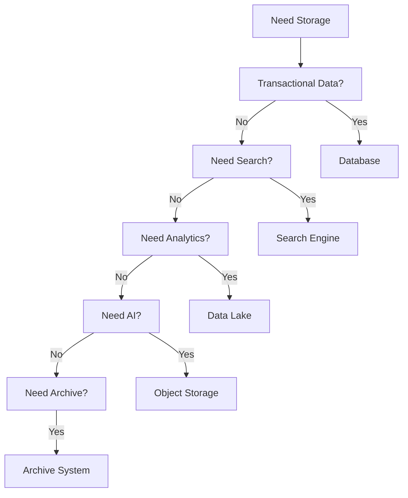

---

# Performance Thinking

Always think about:

```text
Latency

Throughput

IOPS

Bandwidth

Data locality

Caching
```

---

# Security Thinking

Protect:

```text
Data ownership

Encryption

Access control

Replication

Backups

Compliance
```

---

# Scaling Thinking

At scale, storage problems become:

```text
Metadata problems

Network problems

Observability problems

Cost problems
```

Not disk problems.

---

# Observability Thinking

Monitor:

```text
Growth rate

Access frequency

Latency

Replication

Failures

Costs

Cold data

Hot data
```

---

# Engineering Mindset

Beginners think:

> Where do I save files?

Backend engineers think:

> Which database should I use?

Platform engineers think:

> How should data move?

Architects think:

> How should data evolve?

Founders think:

> How does data become a business asset?

---

# Interview Questions

### Beginner

1. What is a storage pattern?

2. What is cache aside?

3. Why do we separate compute and storage?

4. What is immutable storage?

5. What is a data lake?

### Intermediate

6. Why is polyglot persistence useful?

7. Why do AI systems prefer object storage?

8. Why does data gravity exist?

9. Why is edge storage important?

10. Why do modern systems use multiple storage layers?

### Advanced

11. How would you architect storage for 100 million users?

12. How would you build an AI storage platform?

13. How would you design a global data platform?

14. How would you separate transactional and analytical workloads?

15. How would you evolve a startup's storage architecture over 10 years?

---

# Cheat Sheet

```text
Storage Evolution

Filesystem

↓

Databases

↓

Cloud Storage

↓

Distributed Storage

↓

Data Platforms

↓

AI Storage


Golden Rule

Modern systems do not store data.

Modern systems move data.
```

because after learning **how modern systems store data**, we learn **how to diagnose when everything breaks**.
