# Storage Patterns

> **Technologies change. Storage patterns survive.**

This file is one of the most important files in the entire storage section.

Why?

Because engineers don't memorize technologies.

Engineers recognize patterns.

After a few years, you will stop thinking:

> We need Docker.

> We need Kubernetes.

> We need AWS EBS.

Instead, you'll think:

> We have a storage problem. Which pattern solves it?

This is a completely different mindset.

---

# Why This Exists

Most beginners learn storage like this:

```text
HDD

↓

SSD

↓

Docker Volume

↓

Kubernetes PVC

↓

AWS EBS

↓

Done
```

This is wrong.

Because technologies come and go.

10 years ago:

```text
Bare metal

NFS

SAN
```

Today:

```text
Docker

Kubernetes

Cloud storage
```

Tomorrow:

```text
Serverless storage

AI-native storage
```

The technologies change.

The patterns remain.

---

# The Core Idea

Storage engineering is fundamentally about answering five questions.

```text
Where is data?

Who owns data?

Who can access data?

How long should data live?

What happens if infrastructure fails?
```

Every storage architecture is simply a different answer to these questions.

---

# Mental Model

Think of a city.

```text
Buildings = Applications

Citizens = Data

Roads = Networks

Warehouses = Storage Systems
```

Storage patterns are city planning patterns.

Good city planning:

```text
Fast

Reliable

Scalable

Maintainable
```

Bad city planning:

```text
Traffic jams

Chaos

Failures

Expensive systems
```

The same applies to software.

---

# First Principles

Every storage system must balance:

```text
Performance

Durability

Availability

Scalability

Cost
```

You cannot maximize everything.

Storage engineering is tradeoff engineering.

---

# The Storage Evolution


Patterns evolved because scale evolved.

---

# The 12 Storage Patterns Every Engineer Should Know

```text
1. Local Storage Pattern

2. Shared Storage Pattern

3. Persistent Storage Pattern

4. Cache Pattern

5. Immutable Data Pattern

6. Tiered Storage Pattern

7. Replication Pattern

8. Backup Pattern

9. Sharding Pattern

10. Hot-Warm-Cold Pattern

11. Event Storage Pattern

12. Data Lake Pattern
```

These patterns appear everywhere.

---

---

# Pattern 1: Local Storage Pattern

# Problem It Solves

Applications need extremely fast access.

Store data near compute.

---

# Architecture

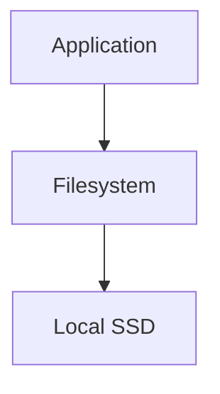

Examples:

```text
Redis cache

Temp files

Scratch space

Build artifacts
```

Advantages:

```text
Very low latency

Simple

Cheap
```

Disadvantages:

```text
Data loss risk

No sharing

No portability
```

---

# When To Use

Use when:

```text
Data is temporary

Speed matters

Recovery is easy
```

Do not use for:

```text
Databases without replication

Critical files

User uploads
```

---

# Pattern 2: Shared Storage Pattern

# Problem It Solves

Multiple systems need access.

---

# Architecture

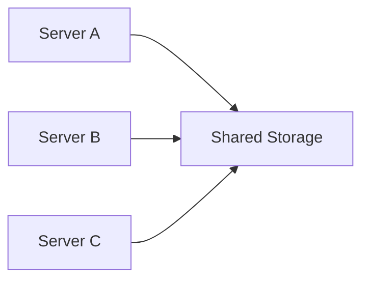

Examples:

```text
NFS

AWS EFS

Azure Files

Google Filestore
```

Use cases:

```text
Shared assets

CMS

Media servers
```

Tradeoff:

```text
Convenience

↓

Higher latency
```

---

# Pattern 3: Persistent Storage Pattern

# Problem It Solves

Containers die.

Data shouldn't.

---

# Architecture

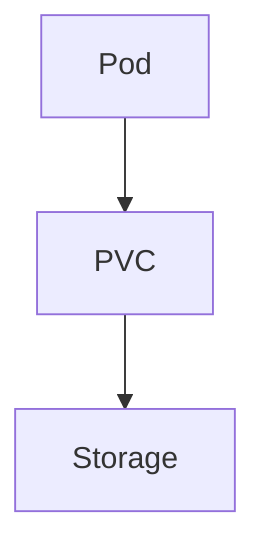

Examples:

```text
PostgreSQL

MongoDB

Redis AOF

Elasticsearch
```

Golden rule:

> Compute is temporary. Data is permanent.

---

# Pattern 4: Cache Pattern

# Problem It Solves

Storage is slow.

Memory is fast.

Put memory in front.

---

# Architecture


Example:

```text
Redis

Memcached
```

---

# Cache Data Flow

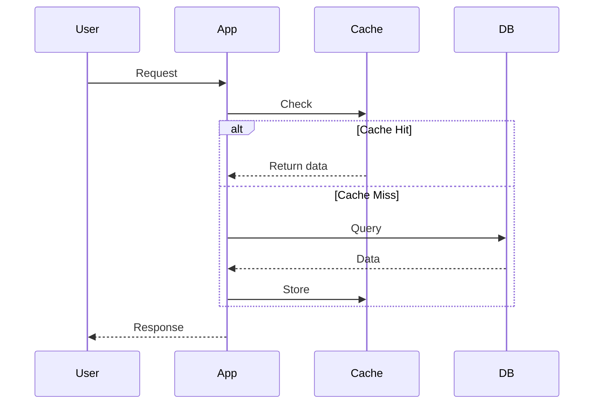

---

# Pattern 5: Immutable Data Pattern

> Never modify.

Always create new versions.

Examples:

```text
Docker images

Git commits

S3 versioning

Backups
```

Benefits:

```text
Easy rollback

Safe deployments

Auditability
```

---

# Architecture

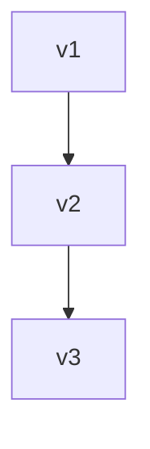

Never overwrite.

---

# Pattern 6: Tiered Storage Pattern

Different data deserves different storage.

Not all data is equally important.

---

# Architecture

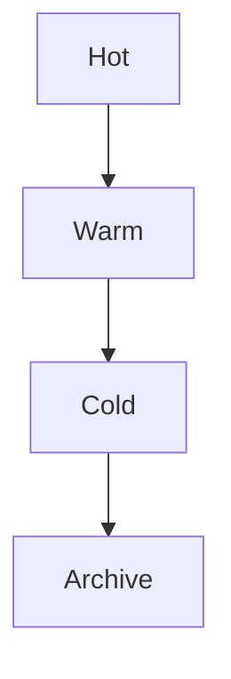

---

# Example

Hot:

```text
Recent data
```

Warm:

```text
Monthly reports
```

Cold:

```text
Old backups
```

Archive:

```text
Compliance data
```

---

# Pattern 7: Replication Pattern

> One copy is zero copies.

Always assume hardware will fail.

---

# Architecture

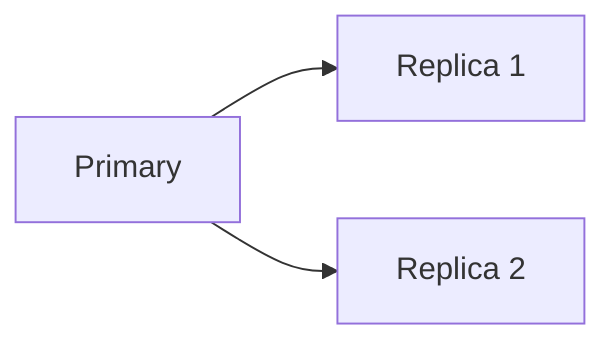

Benefits:

```text
Durability

Availability

Fault tolerance
```

Tradeoff:

```text
More cost

More complexity
```

---

# Pattern 8: Backup Pattern

Replication is NOT backup.

This is a very important lesson.

People confuse them.

---

# Wrong


Delete data:

```text
Primary deleted

↓

Replica deleted
```

Data gone.

---

# Correct

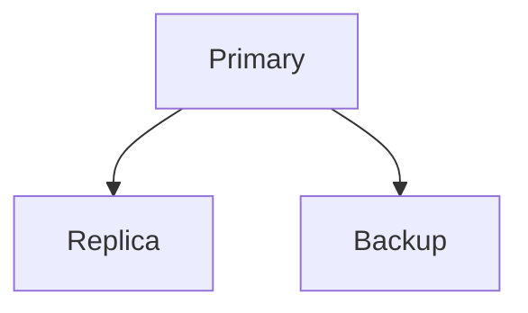

Backup must be independent.

---

# Pattern 9: Sharding Pattern

# Problem It Solves

Data is too large.

Split it.

---

# Architecture

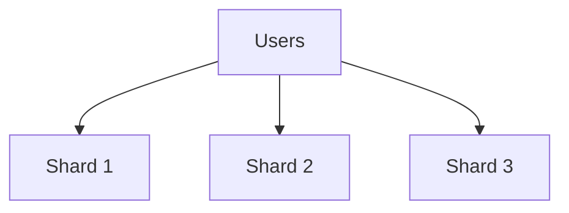

Examples:

```text
Instagram

Uber

YouTube

Netflix
```

---

# Pattern 10: Hot-Warm-Cold Architecture

Very common in observability systems.

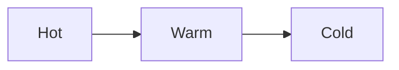

Examples:

```text
Elasticsearch

Prometheus

Data warehouses
```

---

# Pattern 11: Event Storage Pattern

Instead of storing state.

Store events.

Example:

```text
User Created

User Updated

Email Changed

Subscription Added
```

---

# Architecture

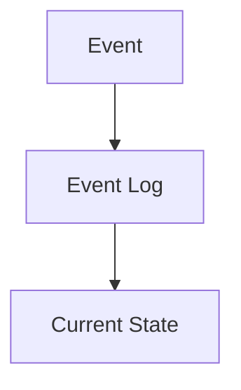

Examples:

```text
Kafka

Event sourcing systems
```

---

# Pattern 12: Data Lake Pattern

Store everything.

Analyze later.

Examples:

```text
AI

ML

Analytics

Data Science
```

---

# Architecture

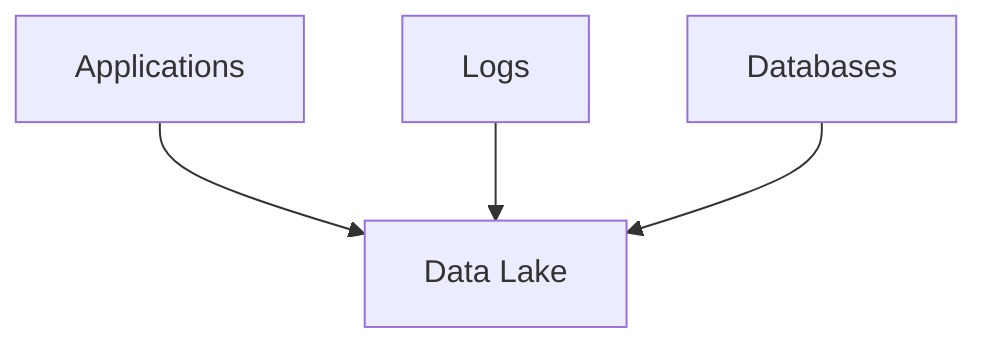

---

# Modern Infrastructure Connections

# Linux

```text
Filesystem
```

↓

# Docker

```text
Volumes
```

↓

# Kubernetes

```text
PVC
```

↓

# Cloud

```text
Distributed storage
```

All of these use the same patterns.

---

# Storage Pattern Selection Tree

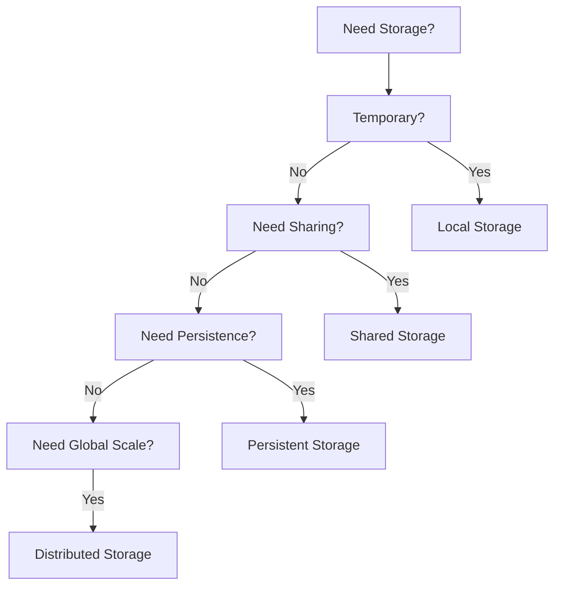

---

# Performance Considerations

Always think:

```text
Latency

IOPS

Throughput

Queue depth

Data locality
```

---

# Security Considerations

Protect:

```text
Data access

Encryption

Secrets

Backups

Replication channels
```

---

# Scaling Considerations

As systems grow:

```text
Storage

↓

Networking

↓

Metadata

↓

Observability

↓

Automation
```

become more important.

---

# Observability Considerations

Monitor:

```text
Capacity

Growth

Latency

IOPS

Errors

Replication lag

Backups

Availability
```

---

# Real World Example: Instagram

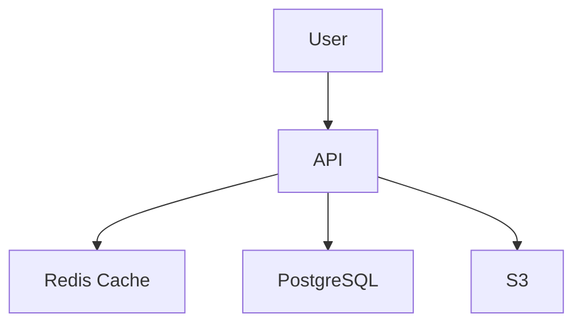

Patterns used:

```text
Cache

Persistent Storage

Object Storage

Replication

Tiering
```

---

# Troubleshooting Mindset

Never ask:

> Which technology should I use?

Ask:

> Which storage pattern is missing?

---

# Common Mistakes

### Mistake 1

Thinking replication is backup.

---

### Mistake 2

Putting everything in one database.

---

### Mistake 3

Ignoring data lifecycle.

---

### Mistake 4

Ignoring storage costs.

---

### Mistake 5

Optimizing only for speed.

---

# Engineering Mindset

Beginners think:

> Where do I save data?

Engineers think:

> How should data live?

Platform engineers think:

> How should data survive?

Architects think:

> How should data evolve over 10 years?

Founders think:

> How can data scale with the business?

---

# Interview Questions

## Beginner

1. What is a storage pattern?

2. Why is cache useful?

3. Why is replication needed?

4. Why is backup different from replication?

5. What is sharding?

---

## Intermediate

6. Why do containers need persistent storage?

7. What is immutable storage?

8. What is tiered storage?

9. What is a data lake?

10. What are event stores?

---

## Advanced

11. How would you architect storage for 100 million users?

12. How would you design petabyte-scale storage?

13. How would you separate hot and cold data?

14. How would you design storage for AI systems?

15. How would you evolve a startup from one server to global infrastructure?

---

# Cheat Sheet

```text
Storage Engineering Pyramid

Local Storage

↓

Shared Storage

↓

Persistent Storage

↓

Replication

↓

Distributed Storage

↓

Global Storage


Golden Rule

Don't memorize technologies.

Recognize patterns.
```

because **great engineers are not the ones who build systems. Great engineers are the ones who can fix systems when everything is burning.**
