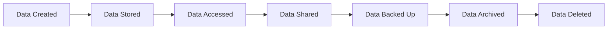
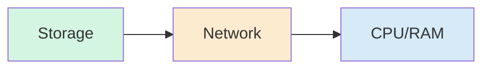
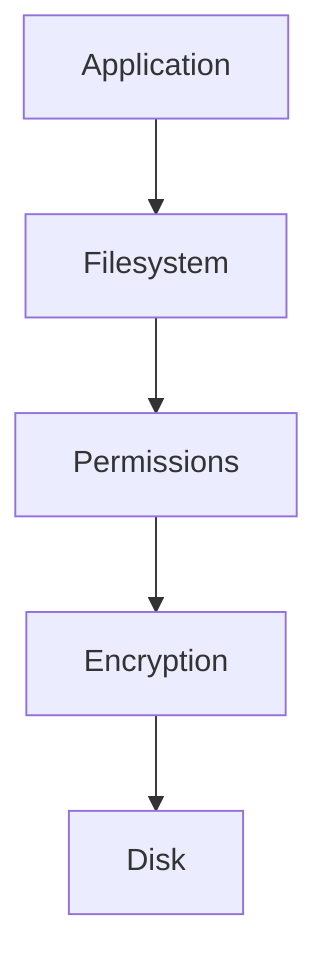
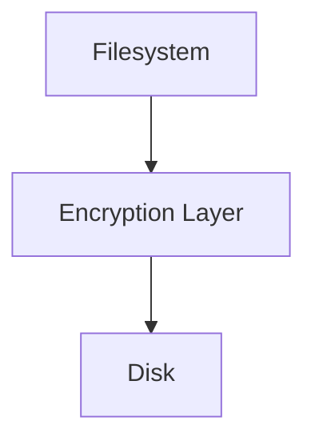
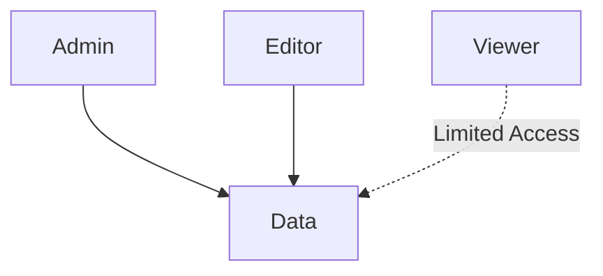
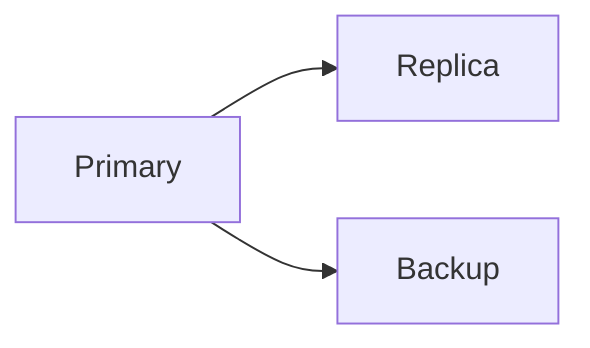
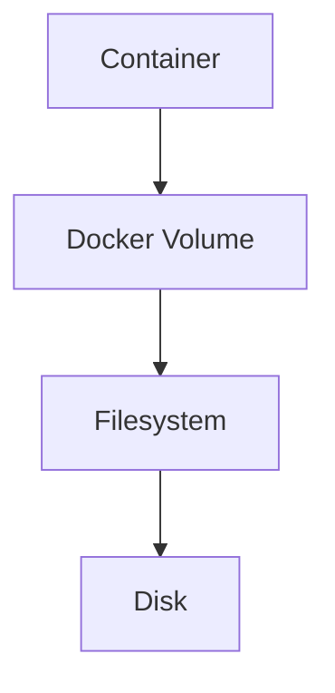
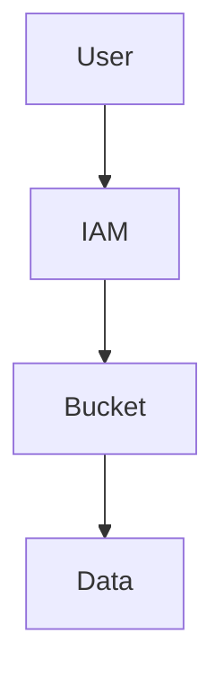
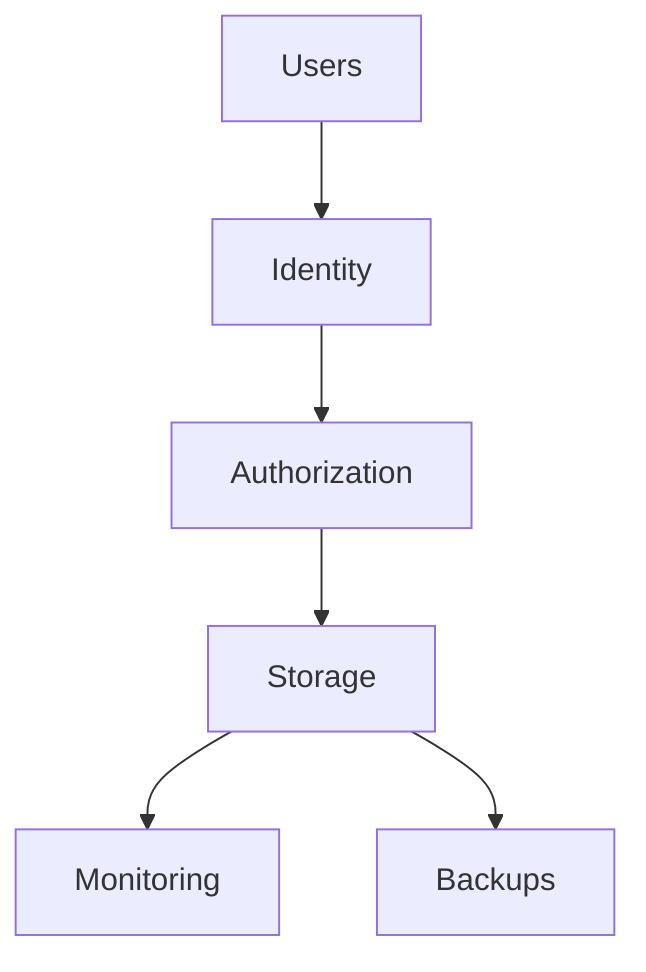

# Storage Security

> **Storage security is not about protecting disks. It is about protecting the entire lifecycle of data.**

This is one of the most misunderstood topics in engineering.

Many beginners think:

```text
Security

↓

Passwords

↓

Done
```

or

```text
Storage Security

↓

Encrypt disk

↓

Done
```

Both are wrong.

Storage security is much bigger.

Storage security answers a fundamental question:

> **How do we ensure data remains confidential, trustworthy, available, recoverable, and auditable throughout its entire life?**

Storage security is not a storage topic.

It is a systems engineering topic.

---

# Why This Exists

Everything eventually becomes data.

Think about modern systems.

Instagram:

```text
Photos

Videos

Comments

Likes

Stories

Messages
```

Netflix:

```text
Videos

Recommendations

Profiles

Analytics
```

Banks:

```text
Transactions

Account balances

Audit logs

KYC documents
```

Hospitals:

```text
Medical records

Scans

Reports
```

AI systems:

```text
Training data

Models

Embeddings

Checkpoints
```

Every business eventually becomes a data company.

Which means:

> Every business eventually becomes a storage security company.

---

# Problem It Solves

Storage security exists because data is constantly under attack.

Attackers don't attack disks.

Attackers attack:

```text
Data

Identity

Permissions

Backups

Storage APIs

Misconfigurations
```

A huge misconception:

> "Hackers steal servers."

Usually no.

Most incidents happen because:

```text
Wrong permissions

Public buckets

Leaked credentials

Misconfigured backups

Exposed volumes

Ransomware

Privilege escalation
```

---

# Mental Model

Think of data like gold inside a bank.

The bank isn't enough.

We need:

```text
Building

Doors

Locks

Cameras

Guards

Backup vaults

Insurance

Audit logs
```

Storage security is exactly this.

---

# Data Castle Mental Model

```text
                     Audit Logs

                         ▲

                 Monitoring Systems

                         ▲

                  Access Controls

                         ▲

                    Encryption

                         ▲

                     Backups

                         ▲

                   Actual Data
```

You are never protecting one thing.

You are protecting multiple layers.

---

# First Principles

There are only five things security engineers protect.

```text
Confidentiality

Integrity

Availability

Recoverability

Auditability
```

Memorize these.

They appear everywhere.

---

# Confidentiality

Question:

> Who can see the data?

Examples:

```text
Passwords

Medical records

Private photos

Financial records
```

Goal:

```text
Authorized users

↓

Can access

Unauthorized users

↓

Cannot access
```

---

# Integrity

Question:

> Can someone secretly modify the data?

Example:

```text
₹1000

↓

₹1000000
```

Very dangerous.

Goal:

```text
Data

↓

Cannot be altered silently
```

---

# Availability

Question:

> Can users access data when needed?

Examples:

```text
Datacenter failures

Disk failures

DDoS attacks

Power failures
```

Goal:

```text
Data remains accessible
```

---

# Recoverability

Question:

> If data is destroyed, can we restore it?

Goal:

```text
Recover quickly
```

---

# Auditability

Question:

> Who accessed what?

Example:

```text
User

↓

Opened file

↓

Modified file

↓

Deleted file
```

We must know everything.

---

# The Storage Security Pyramid

```text
              Audit Logs

           Monitoring Layer

          Access Control Layer

          Encryption Layer

            Backup Layer

           Storage Layer

               Data
```

Every layer matters.

---

# Data Has A Lifecycle

This is extremely important.

Data is never static.

Data moves.

Data lifecycle:



Every stage has security implications.

---

# Data Is Vulnerable At Three States

This is one of the most important concepts in security.

Data exists in three states.

```text
At Rest

In Transit

In Use
```

Memorize these.

---

# Data At Rest

Data sitting somewhere.

Examples:

```text
SSD

HDD

Cloud Storage

Database Files
```

Protect using:

```text
Encryption

Permissions

Access control
```

---

# Data In Transit

Data moving.

Examples:

```text
Server A

↓

Server B
```

Protect using:

```text
TLS

HTTPS

VPN

SSH
```

---

# Data In Use

Data being processed.

Examples:

```text
Application

↓

RAM

↓

CPU
```

Protect using:

```text
Process isolation

Memory protection

Least privilege
```

---

# Data State Visualization



---

# Linux Storage Security Architecture



---

# Layer 1: Physical Security

Beginners ignore this.

Question:

> What if someone steals the disk?

No encryption?

Data is gone.

Solutions:

```text
Disk encryption

Secure datacenters

Secure hardware
```

---

# Layer 2: Filesystem Security

Linux filesystems have permissions.

Examples:

```bash
ls -l
```

```text
-rwxr-x---
```

Meaning:

```text
Owner

Group

Others
```

---

# Visualization

```text
rwx | r-x | ---

Owner Group Others
```

---

# Permission Principle

Never do this:

```bash
chmod 777
```

This is one of the worst habits beginners learn.

Why?

```text
Everyone

↓

Can access

Can modify

Can execute
```

Huge risk.

---

# Principle Of Least Privilege

Golden rule:

> Give the minimum permissions required.

Bad:

```text
Everyone can access
```

Good:

```text
Only necessary users can access
```

---

# Layer 3: Encryption

Encryption converts:

```text
Readable Data

↓

Unreadable Data
```

Without a key:

Impossible to understand.

---

# Encryption Visualization

```text
Original

Hello World

↓

Encryption

9A8D72A72C3E

↓

Decryption

Hello World
```

---

# Full Disk Encryption

Popular Linux technologies:

```text
LUKS

dm-crypt
```

Architecture:



---

# Layer 4: Access Control

Modern systems don't rely only on Linux permissions.

Systems use:

```text
RBAC

ABAC

IAM
```

---

# RBAC

Role Based Access Control.

Example:

```text
Admin

Editor

Viewer
```

---

# RBAC Visualization



---

# Layer 5: Backup Security

This is often ignored.

Question:

What if ransomware encrypts everything?

No backup?

Company is finished.

---

# The 3-2-1 Rule

One of the most important rules.

```text
3 Copies

2 Different Media

1 Offsite Backup
```

Visualization:

```text
Production

↓

Local Backup

↓

Cloud Backup
```

---

# Replication Is Not Backup

This is critical.

Wrong:


Delete:

```text
Primary

↓

Replica

↓

Deleted
```

Both gone.

---

# Correct



Backup is independent.

---

# Storage Threats

There are common attacks.

---

# Threat 1: Ransomware

Process:

```text
Access

↓

Encrypt

↓

Demand money
```

---

# Threat 2: Public Cloud Bucket

Common mistake.

```text
S3

↓

Public

↓

Everyone can download
```

Very common.

---

# Threat 3: Credential Leak

```text
GitHub

↓

API Key Leak

↓

Storage Compromised
```

---

# Threat 4: Privilege Escalation

User gains more access.

---

# Threat 5: Insider Threat

Employees.

Contractors.

Admins.

These are real threats.

---

# Docker Storage Security

Bad:

```bash
-v /:/host
```

Dangerous.

Container can access host.

---

# Good

```text
Read only volumes

Minimal mounts

Named volumes
```

---

# Docker Security Architecture



---

# Kubernetes Storage Security

Protect:

```text
PVC

CSI Drivers

Secrets

hostPath
```

Avoid:

```text
Privileged containers

Host mounts

Root access
```

---

# Cloud Storage Security

Protect:

```text
Buckets

IAM

Encryption

Access Policies
```

---

# Cloud Security Visualization



---

# AI Storage Security

AI systems introduce new risks.

Protect:

```text
Datasets

Embeddings

Models

Checkpoints
```

AI companies are huge storage companies.

---

# Storage Monitoring For Security

Monitor:

```text
Unexpected writes

Permission changes

Storage spikes

Delete spikes

Encryption activity

Access failures
```

Questions:

```text
Who?

What?

When?

Where?

Why?
```

---

# Modern Security Stack



---

# Performance Considerations

Security always has tradeoffs.

Encryption adds:

```text
CPU overhead
```

Audit logs add:

```text
Storage overhead
```

Backups add:

```text
Network overhead
```

Engineers balance tradeoffs.

---

# Security Checklist

Always verify:

```text
Encryption enabled

Least privilege

Backups exist

Audit logs enabled

Storage monitored

Permissions reviewed

Secrets protected

Access controlled
```

---

# Common Mistakes

## Mistake 1

Thinking storage security is encryption.

Wrong.

It's much larger.

---

## Mistake 2

Using chmod 777.

Never do this.

---

## Mistake 3

Thinking replication is backup.

Wrong.

---

## Mistake 4

Ignoring backups.

---

## Mistake 5

Storing secrets in Git.

Never.

---

# Engineering Mindset

Junior engineers think:

> How do I protect a file?

Mid engineers think:

> How do I protect a server?

Senior engineers think:

> How do I protect data?

Architects think:

> How do I protect the entire data lifecycle?

Founders think:

> How do I protect customer trust?

---

# Interview Questions

## Beginner

1. What is storage security?

2. What is the CIA triad?

3. Difference between backup and replication?

4. Why is chmod 777 dangerous?

5. What is encryption?

## Intermediate

6. Why do we encrypt data at rest?

7. Why is IAM important?

8. Why is least privilege important?

9. Why is audit logging important?

10. Why is replication not backup?

## Advanced

11. How would you secure petabytes of data?

12. How would you secure Kubernetes storage?

13. How would you secure AI datasets?

14. How would you design storage security for a global platform?

15. How would you build zero-trust storage?

---

# Cheat Sheet

```text
Storage Security

=

Protect Data Lifecycle


Protect

↓

Confidentiality

Integrity

Availability

Recoverability

Auditability


Golden Rule

Do not protect disks.

Protect data.
```


> Thinking like a Staff Engineer / System Architect.
