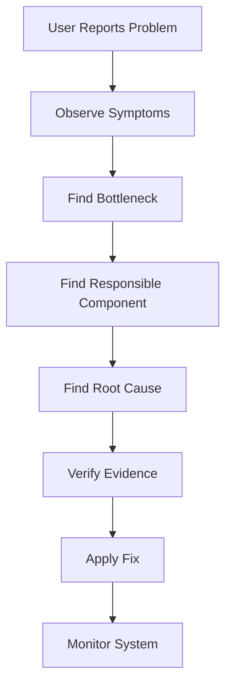
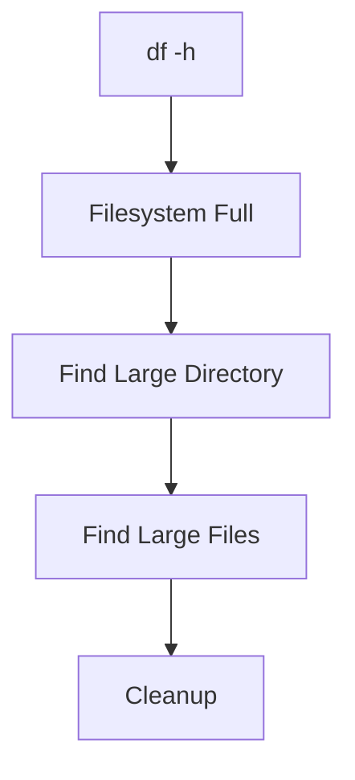
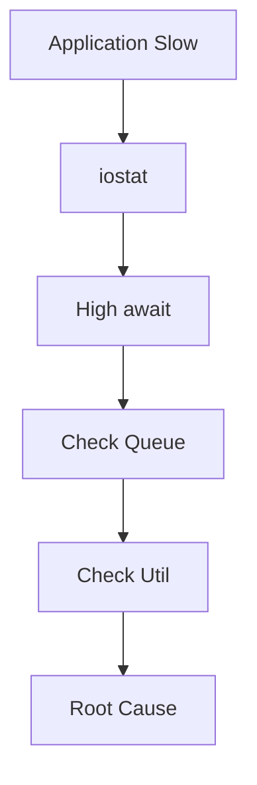
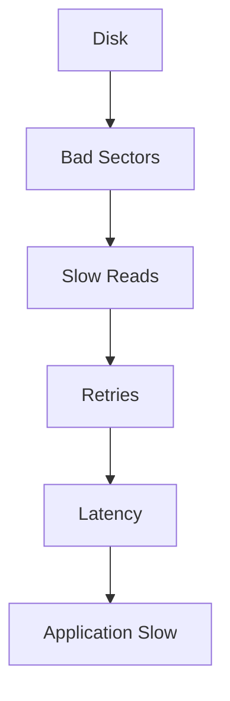
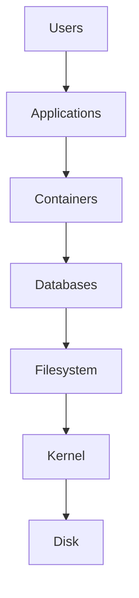
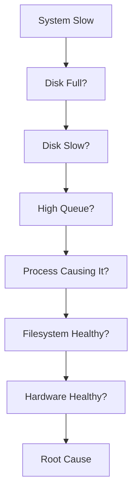

# storage-troubleshooting


> **Storage troubleshooting is not a storage skill. It is a systems thinking skill.**

This may become one of the most valuable files in your entire Linux repository.

Many engineers know Linux storage concepts.

Very few engineers know how to debug them under pressure.

In real jobs, nobody says:

> Explain ext4.

Instead they say:

> Production is down.

> APIs are timing out.

> Pods are restarting.

> Database is slow.

> Customers are complaining.

This file teaches you how senior engineers think.

---

# Why This Exists

Most beginners troubleshoot backwards.

Their process:

```text
Application slow

↓

Restart application

↓

Restart database

↓

Restart Docker

↓

Restart server

↓

Pray
```

This is guessing.

Engineers don't guess.

Engineers investigate.

Storage troubleshooting is simply:

> Converting invisible data movement into visible evidence.

---

# The Biggest Storage Misconception

Most engineers think:

```text
Storage = Disk Space
```

Wrong.

Storage is:

```text
Storage

↓

Capacity

Latency

IOPS

Throughput

Queue Depth

Filesystem Health

Device Health

Application Behavior
```

Storage is an ecosystem.

---

# The Golden Rule

Never troubleshoot storage from the bottom up.

Never start here:

```text
SSD

↓

Filesystem

↓

Application
```

Users don't care about SSDs.

Users care about applications.

Always start from symptoms.

---

# The Universal Troubleshooting Pyramid

This pyramid should become automatic in your brain.

```text
                  User Symptoms

                Application Layer

               Container Layer

              Database Layer

            Filesystem Layer

           Linux Storage Layer

             Physical Device
```

Always move downward.

---

# The Universal Troubleshooting Workflow



Never skip steps.

---

# The Five Universal Storage Questions

Always ask these.

Question 1:

```text
Is storage full?
```

Question 2:

```text
Is storage slow?
```

Question 3:

```text
Who is using storage?
```

Question 4:

```text
Is storage healthy?
```

Question 5:

```text
Is storage scaling properly?
```

These five questions solve most incidents.

---

# Troubleshooting Mental Model

Think of a highway.

```text
Cars = Data

Road = Storage

Traffic = I/O

Traffic Jam = Queue

Police = Monitoring Tools
```

Symptoms:

```text
Slow movement

↓

Traffic buildup

↓

Congestion

↓

Complaints
```

Storage behaves exactly the same way.

---

# The Storage Investigation Ladder

Always follow this order.

```text
1. Capacity

2. Latency

3. Throughput

4. Queue Depth

5. Processes

6. Filesystem

7. Hardware
```

Never jump randomly.

---

# Step 1: Is Storage Full?

This is the easiest problem.

Check:

```bash
df -h
```

Example:

```text
Filesystem Size Used Avail Use%

/dev/sda1 500G 490G 10G 98%
```

Danger:

```text
90%+

95%+

98%
```

---

# Capacity Investigation Workflow



---

# Find Large Directories

```bash
sudo du -sh /*
```

Find biggest folders.

---

# Drill Down

```bash
sudo du -sh /var/*
```

---

# Find Largest Files

```bash
sudo find / -type f -size +500M
```

---

# Common Causes

```text
Docker logs

Application logs

Backups

Core dumps

Database snapshots

Old images
```

---

# Step 2: Is Storage Slow?

This is where engineers separate themselves.

Check:

```bash
iostat -xz 1
```

Observe:

```text
await

aqu-sz

%util
```

---

# Storage Metrics Mental Model

```text
await

↓

How long requests wait

-----------------

aqu-sz

↓

How many requests wait

-----------------

util

↓

How busy storage is
```

---

# Healthy Numbers

NVMe:

```text
0.1-1 ms
```

SSD:

```text
1-5 ms
```

HDD:

```text
5-20 ms
```

Danger:

```text
50ms+

100ms+

300ms+
```

---

# Latency Investigation Workflow



---

# Step 3: Who Is Using Storage?

Now we find the culprit.

Command:

```bash
sudo iotop -oPa
```

Look for:

```text
postgres

docker

java

node

journald
```

Questions:

```text
Who writes?

Who reads?

Who spikes?
```

---

# Step 4: Is The Filesystem Healthy?

Storage can fail even with free space.

Check:

```bash
dmesg
```

Look for:

```text
I/O error

corruption

journal error

read failure
```

---

# Investigate Mounts

```bash
mount
```

Check:

```text
read-only

missing mounts

wrong options
```

---

# Check Inodes

This is one of the most common Linux incidents.

Command:

```bash
df -i
```

Problem:

```text
Filesystem free

↓

Inodes exhausted
```

Symptoms:

```text
Cannot create file

Cannot write logs

Cannot start applications
```

---

# Inode Visualization

```text
Disk

↓

Blocks

↓

Files

↓

Inodes
```

No inode:

```text
No file creation
```

---

# Step 5: Is Hardware Failing?

Command:

```bash
sudo smartctl -a /dev/sda
```

Look for:

```text
Temperature

Bad sectors

Wear level

Life remaining
```

---

# Hardware Failure Pipeline



---

# The 10 Most Common Production Incidents

# Incident 1: Disk Full

Symptoms:

```text
Application crashes

No logs

Cannot write files
```

Check:

```bash
df -h
```

Root causes:

```text
Logs

Docker

Backups
```

---

# Incident 2: Docker Log Explosion

Symptoms:

```text
Node unhealthy

Disk usage spikes
```

Check:

```bash
docker system df
```

Inspect:

```bash
du -sh /var/lib/docker/containers/*
```

Fix:

Enable rotation.

---

# Incident 3: Kubernetes Node Full

Symptoms:

```text
Pods restarting

Node NotReady
```

Investigate:

```text
/var/log

/var/lib/containerd

/var/lib/kubelet
```

---

# Incident 4: Database Slow

Symptoms:

```text
API latency

Query timeout
```

Check:

```bash
iostat
```

Then:

```bash
iotop
```

Often:

```text
Checkpoint spikes

WAL writes

Missing indexes
```

---

# Incident 5: Millions Of Tiny Files

Symptoms:

```text
Slow filesystem

Slow backups

High inode usage
```

Problem:

```text
Metadata overhead
```

---

# Incident 6: Cloud Disk Throttling

Symptoms:

```text
Random latency spikes
```

Cause:

```text
IOPS limit reached
```

Very common.

---

# Incident 7: Backup Jobs Destroy Performance

Symptoms:

```text
Server slow every night
```

Cause:

```text
Backup cron
```

---

# Incident 8: Ransomware

Symptoms:

```text
Sudden write explosion
```

Observe:

```text
100% util

Huge writes
```

Investigate immediately.

---

# Incident 9: Filesystem Corruption

Symptoms:

```text
Read only mount

Errors everywhere
```

Investigate:

```bash
dmesg
```

---

# Incident 10: SSD Wear Out

Symptoms:

```text
Latency spikes

I/O errors

Timeouts
```

Check:

```bash
smartctl
```

---

# The Complete Troubleshooting Stack



---

# Linux Tool Map

| Question           | Tool     |
| ------------------ | -------- |
| Storage full?      | df       |
| Who uses disk?     | iotop    |
| Disk slow?         | iostat   |
| Memory pressure?   | vmstat   |
| Filesystem health? | dmesg    |
| Disk health?       | smartctl |
| Large directories? | du       |
| Large files?       | find     |

---

# Modern World Troubleshooting

# Docker

Investigate:

```text
overlay2

Volumes

Logs

Images
```

Commands:

```bash
docker system df
```

---

# Kubernetes

Investigate:

```text
PVC

PV

CSI

Container runtime
```

---

# Cloud

Investigate:

```text
IOPS

Burst credits

Latency

Throttling
```

---

# AI Systems

Investigate:

```text
Dataset growth

Checkpoint storage

GPU I/O bottlenecks
```

---

# Troubleshooting Decision Tree



---

# Performance Thinking

Never optimize randomly.

Follow evidence.

Bad:

```text
Slow app

↓

Add CPU
```

Good:

```text
Slow app

↓

Measure

↓

Find bottleneck

↓

Fix bottleneck
```

---

# Security Thinking

Monitor:

```text
Unexpected writes

Encryption activity

Permission changes

Log explosions

Storage spikes
```

Storage anomalies often indicate attacks.

---

# Scaling Thinking

As systems grow:

```text
100 GB

↓

10 TB

↓

1 PB
```

Storage problems become:

```text
Network problems

Metadata problems

Observability problems
```

Not disk problems.

---

# Observability Thinking

Monitor these continuously.

```text
Capacity

Growth rate

Latency

IOPS

Queue depth

Errors

Health

Availability
```

---

# Engineering Mindset

Junior engineers think:

> Which command should I run?

Mid engineers think:

> Which component is failing?

Senior engineers think:

> Which bottleneck is responsible?

Staff engineers think:

> Why did the architecture allow this failure?

Architects think:

> How do we make this impossible?

---

# Interview Questions

## Beginner

1. Difference between disk full and inode exhaustion?

2. Why use iostat?

3. Why use iotop?

4. What is storage latency?

5. What is queue depth?

## Intermediate

6. How would you troubleshoot a slow database?

7. Why does Docker fill disks?

8. Why do Kubernetes nodes fail?

9. Why do backups hurt performance?

10. How does filesystem corruption happen?

## Advanced

11. How would you troubleshoot a 1000-node storage cluster?

12. How would you design storage observability?

13. How would you diagnose cloud disk throttling?

14. How would you troubleshoot petabyte-scale storage?

15. How would you build a self-healing storage platform?

---

# Cheat Sheet

```text
Storage Troubleshooting Pyramid

User

↓

Application

↓

Container

↓

Database

↓

Filesystem

↓

Kernel

↓

Disk


Golden Workflow

Observe

↓

Measure

↓

Find Bottleneck

↓

Find Culprit

↓

Find Root Cause

↓

Fix

↓

Verify
```

These files are where your repository begins transforming from **Linux knowledge** into **engineering capability**.
