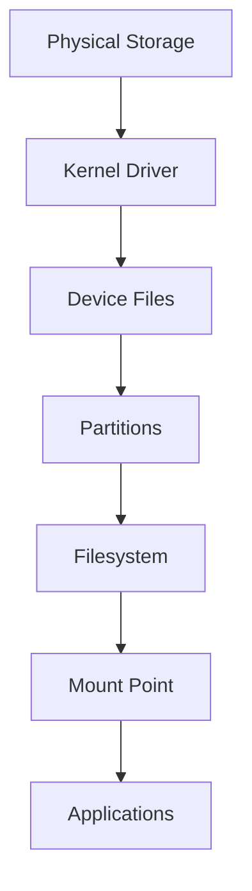
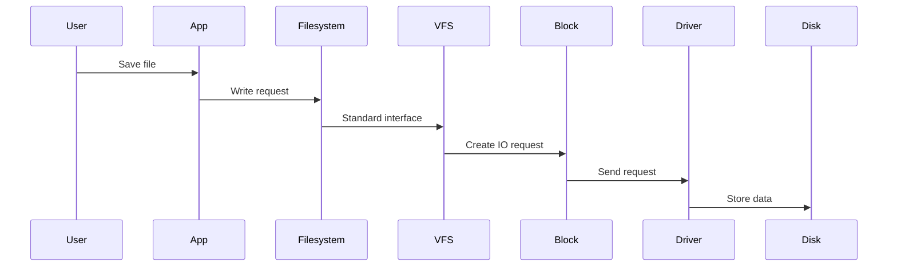
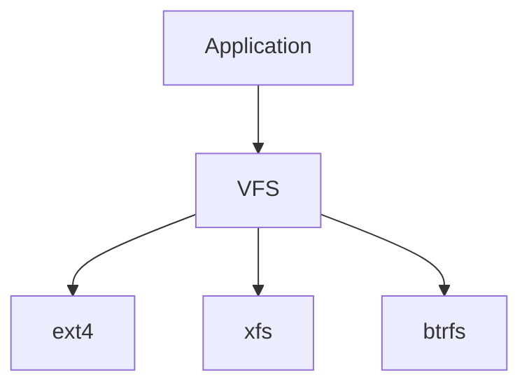
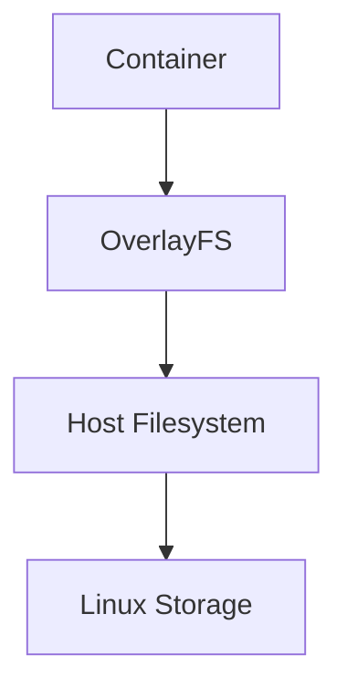
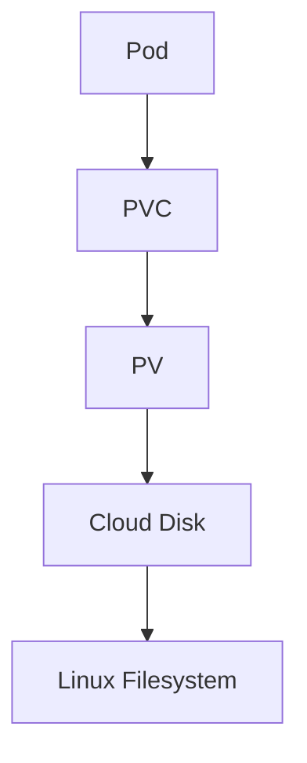
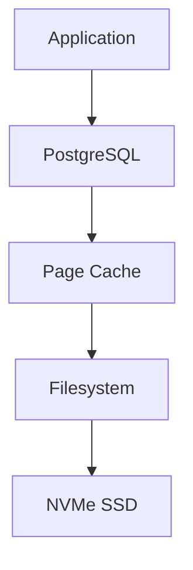

# How Linux Sees Storage

> One of the biggest mindset shifts when learning Linux is understanding that Linux does **NOT think like Windows**.

Most beginners think:

```text
Hard Disk

↓

Files

↓

Folders
```

Linux does not think this way.

Linux thinks in layers, abstractions, and relationships.

Understanding this single concept makes storage, filesystems, Docker, Kubernetes, databases, and cloud infrastructure much easier to understand.

---

# Why This File Exists

Many engineers learn commands.

```bash
lsblk

fdisk

mount

df

du
```

But they don't understand:

```text
What exactly Linux is looking at

How Linux identifies storage

How Linux organizes storage

How Linux attaches storage

How Linux finds data

How applications access data
```

This file builds that foundation.

---

# Problem It Solves

Without understanding how Linux sees storage, these concepts become confusing:

```text
/dev/sda

/dev/sdb

/dev/nvme0n1

/dev/mapper

mount

fstab

UUID

LVM

Docker volumes

Kubernetes PVs
```

After reading this file, all of them become easier.

---

# Mental Model

Think of Linux as a city planner.

Linux doesn't see:

```text
Hard disks
```

Linux sees:

```text
Resources

↓

Objects

↓

Relationships

↓

Paths
```

Linux builds a giant tree.

Everything eventually connects to that tree.

---

# The Biggest Difference Between Windows And Linux

Windows:

```text
C:

D:

E:
```

Linux:

```text
/
```

Linux has one giant filesystem tree.

Visual:

```text
                 /

     ┌───────────┼───────────┐

   /boot       /home       /var

                  │

                /mnt

                  │

             External Disk
```

There are no separate drive letters.

Everything attaches somewhere under `/`.

---

# First Principles

Storage is physical hardware.

Linux cannot directly understand hardware.

Linux needs layers.

The kernel creates abstractions.

Physical world:

```text
SSD

HDD

NVMe
```

Linux world:

```text
Devices

Partitions

Filesystems

Mount points
```

---

# Linux Storage Architecture



Every layer has a purpose.

---

# Mental Model: Linux Sees Everything As Files

This is one of Linux's core philosophies.

```text
Everything is a file
```

Examples:

```text
Hardware

↓

File

Disk

↓

File

Network Interface

↓

File

Process Information

↓

File
```

Storage devices appear inside:

```text
/dev
```

---

# What Is /dev ?

`/dev` stands for Device.

This is where Linux exposes hardware.

Visual:

```text
/

├── home

├── var

├── etc

├── proc

├── sys

└── dev
```

Inside `/dev`:

```text
/dev/sda

/dev/sda1

/dev/sdb

/dev/nvme0n1
```

These are device files.

---

# Device Files Are NOT Real Files

This confuses beginners.

This:

```text
/dev/sda
```

is not data.

It is an interface to hardware.

Think:

```text
Physical SSD

↓

Kernel Driver

↓

Software Door

↓

/dev/sda
```

Applications use this door.

---

# Storage Naming Conventions

## SATA Drives

```text
/dev/sda

/dev/sdb

/dev/sdc
```

Meaning:

```text
sd

↓

SCSI Disk

a

↓

First disk
```

Examples:

```text
/ dev/sda

First disk

/dev/sdb

Second disk

/dev/sdc

Third disk
```

---

## NVMe Drives

Example:

```text
/dev/nvme0n1
```

Break it down:

```text
nvme

↓

Technology

0

↓

Controller

n1

↓

Namespace
```

Partition example:

```text
/dev/nvme0n1p1

/dev/nvme0n1p2
```

---

# Mental Model: Disk Is A Building

Visual:

```text
Physical Disk

┌───────────────────┐

│                   │

│ Entire Building   │

│                   │

└───────────────────┘
```

Linux sees it as:

```text
/ dev/sda
```

---

# Mental Model: Partitions Are Rooms

Visual:

```text
Disk

┌───────────────────┐

│ Partition 1       │

├───────────────────┤

│ Partition 2       │

├───────────────────┤

│ Partition 3       │

└───────────────────┘
```

Linux sees:

```text
/dev/sda1

/dev/sda2

/dev/sda3
```

---

# Mental Model: Filesystems Are Organizers

Without filesystems:

```text
0101010101010101
```

With filesystems:

```text
Documents

Images

Videos

Databases
```

Examples:

```text
ext4

xfs

btrfs
```

---

# Mental Model: Mounting Is Attaching

Mounting connects storage to Linux.

Visual:

```text
Storage

↓

Filesystem

↓

Mount Point

↓

Linux Tree
```

Example:

```text
/dev/sdb1

↓

ext4

↓

/mnt/data
```

After mounting:

```text
/

└── mnt

     └── data
```

Now applications can access it.

---

# Data Journey Inside Linux

Suppose you save:

```text
report.pdf
```

What happens?



---

# Linux Internals: VFS

VFS = Virtual Filesystem.

Linux supports many filesystems.

Without VFS:

```text
Application

↓

Understand ext4

↓

Understand xfs

↓

Understand btrfs
```

Very difficult.

With VFS:

```text
Application

↓

VFS

↓

Filesystem
```

Visual:



VFS creates a common interface.

---

# How Linux Discovers New Storage

When you plug a disk:

```text
USB SSD

↓

Kernel detects hardware

↓

Driver loads

↓

Device file created

↓

Filesystem detected

↓

Ready to mount
```

Visual:

```mermaid
flowchart LR

A[Plug SSD]

A --> B[Kernel]

B --> C[Driver]

C --> D[/dev/sdb]

D --> E[Filesystem]

E --> F[Mount]
```

---

# How Docker Sees Storage

Docker does not bypass Linux.

Docker still uses Linux storage.



Containers are storage consumers.

---

# How Kubernetes Sees Storage



Kubernetes eventually depends on Linux storage.

---

# How Databases See Storage

Database write path:



Storage performance directly affects databases.

---

# Performance Considerations

Questions engineers ask:

```text
Is storage fast enough?

Is page cache helping?

Is IO saturated?

Is storage fragmented?

Is storage full?

Is inode usage full?

Is swap heavily used?
```

---

# Security Considerations

Storage security matters.

Protect:

```text
Data at rest

Filesystem permissions

Encryption

Backups

Access control
```

Examples:

```text
LUKS

File permissions

ACLs

Encrypted cloud disks
```

---

# Troubleshooting Mindset

Whenever storage has issues, ask:

### Question 1

Where is data physically stored?

### Question 2

Which device stores it?

### Question 3

Which partition stores it?

### Question 4

Which filesystem stores it?

### Question 5

Where is it mounted?

### Question 6

Is storage full?

### Question 7

Is storage slow?

---

# Common Mistakes

## Mistake 1

Thinking Linux has drives.

Wrong:

```text
C:

D:
```

Correct:

```text
/
```

---

## Mistake 2

Thinking `/dev/sda` contains files.

Wrong.

`/dev/sda` is a device interface.

---

## Mistake 3

Thinking mounting copies data.

Wrong.

Mounting attaches storage.

---

## Mistake 4

Ignoring VFS.

VFS is one of Linux's most important abstractions.

---

# Engineering Mindset

Whenever you see storage, visualize this:

```text
Physical Storage

↓

Kernel Driver

↓

Device File

↓

Partition

↓

Filesystem

↓

Mount Point

↓

Application
```

Do this enough times and Linux storage becomes intuitive.

---

# Interview Questions

### Beginner

1. Why doesn't Linux use drive letters?

2. What is `/dev`?

3. What is mounting?

4. What is a filesystem?

---

### Intermediate

5. Why does Linux use VFS?

6. Difference between `/dev/sda` and `/dev/sda1`?

7. Why are UUIDs preferred in `fstab`?

8. Why are filesystems necessary?

---

### Advanced

9. Explain Linux storage architecture.

10. Explain how a file write travels through Linux.

11. Explain VFS internals.

12. Explain how Docker uses Linux storage.

13. Explain Kubernetes persistent storage architecture.

---

# Cheat Sheet

```text
Linux sees storage as:

Physical Disk
↓

Kernel Driver
↓

Device File
↓

Partition
↓

Filesystem
↓

Mount Point
↓

Application


Important Locations

/dev → Devices

/mnt → Temporary mounts

/media → External devices

/etc/fstab → Persistent mounts


Mental Model

Linux does not see drives.

Linux sees one giant tree.

Everything attaches somewhere under /
```

> Golden Rule:

> Don't think "Where is my disk?"

> Think "Where is my storage attached inside the Linux tree?"
