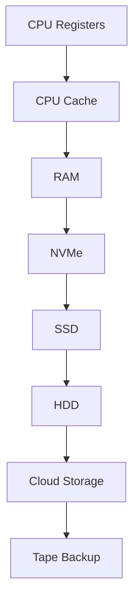
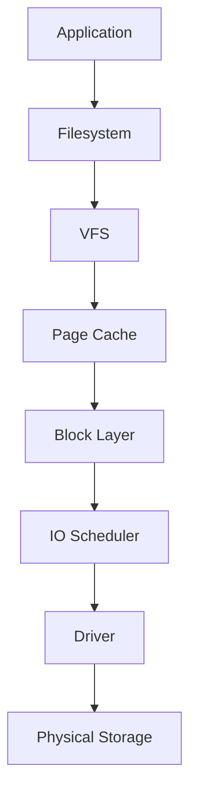
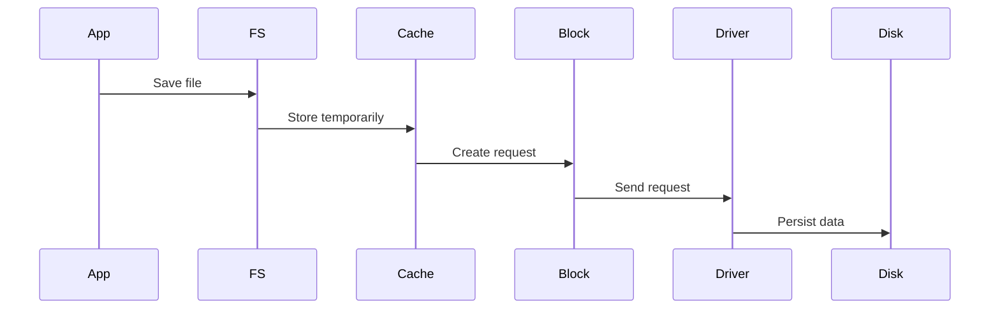
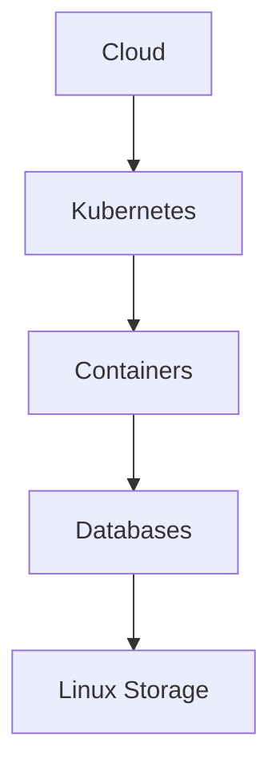

# Storage First Principles

> Great engineers do not memorize technologies.
>
> Great engineers ask fundamental questions.
>
> Before learning disks, filesystems, partitions, RAID, Docker volumes, Kubernetes Persistent Volumes, databases, or cloud storage, we must answer one question:
>
> **Why does storage exist at all?**

---

# Why This File Exists

Many people learn storage backwards.

They learn:

```text
fdisk

mount

fstab

LVM

RAID

Docker Volumes
```

But they never ask:

```text
Why do we need storage?

Why can't RAM do everything?

Why do filesystems exist?

Why do partitions exist?

Why do databases care about storage?

Why does cloud infrastructure revolve around storage?
```

This file answers those questions.

---

# The Most Important Question

## What is storage?

Storage is:

> A system that preserves data beyond the lifetime of a running program, process, or power cycle.

Simple definition:

```text
Storage = Persistent Memory
```

Keywords:

```text
Persistent

Reliable

Recoverable

Shareable
```

---

# First Principle #1

# Computers Forget Everything

This is the most important concept.

Computers are forgetful machines.

Visual:

```text
Computer Power ON

↓

RAM contains data

↓

Computer Power OFF

↓

RAM becomes empty
```

Without storage:

```text
Shutdown

↓

Everything disappears
```

There would be:

```text
No operating system

No applications

No databases

No photos

No documents

No videos

No internet services
```

---

# Mental Model: Humans vs Computers

Humans:

```text
Brain

│

├── Short-term memory

└── Long-term memory
```

Computers:

```text
Computer

│

├── RAM

└── Storage
```

Visual:

```text
Human

↓

Brain

↓

Long-term memory


Computer

↓

RAM

↓

Storage
```

Storage is Linux's long-term memory.

---

# First Principle #2

# RAM Is Fast But Fragile

RAM is amazing.

Properties:

```text
Extremely fast

Temporary

Volatile
```

Visual:

```text
RAM

Speed ⭐⭐⭐⭐⭐

Persistence ⭐
```

If electricity disappears:

```text
RAM

↓

Everything lost
```

---

# First Principle #3

# Storage Is Slow But Persistent

Storage sacrifices speed for reliability.

Visual:

```text
Storage

Speed ⭐⭐⭐

Persistence ⭐⭐⭐⭐⭐
```

Properties:

```text
Persistent

Reliable

Recoverable

Long lasting
```

---

# Mental Model: The Speed Ladder



Notice the pattern.

As we move down:

```text
Speed ↓

Latency ↑

Capacity ↑

Cost per GB ↓
```

Engineering is balancing these tradeoffs.

---

# First Principle #4

# Computers Are Built Around Tradeoffs

Nothing is free.

Every storage decision balances:

```text
Speed

Capacity

Reliability

Cost
```

Visual:

```text
             Speed

               ▲

               │

Reliability ◄──┼──► Cost

               │

               ▼

           Capacity
```

You cannot maximize everything.

---

# First Principle #5

# Data Is More Valuable Than Hardware

Hardware can be replaced.

Data often cannot.

Example:

```text
Laptop breaks

↓

Buy another laptop
```

But:

```text
Database lost

↓

Business may die
```

This is why storage engineering exists.

---

# First Principle #6

# Storage Is A Data Survival System

Storage has one mission.

```text
Keep data alive
```

No matter what happens.

Failures:

```text
Power failure

Application crash

Kernel panic

Container restart

Disk failure

Server failure
```

Data should survive.

---

# First Principle #7

# Storage Is Not One Thing

Many beginners think:

```text
Storage

↓

Disk
```

Wrong.

Storage is a system.

Visual:



Every layer exists for a reason.

---

# First Principle #8

# Data Must Be Organized

Raw disks are useless.

Raw disks only understand:

```text
0

1

0

1

0

1
```

Humans need:

```text
Photos

Documents

Videos

Databases
```

Something must organize data.

That's why filesystems exist.

Visual:

```text
Raw Disk

↓

Chaos

↓

Filesystem

↓

Organization
```

---

# First Principle #9

# Data Must Have An Address

Suppose you save:

```text
resume.pdf
```

Question:

```text
Where is it?
```

Linux must know:

```text
Which disk?

Which partition?

Which inode?

Which block?
```

Storage is fundamentally an addressing problem.

---

# First Principle #10

# Storage Is A Mapping Problem

Storage constantly maps things.

Visual:

```text
Human Name

↓

resume.pdf

↓

Inode

↓

Data Blocks

↓

Physical Device
```

Everything eventually maps somewhere.

---

# First Principle #11

# Storage Is A Transportation System

Data moves.

Visual:



Storage is a transportation network.

---

# First Principle #12

# Fast Systems Minimize Disk Access

Disk is expensive.

Disk access is slow.

Good engineers avoid unnecessary disk access.

Linux uses:

```text
Page Cache

Buffering

Caching

Read Ahead
```

Visual:

```text
Without Cache

Application

↓

Disk

Slow


With Cache

Application

↓

RAM

↓

Disk

Fast
```

---

# First Principle #13

# Storage Is A Reliability Problem

Storage engineering is really reliability engineering.

Questions engineers ask:

```text
What if disk dies?

What if server dies?

What if cloud region dies?

What if container dies?

What if filesystem corrupts?
```

Solutions:

```text
RAID

Backups

Replication

Snapshots

Cloud redundancy
```

---

# First Principle #14

# Everything Eventually Becomes A Storage Problem

Think about these systems.

Instagram

```text
Photos

↓

Storage
```

Netflix

```text
Videos

↓

Storage
```

YouTube

```text
Videos

↓

Storage
```

Databases

```text
Records

↓

Storage
```

Docker

```text
Volumes

↓

Storage
```

Kubernetes

```text
Persistent Volumes

↓

Storage
```

Almost every system eventually becomes a storage problem.

---

# First Principle #15

# Modern Infrastructure Is Built On Linux Storage

Visual:



Linux storage is foundational infrastructure.

---

# Modern World Connections

## Databases

```text
Application

↓

Database

↓

Filesystem

↓

Storage
```

---

## Docker

```text
Container

↓

Volume

↓

Linux Storage
```

---

## Kubernetes

```text
Pod

↓

PVC

↓

PV

↓

Linux Storage
```

---

## Cloud

```text
Object Storage

Block Storage

File Storage
```

All eventually become Linux storage.

---

# Production Examples

## Example 1

Social media company.

```text
Users upload photos

↓

Store photos

↓

Scale storage
```

Storage becomes the bottleneck.

---

## Example 2

Database server.

```text
Millions of writes

↓

Slow disk

↓

Slow application
```

Storage becomes the bottleneck.

---

## Example 3

Kubernetes cluster.

```text
Pod restarts

↓

Data disappears

↓

Attach Persistent Volume
```

Storage solves the problem.

---

# Performance Considerations

Ask:

```text
How many reads?

How many writes?

How much latency?

How much throughput?

How much caching?
```

---

# Security Considerations

Protect:

```text
Data at rest

Backups

Encryption

Access control

Recovery
```

Examples:

```text
LUKS

ACL

Snapshots
```

---

# Troubleshooting Mindset

Always ask:

```text
Where is data?

How is data stored?

Who owns data?

How is data protected?

Can data survive failure?
```

---

# Common Mistakes

## Mistake 1

Thinking storage equals disk.

Wrong.

Storage is a system.

---

## Mistake 2

Thinking faster is always better.

Tradeoffs exist.

---

## Mistake 3

Ignoring reliability.

Storage is reliability engineering.

---

## Mistake 4

Ignoring data movement.

Data is always moving.

---

# Engineering Mindset

Never ask:

```text
Where is my disk?
```

Ask:

```text
How does my data survive?
```

That is how great engineers think.

---

# Interview Questions

## Beginner

1. Why does storage exist?

2. Why can't RAM replace storage?

3. What makes storage persistent?

4. Why are filesystems necessary?

---

## Intermediate

5. Why is storage slower than RAM?

6. Explain storage tradeoffs.

7. Explain data flow inside Linux storage.

8. Why does page cache exist?

---

## Advanced

9. Explain why every large system eventually becomes a storage problem.

10. Explain storage reliability engineering.

11. Explain Linux storage architecture from first principles.

12. Explain how cloud infrastructure depends on Linux storage.

---

# Cheat Sheet

```text
Storage First Principles


Storage = Persistent Memory


Core Goals

Persist Data

Protect Data

Organize Data

Move Data

Recover Data


Storage Pipeline

Application

↓

Filesystem

↓

VFS

↓

Page Cache

↓

Block Layer

↓

IO Scheduler

↓

Driver

↓

Physical Storage


Golden Rule

Storage is not hardware.

Storage is a data survival system.
```
