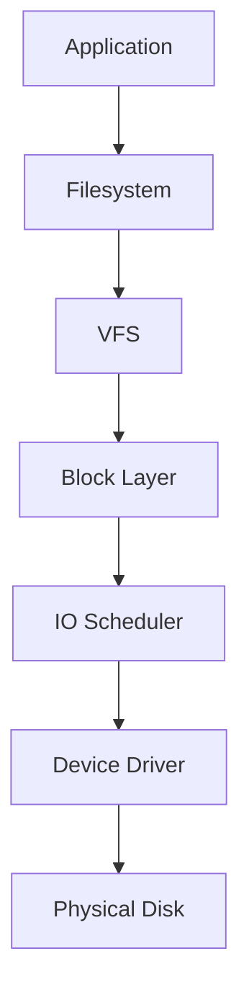
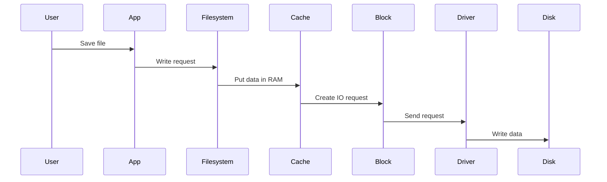
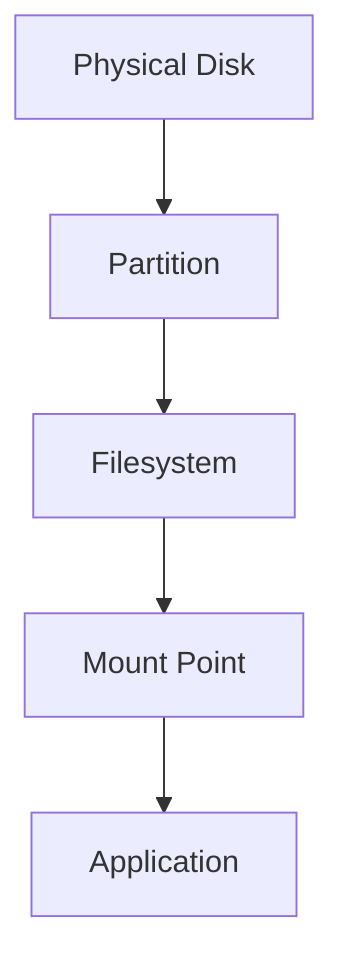
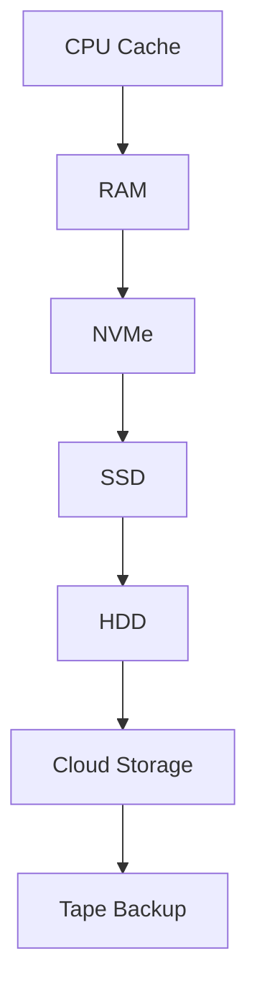
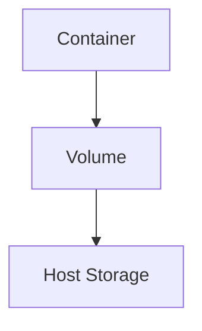

# Storage Mental Models

> Great Linux engineers do not memorize storage commands.
>
> They build mental models.
>
> Mental models allow you to understand every storage technology, even ones you've never used before.

---

# Why This File Exists

Most people learn storage like this:

```text
fdisk

mount

lsblk

df

du

fstab
```

They memorize commands.

Then one day production breaks.

They panic.

Because they never understood:

```text
Where is my data?

Who controls my data?

How does Linux find my data?

How does Linux move my data?

Why is my storage slow?

What happens when disks fail?
```

This file fixes that.

---

# Mental Model 1: Storage Is Linux's Long-Term Memory

Humans have:

```text
Short-term memory

Long-term memory
```

Computers also have:

```text
RAM

Storage
```

Visual:

```text
Human

Brain
│
├── Short-term memory
│
└── Long-term memory


Computer

CPU
│
├── RAM
│
└── Storage
```

RAM:

```text
Very fast

Temporary

Volatile
```

Storage:

```text
Slower

Persistent

Permanent
```

---

# Mental Model 2: Storage Is A City

Think of Linux storage as a city.

```text
Entire City
↓

Physical Disk

↓

Districts

↓

Partitions

↓

Buildings

↓

Filesystems

↓

Rooms

↓

Directories

↓

Documents

↓

Files
```

Visual:

```text
Physical Disk

┌───────────────────────┐
│                       │
│   Partition 1         │
│                       │
├───────────────────────┤
│                       │
│   Partition 2         │
│                       │
├───────────────────────┤
│                       │
│   Partition 3         │
│                       │
└───────────────────────┘
```

---

# Mental Model 3: Storage Is A Pipeline

Storage is not one thing.

Storage is a pipeline.



Every layer has a job.

---

# Mental Model 4: Data Travels

Many beginners think:

```text
save file

↓

disk
```

Wrong.

Data travels through many systems.

Visual:



Data is always traveling.

---

# Mental Model 5: Linux Never Sees A Disk

This surprises many people.

Linux sees devices.

Not disks.

Linux sees:

```text
/dev/sda

/dev/sdb

/dev/nvme0n1
```

These are device files.

Visual:

```text
Physical SSD

↓

Kernel Driver

↓

Device File

↓

/dev/nvme0n1
```

---

# Mental Model 6: Everything Is Attached To One Giant Tree

Windows:

```text
C:

D:

E:
```

Linux:

```text
/
```

Everything attaches somewhere.

Visual:

```text
/

├── boot

├── home

├── var

├── etc

├── usr

└── mnt
```

Example:

```text
New Disk

↓

/dev/sdb1

↓

Mounted

↓

/mnt/data
```

---

# Mental Model 7: Filesystems Are Librarians

Disks are dumb.

They only know:

```text
0

1

0

1
```

Filesystems organize chaos.

Visual:

```text
Disk

0101010101010101010

↓

Filesystem

↓

report.pdf

↓

photo.jpg

↓

database.db
```

Filesystems create order.

Examples:

```text
ext4

xfs

btrfs
```

---

# Mental Model 8: Partitions Are Walls

Imagine a house.

```text
House

↓

Walls

↓

Rooms
```

Storage:

```text
Disk

↓

Partitions

↓

Separate spaces
```

Example:

```text
Disk

1 TB

↓

200 GB

Root

↓

500 GB

Data

↓

300 GB

Backup
```

---

# Mental Model 9: Linux Uses Middle Managers

Linux loves abstraction.



Every layer hides complexity.

---

# Mental Model 10: Storage Is Hierarchical

Storage exists in levels.



Properties:

| Level | Speed | Capacity |
|------|------|---------|
| CPU Cache | Extremely Fast | Tiny |
| RAM | Very Fast | Small |
| NVMe | Fast | Medium |
| SSD | Fast | Large |
| HDD | Slow | Huge |
| Cloud | Variable | Massive |

---

# Mental Model 11: Faster Means More Expensive

```text
Fast

↓

Expensive

↓

Smaller

----------------

Slow

↓

Cheap

↓

Larger
```

Engineering is balancing tradeoffs.

---

# Mental Model 12: Storage Is About Tradeoffs

Every storage decision balances:

```text
Speed

Capacity

Cost

Reliability
```

Visual:

```text
           Speed

             ▲

             │

Reliability ◄► Cost

             │

             ▼

          Capacity
```

You cannot maximize everything.

---

# Mental Model 13: Production Systems Are Storage Systems

Every application eventually becomes a storage problem.

Examples:

```text
Instagram

Storage Problem

Netflix

Storage Problem

YouTube

Storage Problem

Database

Storage Problem

Kubernetes

Storage Problem
```

---

# Mental Model 14: Containers Also Need Storage

Container data disappears.

Unless storage is attached.



---

# Mental Model 15: Databases Are Heavy Storage Users

Database writes:

```text
Application

↓

Database

↓

Page Cache

↓

Filesystem

↓

Disk
```

Slow storage = slow database.

---

# Mental Model 16: Performance Bottlenecks Usually End At Storage

Symptoms:

```text
Slow APIs

Slow websites

Slow databases

Slow backups

Slow containers
```

Often caused by:

```text
Storage
```

---

# The Golden Rule

Always ask these questions.

```text
Where is data?

How is data organized?

Who owns the data?

How does data travel?

How is data protected?

How is data recovered?

What happens if hardware dies?

What happens if storage becomes slow?
```

---

# Storage Engineer Mindset

Never memorize commands.

Always visualize:

```text
Application

↓

Filesystem

↓

VFS

↓

Block Layer

↓

IO Scheduler

↓

Device Driver

↓

Physical Storage
```

Everything in Linux storage is built around this pipeline.

Understand the pipeline.

The commands become easy.
