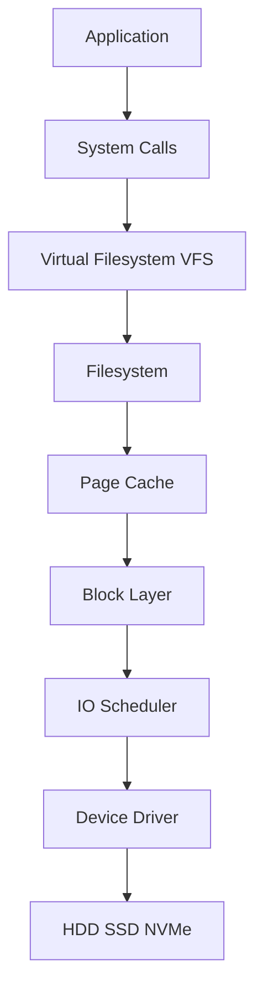
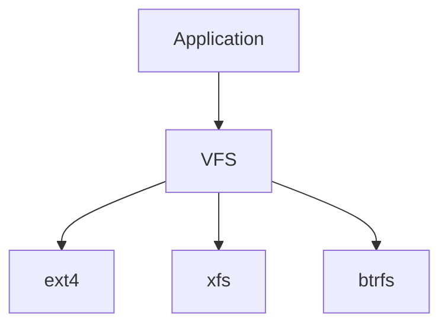
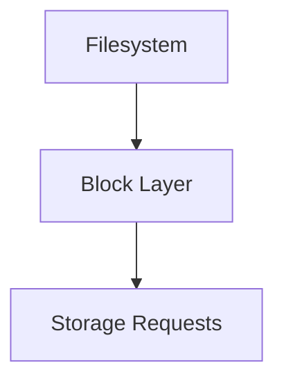
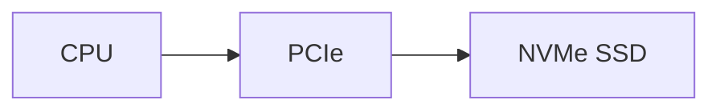
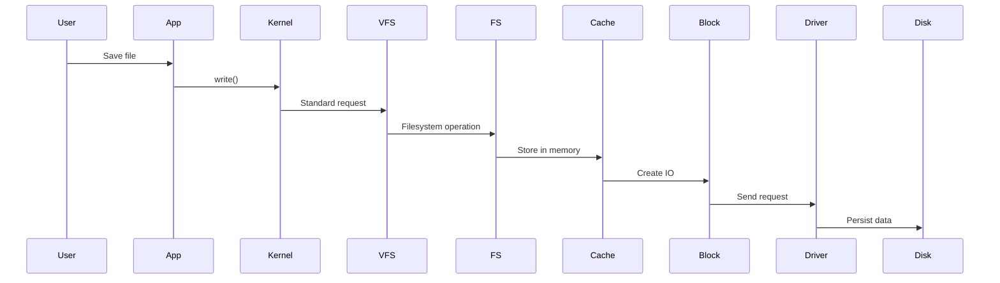
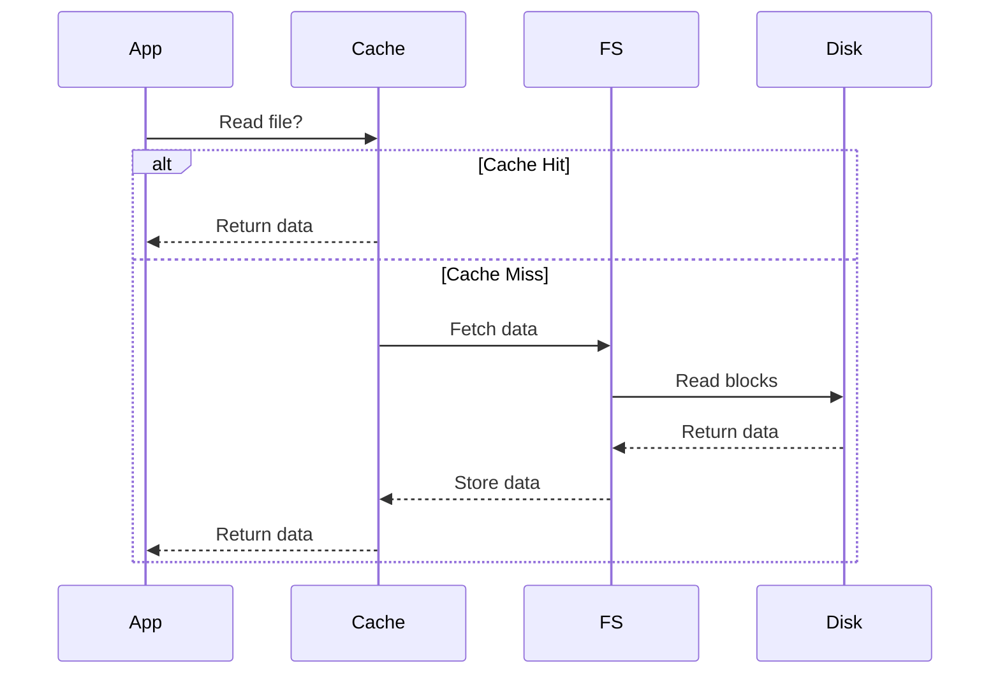
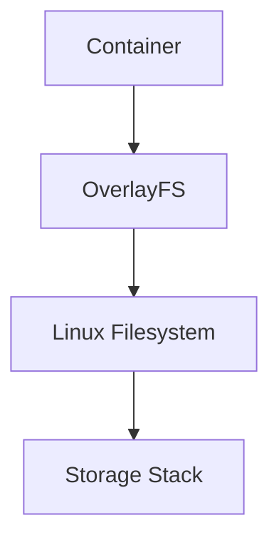
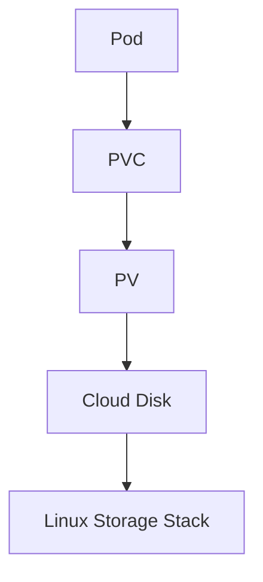
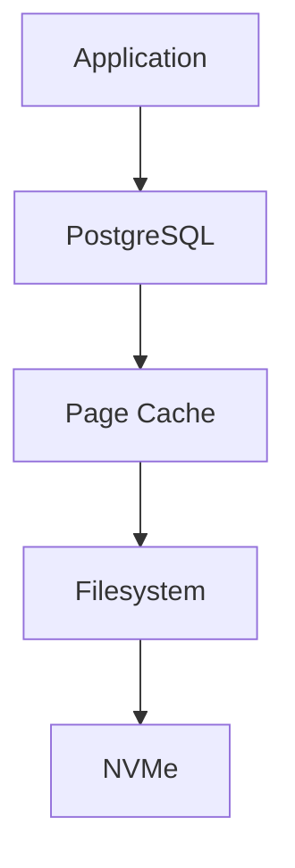
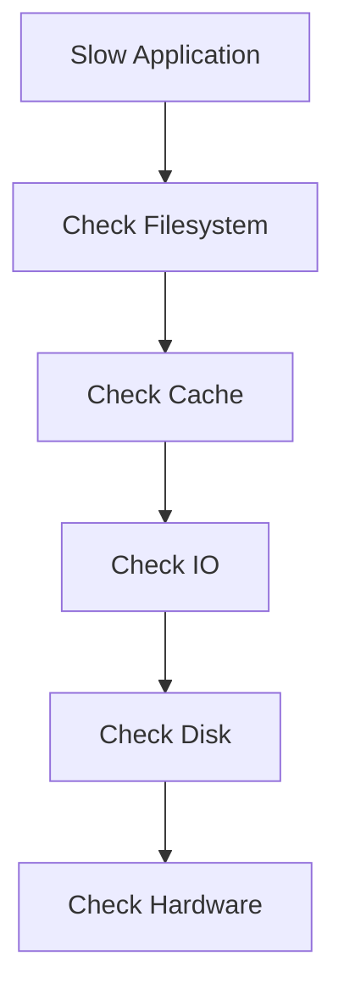

# Storage Stack

> Linux storage is not a hard disk.
>
> Linux storage is a pipeline of specialized systems working together to move data safely, efficiently, and reliably.

This file is one of the most important files in the entire Linux Engineering Handbook.

If you deeply understand this file, almost every storage topic becomes easier.

---

# Why This File Exists

Many people learn storage incorrectly.

They think:

```text
Save File

↓

Disk
```

Reality:

```text
Save File

↓

Application

↓

Filesystem

↓

VFS

↓

Page Cache

↓

Block Layer

↓

IO Scheduler

↓

Device Driver

↓

Physical Storage
```

Linux storage is a system.

Not a device.

---

# Problem It Solves

This file answers:

```text
How does Linux save data?

How does Linux read data?

Who controls storage?

How does Linux optimize storage?

Why is storage fast?

Why is storage slow?

Why does page cache exist?

Why do filesystems exist?

How do Docker and Kubernetes use storage?
```

---

# Mental Model: Storage Is A Factory Assembly Line

Think of storage as a factory.

```text
Raw Material

↓

Departments

↓

Finished Product
```

Linux storage:

```text
Data

↓

Many specialized systems

↓

Persistent storage
```

Visual:

```text
Application

↓

Storage Factory

↓

Physical Device
```

Every department has one responsibility.

---

# The Complete Linux Storage Stack



---

# Big Picture Responsibilities

| Layer            | Responsibility              |
| ---------------- | --------------------------- |
| Application      | Requests data               |
| System Call      | Talks to kernel             |
| VFS              | Common filesystem interface |
| Filesystem       | Organizes data              |
| Page Cache       | Speeds up storage           |
| Block Layer      | Manages IO requests         |
| IO Scheduler     | Optimizes IO order          |
| Device Driver    | Talks to hardware           |
| Physical Storage | Stores data                 |

---

# Layer 1: Application Layer

This is where users interact.

Examples:

```text
Chrome

Firefox

VS Code

PostgreSQL

Nginx

Docker

Redis
```

Applications never directly touch disks.

Applications only request operations.

Example:

```text
Open file

Save file

Delete file

Read file
```

---

# Layer 2: System Calls

Applications ask the Linux kernel for help.

Visual:

```text
Application

↓

System Call

↓

Kernel
```

Examples:

```c
open()

read()

write()

close()

fsync()
```

Think of system calls as doors.

Applications cannot bypass them.

---

# Layer 3: VFS (Virtual Filesystem)

VFS is one of Linux's greatest engineering achievements.

Without VFS:

```text
Application

↓

Understand ext4

Understand xfs

Understand btrfs
```

Impossible.

With VFS:

```text
Application

↓

VFS

↓

Any filesystem
```

Visual:



VFS standardizes communication.

---

# Layer 4: Filesystem

Disks are dumb.

Disks only understand:

```text
0

1
```

Filesystems create order.

Visual:

```text
Raw Disk

0101010101010

↓

Filesystem

↓

photo.jpg

↓

database.db

↓

video.mp4
```

Common filesystems:

```text
ext4

xfs

btrfs
```

Responsibilities:

```text
Naming

Directories

Metadata

Permissions

Ownership

Inodes

Journaling
```

---

# Layer 5: Page Cache

This layer makes Linux fast.

Without cache:

```text
Every read

↓

Disk
```

Very slow.

With cache:

```text
Disk

↓

RAM

↓

Future reads become fast
```

Visual:


Think of page cache as a smart memory assistant.

---

# Layer 6: Linux Block Layer

The block layer manages all storage traffic.

Responsibilities:

```text
Merge requests

Split requests

Queue requests

Manage requests

Optimize requests
```

Visual:



Without this layer, Linux storage would be chaotic.

---

# Layer 7: IO Scheduler

Imagine 1000 requests arriving simultaneously.

Example:

```text
Request 99

Request 1

Request 500

Request 3
```

Scheduler reorganizes them.

Visual:

```text
Incoming

99

1

500

3

↓

Scheduler

↓

1

3

99

500
```

Goals:

```text
Reduce latency

Improve throughput

Reduce disk movement
```

Schedulers:

```text
noop

deadline

bfq
```

---

# Layer 8: Device Driver

Drivers translate Linux language into hardware language.

Visual:

```text
Linux

↓

Driver

↓

Hardware
```

Without drivers:

```text
Linux

↓

Nothing
```

Drivers know how to communicate with:

```text
SATA

USB

PCIe

NVMe
```

---

# Layer 9: Physical Storage

This is where data finally lives.

Examples:

```text
HDD

SSD

NVMe
```

Visual:



---

# Complete Write Flow

Suppose you save:

```text
resume.pdf
```

Visual:



---

# Complete Read Flow

Visual:



---

# Storage Architecture Tree

```text
Application

↓

System Calls

↓

VFS

↓

Filesystem

↓

Page Cache

↓

Block Layer

↓

IO Scheduler

↓

Device Driver

↓

Physical Storage
```

This diagram should become muscle memory.

---

# How Docker Uses The Storage Stack

Docker does not create a new storage system.

Docker uses Linux storage.

Visual:



Containers are storage consumers.

---

# How Kubernetes Uses The Storage Stack

Visual:



Eventually Kubernetes reaches Linux storage.

---

# How Databases Use The Storage Stack

Visual:



Storage speed directly affects databases.

---

# Performance Bottlenecks

Every layer can become slow.

| Layer       | Problem           |
| ----------- | ----------------- |
| Application | Too many writes   |
| Filesystem  | Fragmentation     |
| Cache       | Insufficient RAM  |
| Block Layer | Too many requests |
| Scheduler   | Bad scheduling    |
| Driver      | Driver issues     |
| Disk        | Slow hardware     |

---

# Observability Mindset

Ask:

```text
Where is latency happening?

Where is throughput dropping?

Where is the bottleneck?

Which layer is overloaded?
```

Useful tools:

```bash
top

iotop

iostat

vmstat

df

du

lsblk
```

---

# Security Considerations

Protect:

```text
Data at rest

Filesystem permissions

Disk encryption

Access control
```

Examples:

```text
LUKS

ACL

File permissions
```

---

# Troubleshooting Flow

When storage is slow:

```text
Application slow?

↓

Filesystem issue?

↓

Page cache issue?

↓

Block layer overloaded?

↓

Disk saturated?

↓

Hardware issue?
```

Visual:



---

# Common Mistakes

## Mistake 1

Thinking:

```text
Application

↓

Disk
```

Correct:

```text
Application

↓

9+ layers

↓

Disk
```

---

## Mistake 2

Ignoring page cache.

Page cache is one of Linux's biggest performance optimizations.

---

## Mistake 3

Ignoring VFS.

VFS is everywhere.

---

## Mistake 4

Thinking Docker bypasses Linux storage.

It doesn't.

---

# Engineering Mindset

Never think:

```text
Hard Disk
```

Always think:

```text
Storage Stack
```

Visualize:

```text
Application

↓

System Call

↓

VFS

↓

Filesystem

↓

Page Cache

↓

Block Layer

↓

IO Scheduler

↓

Driver

↓

Storage
```

This is how Linux engineers think.

---

# Interview Questions

### Beginner

1. What is VFS?

2. Why are filesystems needed?

3. Why does Linux use page cache?

4. Why are system calls necessary?

---

### Intermediate

5. Explain Linux storage architecture.

6. Explain a file write operation.

7. Explain a file read operation.

8. Explain VFS responsibilities.

---

### Advanced

9. Explain page cache internals.

10. Explain block layer internals.

11. Explain how Docker uses Linux storage.

12. Explain Kubernetes persistent storage architecture.

13. Explain storage bottlenecks.

---

# Cheat Sheet

```text
Linux Storage Stack

Application

↓

System Call

↓

VFS

↓

Filesystem

↓

Page Cache

↓

Block Layer

↓

IO Scheduler

↓

Device Driver

↓

Physical Storage


Golden Rule:

Storage is not a device.

Storage is a pipeline.
```
