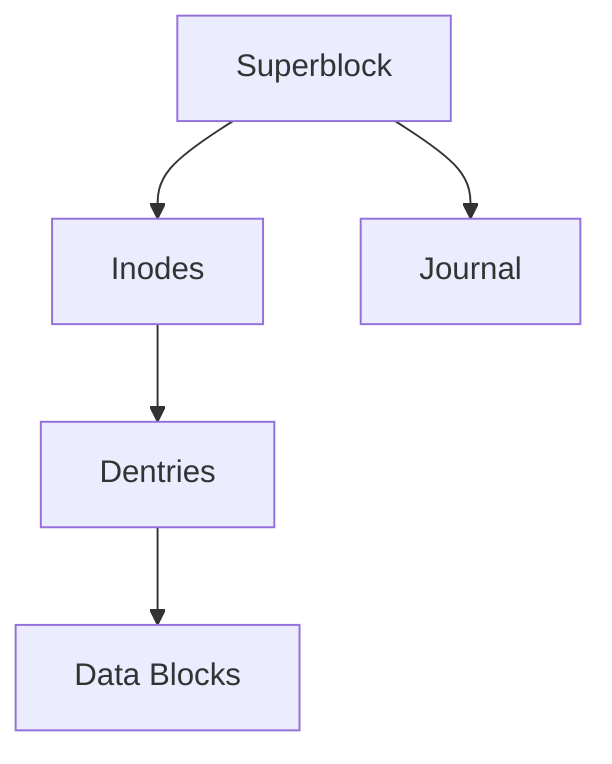
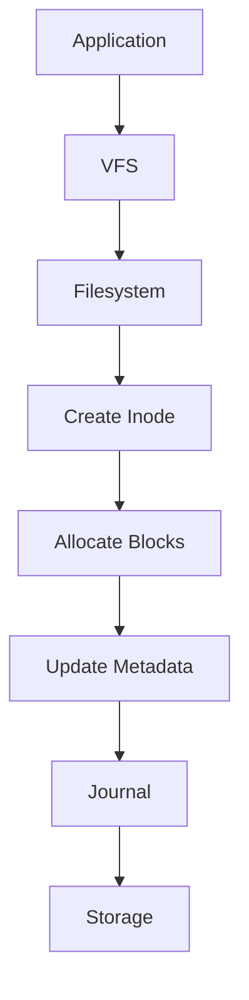
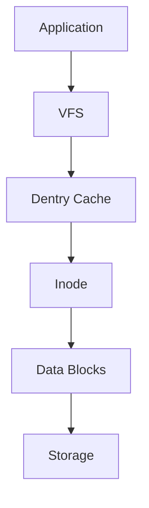
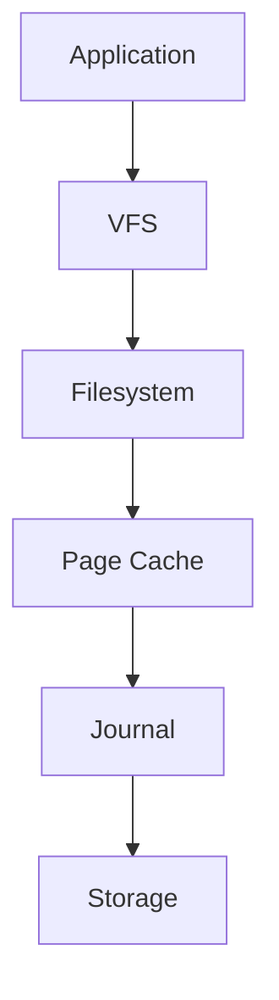

# Filesystem Internals

> Filesystems are one of the most important software systems ever built.
>
> They transform chaotic raw storage into organized, reliable, recoverable, searchable data.
>
> Great Linux engineers don't think:
>
> "I saved a file."
>
> They think:
>
> "The filesystem created metadata, allocated blocks, updated indexes, updated caches, possibly updated journals, and eventually persisted data."

---

# Why This File Exists

Many people think:

```text
File

↓

Disk
```

Reality:

```text
File

↓

VFS

↓

Filesystem

↓

Many Internal Systems

↓

Storage
```

This file explains those internal systems.

---

# Problem It Solves

This file answers:

```text
How do filesystems work?

What happens when I save a file?

How does Linux find files?

How does Linux organize billions of files?

What are inodes?

What are superblocks?

What are data blocks?

What is journaling?
```

---

# Mental Model: A Modern City

Imagine a city.

A city has:

```text
Buildings

Addresses

Roads

Maps

Rules

Emergency Recovery
```

A filesystem is similar.

```text
Files

Directories

Inodes

Metadata

Allocation Systems

Recovery Systems
```

Filesystems are cities for data.

---

# First Principles

Question:

How does storage look to hardware?

```text
010101010101010101010101
```

That's all.

Question:

How does Linux create:

```text
report.pdf

video.mp4

database.db
```

Answer:

Filesystems.

---

# Big Picture Architecture

```text
Application

↓

VFS

↓

Filesystem

↓

Block Layer

↓

Storage Device
```

---

# Internal Filesystem Architecture



These components work together.

---

# The Core Components

Every filesystem contains systems for:

```text
Superblock

Inodes

Directories

Data Blocks

Allocation

Journaling

Metadata
```

---

# Mental Model

Think of a library.

```text
Library

├── Building Information

├── Catalog System

├── Shelf Locations

├── Books

└── Recovery Records
```

Filesystem:

```text
Filesystem

├── Superblock

├── Inodes

├── Dentries

├── Data Blocks

└── Journal
```

---

# Component 1: Superblock

The superblock is the filesystem's identity card.

It contains information about the entire filesystem.

Stores:

```text
Filesystem Type

Block Size

Total Blocks

Free Blocks

Total Inodes

Free Inodes

Filesystem State
```

Mental model:

```text
Filesystem Brain
```

Visual:

```text
Filesystem

↓

Superblock

↓

Filesystem Metadata
```

---

# Component 2: Inodes

Inodes are one of Linux's most important concepts.

Definition:

> Inodes store information about files.

An inode contains:

```text
Owner

Permissions

Size

Timestamps

Block Pointers
```

An inode does NOT contain:

```text
File Name
```

Very important.

---

# Mental Model: Inode = Passport

Imagine:

```text
Passport

↓

Identity Information
```

File:

```text
Inode

↓

File Information
```

Example:

```text
report.pdf

↓

inode 12345
```

---

# Component 3: Dentry

Dentry means:

Directory Entry.

Its job:

```text
File Name

↓

Inode
```

Visual:

```text
report.pdf

↓

inode 12345
```

Dentries connect names to inodes.

---

# Component 4: Data Blocks

This is where actual data lives.

Visual:

```text
Storage

┌─────────────┐

│ Block 1     │

├─────────────┤

│ Block 2     │

├─────────────┤

│ Block 3     │

└─────────────┘
```

Files eventually become blocks.

---

# Mental Model: LEGO Pieces

Storage is a giant LEGO box.

Filesystems combine pieces together.

Example:

```text
File

↓

Block 8

↓

Block 92

↓

Block 150
```

The file is scattered.

The filesystem remembers where everything is.

---

# Component 5: Journal

Question:

What if power disappears?

Without journaling:

```text
Write interrupted

↓

Corruption
```

With journaling:

```text
Record changes first

↓

Apply changes

↓

Recover if needed
```

Visual:

```text
Write Request

↓

Journal

↓

Storage
```

---

# How Linux Saves A File

Suppose:

```text
report.pdf
```

Visual:



Lots of things happen.

---

# How Linux Finds A File

Suppose:

```text
/var/log/syslog
```

Linux walks the path.

```text
/

↓

var

↓

log

↓

syslog

↓

inode

↓

blocks
```

This is called path traversal.

---

# File Read Flow



---

# File Write Flow



---

# How Linux Handles Huge Systems

Linux can manage:

```text
Millions of files

Billions of files

Petabytes of storage
```

Because everything is indexed.

---

# Metadata vs Data

Never confuse them.

Metadata:

```text
Owner

Permissions

Timestamps

Location
```

Data:

```text
Actual Content
```

Example:

```text
report.pdf

Metadata

↓

10 KB

Alice

rw-r--r--

inode 12345


Data

↓

Hello World
```

---

# Modern World Connections

## Databases

Databases heavily depend on filesystems.

```text
Database

↓

Filesystem

↓

Storage
```

Slow filesystems create slow databases.

---

## Docker

Docker uses OverlayFS.

```text
Container

↓

OverlayFS

↓

VFS

↓

Filesystem
```

---

## Kubernetes

```text
Pod

↓

Persistent Volume

↓

Filesystem

↓

Storage
```

---

# Performance Considerations

Engineers ask:

```text
How many files?

How many writes?

How much metadata?

Sequential access?

Random access?
```

Performance is workload dependent.

---

# Security Considerations

Filesystems enforce:

```text
Permissions

Ownership

ACLs
```

Everything passes through them.

---

# Observability Mindset

Ask:

```text
Where is the bottleneck?

Metadata?

Disk?

Cache?

Filesystem?
```

Useful tools:

```bash
lsblk

df

du

stat

mount
```

---

# Troubleshooting Workflow

Cannot access a file?

Ask:

```text
Filesystem mounted?

↓

Permissions correct?

↓

File exists?

↓

Storage healthy?
```

---

# Common Mistakes

## Mistake 1

Thinking files are continuous.

Wrong.

Files are often scattered blocks.

---

## Mistake 2

Thinking filenames are stored in inodes.

Wrong.

Dentries store names.

---

## Mistake 3

Thinking journaling is backup.

Wrong.

Journaling is crash recovery.

---

## Mistake 4

Ignoring metadata.

Metadata is critical.

---

# Engineering Mindset

Whenever you save a file visualize:

```text
Application

↓

VFS

↓

Filesystem

↓

Inode

↓

Blocks

↓

Journal

↓

Storage
```

This is how Linux engineers think.

---

# Interview Questions

## Beginner

1. What is an inode?

2. What is a superblock?

3. What is journaling?

4. What are data blocks?

---

## Intermediate

5. Explain file storage architecture.

6. Explain file reads.

7. Explain file writes.

8. Explain path traversal.

---

## Advanced

9. Explain Linux filesystem internals.

10. Explain metadata management.

11. Explain journaling internals.

12. Explain Docker filesystem architecture.

---

# Cheat Sheet

```text
Filesystem Components

Superblock

Inodes

Dentries

Data Blocks

Journal


Storage Pipeline

Application

↓

VFS

↓

Filesystem

↓

Storage


Golden Rule

Files are relationships.

Not objects.
```
