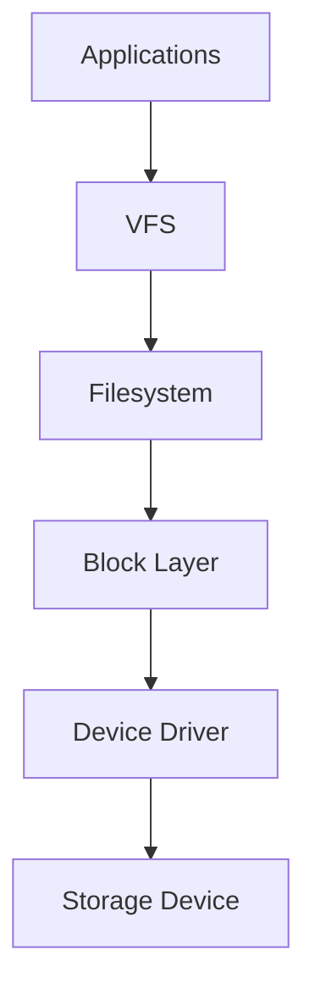
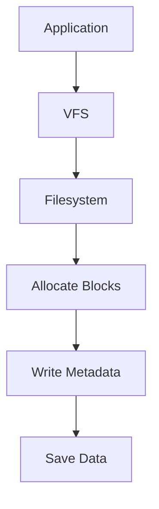
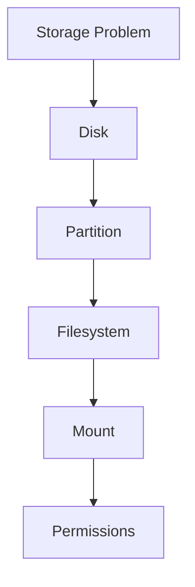

# Filesystems Overview

> A filesystem is one of the most important inventions in computing.
>
> Without filesystems, storage is just a giant pile of meaningless bits.
>
> Great Linux engineers don't think:
>
> **"I have files on a disk."**
>
> They think:
>
> **"I have a data organization system running on top of storage."**

---

# Why This File Exists

Many beginners think:

```text
SSD

↓

Files
```

Reality:

```text
SSD

↓

Filesystem

↓

Files

↓

Directories

↓

Applications
```

There is an entire system between hardware and your data.

This file explains that system.

---

# Problem It Solves

This file answers:

```text
What is a filesystem?

Why do filesystems exist?

How does Linux store files?

How does Linux find files?

Why are there multiple filesystems?

Why do databases care?

Why do Docker and Kubernetes care?
```

---

# Mental Model: A Library

Imagine a giant library.

Without organization:

```text
Millions of books

↓

Thrown randomly

↓

Chaos
```

Impossible to use.

You need:

```text
Shelves

Sections

Labels

Catalogs

Rules
```

Linux storage is identical.

Visual:

```text
Raw Storage

↓

Filesystem

↓

Organization

↓

Usable Data
```

---

# First Principles

Question:

```text
What does a disk understand?
```

Answer:

```text
0

1

0

1

0

1
```

That's it.

A disk does NOT understand:

```text
photo.jpg

video.mp4

resume.pdf

database.db
```

Filesystems create those abstractions.

---

# What Is A Filesystem?

A filesystem is:

> A data organization system that manages how data is stored, located, retrieved, protected, and maintained.

Simple definition:

```text
Filesystem = Storage Operating System
```

Its job:

```text
Raw Storage

↓

Organization

↓

Usable Data
```

---

# The Big Picture

```text
Application

↓

Filesystem

↓

Storage Device
```

Applications never directly talk to raw storage.

---

# Where Filesystems Live

Memorize this.

```text
Physical Disk

↓

Partition

↓

Filesystem

↓

Mount Point

↓

Applications
```

Filesystem is one layer.

Not the whole system.

---

# Linux Storage Architecture



---

# Why Filesystems Exist

Filesystems solve many problems.

## Problem 1: Organization

Without a filesystem:

```text
0101010101010101
```

Impossible to understand.

With a filesystem:

```text
Documents

Videos

Images

Databases
```

---

## Problem 2: Addressing

Question:

```text
Where is resume.pdf?
```

Filesystem knows.

---

## Problem 3: Metadata

Question:

```text
Who owns this file?

When was it created?

Who can access it?
```

Filesystem stores this information.

---

## Problem 4: Reliability

Question:

```text
What happens if electricity disappears?
```

Filesystems help recover data.

---

# Responsibilities Of A Filesystem

A filesystem manages:

```text
Files

Directories

Metadata

Permissions

Ownership

Inodes

Allocation

Recovery

Journaling
```

---

# Mental Model: Filesystem Is A City Manager

Imagine a city.

Responsibilities:

```text
Roads

Addresses

Buildings

Rules

Security
```

Filesystem is similar.

Responsibilities:

```text
Blocks

Addresses

Directories

Permissions

Recovery
```

---

# Components Inside A Filesystem

```text
Filesystem

├── Superblock

├── Inodes

├── Data Blocks

├── Journaling

└── Metadata
```

We'll study these individually later.

---

# What Happens When You Save A File?

Suppose:

```text
notes.txt
```

Visual:



A lot happens behind the scenes.

---

# Mental Model: Files Are Not Actually Files

This is a huge mindset shift.

Files are relationships.

```text
File Name

↓

Metadata

↓

Pointers

↓

Data Blocks
```

Files are a map.

---

# How Linux Finds A File

Suppose:

```text
/home/user/report.pdf
```

Linux does not search the whole disk.

Linux follows a path.

```text
/

↓

home

↓

user

↓

report.pdf

↓

inode

↓

data blocks
```

Very efficient.

---

# Filesystem Types

Linux supports many filesystems.

Common ones:

```text
ext4

xfs

btrfs

vfat

tmpfs
```

Each solves different problems.

---

# ext4

Most common.

Characteristics:

```text
Stable

Reliable

Mature

General purpose
```

Used for:

```text
Laptops

Servers

Cloud VMs
```

---

# xfs

Optimized for scale.

Characteristics:

```text
Large systems

Parallel workloads

High throughput
```

Used for:

```text
Databases

Large servers

Enterprise systems
```

---

# btrfs

Modern filesystem.

Characteristics:

```text
Snapshots

Checksums

Compression

Advanced features
```

Used for:

```text
Modern Linux systems

Advanced storage setups
```

---

# tmpfs

Memory filesystem.

Characteristics:

```text
Lives in RAM

Very fast

Temporary
```

Used for:

```text
Caches

Temporary data
```

---

# Filesystem Selection Mental Model

Don't ask:

```text
Which filesystem is best?
```

Ask:

```text
What problem am I solving?
```

---

# Modern World Connections

## Docker

Docker heavily depends on filesystems.

Visual:

```text
Container

↓

OverlayFS

↓

Host Filesystem

↓

Storage
```

---

## Kubernetes

Kubernetes volumes eventually become filesystems.

```text
Pod

↓

Persistent Volume

↓

Filesystem

↓

Storage
```

---

## Databases

Databases constantly interact with filesystems.

```text
Application

↓

Database

↓

Filesystem

↓

Storage
```

Filesystem performance matters enormously.

---

# Cloud Connections

Cloud providers ultimately expose Linux filesystems.

Examples:

```text
AWS EBS

Azure Managed Disk

Google Persistent Disk
```

Eventually:

```text
Cloud Disk

↓

Filesystem

↓

Linux
```

---

# Performance Considerations

Questions engineers ask:

```text
How many reads?

How many writes?

How many files?

How much metadata?

Sequential or random access?

Small or large files?
```

Performance is workload-dependent.

---

# Security Considerations

Filesystems enforce security.

Examples:

```text
Permissions

Ownership

ACLs

Encryption
```

Protect:

```text
Secrets

Databases

User Data

Logs
```

---

# Observability Mindset

Ask:

```text
Where is data stored?

How is it organized?

Who owns it?

How fast is it growing?

What depends on it?
```

Useful tools:

```bash
lsblk

blkid

df

du

mount
```

---

# Troubleshooting Workflow

Cannot access data?

Ask:

```text
Disk exists?

↓

Partition exists?

↓

Filesystem exists?

↓

Mounted?

↓

Permissions okay?
```

Visual:



---

# Common Mistakes

## Mistake 1

Thinking filesystem = storage.

Wrong.

```text
Storage

↓

Filesystem
```

Different layers.

---

## Mistake 2

Thinking files are directly stored.

Wrong.

Linux stores metadata and data blocks.

---

## Mistake 3

Thinking all filesystems are identical.

Wrong.

Different workloads need different filesystems.

---

## Mistake 4

Ignoring filesystem performance.

Applications eventually depend on it.

---

# Engineering Mindset

Whenever you hear "filesystem", visualize:

```text
Raw Storage

↓

Organization Engine

↓

Files

↓

Applications
```

Do not think:

```text
Folder manager
```

Think:

```text
Data organization infrastructure
```

That's how engineers think.

---

# Interview Questions

## Beginner

1. What is a filesystem?

2. Why do filesystems exist?

3. Why can't disks store files directly?

4. Why are there multiple filesystems?

---

## Intermediate

5. Explain Linux filesystem architecture.

6. Explain how Linux finds files.

7. Explain metadata.

8. Explain filesystem responsibilities.

---

## Advanced

9. Explain why databases depend on filesystems.

10. Explain Docker filesystem architecture.

11. Explain Kubernetes storage architecture.

12. Explain storage abstraction layers.

---

# Cheat Sheet

```text
Filesystem = Data Organization System


Storage Pipeline

Disk

↓

Partition

↓

Filesystem

↓

Mount Point

↓

Applications


Core Responsibilities

Organize Data

Locate Data

Protect Data

Recover Data

Manage Metadata


Golden Rule

A disk stores bits.

A filesystem creates meaning.
```
