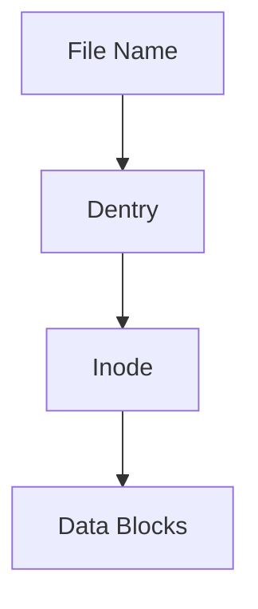
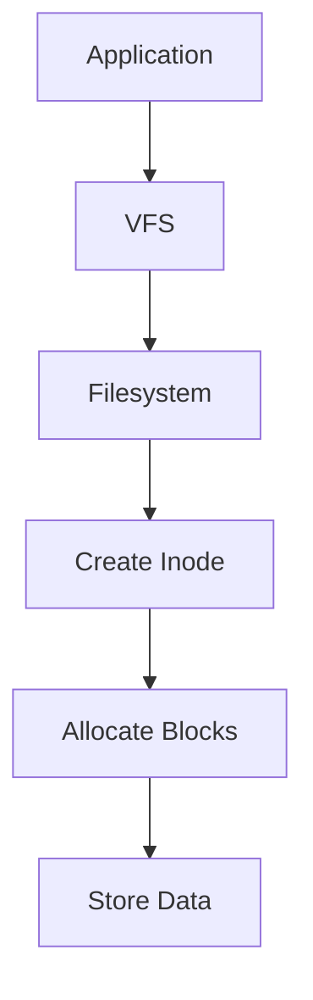
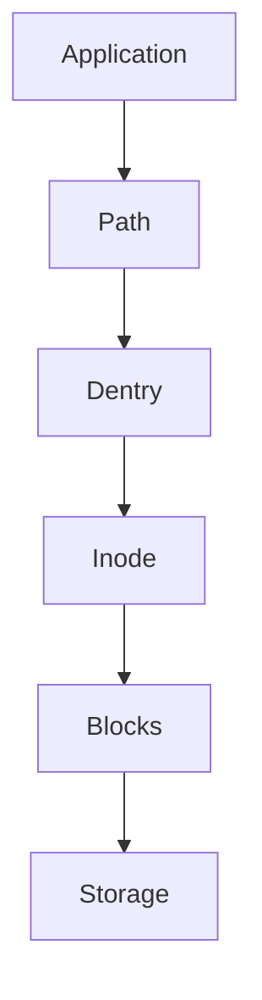
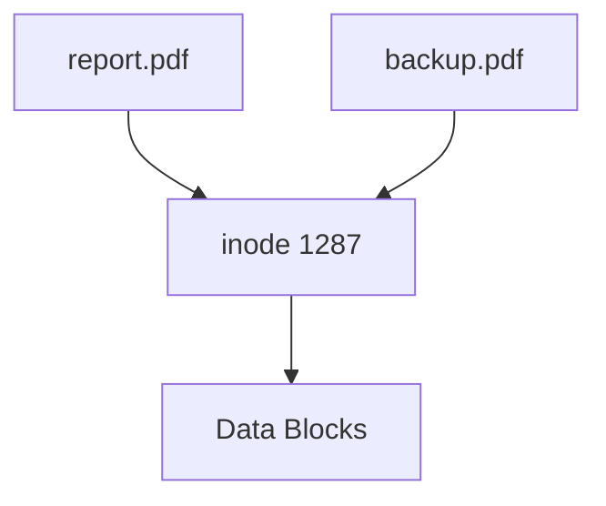
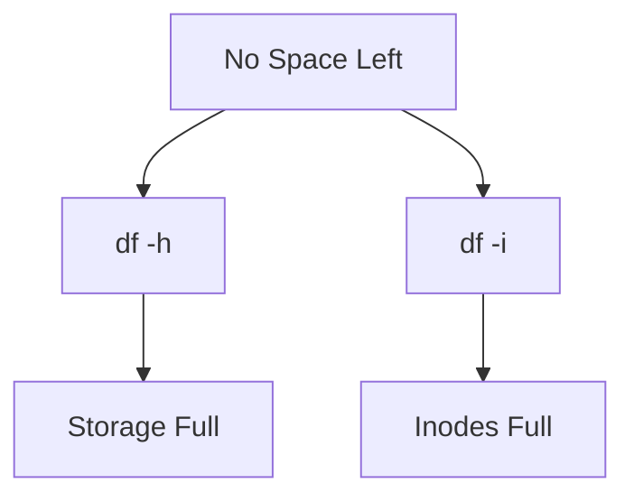

# Inodes

> Inodes are one of Linux's most important and most misunderstood concepts.
>
> Great Linux engineers don't think:
>
> "Files are stored on disk."
>
> They think:
>
> "Files are metadata objects that point to storage blocks."
>
> An inode is the heart of that system.

---

# Why This File Exists

Most beginners think:

```text
report.pdf

↓

Data
```

Reality:

```text
report.pdf

↓

File Name

↓

Inode

↓

Data Blocks
```

This file explains that middle layer.

---

# Problem It Solves

This file answers:

```text
What is an inode?

Why do inodes exist?

How are files stored?

Where are filenames stored?

Why can Linux run out of inodes?

How do hard links work?

Why do databases care about inodes?
```

---

# Mental Model: Passport System

Imagine a country.

People have:

```text
Names

↓

Passports

↓

Homes
```

Linux files are similar.

```text
File Name

↓

Inode

↓

Data Blocks
```

The inode is the passport.

---

# First Principles

Question:

How does storage look?

```text
010101010101010101
```

Storage does not understand:

```text
report.pdf

video.mp4

database.db
```

Linux must build a system.

---

# Files Are Not Files

This is one of the biggest mindset shifts.

A file is actually:

```text
Metadata

+

Pointers

+

Data
```

Visual:

```text
report.pdf

↓

inode

↓

block pointers

↓

data blocks
```

---

# What Is An Inode?

Definition:

> An inode is a data structure that stores metadata about a file.

Simple definition:

```text
inode = File Metadata Object
```

---

# What An Inode Stores

```text
Permissions

Ownership

File Size

Timestamps

Link Count

Data Block Pointers

File Type
```

---

# What An Inode Does NOT Store

Very important.

It does NOT store:

```text
File Name
```

This surprises everyone.

---

# Mental Model

Imagine:

Passport

```text
Name: Alice

Age: 30

Country: India
```

The passport contains information.

The passport does NOT contain:

```text
House Address
```

Similarly:

```text
Inode

↓

Metadata

↓

Pointers
```

---

# Big Picture Architecture

```text
File Name

↓

Dentry

↓

Inode

↓

Data Blocks
```

Memorize this.

---

# Linux File Storage Architecture



---

# Example

Suppose:

```text
report.pdf
```

Linux creates:

```text
report.pdf

↓

inode 1287

↓

block 82

↓

block 83

↓

block 84
```

---

# Why Linux Uses Inodes

Question:

Why not store everything together?

Without inodes:

```text
File

↓

Metadata

↓

Data

↓

Mixed together
```

Very inefficient.

Inodes solve this.

Benefits:

```text
Fast lookup

Scalability

Flexibility

Linking
```

---

# Inode Structure

Think conceptually.

```text
inode

├── inode number

├── permissions

├── owner

├── group

├── size

├── timestamps

├── link count

└── block pointers
```

---

# Inode Number

Every inode has an ID.

Example:

```text
inode 1287
```

Linux uses this internally.

Think:

```text
Employee ID

↓

File ID
```

---

# Permissions

Stored here.

Example:

```text
rw-r--r--
```

Permissions live in the inode.

---

# Ownership

Stored here.

```text
user

group
```

---

# Timestamps

Linux stores:

```text
atime

mtime

ctime
```

We'll study these later.

---

# Link Count

Very important.

Example:

```text
2
```

Means:

Two names reference this inode.

---

# Data Block Pointers

The inode remembers where data lives.

Visual:

```text
inode

↓

block 12

↓

block 98

↓

block 145
```

Files are often scattered.

---

# Mental Model: Treasure Map

Imagine:

```text
Treasure Map

↓

Locations

↓

Treasure
```

The inode is a map.

---

# How Linux Saves A File

Suppose:

```text
notes.txt
```

Visual:



---

# How Linux Reads A File

Visual:



---

# How To See Inodes

Command:

```bash
ls -i
```

Example:

```text
1287 report.pdf

1288 image.png

1289 notes.txt
```

First number:

```text
inode number
```

---

# File Information

```bash
stat report.pdf
```

Example:

```text
File: report.pdf

Size: 2048

Inode: 1287
```

`stat` is extremely useful.

---

# Hard Links

This is where inodes become powerful.

Visual:

```text
report.pdf

↓

inode 1287

↑

backup.pdf
```

Two names.

One inode.

One data.

---

# Hard Link Architecture



Amazing feature.

---

# Why Hard Links Are Efficient

Without hard links:

```text
Copy File

↓

Duplicate Data
```

With hard links:

```text
Multiple Names

↓

Same Data
```

Much better.

---

# Running Out Of Inodes

This surprises many engineers.

Disk may show:

```text
100 GB free
```

Yet Linux says:

```text
No space left
```

Why?

No free inodes.

Example:

```text
Millions of tiny files
```

This is common.

---

# Check Inode Usage

```bash
df -i
```

Example:

```text
Filesystem

Inodes

IUsed

IFree
```

Very important.

---

# Real World Example

Bad workload:

```text
10 million log files
```

Result:

```text
Inodes exhausted
```

System breaks.

---

# Databases And Inodes

Databases usually create fewer large files.

Good.

```text
database.db

↓

Huge file
```

Efficient.

---

# Docker Connection

Docker creates many filesystem objects.

```text
Images

Layers

Containers
```

Inodes matter.

---

# Kubernetes Connection

Pods generate:

```text
Logs

Volumes

Temporary files
```

Inodes matter.

---

# Cloud Connection

Cloud systems often suffer:

```text
Small file explosion
```

Monitor inode usage.

---

# Performance Considerations

Many tiny files:

Bad.

Few large files:

Better.

Metadata operations are expensive.

---

# Security Considerations

Inodes enforce:

```text
Permissions

Ownership

Access Control
```

Every file depends on them.

---

# Troubleshooting Workflow

Disk full?

Ask:

```text
Disk full?

↓

Or inode full?

↓

df -i
```

Visual:



---

# Common Mistakes

## Mistake 1

Thinking files are continuous.

Wrong.

Files are block pointers.

---

## Mistake 2

Thinking filenames are stored in inodes.

Wrong.

Dentry stores names.

---

## Mistake 3

Ignoring inode usage.

Very common production mistake.

---

## Mistake 4

Confusing hard links and copies.

Different concepts.

---

# Engineering Mindset

Whenever you see a file, visualize:

```text
File Name

↓

Dentry

↓

Inode

↓

Blocks
```

That's how Linux engineers think.

---

# Interview Questions

## Beginner

1. What is an inode?

2. What information does an inode store?

3. Does an inode store filenames?

4. Why do inodes exist?

---

## Intermediate

5. Explain file storage architecture.

6. Explain hard links.

7. Explain inode exhaustion.

8. Explain file lookups.

---

## Advanced

9. Explain inode scalability.

10. Explain Docker inode usage.

11. Explain inode bottlenecks.

12. Explain filesystem architecture.

---

# Cheat Sheet

```text
File Name

↓

Dentry

↓

Inode

↓

Data Blocks


inode Stores

Permissions

Ownership

Size

Timestamps

Link Count

Block Pointers


Commands

ls -i

stat

df -i


Golden Rule

Files are metadata objects.

Not blobs of data.
```
