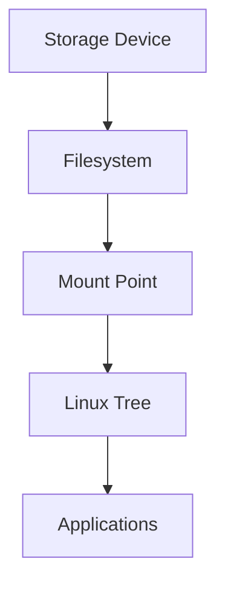
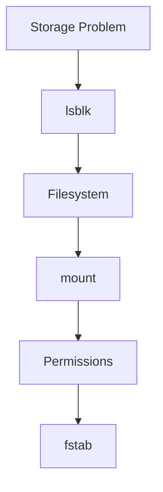

# Mounting

> Mounting is one of Linux's most important concepts.
>
> Great Linux engineers don't think:
>
> **"Open a drive."**
>
> They think:
>
> **"Attach a filesystem to the Linux directory tree."**
>
> Linux does not have drive letters.
>
> Linux has one giant tree.

---

# Why This File Exists

Windows teaches:

```text
C:

D:

E:
```

Linux teaches:

```text
/
```

Everything exists under one tree.

Question:

```text
How does Linux connect storage to that tree?
```

Answer:

```text
Mounting
```

---

# Problem It Solves

This file answers:

```text
What is mounting?

Why is mounting necessary?

What is a mount point?

How does Linux attach storage?

How do Docker and Kubernetes use mounts?

How does Linux boot using mounts?
```

---

# Mental Model: Plugging A Branch Into A Tree

Imagine one giant tree.

```text
             /

      ┌──────┼───────┐

    home    var     etc
```

Now you buy a new SSD.

Question:

```text
Where does it go?
```

Linux says:

```text
Attach it somewhere.
```

Visual:

```text
New SSD

↓

Filesystem

↓

/mnt/data

↓

Linux Tree
```

---

# First Principles

Linux has ONE namespace.

Visual:

```text
/

├── home

├── var

├── etc

├── usr

└── mnt
```

Everything eventually lives under `/`.

There are no separate drive letters.

---

# What Is Mounting?

Definition:

> Mounting is the process of attaching a filesystem to a directory inside Linux.

Simple definition:

```text
Mounting = Connect Filesystem To Linux Tree
```

---

# The Big Picture

```text
Physical Disk

↓

Partition

↓

Filesystem

↓

Mount Point

↓

Applications
```

Memorize this.

---

# What Is A Mount Point?

A mount point is simply a directory.

Examples:

```text
/

/home

/mnt/data

/media/usb
```

Linux attaches filesystems there.

---

# Mental Model: Electrical Socket

Think:

```text
Filesystem

↓

Plug

↓

Mount Point

↓

Socket

↓

Linux Tree
```

---

# Linux Mount Architecture



---

# Example

Suppose:

```text
1 TB SSD

↓

/dev/sdb1

↓

ext4
```

Mount it:

```bash
sudo mount /dev/sdb1 /mnt/data
```

Now Linux sees:

```text
/

└── mnt

    └── data
```

---

# Before Mounting

Linux sees:

```text
Disk

↓

Filesystem

↓

Unavailable
```

Applications cannot access it.

---

# After Mounting

Linux sees:

```text
Disk

↓

Filesystem

↓

Linux Tree

↓

Applications
```

Now it is usable.

---

# Where Linux Stores Mount Information

Kernel maintains a mount table.

Useful files:

```text
/proc/mounts

/etc/mtab
```

---

# How To See Mounted Filesystems

## Method 1

```bash
mount
```

---

## Method 2

```bash
findmnt
```

Excellent tool.

---

## Method 3

```bash
lsblk
```

Look at:

```text
MOUNTPOINTS
```

column.

---

# Basic Mount Command

Syntax:

```bash
sudo mount <device> <mountpoint>
```

Example:

```bash
sudo mount /dev/sdb1 /mnt/data
```

---

# Verify It

```bash
lsblk
```

Output:

```text
sdb

└── sdb1

     /mnt/data
```

---

# Common Mount Locations

## Root Filesystem

```text
/
```

The entire operating system.

---

## User Files

```text
/home
```

---

## Temporary Mounts

```text
/mnt
```

System administrators use this often.

---

## External Devices

```text
/media
```

USB drives commonly appear here.

---

# Temporary vs Persistent Mounts

## Temporary Mount

```bash
mount
```

Problem:

```text
Reboot

↓

Gone
```

---

## Persistent Mount

Use:

```text
/etc/fstab
```

Survives reboot.

---

# Mount Workflow

Engineers memorize this.

```text
New Disk

↓

Partition

↓

Filesystem

↓

Mount

↓

Verify

↓

Persist
```

Commands:

```text
lsblk

↓

fdisk

↓

mkfs

↓

mount

↓

fstab
```

---

# Mount Options

Very important.

Example:

```bash
sudo mount -o ro /dev/sdb1 /mnt/data
```

`ro`

```text
Read Only
```

---

# Useful Options

## Read Only

```text
ro
```

---

## Read Write

```text
rw
```

Default.

---

## No Execute

```text
noexec
```

Prevents execution.

---

## No Device Files

```text
nodev
```

Improves security.

---

## No SUID

```text
nosuid
```

Prevents privilege escalation.

---

# Mount Table Mental Model

Linux internally maintains:

```text
Filesystem

↓

Mount Point

↓

Options

↓

State
```

Think of it as a giant lookup table.

---

# How Linux Boots

This is extremely important.

Boot sequence:

```text
Power On

↓

BIOS/UEFI

↓

Bootloader

↓

Kernel

↓

Mount Root Filesystem

↓

Start System
```

Without mounting:

```text
Linux cannot start
```

---

# Mount Namespaces (Modern Linux)

Containers use mount namespaces.

This is huge.

Visual:

```text
Host

↓

Mount Namespace

↓

Container
```

Each container can have its own view.

---

# Docker Connection

Docker uses mounts everywhere.

Examples:

```text
Bind Mount

Volume

tmpfs
```

Visual:

```text
Container

↓

Volume

↓

Host Filesystem

↓

Storage
```

---

# Kubernetes Connection

Kubernetes also uses mounts.

Visual:

```text
Pod

↓

Persistent Volume

↓

Filesystem

↓

Mount

↓

Linux Tree
```

---

# Bind Mounts

Bind mounts are different.

Example:

```bash
sudo mount --bind /data /backup
```

Visual:

```text
One Directory

↓

Another Location

↓

Same Data
```

No copying happens.

---

# Production Examples

## Developer Laptop

```text
/

/home
```

Mounted automatically.

---

## Database Server

```text
/

/database

/logs

/backups
```

Separate mounts.

---

## Docker Host

```text
/

/var
```

Often separated.

---

# Performance Considerations

Questions engineers ask:

```text
Are too many applications sharing one filesystem?

Is a database isolated?

Are logs isolated?

Are containers isolated?
```

Mounting itself is not a performance tool.

Isolation is.

---

# Security Considerations

Critical options:

```text
ro

noexec

nodev

nosuid
```

Protect:

```text
Temporary storage

Logs

User uploads
```

---

# Troubleshooting Workflow

Storage not accessible?

Ask:

```text
Disk visible?

↓

Filesystem exists?

↓

Mounted?

↓

Permissions correct?

↓

fstab correct?
```

Visual:



---

# Common Mistakes

## Mistake 1

Thinking mounting copies data.

Wrong.

It attaches data.

---

## Mistake 2

Thinking `/mnt/data` is storage.

Wrong.

It is a doorway.

---

## Mistake 3

Forgetting persistence.

Reboot removes temporary mounts.

---

## Mistake 4

Thinking Linux has drive letters.

Wrong.

Linux has one giant tree.

---

# Engineering Mindset

Whenever you see storage, visualize:

```text
Storage Device

↓

Filesystem

↓

Mount Point

↓

Linux Tree

↓

Applications
```

That's how Linux engineers think.

---

# Interview Questions

## Beginner

1. What is mounting?

2. Why does Linux need mounting?

3. What is a mount point?

4. Why doesn't Linux use drive letters?

---

## Intermediate

5. Explain Linux mount architecture.

6. Explain bind mounts.

7. Explain mount options.

8. Explain Linux boot mounts.

---

## Advanced

9. Explain Docker mounts.

10. Explain Kubernetes persistent volumes.

11. Explain mount namespaces.

12. Explain production mount design.

---

# Cheat Sheet

```text
Storage

↓

Filesystem

↓

Mount Point

↓

Linux Tree


Useful Commands

mount

findmnt

lsblk


Useful Options

ro

rw

noexec

nodev

nosuid


Golden Rule

Mounting does not move data.

Mounting attaches data.
```
