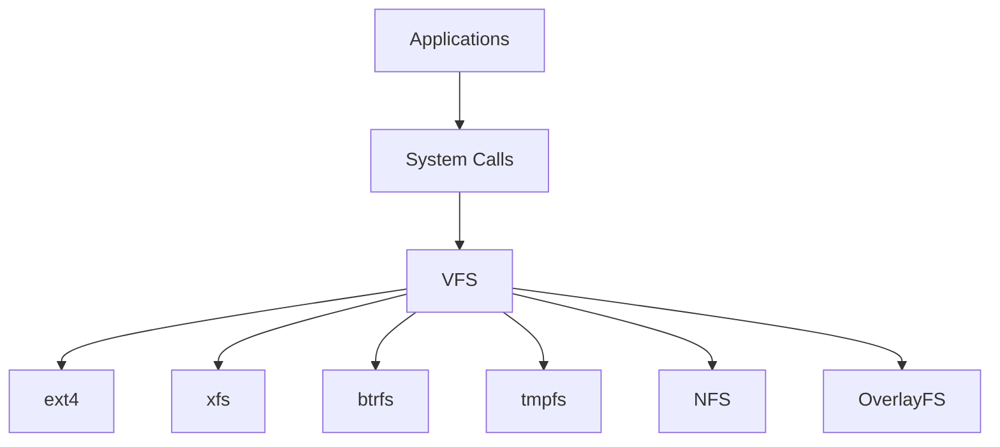
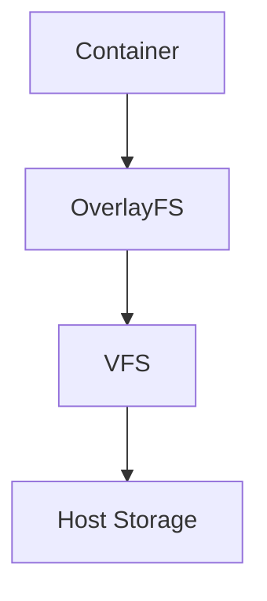

# Virtual Filesystem (VFS)

> VFS is one of Linux's greatest engineering inventions.
>
> It allows Linux to support hundreds of different filesystems without applications needing to know anything about them.
>
> Great Linux engineers don't think:
>
> "Applications talk to ext4."
>
> They think:
>
> "Applications talk to VFS."

---

# Why This File Exists

Many people wonder:

How can Linux support:

- ext4
- xfs
- btrfs
- tmpfs
- NFS
- OverlayFS
- procfs
- sysfs

all at the same time?

How can applications work without changing code?

This file answers that.

---

# Problem It Solves

This file answers:

What is VFS?

Why does VFS exist?

How does Linux support multiple filesystems?

How do applications read files?

How does Docker use VFS?

How does Kubernetes use VFS?

How does Linux switch between filesystems?

---

# Mental Model: Universal Translator

Imagine the world.

Different countries.

Different languages.

Applications only know one language.

Storage systems know many languages.

You need a translator.

Visual:

Applications

↓

Translator

↓

Different Languages

Linux:

Applications

↓

VFS

↓

Different Filesystems

---

# First Principles

Question:

What if VFS did not exist?

Suppose an application wanted to read files.

Without VFS:

Application

↓

Understand ext4

Understand xfs

Understand btrfs

Understand NFS

Understand tmpfs

Impossible.

Applications would become huge.

---

# The Problem Before VFS

Imagine Chrome.

Chrome would need code for:

```text
if ext4:

   do this

if xfs:

   do this

if btrfs:

   do this

if NFS:

   do this
````

This is terrible engineering.

Applications should not care.

---

# The Solution

Linux inserts a layer.

Visual:

Applications

↓

VFS

↓

Filesystems

Now applications always talk to VFS.

---

# What Is VFS?

VFS stands for:

Virtual Filesystem

Definition:

> VFS is an abstraction layer inside the Linux kernel that provides a unified interface for all filesystems.

Simple definition:

```text
VFS = Universal Storage API
```

---

# Big Picture Architecture



---

# Where Does VFS Live?

Visual:

```text
User Space

Applications

──────────────

Kernel Space

System Calls

↓

VFS

↓

Filesystem Drivers

↓

Storage
```

VFS is inside the kernel.

---

# The Linux Storage Pipeline

Memorize this.

```text
Application

↓

System Call

↓

VFS

↓

Filesystem

↓

Block Layer

↓

Driver

↓

Storage
```

---

# How Applications Read Files

Suppose:

```text
report.pdf
```

Application:

```c
open()

read()

close()
```

Application never talks to ext4.

Visual:

```mermaid
flowchart TD

A[Application]

A --> B[open()]

B --> C[VFS]

C --> D[Filesystem]

D --> E[Storage]
```

---

# Core VFS Components

VFS has several internal objects.

```text
Superblock

Inode

Dentry

File Object
```

These are extremely important.

---

# Superblock

Mental model:

Filesystem Identity Card.

Contains:

```text
Filesystem type

Size

Status

Configuration
```

Every mounted filesystem has one.

Visual:

```text
Filesystem

↓

Superblock

↓

Metadata
```

---

# Inode

Mental model:

File Identity Card.

Stores:

```text
Permissions

Owner

Size

Timestamps

Pointers
```

Does NOT store:

```text
File Name
```

Very important.

---

# Dentry

Dentry means:

Directory Entry.

Mental model:

Phone Contact.

Maps:

```text
File Name

↓

Inode
```

Example:

```text
report.pdf

↓

inode 12345
```

---

# File Object

Represents an opened file.

Example:

```c
open()
```

Linux creates a file object.

Visual:

```text
Application

↓

File Object

↓

VFS
```

---

# The Four Core Objects Together


Relationship:

```text
Filesystem

↓

Superblock

↓

Directory Entry

↓

Inode

↓

File Object
```

---

# Data Flow Example

Suppose:

```text
/home/vip/report.pdf
```

Linux does:

```text
/

↓

home

↓

vip

↓

report.pdf

↓

Dentry

↓

Inode

↓

Data Blocks
```

---

# File Read Flow

```mermaid
flowchart TD

A[Application]

A --> B[read()]

B --> C[VFS]

C --> D[Dentry]

D --> E[Inode]

E --> F[Filesystem]

F --> G[Storage]
```

---

# File Write Flow

```mermaid
flowchart TD

A[Application]

A --> B[write()]

B --> C[VFS]

C --> D[Filesystem]

D --> E[Page Cache]

E --> F[Storage]
```

---

# Why VFS Is Powerful

Linux can instantly support new filesystems.

Examples:

```text
ext4

xfs

btrfs

NFS

tmpfs

procfs

sysfs

OverlayFS
```

Applications never change.

---

# How Docker Uses VFS

Docker uses:

```text
OverlayFS
```

Visual:



VFS makes this possible.

---

# How Kubernetes Uses VFS

```text
Pod

↓

Persistent Volume

↓

Filesystem

↓

VFS

↓

Storage
```

Kubernetes eventually depends on VFS.

---

# How NFS Works

Remote server:

```text
Storage Server

↓

NFS

↓

VFS

↓

Application
```

Applications cannot tell the difference.

That's incredible engineering.

---

# How tmpfs Works

tmpfs lives in RAM.

Visual:

```text
RAM

↓

tmpfs

↓

VFS

↓

Applications
```

Applications still work normally.

---

# Why VFS Is Amazing

Applications cannot tell if data comes from:

```text
SSD

HDD

RAM

Cloud

Network

Containers
```

VFS hides complexity.

---

# Modern Filesystems Linux Supports

Examples:

```text
ext4

xfs

btrfs

tmpfs

NFS

procfs

sysfs

OverlayFS
```

All because of VFS.

---

# Performance Considerations

VFS optimizes heavily.

Uses:

```text
Dentry Cache

Inode Cache

Page Cache
```

These reduce disk access.

---

# Security Considerations

VFS enforces:

```text
Permissions

Ownership

ACLs

Access Checks
```

Every file access passes through VFS.

---

# Troubleshooting Workflow

Cannot access a file?

Ask:

```text
Filesystem mounted?

↓

Permissions correct?

↓

Path exists?

↓

VFS caches healthy?

↓

Storage accessible?
```

---

# Common Mistakes

## Mistake 1

Thinking VFS is a filesystem.

Wrong.

VFS is an abstraction layer.

---

## Mistake 2

Thinking applications talk to ext4.

Wrong.

Applications talk to VFS.

---

## Mistake 3

Ignoring VFS in Docker.

Docker heavily depends on VFS.

---

## Mistake 4

Ignoring VFS in Kubernetes.

Kubernetes heavily depends on VFS.

---

# Engineering Mindset

Whenever you see:

```text
File

Directory

Mount

Container

Volume
```

Visualize:

```text
Application

↓

VFS

↓

Filesystem

↓

Storage
```

This is how Linux engineers think.

---

# Interview Questions

## Beginner

1. What is VFS?

2. Why does VFS exist?

3. Is VFS a filesystem?

4. Why is VFS important?

---

## Intermediate

5. Explain VFS architecture.

6. Explain the VFS pipeline.

7. Explain file reads using VFS.

8. Explain Dentry.

---

## Advanced

9. Explain Docker OverlayFS architecture.

10. Explain Kubernetes storage architecture.

11. Explain NFS through VFS.

12. Explain Linux storage abstraction.

---

# Cheat Sheet

```text
Application

↓

System Calls

↓

VFS

↓

Filesystem

↓

Storage


VFS Objects

Superblock

Dentry

Inode

File Object


Golden Rule

Applications never talk to filesystems.

Applications talk to VFS.
```

````

---

After this, the next ideal file is **`filesystem-internals.md`** because now we can deep dive into:

```text
Superblock

Inode

Dentry

Page Cache

Data Blocks

Journaling

Allocation Algorithms
````

which is where Linux becomes truly fascinating.
