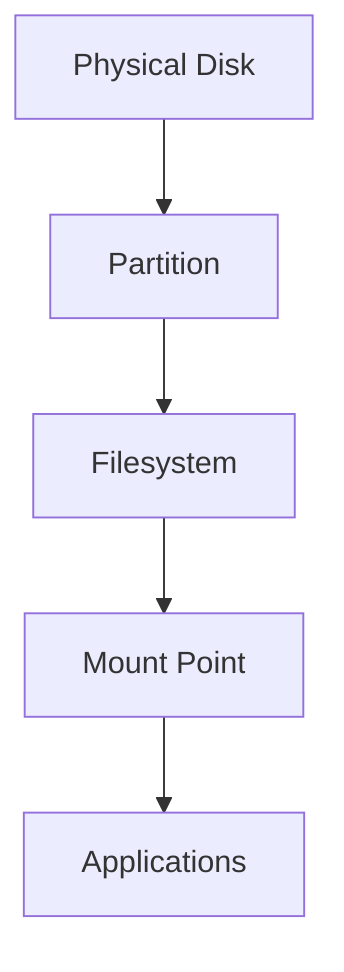
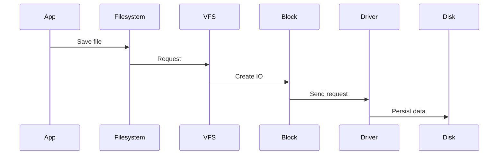
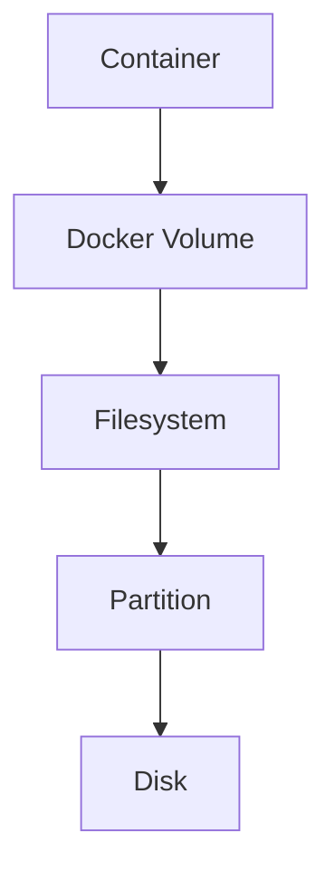
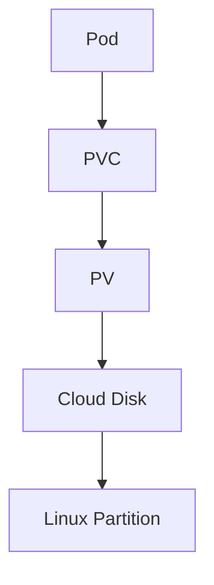
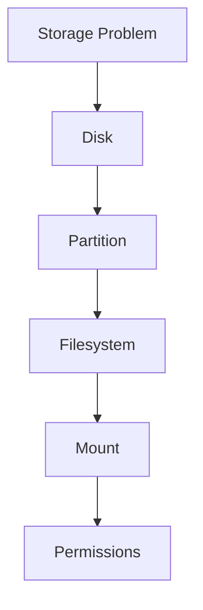

# Disks And Partitions

> One of the most important Linux engineering concepts is understanding that a **disk is not a partition, a partition is not a filesystem, and a filesystem is not a directory**.
>
> These are completely different layers.

This file teaches how Linux transforms a physical storage device into something applications can use.

---

# Why This File Exists

Most people eventually encounter this confusing situation.

```text
/dev/sda

/dev/sda1

/dev/sda2

/

/home

/mnt/data
```

And then ask:

```text
What are these?

Why are there numbers?

Why is /dev/sda different from /dev/sda1?

What exactly is a partition?

Where are my files stored?
```

This file answers all of those questions.

---

# Problem It Solves

This file answers:

```text
What is a disk?

What is a partition?

Why do partitions exist?

What is a filesystem?

What is a mount point?

How are all these connected?

How does Linux find data?
```

---

# Mental Model: Building A House

Imagine building a house.

```text
Land

↓

Rooms

↓

Furniture

↓

People
```

Linux storage:

```text
Physical Disk

↓

Partitions

↓

Filesystems

↓

Mount Points

↓

Applications
```

Every layer has a job.

---

# The Complete Relationship

This diagram is one of the most important diagrams in Linux.



Memorize this.

You will use this mental model everywhere.

---

# First Principles

Storage starts with a physical device.

Examples:

```text
HDD

SSD

NVMe

USB Drive
```

Physical hardware alone is useless.

We need organization.

Linux gradually adds layers.

---

# Layer 1: Physical Disk

A disk is simply storage hardware.

Visual:

```text
Physical Disk

┌──────────────────────────┐

│                          │

│      Raw Storage         │

│                          │

└──────────────────────────┘
```

Linux sees:

```text
/dev/sda

/dev/sdb

/dev/nvme0n1
```

At this stage:

```text
No files

No folders

No filesystem
```

Only raw space.

---

# Why Raw Disks Are Useless

Imagine buying empty land.

Can you immediately live there?

No.

You must organize it.

Raw disks are similar.

Visual:

```text
Disk

0101010101010101010

0101010101010101010

0101010101010101010
```

There is no structure.

---

# Layer 2: Partitions

Partitions divide disks into logical sections.

Visual:

```text
Disk

┌──────────────────────────┐

│                          │

│       1 TB Disk          │

│                          │

└──────────────────────────┘


↓

Partitioned


┌─────────┬─────────┬──────┐

│ Root    │ Data    │BackUp│

│ 200 GB  │500 GB   │300GB │

└─────────┴─────────┴──────┘
```

Linux:

```text
/dev/sda1

/dev/sda2

/dev/sda3
```

---

# Why Do Partitions Exist?

Partitions solve organization problems.

Without partitions:

```text
Everything mixed together
```

With partitions:

```text
Separate purposes

Separate management

Separate recovery

Separate permissions
```

---

# Real World Example

Developer laptop:

```text
1 TB SSD

↓

300 GB Linux

↓

500 GB Data

↓

200 GB Backup
```

---

# Mental Model: Rooms In A House

Disk:

```text
Entire house
```

Partitions:

```text
Rooms
```

Visual:

```text
House

┌─────────────────────┐

│ Living Room         │

├─────────────────────┤

│ Bedroom             │

├─────────────────────┤

│ Office              │

└─────────────────────┘
```

Storage:

```text
Disk

┌─────────────────────┐

│ Partition 1         │

├─────────────────────┤

│ Partition 2         │

├─────────────────────┤

│ Partition 3         │

└─────────────────────┘
```

---

# Layer 3: Filesystem

Partitions still cannot store files.

Partitions only divide space.

Filesystems create organization.

Visual:

```text
Partition

↓

Filesystem

↓

photo.jpg

↓

database.db

↓

video.mp4
```

Common filesystems:

```text
ext4

xfs

btrfs
```

---

# Filesystem Responsibilities

Filesystems manage:

```text
File names

Permissions

Ownership

Directories

Metadata

Inodes

Journaling
```

---

# Layer 4: Mount Points

Linux has one giant tree.

```text
/
```

Storage must attach somewhere.

Visual:

```text
Filesystem

↓

Mount Point

↓

Linux Tree
```

Example:

```text
/dev/sda2

↓

ext4

↓

/mnt/data
```

Result:

```text
/

├── home

├── var

├── etc

└── mnt

    └── data
```

---

# Complete Journey

Imagine buying a new SSD.

Step 1:

Linux detects it.

```text
Physical SSD

↓

/dev/sdb
```

Step 2:

Create partitions.

```text
/ dev/sdb1

/ dev/sdb2
```

Step 3:

Create filesystem.

```text
ext4
```

Step 4:

Mount it.

```text
/mnt/data
```

Step 5:

Store files.

```text
photo.jpg

resume.pdf

database.db
```

Visual:

```mermaid
flowchart TD

A[Physical SSD]

A --> B[/dev/sdb]

B --> C[/dev/sdb1]

C --> D[ext4]

D --> E[/mnt/data]

E --> F[Files]
```

---

# How Linux Sees It

Linux gradually adds abstraction.

```text
Physical Device

↓

Device File

↓

Partition

↓

Filesystem

↓

Mount Point

↓

Files
```

---

# Device Naming

## SATA Drives

```text
/ dev/sda

/ dev/sdb

/ dev/sdc
```

Partitions:

```text
/ dev/sda1

/ dev/sda2

/ dev/sda3
```

---

## NVMe Drives

Disk:

```text
/ dev/nvme0n1
```

Partitions:

```text
/ dev/nvme0n1p1

/ dev/nvme0n1p2
```

---

# Partition Tables

Linux must remember partition information.

Partition tables solve this.

Two systems exist.

```text
MBR

GPT
```

---

# MBR (Older)

Limitations:

```text
2 TB maximum

4 primary partitions
```

Visual:

```text
Disk

↓

MBR

↓

4 Partitions
```

---

# GPT (Modern)

Advantages:

```text
Huge disk support

128 partitions

Redundancy

More reliable
```

Visual:

```text
Disk

↓

GPT

↓

Many partitions
```

Today:

```text
GPT is preferred
```

---

# Data Flow Inside Linux

Suppose you save:

```text
report.pdf
```

Visual:



---

# How Databases Use Partitions

Database server.

```text
Disk

↓

Partition

↓

ext4

↓

PostgreSQL

↓

Data
```

Large companies often separate:

```text
Database data

Database logs

Backups
```

Into different partitions.

---

# Docker Connection

Docker volumes eventually become Linux filesystems.

Visual:



---

# Kubernetes Connection



---

# Performance Considerations

Questions engineers ask:

```text
Should logs be separate?

Should databases have dedicated partitions?

Should backups have dedicated disks?

Should containers have dedicated storage?
```

The answer is often yes.

---

# Security Considerations

Separate sensitive data.

Examples:

```text
Encryption

Backups

ACL

Filesystem permissions
```

Protect:

```text
User data

Database data

Secrets

Logs
```

---

# Troubleshooting Workflow

Application cannot access data.

Ask:

```text
Is disk detected?

↓

Is partition present?

↓

Is filesystem created?

↓

Is storage mounted?

↓

Is there permission?
```

Visual:



---

# Common Mistakes

## Mistake 1

Thinking disk = partition.

Wrong.

Disk contains partitions.

---

## Mistake 2

Thinking partition = filesystem.

Wrong.

Filesystem lives inside partitions.

---

## Mistake 3

Thinking mounting copies data.

Wrong.

Mounting attaches storage.

---

## Mistake 4

Thinking `/mnt/data` is storage.

Wrong.

It's a doorway.

---

# Engineering Mindset

Whenever you see storage, visualize:

```text
Physical Disk

↓

Partition

↓

Filesystem

↓

Mount Point

↓

Application
```

This diagram solves most storage confusion.

---

# Interview Questions

## Beginner

1. What is a disk?

2. What is a partition?

3. Why do partitions exist?

4. What is a filesystem?

5. What is mounting?

---

## Intermediate

6. Difference between disk and partition?

7. Difference between partition and filesystem?

8. Difference between MBR and GPT?

9. Why are mount points necessary?

---

## Advanced

10. Explain Linux storage architecture.

11. Explain how Linux finds files.

12. Explain storage abstraction layers.

13. Explain how Docker uses Linux storage.

14. Explain how Kubernetes persistent volumes depend on Linux storage.

---

# Cheat Sheet

```text
Physical Disk

↓

Partition

↓

Filesystem

↓

Mount Point

↓

Application


Examples

Disk

/dev/sda


Partitions

/dev/sda1

/dev/sda2


Filesystem

ext4


Mount Point

/mnt/data


Golden Rule

Disk ≠ Partition

Partition ≠ Filesystem

Filesystem ≠ Mount Point
```
