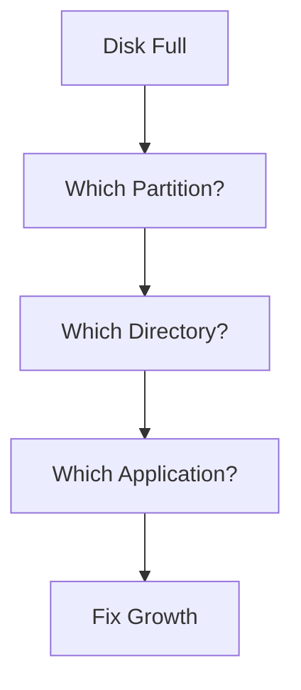
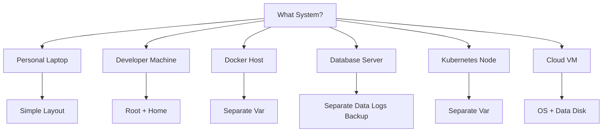

# Partitioning Strategies

> Great Linux engineers don't ask:
>
> **"How do I create partitions?"**
>
> They ask:
>
> **"How should I design my storage architecture?"**
>
> Partitioning is not a Linux command problem.
>
> It is a systems design problem.

---

# Why This File Exists

Most tutorials teach:

```bash
fdisk

parted
```

But they never teach:

```text
Why should /var be separate?

Should /home be separate?

Should logs have dedicated storage?

Should databases have dedicated disks?

How should Kubernetes nodes be partitioned?

How should cloud servers be partitioned?
```

This file answers those questions.

---

# Problem It Solves

This file answers:

```text
Why partition at all?

When should partitions be separated?

What problems do separate partitions solve?

What are modern partitioning practices?

How do engineers partition production systems?
```

---

# Mental Model: City Planning

Think of a city.

Bad city planning:

```text
Homes

Factories

Hospitals

Schools

Airports

Everything mixed together
```

Chaos.

Good city planning:

```text
Residential Zone

Industrial Zone

Commercial Zone

Infrastructure Zone
```

Linux storage is similar.

---

# First Principles

Ask:

```text
Why partition?
```

Not:

```text
How partition?
```

The answer:

> **Isolation.**

Partitioning creates boundaries.

---

# The 5 Reasons Partitions Exist

## 1. Isolation

Prevent one workload from destroying another.

## 2. Reliability

Failures stay contained.

## 3. Security

Sensitive data stays separate.

## 4. Performance

Heavy workloads don't compete.

## 5. Management

Storage becomes easier to maintain.

---

# Mental Model: Apartment Building

Imagine an apartment building.

Bad design:

```text
Everyone shares one giant room.
```

Good design:

```text
Separate rooms.

Separate purposes.
```

Visual:

```text
Building

┌──────────────┐

│ Apartment 1  │

├──────────────┤

│ Apartment 2  │

├──────────────┤

│ Apartment 3  │

└──────────────┘
```

Linux:

```text
Disk

┌──────────────┐

│ Root         │

├──────────────┤

│ Home         │

├──────────────┤

│ Var          │

└──────────────┘
```

---

# Strategy 1: Single Root Partition

Simplest setup.

Visual:

```text
Disk

┌─────────────┐

│ /           │

│ Everything  │

└─────────────┘
```

Used by:

```text
Beginners

Small servers

Temporary VMs

Cloud instances
```

Advantages:

```text
Simple

Easy

Minimal management
```

Disadvantages:

```text
No isolation

Harder recovery

Disk full affects everything
```

---

# Strategy 2: Root + Home

Common desktop strategy.

Visual:

```text
Disk

┌─────────────┐

│ /           │

├─────────────┤

│ /home       │

└─────────────┘
```

Benefits:

```text
OS separate

User data separate

Easy reinstall
```

Very popular.

---

# Strategy 3: Root + Home + Var

Very common engineering setup.

Visual:

```text
Disk

┌─────────────┐

│ /           │

├─────────────┤

│ /home       │

├─────────────┤

│ /var        │

└─────────────┘
```

---

# Why Separate /var ?

Because `/var` grows.

Contains:

```text
Logs

Containers

Caches

Databases

Package data
```

Without isolation:

```text
Huge logs

↓

Root full

↓

Server crash
```

This happens often.

---

# Strategy 4: Root + Home + Var + Tmp

Visual:

```text
Disk

┌─────────────┐

│ /           │

├─────────────┤

│ /home       │

├─────────────┤

│ /var        │

├─────────────┤

│ /tmp        │

└─────────────┘
```

Benefits:

```text
Temporary files isolated

Security improved

Crash protection
```

---

# Strategy 5: Enterprise Linux Server

Visual:

```text
Disk

┌─────────────┐

│ /boot       │

├─────────────┤

│ /           │

├─────────────┤

│ /var        │

├─────────────┤

│ /home       │

├─────────────┤

│ /tmp        │

├─────────────┤

│ /opt        │

└─────────────┘
```

Used for:

```text
Enterprise servers

Critical systems

Multi-user systems
```

---

# Purpose Of Important Directories

## /

Root system.

Contains:

```text
Operating system
```

Protect it.

---

## /home

Contains:

```text
User data

Documents

Downloads

Configurations
```

---

## /var

Contains:

```text
Logs

Databases

Docker data

Containers

Cache
```

This grows rapidly.

---

## /tmp

Contains:

```text
Temporary files
```

Can become dangerous.

---

## /boot

Contains:

```text
Kernel

Bootloader files
```

Protect it.

---

## /opt

Contains:

```text
Third-party applications
```

---

# Developer Laptop Strategy

Recommended.

Visual:

```text
512 GB SSD

↓

1 GB EFI

↓

100 GB /

↓

350 GB /home

↓

61 GB free growth
```

---

# Power User Strategy

Visual:

```text
1 TB SSD

↓

1 GB EFI

↓

100 GB /

↓

500 GB /home

↓

250 GB /var

↓

149 GB free growth
```

---

# Docker Host Strategy

Docker writes enormous amounts of data.

Separate `/var`.

Visual:

```text
Disk

┌─────────────┐

│ /           │

├─────────────┤

│ /var        │

└─────────────┘
```

Because:

```text
Docker Images

Docker Layers

Volumes

Logs
```

All grow inside:

```text
/var/lib/docker
```

---

# Database Server Strategy

Never mix everything.

Visual:

```text
Disk 1

↓

Operating System


Disk 2

↓

Database Data


Disk 3

↓

Database Logs


Disk 4

↓

Backups
```

Excellent isolation.

---

# PostgreSQL Example

```text
OS SSD

↓

/


NVMe

↓

PostgreSQL Data


NVMe

↓

WAL Logs


HDD

↓

Backups
```

Very common.

---

# Kubernetes Node Strategy

Visual:

```text
Disk

┌─────────────┐

│ /           │

├─────────────┤

│ /var        │

└─────────────┘
```

Because Kubernetes stores:

```text
Container Images

Pod Logs

Runtime Data
```

Inside:

```text
/var
```

---

# Cloud VM Strategy

Keep it simple.

Visual:

```text
Disk 1

↓

OS


Disk 2

↓

Application Data
```

Cloud providers often encourage this.

---

# Modern World Connections

## Docker

Important location:

```text
/var/lib/docker
```

Separate if possible.

---

## Kubernetes

Important locations:

```text
/var/lib/containerd

/var/lib/kubelet

/var/log
```

---

## Databases

Separate:

```text
Data

Logs

Backups
```

---

## AI Systems

Separate:

```text
Models

Datasets

Caches
```

---

# Performance Considerations

Separate heavy writers.

Examples:

```text
Databases

Containers

Logs

AI datasets
```

Avoid competition.

---

# Security Considerations

Sensitive systems may isolate:

```text
/var

/tmp

/home
```

Mount options:

```text
noexec

nosuid

nodev
```

These improve security.

We will cover these later.

---

# Troubleshooting Flow

Disk full?

Ask:

```text
What partition?

↓

What directory?

↓

What workload?

↓

What is growing?
```

Visual:



---

# Common Mistakes

## Mistake 1

Creating too many tiny partitions.

Bad.

Future growth becomes difficult.

---

## Mistake 2

Putting Docker and databases together.

Bad.

Heavy competition.

---

## Mistake 3

Ignoring `/var`.

This is one of the most common production mistakes.

---

## Mistake 4

Using desktop partitioning for production servers.

Requirements are different.

---

# Engineering Mindset

Do not partition based on directories.

Partition based on workloads.

Ask:

```text
What grows?

What is critical?

What needs isolation?

What needs performance?

What needs security?
```

---

# Decision Tree



---

# Interview Questions

## Beginner

1. Why partition a disk?

2. Why separate `/home`?

3. Why separate `/var`?

4. What lives inside `/var`?

---

## Intermediate

5. Why is `/var` important for Docker?

6. Why should databases use separate disks?

7. Why separate backups?

8. Why isolate workloads?

---

## Advanced

9. Design partitioning for a PostgreSQL server.

10. Design partitioning for Kubernetes nodes.

11. Design partitioning for a Docker host.

12. Explain partitioning tradeoffs.

---

# Cheat Sheet

```text
Partitioning Goals

Isolation

Reliability

Performance

Security

Management


Personal Laptop

/

+

/home


Docker Host

/

+

/var


Database Server

OS

Data

Logs

Backups


Golden Rule

Partition workloads.

Not directories.
```
