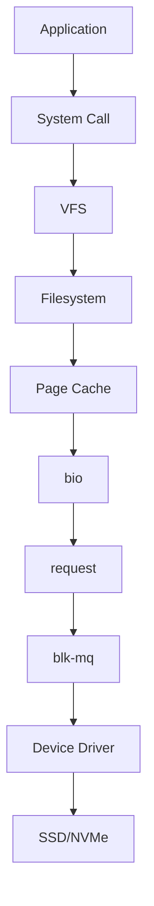
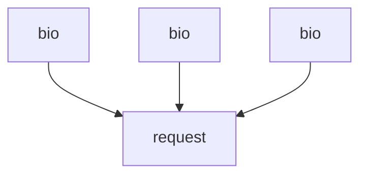
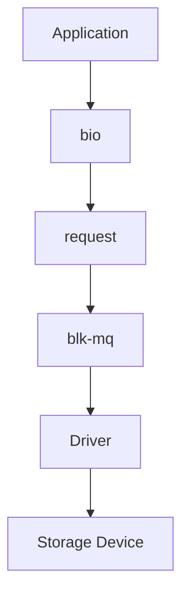
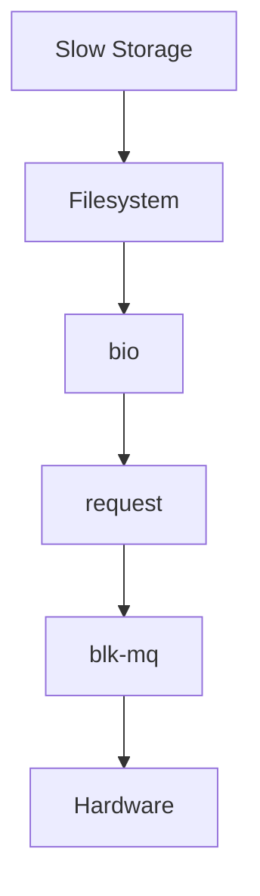

# bio and request

> `bio` and `request` are two of the most important Linux kernel storage concepts.
>
> Great Linux engineers don't think:
>
> "Applications talk to disks."
>
> They think:
>
> "Applications generate I/O descriptions that Linux transforms into optimized hardware operations."
>
> `bio` describes work.
>
> `request` optimizes work.
>
> Together they power Linux storage.

---

# Why This File Exists

Imagine:

```bash
echo hello > notes.txt
```

Looks simple.

Question:

```text
How does Linux transform this

into electrical operations

inside an SSD?
```

Many systems work together.

One important transformation is:

```text
Application

↓

bio

↓

request

↓

Driver

↓

Storage Device
```

This file explains that.

---

# Problem It Solves

This file answers:

```text
What is bio?

What is request?

Why does Linux need both?

How does Linux transform I/O?

How does optimization happen?

Why do databases, Docker and Kubernetes care?
```

---

# Mental Model: Online Shopping

Imagine Amazon.

Question:

What happens after you click:

```text
Buy Now
```

Amazon does NOT immediately drive a truck.

It does:

```text
Order Description

↓

Warehouse Grouping

↓

Delivery Optimization

↓

Truck Dispatch
```

Linux does the same.

---

# First Principles

Question:

Why can't Linux simply do this?

```text
Application

↓

SSD
```

Because:

```text
Millions Of Requests

Thousands Of Processes

Many CPU Cores

Different Priorities

Different Devices
```

Linux needs organization.

---

# Big Picture Architecture



Memorize this forever.

---

# Mental Model: Package Delivery

Think:

```text
bio

↓

Package Information


request

↓

Delivery Truck
```

This is extremely accurate.

---

# What Is bio?

`bio` means:

```text
Block I/O
```

Definition:

> `bio` is a kernel data structure that describes a storage operation.

Simple definition:

```text
bio = I/O Description
```

It answers:

```text
What operation?

Read or Write?

How much data?

Which blocks?

Where is memory?
```

---

# Example bio

Imagine:

```bash
cat file.txt
```

Linux creates something conceptually like:

```text
Operation

↓

Read

Block

↓

1000

Size

↓

4 KB
```

This becomes a bio.

---

# Mental Model: Food Order Slip

Visual:

```text
Table 5

↓

Burger

↓

Coke

↓

Fries
```

Not food itself.

Just instructions.

That's bio.

---

# What Information Does bio Hold?

Conceptually:

```text
Operation Type

Target Device

Memory Pages

Sector Number

Data Size
```

Visual:

```text
bio

├── Read/Write

├── Device

├── Memory

├── Size

└── Sector
```

---

# Where Does bio Live?

Visual:

```text
Application

↓

Filesystem

↓

Page Cache

↓

bio

↓

request

↓

Hardware
```

---

# Why Does Linux Need bio?

Imagine:

```text
Application A

↓

Read

Application B

↓

Write

Application C

↓

Read
```

Linux needs a standard language.

bio is that language.

---

# What Is request?

Definition:

> A request is an optimized collection of one or more bio objects.

Simple definition:

```text
request = Optimized Work Unit
```

---

# Mental Model: Delivery Truck

Imagine:

```text
bio

↓

Package

↓

Package

↓

Package
```

Question:

Should we send:

```text
3 Trucks?
```

No.

Linux groups them.

```text
1 Truck
```

That's request.

---

# The Big Difference

bio:

```text
Describe Work
```

request:

```text
Optimize Work
```

Memorize forever.

---

# Visual Comparison

```text
bio

↓

Individual Task


request

↓

Grouped Tasks
```

---

# Data Transformation

Visual:



Multiple bio objects become one request.

---

# Why Group Requests?

Question:

Suppose we have:

```text
Read Block 100

Read Block 101

Read Block 102
```

Bad:

```text
3 Separate Operations
```

Good:

```text
1 Combined Operation
```

Huge performance improvement.

---

# Request Merging

Visual:

Before:

```text
bio

100

bio

101

bio

102
```

After:

```text
request

100 → 102
```

Very efficient.

---

# Data Lifecycle



---

# Where blk-mq Fits

Remember.

blk-mq sits after request creation.

Visual:

```text
bio

↓

request

↓

blk-mq

↓

Driver
```

---

# Mental Model: Factory

Imagine a factory.

Raw work:

```text
bio
```

Assembly:

```text
request
```

Shipping:

```text
blk-mq
```

Delivery:

```text
driver
```

Excellent mental model.

---

# How Many bios Become One request?

Depends.

Sometimes:

```text
1 bio

↓

1 request
```

Sometimes:

```text
100 bio

↓

1 request
```

Linux decides dynamically.

---

# Read Example

Suppose:

```bash
cat huge-file.txt
```

Visual:

```text
Application

↓

bio

↓

bio

↓

bio

↓

request

↓

NVMe
```

---

# Write Example

Suppose:

```bash
cp movie.mp4 backup/
```

Visual:

```text
Application

↓

Page Cache

↓

bio

↓

request

↓

Driver

↓

Storage
```

---

# Linux Internal Pipeline

This is one of the most important visuals.


Memorize this.

---

# HDD vs NVMe

HDD:

```text
Fewer Parallel Operations
```

NVMe:

```text
Thousands Of Parallel Operations
```

This makes request optimization even more important.

---

# Database Example

PostgreSQL.

Visual:

```text
SQL Query

↓

Filesystem

↓

bio

↓

request

↓

NVMe
```

Millions of these happen every second.

---

# Docker Example

Containers create many requests.

Visual:

```text
Container

↓

OverlayFS

↓

bio

↓

request
```

---

# Kubernetes Example

Pods create storage requests.

Visual:

```text
Pod

↓

Persistent Volume

↓

Filesystem

↓

bio

↓

request
```

---

# AI Workloads

Examples:

```text
Dataset Reads

Model Saves

Checkpoint Writes
```

All become:

```text
bio

↓

request
```

---

# Cloud Perspective

Cloud disks still use Linux internals.

Examples:

```text
AWS EBS

Azure Disk

Google Persistent Disk
```

Eventually:

```text
bio

↓

request
```

still exists.

---

# Why This Architecture Is Powerful

Linux separates responsibilities.

```text
bio

↓

Describe

request

↓

Optimize

blk-mq

↓

Parallelize

driver

↓

Execute
```

Excellent engineering.

---

# Performance Considerations

Questions engineers ask:

```text
Sequential Or Random?

Request Size?

Queue Saturation?

Hardware Type?

CPU Count?
```

---

# Security Considerations

Storage floods can become attacks.

Examples:

```text
Log Flooding

Disk Exhaustion

Container Abuse
```

Observe workloads.

---

# Observability Tools

Useful tools:

```bash
blktrace

iostat

iotop

vmstat

perf
```

Useful files:

```text
/proc/diskstats

/sys/block
```

---

# Troubleshooting Workflow

Storage slow?

Ask:

```text
Application?

↓

Filesystem?

↓

bio?

↓

request?

↓

blk-mq?

↓

Hardware?
```

Visual:



---

# Common Mistakes

## Mistake 1

Thinking bio is data.

Wrong.

bio describes data.

---

## Mistake 2

Thinking request is hardware.

Wrong.

It is optimized work.

---

## Mistake 3

Thinking applications talk to disks.

Wrong.

---

## Mistake 4

Ignoring request merging.

Huge optimization.

---

## Mistake 5

Ignoring workload patterns.

Very important.

---

# Engineering Mindset

Whenever you see storage, visualize:

```text
Application

↓

Filesystem

↓

Page Cache

↓

bio

↓

request

↓

blk-mq

↓

Driver

↓

Hardware
```

That's how Linux kernel engineers think.

---

# Interview Questions

## Beginner

1. What is bio?

2. What is request?

3. Why does Linux need both?

4. What is request merging?

---

## Intermediate

5. Explain the bio lifecycle.

6. Explain the request lifecycle.

7. Explain blk-mq integration.

8. Explain storage optimization.

---

## Advanced

9. Explain Linux storage architecture.

10. Explain database storage flow.

11. Explain NVMe optimization.

12. Explain Linux kernel I/O internals.

---

# Cheat Sheet

```text
Storage Pipeline

Application

↓

Filesystem

↓

Page Cache

↓

bio

↓

request

↓

blk-mq

↓

Driver

↓

Hardware


Responsibilities

bio

↓

Describe Work


request

↓

Optimize Work


blk-mq

↓

Parallelize Work


driver

↓

Execute Work


Golden Rule

Applications never talk to disks.

Linux transforms work layer by layer.
```
