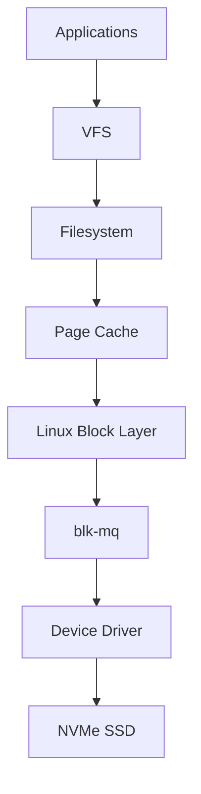
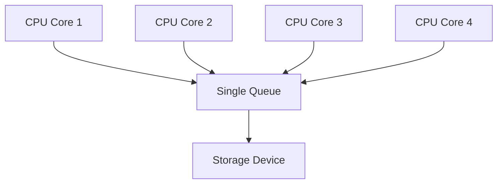
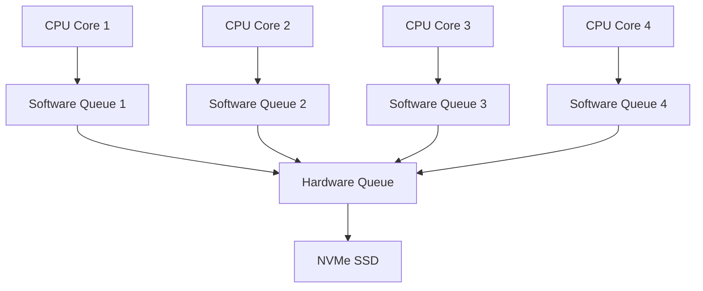
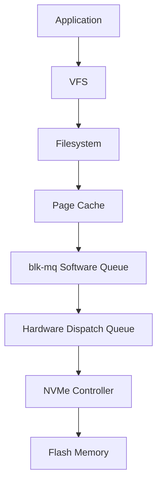
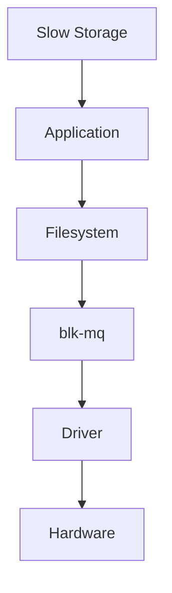

# blk-mq (Block Multi Queue)

> blk-mq is one of Linux's biggest storage architecture redesigns.
>
> Great Linux engineers don't think:
>
> "Linux sends data to disks."
>
> They think:
>
> "Linux distributes millions of I/O requests across CPUs and queues to maximize hardware parallelism."
>
> blk-mq exists because modern hardware became too fast for old Linux architectures.

---

# Why This File Exists

Question:

Why did Linux redesign its storage system?

Because modern hardware changed.

Old world:

```text
1 CPU

↓

1 HDD

↓

1 Queue
```

Modern world:

```text
64 CPU Cores

↓

High-Speed NVMe

↓

Thousands Of Parallel Operations
```

Old Linux became a bottleneck.

---

# Problem It Solves

This file answers:

```text
What is blk-mq?

Why was it created?

What was wrong with old Linux?

How does blk-mq work?

Why do NVMe SSDs love blk-mq?

Why do cloud, Kubernetes and databases care?
```

---

# Mental Model: Supermarket

Imagine this.

Bad design:

```text
1000 Customers

↓

1 Checkout Counter
```

Everyone waits.

Huge bottleneck.

Good design:

```text
1000 Customers

↓

20 Checkout Counters
```

Everything becomes faster.

That's blk-mq.

---

# First Principles

Computers evolved.

Old computers:

```text
1 CPU

1 HDD

Few Processes
```

Modern computers:

```text
64 CPU Cores

NVMe SSD

Thousands Of Processes
```

Old Linux architecture couldn't scale.

---

# Storage Evolution

## Generation 1

```text
Application

↓

Disk
```

---

## Generation 2

```text
Application

↓

Block Layer

↓

Single Queue

↓

Disk
```

---

## Generation 3 (Modern)

```text
Application

↓

Block Layer

↓

Multiple Queues

↓

NVMe
```

This is blk-mq.

---

# Big Picture Architecture



---

# The Old Architecture

Before blk-mq:

```text
CPU 1

CPU 2

CPU 3

CPU 4

↓

One Shared Queue

↓

Disk
```

Problem:

Everyone fought over one queue.

---

# Old Architecture Visual



---

# Problems With Single Queue

There were several problems.

## Problem 1: Lock Contention

Question:

What happens when many CPUs access one queue?

```text
CPU 1 Wait

CPU 2 Wait

CPU 3 Wait
```

Everything slows down.

---

## Problem 2: Cache Contention

CPUs continuously synchronize.

Performance suffers.

---

## Problem 3: Modern Hardware Underutilization

NVMe devices are massively parallel.

Single queues waste potential.

---

# The Big Idea

Instead of:

```text
Many CPUs

↓

One Queue
```

Linux built:

```text
Many CPUs

↓

Many Queues
```

---

# Modern Architecture



This is blk-mq.

---

# The Two Queue System

blk-mq has two layers.

```text
Software Queues

↓

Hardware Queues
```

Memorize this forever.

---

# Software Queues

Each CPU gets its own queue.

Visual:

```text
CPU 1

↓

Queue 1


CPU 2

↓

Queue 2


CPU 3

↓

Queue 3
```

Benefits:

```text
Less Waiting

Less Locking

Better CPU Cache Usage
```

---

# Hardware Queues

These connect to storage devices.

Visual:

```text
Software Queues

↓

Hardware Queues

↓

NVMe
```

Modern NVMe supports many hardware queues.

---

# The Complete Pipeline



This is a huge architectural improvement.

---

# Why NVMe Loves blk-mq

NVMe was built for parallelism.

Question:

How many queues can NVMe support?

Often:

```text
64K Queues

64K Commands Per Queue
```

Massive.

Visual:

```text
NVMe

↓

Queue 1

Queue 2

Queue 3

...

Thousands Of Queues
```

---

# HDD vs SSD vs NVMe

## HDD

```text
Mechanical

1 Head

Limited Parallelism
```

---

## SATA SSD

```text
Electronic

Moderate Parallelism
```

---

## NVMe

```text
Massive Parallelism

Built For Multi-Core CPUs
```

---

# Data Flow Example

Suppose:

```bash
docker pull ubuntu
```

Linux does:

```text
Docker

↓

OverlayFS

↓

Filesystem

↓

Page Cache

↓

blk-mq

↓

NVMe
```

Millions of requests may occur.

---

# Mental Model: Highway System

Old:

```text
16 Roads

↓

1 Toll Booth
```

Terrible.

Modern:

```text
16 Roads

↓

16 Toll Booths
```

Excellent.

That's blk-mq.

---

# blk-mq Internals

Important concepts:

```text
bio

↓

request

↓

Software Queue

↓

Hardware Queue

↓

Driver

↓

NVMe
```

Memorize this pipeline.

---

# Data Lifecycle


---

# CPU Affinity

Another optimization.

Linux tries to keep:

```text
CPU

↓

Queue

↓

Hardware Queue
```

on the same path.

Benefits:

```text
Less Synchronization

Better Cache Locality
```

---

# Modern Linux Schedulers

blk-mq introduced new schedulers.

Examples:

```text
none

mq-deadline

bfq

kyber
```

These are blk-mq aware.

---

# How To Inspect blk-mq

See scheduler:

```bash
cat /sys/block/nvme0n1/queue/scheduler
```

See queue depth:

```bash
cat /sys/block/nvme0n1/queue/nr_requests
```

See hardware queue info:

```bash
ls /sys/block/nvme0n1/mq
```

---

# Database Example

PostgreSQL:

```text
Thousands Of Queries

↓

Filesystem

↓

blk-mq

↓

NVMe
```

Performance critical.

---

# Docker Example

Docker workloads:

```text
Images

Containers

Volumes

Logs
```

All eventually hit blk-mq.

---

# Kubernetes Example

Pods generate enormous I/O.

Visual:

```text
Pods

↓

Persistent Volumes

↓

Filesystem

↓

blk-mq

↓

NVMe
```

---

# AI Workloads

Examples:

```text
Datasets

Checkpoints

Models

Embeddings
```

These generate huge parallel I/O.

---

# Cloud Connection

Cloud disks still use Linux.

Examples:

```text
AWS EBS

Azure Managed Disk

Google Persistent Disk
```

Eventually:

```text
Cloud Disk

↓

blk-mq
```

---

# Performance Considerations

Questions engineers ask:

```text
How many CPU cores?

How many queues?

NVMe or HDD?

Read heavy?

Write heavy?

Queue saturation?
```

---

# Security Considerations

Storage attacks can overwhelm queues.

Examples:

```text
Log Flooding

Container Abuse

Storage Exhaustion
```

Observability matters.

---

# Observability Tools

Useful tools:

```bash
iostat

iotop

blktrace

vmstat

nvme list
```

Useful files:

```text
/sys/block/

/proc/diskstats
```

---

# Troubleshooting Workflow

Storage slow?

Ask:

```text
Hardware?

↓

Queue Saturation?

↓

Scheduler?

↓

Filesystem?

↓

Application?
```

Visual:



---

# Common Mistakes

## Mistake 1

Thinking Linux still uses one queue.

Wrong.

---

## Mistake 2

Applying HDD tuning to NVMe.

Wrong.

---

## Mistake 3

Ignoring CPU scaling.

Very important.

---

## Mistake 4

Ignoring queue saturation.

Very common.

---

## Mistake 5

Optimizing before measuring.

Always measure first.

---

# Engineering Mindset

Whenever you see modern storage, visualize:

```text
Application

↓

Filesystem

↓

Page Cache

↓

blk-mq

↓

Driver

↓

NVMe
```

Do not think:

```text
CPU

↓

Disk
```

Think:

```text
Many CPUs

↓

Many Queues

↓

Many Operations

↓

Massive Parallelism
```

That's how Linux kernel engineers think.

---

# Interview Questions

## Beginner

1. What is blk-mq?

2. Why was it created?

3. What was wrong with single queues?

4. Why do NVMe devices benefit?

---

## Intermediate

5. Explain software queues.

6. Explain hardware queues.

7. Explain queue contention.

8. Explain CPU affinity.

---

## Advanced

9. Explain blk-mq architecture.

10. Explain NVMe scaling.

11. Explain database workloads.

12. Explain Linux storage evolution.

---

# Cheat Sheet

```text
Old Linux

Many CPUs

↓

One Queue

↓

Disk


Modern Linux

Many CPUs

↓

Many Software Queues

↓

Hardware Queues

↓

NVMe


Pipeline

bio

↓

request

↓

Software Queue

↓

Hardware Queue

↓

Driver

↓

NVMe


Golden Rule

blk-mq removes storage bottlenecks

by embracing parallelism.
```
