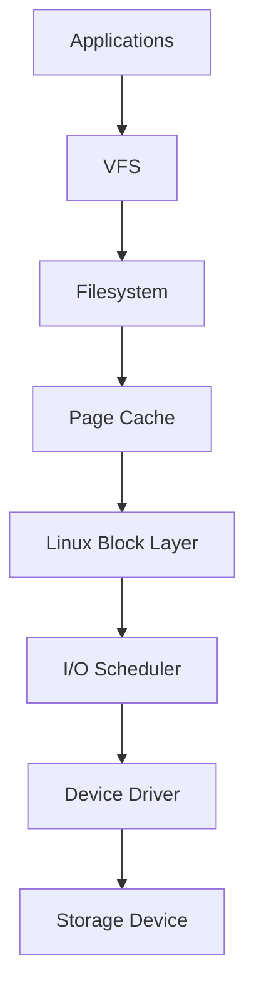
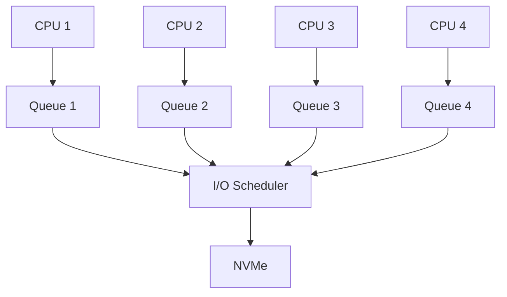
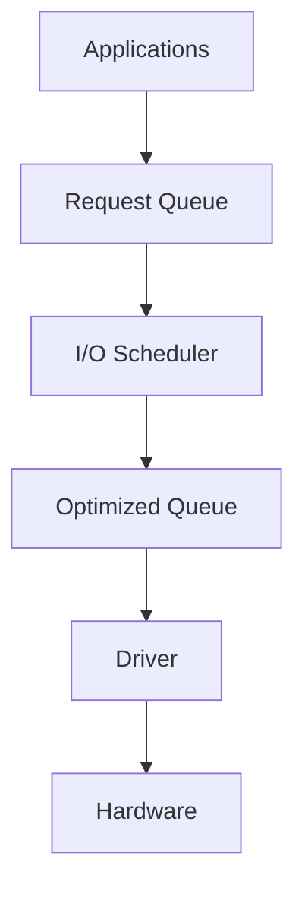
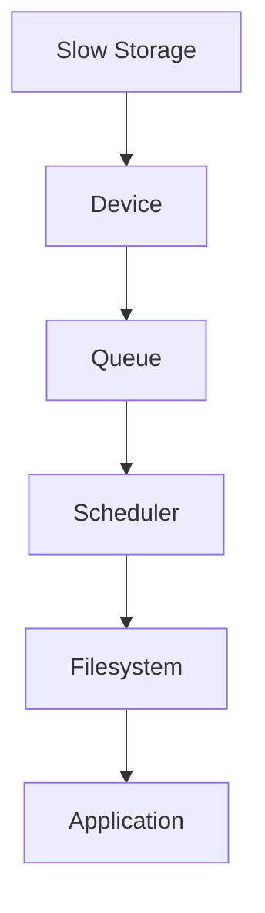

# I/O Scheduler

> The I/O Scheduler is Linux's storage traffic manager.
>
> Great Linux engineers don't think:
>
> "Applications write directly to SSDs."
>
> They think:
>
> "Applications generate thousands of storage requests that Linux intelligently organizes before touching hardware."
>
> The I/O Scheduler decides:
>
> **Who gets access to storage, when, and in what order.**

---

# Why This File Exists

Imagine:

```text
500 Applications

↓

1 SSD
```

Question:

```text
Who goes first?
```

Without a scheduler:

```text
Chaos
```

Linux needs traffic control.

That's why I/O schedulers exist.

---

# Problem It Solves

This file answers:

```text
What is an I/O scheduler?

Why does Linux need it?

How does it work?

How is it similar to CPU scheduling?

Why do SSDs and HDDs behave differently?

Why did Linux create multiple schedulers?

What changed with NVMe?
```

---

# Mental Model: Airport Runway

Imagine an airport.

```text
100 Airplanes

↓

1 Runway
```

Question:

```text
Who lands first?
```

You need:

```text
Queue

Priority

Rules

Optimization
```

Linux storage works similarly.

Applications generate many requests.

Linux organizes them.

---

# First Principles

Storage devices are slower than CPUs.

Very roughly:

```text
CPU

↓

Nanoseconds

RAM

↓

100 ns

NVMe

↓

10-100 microseconds

SSD

↓

100-500 microseconds

HDD

↓

5-15 milliseconds
```

Huge difference.

Linux cannot allow uncontrolled access.

---

# Big Picture Architecture



Memorize this forever.

---

# Where Does The Scheduler Live?

Visual:

```text
Applications

↓

VFS

↓

Filesystem

↓

Page Cache

↓

Block Layer

↓

I/O Scheduler

↓

Driver

↓

SSD/HDD
```

The scheduler lives inside the block layer.

---

# What Is An I/O Scheduler?

Definition:

> An I/O scheduler is a kernel component that decides the order in which storage requests are sent to hardware.

Simple definition:

```text
I/O Scheduler = Storage Traffic Controller
```

---

# Why Not Execute Requests Immediately?

Imagine this.

Applications generate:

```text
Read Block 10

Read Block 5000

Read Block 12

Read Block 8000

Write Block 11
```

If executed randomly:

```text
Very inefficient
```

Linux reorganizes them.

---

# The Three Goals

Every scheduler tries to balance:

```text
Performance

Fairness

Latency
```

Tradeoffs always exist.

---

# Mental Model: Restaurant Kitchen

Customers order food.

Bad kitchen:

```text
Random Cooking
```

Good kitchen:

```text
Group Similar Orders

Prioritize Urgent Orders

Reduce Waste
```

Linux does exactly this.

---

# Data Flow

Suppose:

```bash
echo hello > file.txt
```

Linux flow:

```text
Application

↓

write()

↓

VFS

↓

Filesystem

↓

Page Cache

↓

Block Layer

↓

I/O Scheduler

↓

Hardware
```

---

# Request Queue

Every device has requests waiting.

Visual:

```text
Request Queue

↓

Read 10

Read 500

Write 20

Read 11

Write 21
```

The scheduler reorganizes them.

---

# Request Reordering

Before:

```text
10

500

20

11

21
```

After:

```text
10

11

20

21

500
```

Much better.

---

# Why HDDs Need This More

HDDs have moving parts.

Visual:

```text
Disk Head

↓

Seek

↓

Rotate

↓

Read
```

Moving is expensive.

Scheduler minimizes movement.

---

# HDD Mental Model

Imagine a record player.

Visual:

```text
Head

↓

Move

↓

Read
```

Too much movement:

```text
Slow
```

---

# SSDs Changed Everything

SSDs have:

```text
No Mechanical Head

No Rotation

Fast Parallelism
```

The scheduler matters less.

But not zero.

---

# Sequential vs Random I/O

Sequential:

```text
1

2

3

4

5
```

Random:

```text
4

900

12

87

1000
```

Sequential is faster.

Schedulers try to improve locality.

---

# Historical Linux Schedulers

Linux evolved over time.

Examples:

```text
NOOP

Deadline

CFQ

BFQ

mq-deadline

none
```

---

# NOOP Scheduler

Simple.

Visual:

```text
Requests

↓

FIFO

↓

Device
```

No major optimization.

Good for:

```text
SSDs

Smart Controllers
```

---

# Deadline Scheduler

Goal:

```text
Prevent Starvation
```

Question:

What is starvation?

Example:

```text
Request waits forever
```

Bad.

Deadline assigns expiration times.

Visual:

```text
Request

↓

Timer

↓

Execute Before Deadline
```

---

# CFQ Scheduler

CFQ means:

```text
Completely Fair Queueing
```

Goal:

```text
Fairness
```

Every process gets a turn.

Visual:

```text
Application A

↓

Queue A


Application B

↓

Queue B


Application C

↓

Queue C
```

Linux rotates fairly.

---

# BFQ Scheduler

BFQ means:

```text
Budget Fair Queueing
```

Goal:

```text
Desktop Responsiveness
```

Good for:

```text
Workstations

Laptops
```

---

# Modern Linux: blk-mq

Modern Linux changed architecture.

Old Linux:

```text
One Queue
```

Modern Linux:

```text
Multiple Queues
```

This is called:

```text
blk-mq
```

---

# Modern Architecture



---

# Modern Linux Schedulers

You'll commonly see:

```text
none

mq-deadline

bfq

kyber
```

---

# none Scheduler

This is important.

`none` does NOT mean:

```text
No Scheduling
```

It means:

```text
Minimal Scheduling
```

Useful for:

```text
NVMe
```

because NVMe devices already optimize internally.

---

# mq-deadline

Modern version of deadline.

Optimized for:

```text
Multi Queue Systems
```

Very common.

---

# Kyber Scheduler

Goal:

```text
Latency Control
```

Useful for:

```text
Fast SSDs

NVMe
```

---

# How To See Current Scheduler

Command:

```bash
cat /sys/block/sda/queue/scheduler
```

Example:

```text
mq-deadline [none] bfq
```

Current scheduler:

```text
none
```

---

# Example With NVMe

```bash
cat /sys/block/nvme0n1/queue/scheduler
```

Output:

```text
mq-deadline [none]
```

Very common.

---

# Which Scheduler Should I Use?

## HDD

Usually:

```text
mq-deadline

bfq
```

---

## Desktop SSD

Usually:

```text
bfq

none
```

---

## NVMe Server

Usually:

```text
none

mq-deadline
```

---

# Data Flow Visualization



---

# Production Example: Database Server

Workload:

```text
Thousands Of Queries
```

Pattern:

```text
Random Reads

Random Writes
```

Scheduler matters.

---

# Production Example: Docker Host

Workloads:

```text
Containers

Images

Logs

Volumes
```

Competing workloads.

---

# Production Example: Kubernetes Node

Workloads:

```text
Pods

Images

Logs

Persistent Volumes
```

Many simultaneous requests.

---

# Production Example: AI Server

Workloads:

```text
Datasets

Checkpoints

Models
```

Often sequential.

---

# Performance Considerations

Questions engineers ask:

```text
HDD or NVMe?

Sequential or Random?

Latency Sensitive?

Read Heavy?

Write Heavy?
```

Always understand workload first.

---

# Security Considerations

Storage starvation can become a denial of service problem.

Examples:

```text
Log Flooding

Container Abuse

Disk Exhaustion
```

Monitor storage systems.

---

# Observability Tools

Useful tools:

```bash
iostat

iotop

blktrace

vmstat

lsblk
```

---

# Troubleshooting Workflow

Storage slow?

Ask:

```text
Hardware?

↓

Queue Saturation?

↓

Scheduler?

↓

Filesystem?

↓

Application?
```

Visual:



---

# Common Mistakes

## Mistake 1

Thinking applications talk directly to disks.

Wrong.

---

## Mistake 2

Thinking SSDs make schedulers irrelevant.

Wrong.

---

## Mistake 3

Using HDD recommendations for NVMe.

Wrong.

---

## Mistake 4

Ignoring workload patterns.

Very common.

---

## Mistake 5

Optimizing before measuring.

Always measure first.

---

# Engineering Mindset

Whenever you see storage, visualize:

```text
Application

↓

Filesystem

↓

Page Cache

↓

Block Layer

↓

I/O Scheduler

↓

Driver

↓

Hardware
```

This is how Linux kernel engineers think.

---

# Interview Questions

## Beginner

1. What is an I/O scheduler?

2. Why does Linux need one?

3. Why is HDD optimization important?

4. Why are SSDs different?

---

## Intermediate

5. Explain CFQ.

6. Explain Deadline.

7. Explain BFQ.

8. Explain blk-mq.

---

## Advanced

9. Explain scheduler selection for NVMe.

10. Explain database I/O workloads.

11. Explain storage latency.

12. Explain Linux storage internals.

---

# Cheat Sheet

```text
Storage Pipeline

Application

↓

Filesystem

↓

Page Cache

↓

Block Layer

↓

I/O Scheduler

↓

Driver

↓

Hardware


Goals

Performance

Fairness

Latency


Modern Schedulers

none

mq-deadline

bfq

kyber


Golden Rule

Schedulers optimize requests.

They do not create performance.
```
