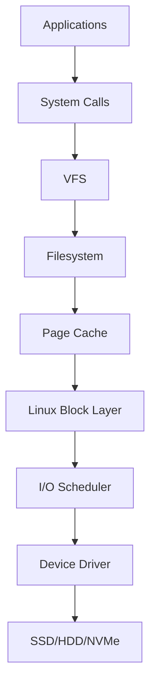
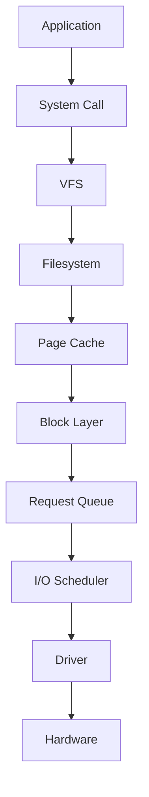
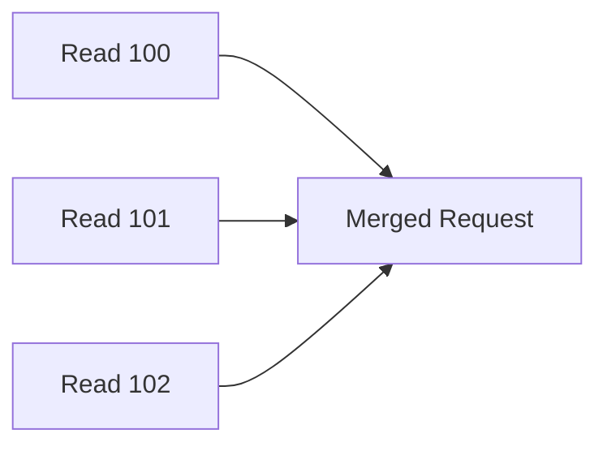
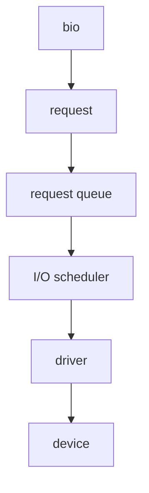
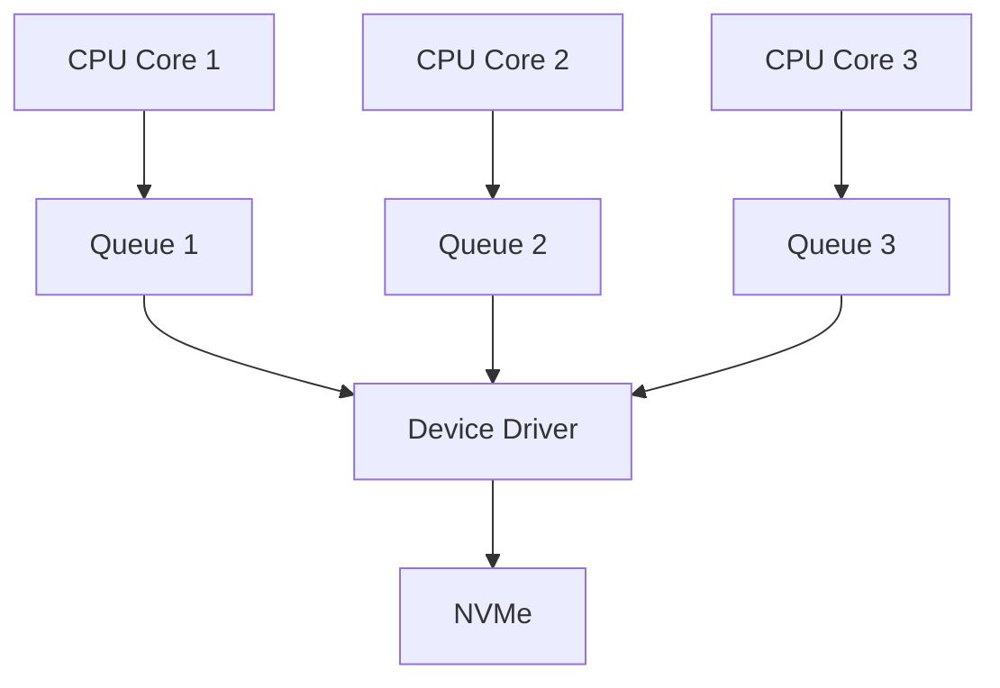
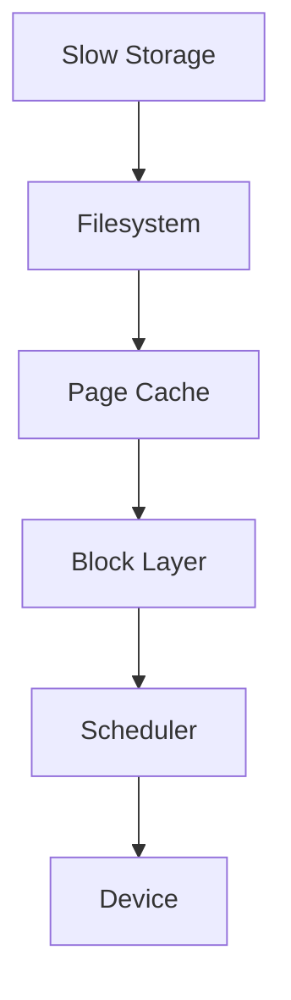

# Linux Block Layer

> The Linux Block Layer is one of Linux's most important engineering systems.
>
> Great Linux engineers don't think:
>
> "Applications write directly to disks."
>
> They think:
>
> "Applications generate I/O requests that flow through multiple kernel subsystems before reaching hardware."
>
> The Linux Block Layer is the traffic control center of storage.

---

# Why This File Exists

Most people imagine this.

```text
Application

↓

SSD
```

Reality:

```text
Application

↓

VFS

↓

Filesystem

↓

Page Cache

↓

Linux Block Layer

↓

I/O Scheduler

↓

Device Driver

↓

Storage Hardware
```

Linux does enormous amounts of work before touching hardware.

This file explains that.

---

# Problem It Solves

This file answers:

```text
What is the Linux Block Layer?

Why does it exist?

Why don't applications talk directly to disks?

How does Linux manage storage requests?

How do millions of storage operations happen efficiently?

Why do databases, Docker, Kubernetes and cloud systems care?
```

---

# Mental Model: A Highway System

Imagine a city.

Thousands of cars.

Question:

```text
Can every car directly enter a factory?
```

No.

Chaos.

You need:

```text
Roads

Traffic Signals

Intersections

Controllers
```

Linux storage is similar.

Applications generate millions of requests.

Linux needs traffic management.

That's the block layer.

---

# First Principles

Question:

How fast are CPUs?

Very fast.

```text
Nanoseconds
```

How fast are storage devices?

Much slower.

```text
Microseconds

Milliseconds
```

Problem:

```text
CPU

↓

Very Fast

Storage

↓

Much Slower
```

Linux needs a mediator.

---

# What Is The Linux Block Layer?

Definition:

> The Linux Block Layer is a kernel subsystem that manages, optimizes, schedules, and delivers storage I/O requests to block devices.

Simple definition:

```text
Block Layer = Storage Traffic Controller
```

---

# What Is A Block Device?

A block device stores data in fixed-size chunks.

Examples:

```text
HDD

SSD

NVMe

RAID

LVM

Cloud Volumes
```

Examples in Linux:

```text
/ dev/sda

/ dev/nvme0n1

/ dev/md0
```

---

# Big Picture Architecture



Memorize this forever.

---

# Why Does Linux Need A Block Layer?

Imagine:

```text
10,000 Applications

↓

1 SSD
```

Question:

```text
Who goes first?
```

Without a block layer:

```text
Chaos
```

The block layer solves this.

---

# The Main Responsibilities

The block layer does several jobs.

```text
Collect Requests

Queue Requests

Merge Requests

Optimize Requests

Schedule Requests

Send Requests
```

---

# Mental Model: Amazon Warehouse

Imagine Amazon.

Orders arrive.

```text
Millions Of Orders
```

Amazon doesn't process randomly.

It:

```text
Collects

Groups

Optimizes

Schedules

Ships
```

Linux does the same.

---

# Data Flow

Suppose:

```bash
echo hello > file.txt
```

Linux flow:

```text
Application

↓

write()

↓

VFS

↓

Filesystem

↓

Page Cache

↓

Block Layer

↓

Storage Device
```

---

# The I/O Request Lifecycle

Visual:



This is one of Linux's most important pipelines.

---

# The Request Queue

Every storage device has a queue.

Visual:

```text
SSD

↓

Request Queue

↓

Request 1

Request 2

Request 3

Request 4
```

Think:

```text
Airport Runway Queue
```

Only one plane can land at a time.

---

# Request Objects

Linux converts operations into requests.

Example:

```text
Read 4KB

Write 8KB

Read 16KB
```

These become kernel request objects.

Visual:

```text
Application Request

↓

Kernel Request

↓

Device Request
```

---

# Request Merging

This is extremely important.

Without merging:

```text
Read Block 100

Read Block 101

Read Block 102
```

Three operations.

Linux merges.

```text
Read Blocks 100-102
```

One operation.

Huge performance improvement.

---

# Visualizing Merging

Before:

```text
Request 1

Request 2

Request 3
```

After:

```text
Large Sequential Request
```

Visual:



---

# Sequential vs Random I/O

Sequential:

```text
1

2

3

4

5
```

Random:

```text
3

90

12

800

5
```

Sequential is faster.

Linux tries to optimize for this.

---

# Why HDD And SSD Behave Differently

HDD:

```text
Mechanical

Seek Time Exists
```

SSD:

```text
Electronic

No Seek Time
```

NVMe:

```text
Massive Parallelism
```

Different devices need different strategies.

---

# Linux Kernel Internals

Inside the kernel, the block layer contains several structures.

Conceptually:

```text
bio

↓

request

↓

queue

↓

driver
```

These are extremely important.

---

# bio Structure

`bio`

means:

```text
Block I/O
```

It represents storage operations.

Example:

```text
Read 4 KB

Write 8 KB
```

---

# request Structure

Linux groups multiple `bio` objects.

Visual:

```text
bio

bio

bio

↓

request
```

---

# Queue Structure

Requests wait here.

Visual:

```text
request

request

request

↓

queue
```

---

# Linux Internal Pipeline



This is extremely important.

---

# Why Databases Care

Databases generate enormous I/O.

Examples:

```text
PostgreSQL

MySQL

MongoDB
```

Every query eventually becomes:

```text
Block Requests
```

---

# Docker Connection

Docker containers create storage requests.

Visual:

```text
Container

↓

OverlayFS

↓

Filesystem

↓

Block Layer
```

---

# Kubernetes Connection

Pods also generate I/O.

Visual:

```text
Pod

↓

Persistent Volume

↓

Filesystem

↓

Block Layer
```

---

# Cloud Connection

Cloud disks are still block devices.

Examples:

```text
AWS EBS

Azure Managed Disk

Google Persistent Disk
```

Eventually:

```text
Cloud Volume

↓

Linux Block Layer
```

---

# Why Modern Linux Changed

Older Linux:

```text
Single Queue
```

Modern Linux:

```text
Multi Queue (blk-mq)
```

Because CPUs have many cores.

---

# blk-mq (Multi Queue)

Visual:

Old:

```text
CPU

↓

One Queue

↓

SSD
```

New:

```text
CPU1

↓

Queue1


CPU2

↓

Queue2


CPU3

↓

Queue3

↓

SSD
```

Much faster.

---

# Multi Queue Architecture



---

# Production Example: Database Server

Thousands of transactions.

```text
Database

↓

Filesystem

↓

Block Layer

↓

NVMe
```

Performance critical.

---

# Production Example: AI Server

Workloads:

```text
Datasets

Models

Checkpoints
```

Generate enormous I/O.

---

# Production Example: Kubernetes Node

Workloads:

```text
Containers

Logs

Images

Volumes
```

All hit the block layer.

---

# Performance Considerations

Questions engineers ask:

```text
Sequential Or Random?

Read Heavy?

Write Heavy?

SSD Or HDD?

How Many Cores?
```

These questions determine performance.

---

# Security Considerations

Storage exhaustion can become attacks.

Examples:

```text
Log Flooding

Disk Exhaustion

Container Abuse
```

Monitor storage systems.

---

# Observability Tools

Useful tools.

```bash
lsblk

iostat

vmstat

iotop

blktrace
```

---

# Troubleshooting Workflow

Storage is slow?

Ask:

```text
Filesystem?

↓

Page Cache?

↓

Block Layer?

↓

Scheduler?

↓

Device?

```

Visual:



---

# Common Mistakes

## Mistake 1

Thinking applications talk directly to disks.

Wrong.

---

## Mistake 2

Thinking SSDs remove the need for optimization.

Wrong.

---

## Mistake 3

Ignoring request queues.

Very important.

---

## Mistake 4

Ignoring workload patterns.

Sequential and random IO behave differently.

---

## Mistake 5

Ignoring multi-queue architecture.

Modern Linux depends heavily on it.

---

# Engineering Mindset

Whenever you see storage, visualize:

```text
Application

↓

VFS

↓

Filesystem

↓

Page Cache

↓

Linux Block Layer

↓

Driver

↓

Hardware
```

That's how Linux kernel engineers think.

---

# Interview Questions

## Beginner

1. What is the Linux Block Layer?

2. Why does it exist?

3. What is a block device?

4. Why don't applications talk directly to disks?

---

## Intermediate

5. Explain request queues.

6. Explain request merging.

7. Explain sequential vs random IO.

8. Explain bio and request structures.

---

## Advanced

9. Explain blk-mq.

10. Explain NVMe optimization.

11. Explain database I/O architecture.

12. Explain Linux storage internals.

---

# Cheat Sheet

```text
Storage Pipeline

Application

↓

VFS

↓

Filesystem

↓

Page Cache

↓

Linux Block Layer

↓

I/O Scheduler

↓

Driver

↓

Hardware


Kernel Objects

bio

↓

request

↓

queue

↓

driver


Golden Rule

Applications never talk to disks.

They generate I/O requests.
```
