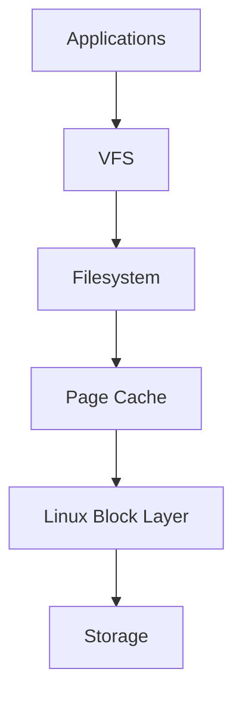
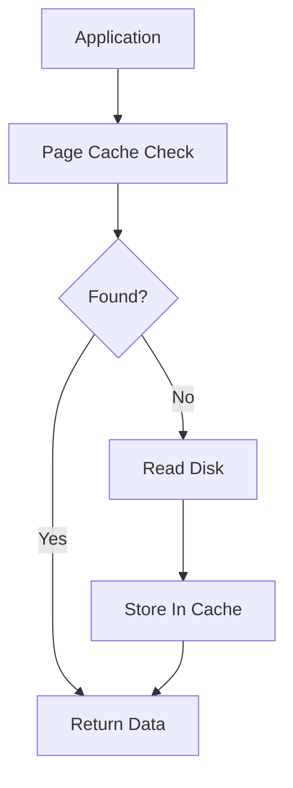
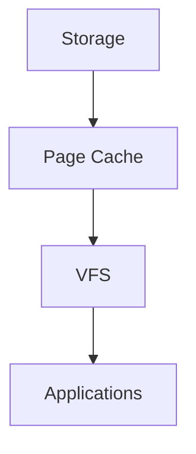
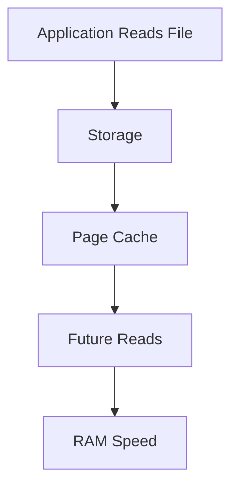
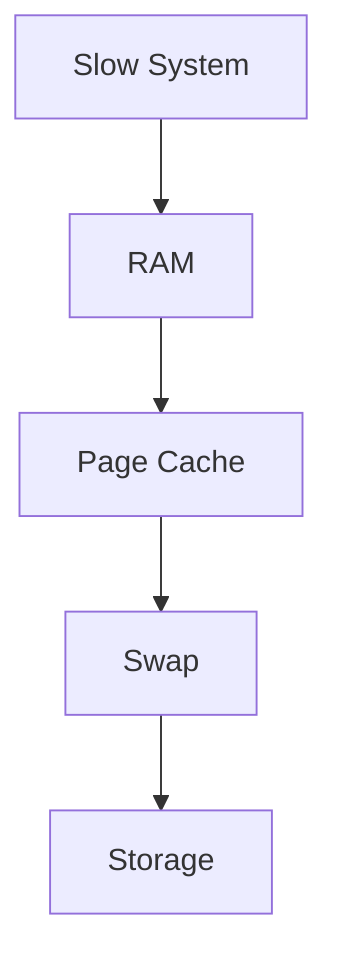

# Page Cache

> Page Cache is one of Linux's greatest performance superpowers.
>
> Great Linux engineers don't think:
>
> "Linux is wasting RAM."
>
> They think:
>
> "Unused RAM is wasted RAM."
>
> Linux aggressively converts free memory into a high-speed storage accelerator.
>
> Page Cache is that accelerator.

---

# Why This File Exists

Almost every beginner eventually sees this.

```bash
free -h
```

Output:

```text
16 GB RAM

15 GB Used
```

Panic.

Question:

```text
Linux is using all my memory!

Is something wrong?
```

Usually:

```text
No.
```

Linux is often using memory for Page Cache.

---

# Problem It Solves

This file answers:

```text
What is Page Cache?

Why does Linux need it?

Why is storage slow?

Why is RAM used for storage?

How do databases interact with it?

How do Docker and Kubernetes use it?

How does Page Cache improve performance?
```

---

# Mental Model: Your Work Desk

Imagine studying.

You have:

```text
Bookshelf

↓

Slow Access
```

and

```text
Desk

↓

Fast Access
```

Books you use frequently stay on your desk.

Linux does the same.

```text
Storage

↓

RAM

↓

Fast Reuse
```

This is Page Cache.

---

# First Principles

Storage is slow.

Approximate speeds:

```text
CPU Cache

↓

1 ns

RAM

↓

100 ns

NVMe

↓

100,000 ns

SSD

↓

500,000 ns

HDD

↓

10,000,000 ns
```

Storage is incredibly slower than RAM.

Problem:

```text
Applications constantly read files.
```

Repeated disk access is expensive.

Linux needed a solution.

---

# The Big Idea

Instead of reading disks repeatedly:

```text
Disk

↓

RAM

↓

Reuse
```

Linux remembers recently accessed data.

That's Page Cache.

---

# What Is Page Cache?

Definition:

> Page Cache is a kernel memory subsystem that stores recently accessed file data in RAM.

Simple definition:

```text
Page Cache = Storage Accelerator
```

---

# Why Is It Called Page Cache?

Linux memory is divided into pages.

Typically:

```text
4 KB
```

Visual:

```text
RAM

↓

Page

↓

Page

↓

Page

↓

Page
```

Linux stores file data inside these pages.

---

# Big Picture Architecture



Memorize this forever.

---

# Without Page Cache

Visual:

```text
Application

↓

Storage

↓

Storage

↓

Storage

↓

Storage
```

Every read hits hardware.

Very slow.

---

# With Page Cache

Visual:

```text
Application

↓

Page Cache

↓

Storage

↓

Page Cache

↓

Page Cache
```

Much faster.

---

# Read Flow

Suppose:

```bash
cat report.txt
```

Linux does:



This is one of Linux's most important optimizations.

---

# Cache Hit

Data already exists.

Visual:

```text
Application

↓

RAM

↓

Done
```

Fast.

---

# Cache Miss

Data not found.

Visual:

```text
Application

↓

Storage

↓

RAM

↓

Done
```

Slower.

---

# Why Linux Loves RAM

Linux follows a philosophy.

```text
Unused RAM

=

Wasted RAM
```

Therefore:

```text
Free RAM

↓

Page Cache
```

Very smart.

---

# The Linux Memory Layout

Visual:

```text
RAM

┌───────────────────┐

│ Kernel Memory     │

├───────────────────┤

│ Applications      │

├───────────────────┤

│ Page Cache        │

├───────────────────┤

│ Free Memory       │

└───────────────────┘
```

This constantly changes.

---

# Dynamic Reclamation

Question:

What if applications need memory?

Linux simply shrinks cache.

Visual:

```text
Application Needs RAM

↓

Remove Old Cache Pages

↓

Give RAM To Application
```

This is automatic.

---

# The Golden Rule

Page Cache is disposable.

Applications are not.

Linux will sacrifice cache first.

---

# Data Flow Example

Suppose:

```bash
python app.py
```

Application loads:

```text
Application

↓

Filesystem

↓

Page Cache

↓

Storage
```

Later reads:

```text
Application

↓

Page Cache
```

No disk needed.

---

# What Gets Cached?

Examples:

```text
Images

Videos

Databases

Libraries

Executables

Text Files

Logs
```

Almost everything.

---

# Linux Internal Pipeline

Visual:



---

# Why Databases Are Special

Databases often build their own caches.

Examples:

```text
PostgreSQL

MySQL

MongoDB
```

Question:

Should Linux cache too?

Sometimes yes.

Sometimes no.

This creates:

```text
Double Caching
```

Very important concept.

---

# PostgreSQL Example

Architecture:

```text
PostgreSQL Buffer Cache

↓

Linux Page Cache

↓

Storage
```

Two cache layers.

---

# Docker Example

Containers share Page Cache.

Visual:

```text
Container A

↓

Shared Page Cache


Container B

↓

Shared Page Cache
```

Very efficient.

---

# Kubernetes Example

Pods also benefit.

Visual:

```text
Pod A

↓

Shared Page Cache


Pod B

↓

Shared Page Cache
```

---

# Cloud Example

Cloud systems rely heavily on Page Cache.

Examples:

```text
Web Servers

API Servers

Microservices
```

Repeated reads become fast.

---

# Why Linux Uses So Much RAM

Question:

```text
16 GB RAM

15 GB Used

Problem?
```

Usually:

```text
No
```

Linux is accelerating storage.

---

# How To See It

Command:

```bash
free -h
```

Example:

```text
buff/cache
```

This is important.

---

# Another Tool

```bash
cat /proc/meminfo
```

Look for:

```text
Cached

Buffers
```

---

# Data Lifecycle

Visual:



---

# Cache Eviction

Question:

What if RAM fills up?

Linux removes:

```text
Old

Unused

Less Important
```

pages.

This is called eviction.

---

# Page Cache vs Buffers

People confuse these.

Page Cache:

```text
File Data
```

Buffers:

```text
Metadata

Filesystem Structures
```

Modern Linux often groups them together.

---

# Performance Considerations

Questions engineers ask:

```text
Cache Hit Rate?

Random IO?

Working Set Size?

Memory Pressure?
```

Huge performance gains come from Page Cache.

---

# Security Considerations

Cached data may remain in RAM.

Sensitive systems often:

```text
Encrypt Storage

Control Memory Access

Restrict Privileges
```

---

# Observability Tools

Useful tools:

```bash
free -h

vmstat

top

htop

cat /proc/meminfo
```

---

# Troubleshooting Workflow

System slow?

Ask:

```text
Memory Pressure?

↓

Cache Thrashing?

↓

Swap Usage?

↓

Storage Slow?

↓

Application Problem?
```

Visual:



---

# Common Mistakes

## Mistake 1

Thinking Linux wastes RAM.

Wrong.

---

## Mistake 2

Clearing cache unnecessarily.

Very common.

---

## Mistake 3

Thinking used RAM is bad.

Wrong.

---

## Mistake 4

Ignoring memory pressure.

Very dangerous.

---

## Mistake 5

Ignoring database double caching.

Important concept.

---

# Engineering Mindset

Whenever you see storage, visualize:

```text
Application

↓

VFS

↓

Filesystem

↓

Page Cache

↓

Block Layer

↓

Storage
```

Page Cache sits between software and hardware.

It is Linux's hidden superpower.

---

# Interview Questions

## Beginner

1. What is Page Cache?

2. Why does Linux use RAM?

3. What is a cache hit?

4. What is a cache miss?

---

## Intermediate

5. Explain Page Cache architecture.

6. Explain cache eviction.

7. Explain dynamic reclamation.

8. Explain Page Cache vs Buffers.

---

## Advanced

9. Explain PostgreSQL double caching.

10. Explain Page Cache in Docker.

11. Explain Kubernetes memory optimization.

12. Explain Linux storage acceleration.

---

# Cheat Sheet

```text
Storage Pipeline

Application

↓

VFS

↓

Filesystem

↓

Page Cache

↓

Block Layer

↓

Storage


Golden Rule

Unused RAM

=

Wasted RAM


Key Concepts

Cache Hit

Cache Miss

Eviction

Reclamation

Memory Pressure


Useful Commands

free -h

vmstat

cat /proc/meminfo


Golden Rule

Linux uses RAM

to make storage fast.
```
