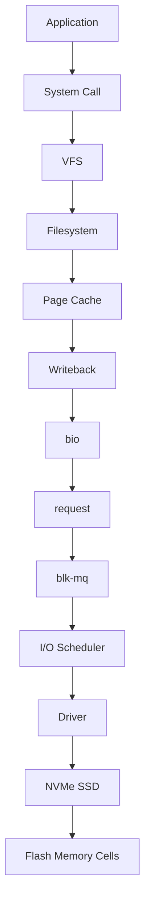
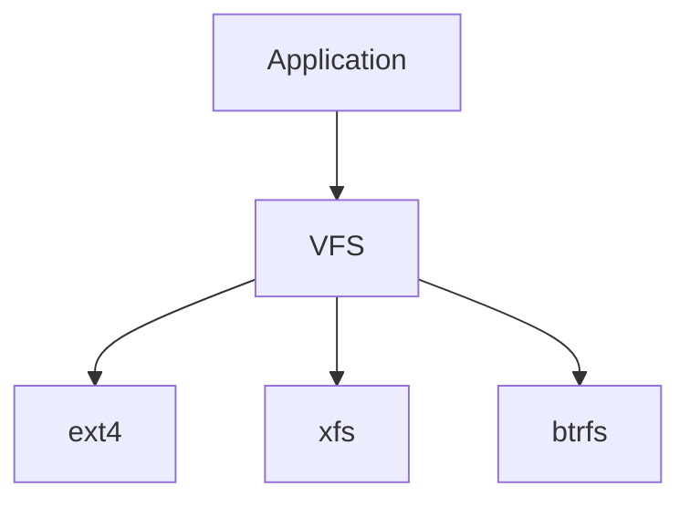
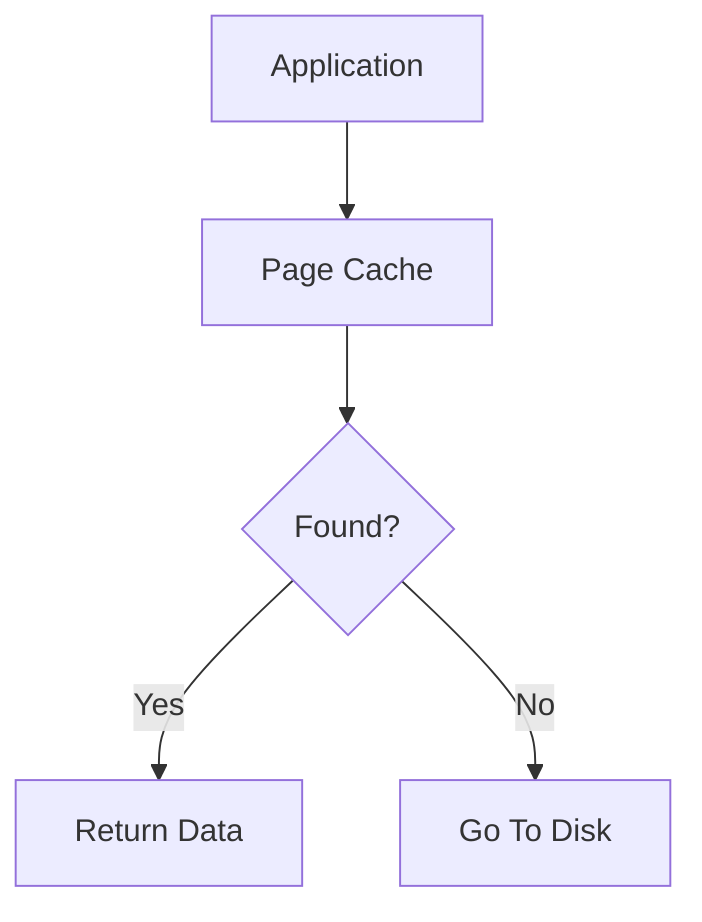
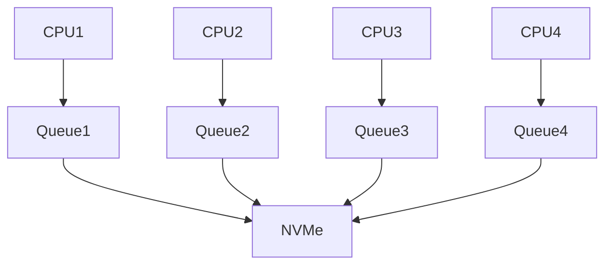
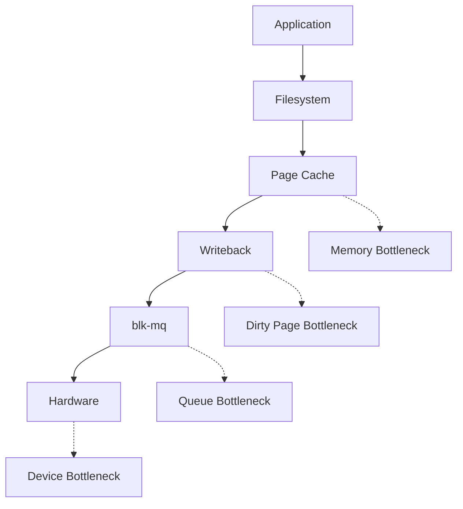
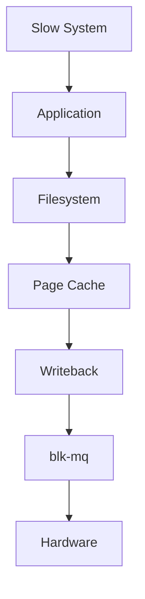

# Storage Data Flow

> Storage is not a disk.
>
> Storage is a journey.
>
> Great Linux engineers don't think:
>
> "Applications write to storage."
>
> They think:
>
> "Data travels through many Linux subsystems before reaching hardware."
>
> Understanding storage means understanding data flow.

---

# Why This File Exists

Most people imagine this.

```text
Application

↓

SSD
```

Reality:

```text
Application

↓

System Call

↓

VFS

↓

Filesystem

↓

Page Cache

↓

Writeback

↓

bio

↓

request

↓

blk-mq

↓

Driver

↓

NVMe

↓

Flash Cells
```

Linux does enormous work.

This file connects everything.

---

# Problem It Solves

This file answers:

```text
How does Linux process reads?

How does Linux process writes?

How do all storage components connect?

Where do bottlenecks happen?

Where do optimizations happen?

How do databases, Docker and Kubernetes fit?
```

---

# Mental Model: Logistics Company

Imagine Amazon.

Buying an item is not:

```text
Click

↓

House
```

It is:

```text
Click

↓

Warehouse

↓

Sorting

↓

Packaging

↓

Truck

↓

Delivery Center

↓

House
```

Linux storage is identical.

---

# First Principles

Storage engineering exists because hardware is slow.

Approximate speeds:

```text
CPU Cache

↓

1 ns

RAM

↓

100 ns

NVMe

↓

100,000 ns

SSD

↓

500,000 ns

HDD

↓

10,000,000 ns
```

Linux must bridge this speed gap.

---

# The Entire Storage Pipeline

Memorize this forever.

```text
Application

↓

System Call

↓

VFS

↓

Filesystem

↓

Page Cache

↓

Writeback

↓

bio

↓

request

↓

blk-mq

↓

Driver

↓

Storage Device
```

This is Linux storage.

---

# The Master Architecture



Memorize this.

---

# Layer 1: Application Layer

Everything starts here.

Examples:

```bash
echo hello > notes.txt

cat notes.txt

cp movie.mp4 backup/

docker pull nginx
```

Applications never touch disks.

---

# Layer 2: System Calls

Applications ask the kernel.

Examples:

```text
open()

read()

write()

close()

fsync()
```

Think:

```text
User Space

↓

Kernel Space
```

Bridge.

---

# Layer 3: VFS

VFS means:

```text
Virtual Filesystem Switch
```

Question:

Why?

Because Linux supports many filesystems.

Examples:

```text
ext4

xfs

btrfs

tmpfs
```

VFS creates one interface.

---

# VFS Visual



---

# Layer 4: Filesystem

The filesystem organizes data.

Responsibilities:

```text
Directories

Files

Metadata

Permissions

Allocation
```

Examples:

```text
ext4

xfs

btrfs
```

---

# Layer 5: Page Cache

Linux checks RAM first.

Question:

Is data already here?

Visual:



This is one of Linux's biggest optimizations.

---

# Layer 6: Writeback

Writes don't usually go directly to disk.

Visual:

```text
Application

↓

RAM

↓

Dirty Pages

↓

Disk Later
```

This is asynchronous writing.

---

# Layer 7: bio

bio means:

```text
Block I/O
```

bio describes work.

Examples:

```text
Read

Write

Sector

Memory Location
```

Think:

```text
I/O Description
```

---

# Layer 8: request

Linux groups bios.

Visual:

```text
bio

bio

bio

↓

request
```

Think:

```text
Optimized Work Package
```

---

# Layer 9: blk-mq

blk-mq means:

```text
Block Multi Queue
```

Modern Linux distributes work across CPUs.

Visual:



---

# Layer 10: I/O Scheduler

Question:

Who goes first?

Linux optimizes requests.

Goals:

```text
Latency

Fairness

Performance
```

---

# Layer 11: Device Driver

Drivers translate Linux language.

Visual:

```text
Kernel Request

↓

Device Language

↓

Hardware
```

Think:

```text
Translator
```

---

# Layer 12: Hardware

Finally.

Examples:

```text
HDD

SSD

NVMe
```

Actual storage happens here.

---

# Write Flow Example

Suppose:

```bash
echo hello > notes.txt
```

Flow:

```mermaid
flowchart TD

A[Application]

A --> B[write()]

B --> C[VFS]

C --> D[Filesystem]

D --> E[Page Cache]

E --> F[Dirty Page]

F --> G[Writeback]

G --> H[bio]

H --> I[request]

I --> J[blk-mq]

J --> K[Driver]

K --> L[NVMe]
```

---

# Read Flow Example

Suppose:

```bash
cat notes.txt
```

Flow:

```mermaid
flowchart TD

A[Application]

A --> B[read()]

B --> C[VFS]

C --> D[Filesystem]

D --> E[Page Cache]

E --> F{Cache Hit?}

F -->|Yes| G[Return Data]

F -->|No| H[bio]

H --> I[request]

I --> J[blk-mq]

J --> K[Driver]

K --> L[Disk]

L --> M[Store In Cache]

M --> G
```

---

# Mental Model: Restaurant

Think:

```text
Customer

↓

Waiter

↓

Kitchen

↓

Packaging

↓

Delivery

↓

Customer
```

Linux:

```text
Application

↓

VFS

↓

Filesystem

↓

Page Cache

↓

blk-mq

↓

Driver

↓

Hardware
```

---

# The Three Major Optimizations

Linux performs three huge optimizations.

---

## Optimization 1

Page Cache

```text
Disk

↓

RAM
```

---

## Optimization 2

Writeback

```text
Batch Writes
```

---

## Optimization 3

blk-mq

```text
Parallel Queues
```

---

# Data Flow For Databases

Visual:

```text
SQL Query

↓

Filesystem

↓

Page Cache

↓

bio

↓

request

↓

NVMe
```

Millions per second.

---

# Data Flow For Docker

Visual:

```text
Container

↓

OverlayFS

↓

Filesystem

↓

Page Cache

↓

Storage
```

---

# Data Flow For Kubernetes

Visual:

```text
Pod

↓

Persistent Volume

↓

Filesystem

↓

Storage Stack
```

---

# Data Flow For AI Systems

Examples:

```text
Datasets

Embeddings

Checkpoints

Models
```

All follow this pipeline.

---

# Where Bottlenecks Happen

Common bottlenecks:

```text
Page Cache Misses

Writeback Saturation

Queue Saturation

Slow Drivers

Slow Storage
```

---

# Bottleneck Architecture



---

# Performance Thinking

Questions engineers ask:

```text
Where is latency?

Where is waiting?

Where is contention?

Where is saturation?
```

---

# Security Considerations

Attackers can abuse storage.

Examples:

```text
Log Flooding

Container Flooding

Upload Flooding

Storage Exhaustion
```

Observability matters.

---

# Observability Tools

Useful tools:

```bash
iostat

iotop

vmstat

free -h

blktrace

perf
```

Useful files:

```text
/proc/diskstats

/proc/meminfo

/sys/block
```

---

# Troubleshooting Workflow

Storage slow?

Ask:

```text
Application?

↓

Filesystem?

↓

Page Cache?

↓

Writeback?

↓

blk-mq?

↓

Hardware?
```

Visual:



---

# Common Mistakes

## Mistake 1

Thinking applications talk to disks.

Wrong.

---

## Mistake 2

Ignoring Page Cache.

Huge optimization.

---

## Mistake 3

Ignoring writeback.

Very important.

---

## Mistake 4

Ignoring blk-mq.

Critical for NVMe.

---

## Mistake 5

Optimizing hardware before finding bottlenecks.

Wrong order.

---

# Engineering Mindset

Whenever you see storage, visualize:

```text
Application

↓

VFS

↓

Filesystem

↓

Page Cache

↓

Writeback

↓

bio

↓

request

↓

blk-mq

↓

Driver

↓

Hardware
```

That's how Linux kernel engineers think.

---

# Interview Questions

## Beginner

1. Explain Linux storage flow.

2. Why doesn't Linux directly use disks?

3. Why does Page Cache exist?

4. Why does writeback exist?

---

## Intermediate

5. Explain bio.

6. Explain request.

7. Explain blk-mq.

8. Explain VFS.

---

## Advanced

9. Design a storage data flow for PostgreSQL.

10. Explain Kubernetes storage flow.

11. Explain Linux performance bottlenecks.

12. Explain storage architecture.

---

# Cheat Sheet

```text
Complete Pipeline

Application

↓

System Call

↓

VFS

↓

Filesystem

↓

Page Cache

↓

Writeback

↓

bio

↓

request

↓

blk-mq

↓

Driver

↓

Hardware


Three Big Optimizations

Page Cache

Writeback

blk-mq


Golden Rule

Storage is not hardware.

Storage is a data pipeline.
```
