# Linux Storage Internals Visual Atlas

> This file is a visual revision atlas.
>
> Use it after studying all Linux Storage Internals files.
>
> Goal:
>
> Build intuition, not memorization.
>
> Great Linux engineers can visualize storage before they optimize storage.

---

# Visual 1: The Entire Linux Storage Universe

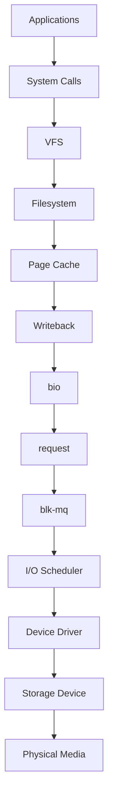

---

# Visual 2: Read Data Flow

```mermaid
flowchart TD

A[Application]

A --> B[read()]

B --> C[VFS]

C --> D[Filesystem]

D --> E[Page Cache]

E --> F{Cache Hit?}

F -->|Yes| G[Return Data]

F -->|No| H[bio]

H --> I[request]

I --> J[blk-mq]

J --> K[Driver]

K --> L[Disk]

L --> M[Store In Cache]

M --> G
```

---

# Visual 3: Write Data Flow

```mermaid
flowchart TD

A[Application]

A --> B[write()]

B --> C[VFS]

C --> D[Filesystem]

D --> E[Page Cache]

E --> F[Dirty Page]

F --> G[Writeback]

G --> H[bio]

H --> I[request]

I --> J[blk-mq]

J --> K[Driver]

K --> L[Storage]
```

---

# Visual 4: User Space vs Kernel Space

```text
┌────────────────────────────┐

        USER SPACE

 Applications

 Browser

 Docker

 PostgreSQL

 Python

 Node.js

└────────────────────────────┘

             │

         System Call

             │

┌────────────────────────────┐

       KERNEL SPACE

 VFS

 Filesystem

 Page Cache

 Writeback

 Block Layer

 Driver

└────────────────────────────┘

             │

       Physical Hardware
```

---

# Visual 5: The Storage Stack

```text
Applications

↓

System Calls

↓

VFS

↓

Filesystem

↓

Page Cache

↓

Writeback

↓

bio

↓

request

↓

blk-mq

↓

I/O Scheduler

↓

Driver

↓

Device Controller

↓

Storage Hardware
```

---

# Visual 6: VFS Architecture

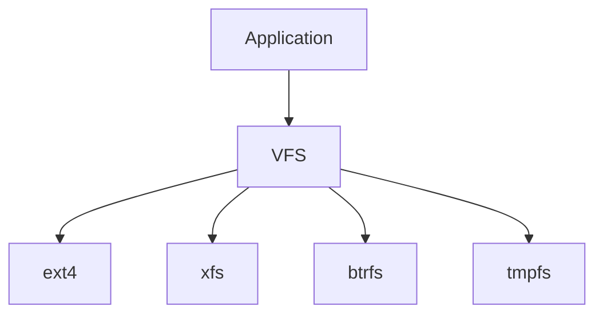

Mental model:

```text
Universal Translator
```

---

# Visual 7: Filesystem Responsibilities

```text
Filesystem

├── File Names

├── Directories

├── Permissions

├── Metadata

├── Allocation

├── Journaling

└── Organization
```

---

# Visual 8: Page Cache Architecture

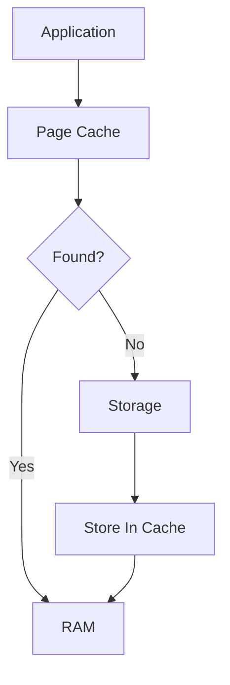

Mental model:

```text
Storage Accelerator
```

---

# Visual 9: Memory Layout

```text
RAM

┌─────────────────────┐

│ Kernel Memory       │

├─────────────────────┤

│ Applications        │

├─────────────────────┤

│ Page Cache          │

├─────────────────────┤

│ Free Memory         │

└─────────────────────┘
```

---

# Visual 10: Dirty Pages

```text
Storage

↓

Page Cache

↓

Application Modifies Data

↓

Dirty Page

↓

Writeback

↓

Storage Updated
```

---

# Visual 11: Clean vs Dirty Pages

```text
Clean Page

RAM

=

Disk


Dirty Page

RAM

≠

Disk
```

---

# Visual 12: Writeback Pipeline

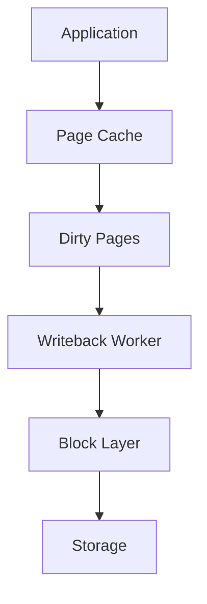

---

# Visual 13: bio Lifecycle

```text
Application

↓

Read 4 KB

↓

bio

↓

Request Description
```

bio answers:

```text
What?

Where?

How Much?

Read Or Write?
```

---

# Visual 14: request Lifecycle

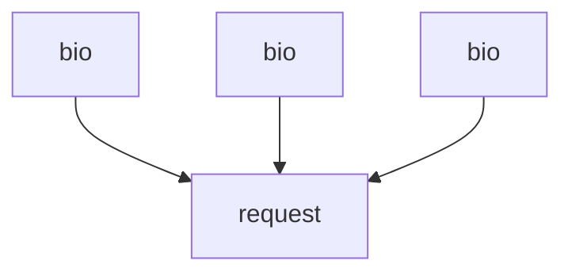

Mental model:

```text
Many Small Tasks

↓

One Optimized Task
```

---

# Visual 15: bio vs request

```text
bio

↓

Describe Work


request

↓

Optimize Work
```

---

# Visual 16: Linux Storage Evolution

```text
Generation 1

Application

↓

Disk


Generation 2

Application

↓

Filesystem

↓

Disk


Generation 3

Application

↓

Page Cache

↓

Block Layer

↓

Disk


Generation 4

Application

↓

Page Cache

↓

blk-mq

↓

NVMe
```

---

# Visual 17: Old Linux Architecture

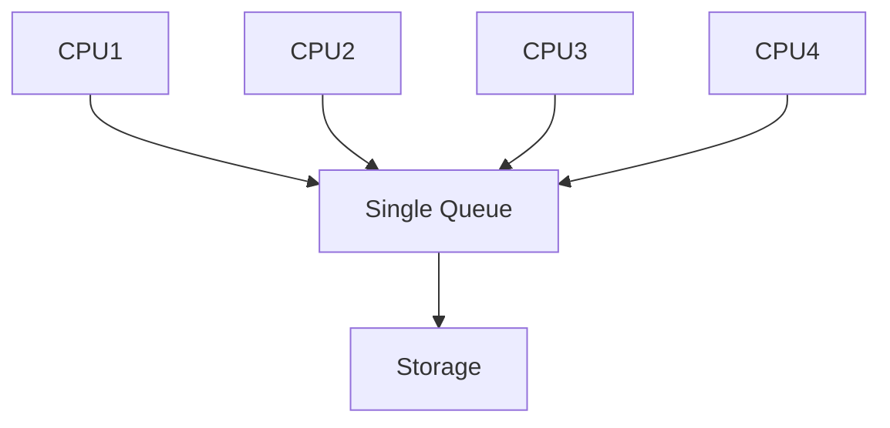

Problem:

```text
Contention
```

---

# Visual 18: Modern blk-mq Architecture

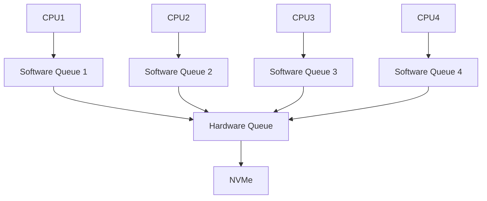

---

# Visual 19: CPU Affinity

```text
CPU Core

↓

Queue

↓

Driver

↓

Hardware Queue

↓

NVMe
```

Goal:

```text
Stay Local

Reduce Synchronization
```

---

# Visual 20: I/O Scheduler Architecture

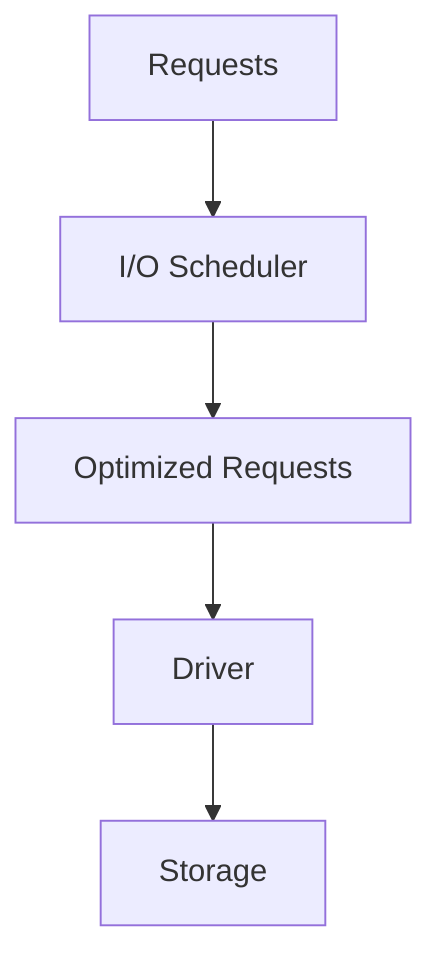

Goals:

```text
Performance

Latency

Fairness
```

---

# Visual 21: HDD vs SSD vs NVMe

```text
HDD

Mechanical

1 Head

Seek Time


SSD

Electronic

Parallel


NVMe

Massively Parallel

Thousands Of Queues
```

---

# Visual 22: Docker Storage Flow

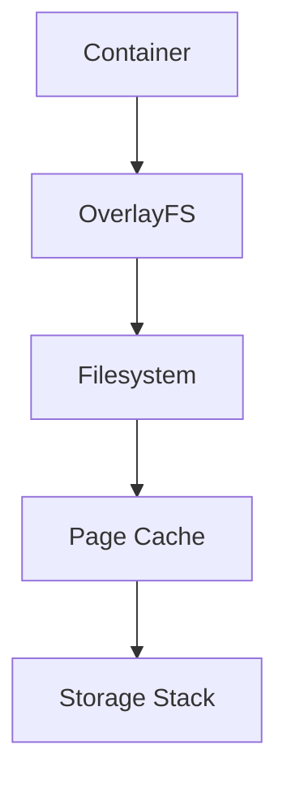

---

# Visual 23: Kubernetes Storage Flow

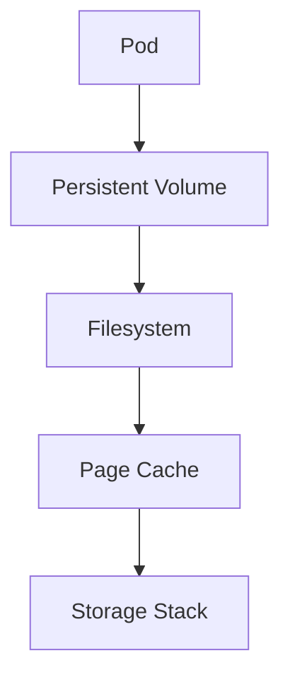

---

# Visual 24: PostgreSQL Storage Flow

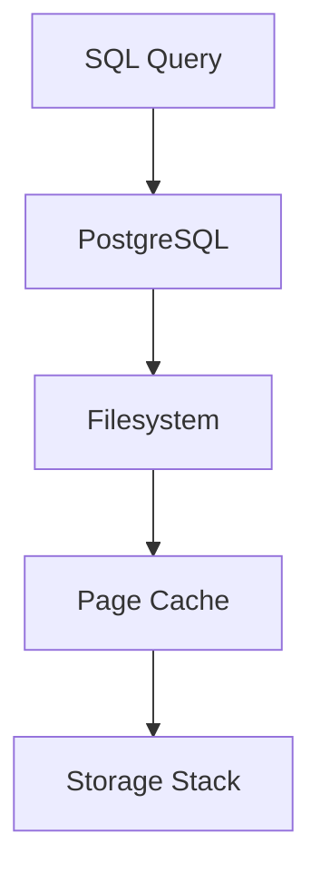

---

# Visual 25: AI Storage Flow

```text
Dataset

↓

Filesystem

↓

Page Cache

↓

blk-mq

↓

NVMe


Model

↓

Checkpoint

↓

Storage
```

---

# Visual 26: Storage Bottleneck Map

```text
Application

↓

Filesystem

↓

Page Cache

↓

Writeback

↓

blk-mq

↓

Driver

↓

Hardware
```

Possible bottlenecks:

```text
CPU

Memory

Cache

Dirty Pages

Queue

Device
```

---

# Visual 27: Linux Storage Layer Responsibilities

```text
Application

↓

Generate Work


VFS

↓

Unify Filesystems


Filesystem

↓

Organize Data


Page Cache

↓

Accelerate Data


Writeback

↓

Persist Data


bio

↓

Describe Work


request

↓

Optimize Work


blk-mq

↓

Parallelize Work


Driver

↓

Translate Work


Hardware

↓

Store Data
```

---

# Visual 28: Golden Storage Mental Model

```text
Applications

↓

Generate Data

↓

Linux

↓

Optimizes Data

↓

Hardware

↓

Stores Data
```

---

# Visual 29: The Master Memory Map

```text
CPU

↓

L1 Cache

↓

L2 Cache

↓

L3 Cache

↓

RAM

↓

Page Cache

↓

NVMe

↓

SSD

↓

HDD
```

---

# Visual 30: The Golden Linux Storage Pipeline

Memorize forever.

```text
Application

↓

System Call

↓

VFS

↓

Filesystem

↓

Page Cache

↓

Writeback

↓

bio

↓

request

↓

blk-mq

↓

I/O Scheduler

↓

Driver

↓

Hardware
```

---

# 30 Second Revision

```text
Application

↓

VFS

↓

Filesystem

↓

Page Cache

↓

Writeback

↓

bio

↓

request

↓

blk-mq

↓

Driver

↓

Hardware
```

Remember:

```text
Applications generate work.

Linux optimizes work.

Hardware stores work.
```
