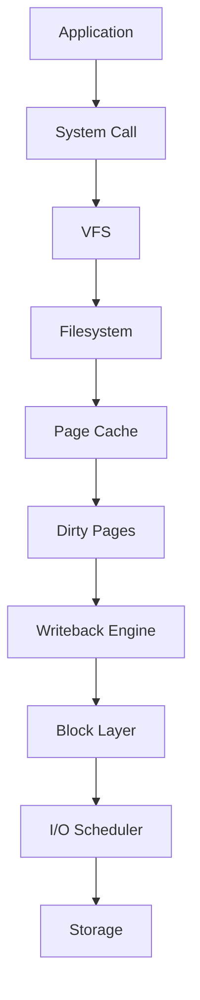
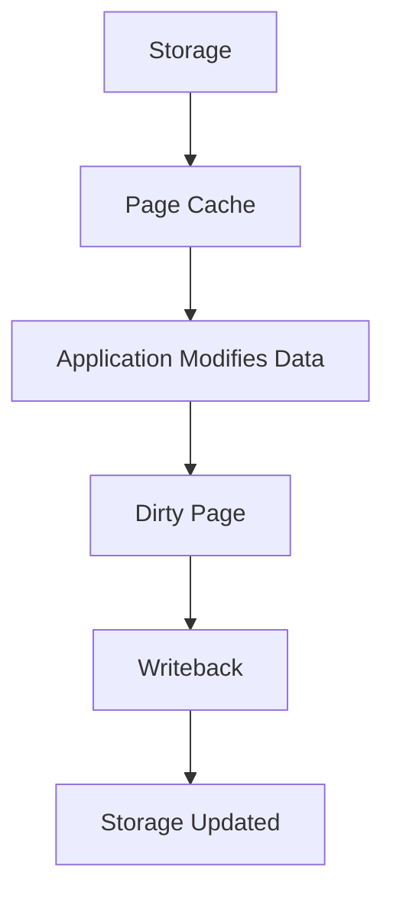
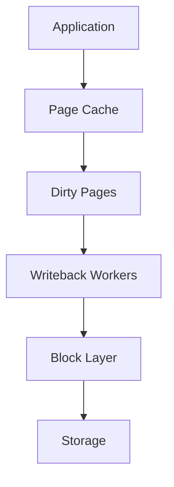
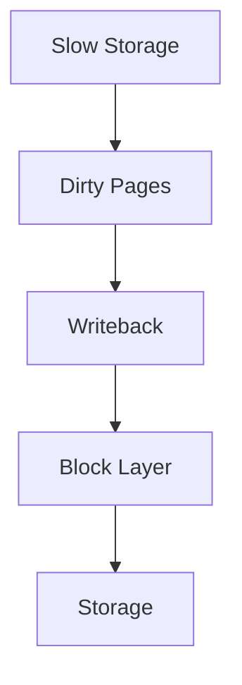

# Writeback Mechanism

> The Writeback Mechanism is one of Linux's hidden superpowers.
>
> Great Linux engineers don't think:
>
> "My application wrote data to disk."
>
> They think:
>
> "My application wrote data to RAM first, and Linux will intelligently persist it to storage later."
>
> Writeback is Linux's asynchronous storage engine.

---

# Why This File Exists

Suppose you run:

```bash
echo "hello" > notes.txt
```

Question:

```text
Did Linux immediately write to disk?
```

Surprising answer:

```text
Usually no.
```

Linux often writes to RAM first.

Then later:

```text
RAM

↓

Disk
```

Question:

```text
Why?
```

Answer:

```text
Performance
```

This file explains that system.

---

# Problem It Solves

This file answers:

```text
What is Writeback?

Why does Linux need it?

How is it connected to Page Cache?

When is data actually written to disk?

What are dirty pages?

Why do databases care?

How does Linux avoid losing data?
```

---

# Mental Model: Postal Service

Imagine writing letters.

Bad system:

```text
Write Letter

↓

Drive To Post Office

↓

Return Home
```

Very inefficient.

Better system:

```text
Write Letters

↓

Collect Them

↓

Deliver In Batches
```

Linux does exactly this.

Applications:

```text
Write Data

↓

Collect Data

↓

Batch Writes

↓

Disk
```

---

# First Principles

Storage is slow.

RAM is fast.

Approximate speeds:

```text
RAM

↓

100 ns

NVMe

↓

100,000 ns

SSD

↓

500,000 ns

HDD

↓

10,000,000 ns
```

Huge difference.

Writing every operation directly to disk is expensive.

Linux needed a better system.

---

# The Big Idea

Instead of:

```text
Application

↓

Disk
```

Linux does:

```text
Application

↓

RAM

↓

Disk Later
```

This is asynchronous writing.

---

# Big Picture Architecture



Memorize this pipeline.

---

# What Is Writeback?

Definition:

> Writeback is the process of moving modified data from Page Cache to persistent storage.

Simple definition:

```text
Writeback = RAM → Disk Synchronization
```

---

# The Write Path

Suppose:

```bash
echo hello > file.txt
```

Linux does:

```text
Application

↓

write()

↓

Page Cache

↓

Mark Dirty

↓

Writeback

↓

Storage
```

---

# Immediate Surprise

Question:

When does `write()` return?

Usually:

```text
After RAM Write
```

NOT:

```text
After Disk Write
```

Very important.

---

# Dirty Pages

One of Linux's most important concepts.

Question:

What is a dirty page?

Definition:

> A page in memory that has changed but has not yet been written to storage.

Visual:

```text
RAM

↓

Modified

↓

Dirty

↓

Needs Writeback
```

---

# Clean vs Dirty Pages

Clean Page:

```text
RAM

=

Disk
```

Dirty Page:

```text
RAM

≠

Disk
```

Very important.

---

# Mental Model: Homework

Imagine:

```text
Notebook

↓

Updated

↓

Not Submitted Yet
```

That's a dirty page.

Once submitted:

```text
Notebook

=

Teacher Copy
```

Now it's clean.

---

# Dirty Page Lifecycle



---

# Why Batch Writes?

Question:

Why not write every change?

Bad:

```text
Write

↓

Disk

↓

Write

↓

Disk

↓

Write

↓

Disk
```

Good:

```text
Write

↓

Write

↓

Write

↓

Batch

↓

Disk
```

Huge performance improvement.

---

# Linux Writeback Daemons

Kernel background workers handle this.

Examples:

```text
flush-8:0

kworker

writeback workers
```

They continuously move data.

---

# What Triggers Writeback?

Several things.

---

# Trigger 1: Too Many Dirty Pages

RAM becomes crowded.

Linux says:

```text
Time To Flush
```

---

# Trigger 2: Time Threshold

Data sat too long.

Linux flushes it.

---

# Trigger 3: Memory Pressure

Applications need RAM.

Linux frees cache.

---

# Trigger 4: Explicit Sync

User requests immediate persistence.

Commands:

```bash
sync
```

or

```bash
fsync()
```

---

# Linux Internal Pipeline

Visual:

```text
Application

↓

Page Cache

↓

Dirty Pages

↓

Writeback Queue

↓

Block Layer

↓

Storage
```

---

# sync vs fsync

People confuse these constantly.

---

# sync

Flush everything.

```text
Entire System
```

---

# fsync()

Flush one file.

```text
Specific File
```

---

# fdatasync()

Flush file data only.

Less metadata.

Often faster.

---

# The Durability Problem

Question:

What if power fails?

Visual:

```text
Application

↓

RAM

↓

Power Loss

↓

Data Lost
```

Possible.

This is why durability matters.

---

# Databases Care Deeply

Databases cannot trust:

```text
Eventually Written
```

They need:

```text
Guaranteed Written
```

This is why databases frequently call:

```text
fsync()
```

Examples:

```text
PostgreSQL

MySQL

MongoDB
```

---

# PostgreSQL Example

Visual:

```text
Database

↓

WAL

↓

fsync()

↓

Storage
```

Durability first.

---

# Docker Example

Containers also depend on writeback.

Visual:

```text
Container

↓

OverlayFS

↓

Page Cache

↓

Writeback

↓

Storage
```

---

# Kubernetes Example

Pods generate enormous writes.

Examples:

```text
Logs

Volumes

Checkpoints
```

Eventually:

```text
Page Cache

↓

Writeback
```

---

# AI Workloads

AI systems write:

```text
Models

Embeddings

Datasets

Checkpoints
```

Writeback becomes important.

---

# Cloud Connection

Cloud disks still use Linux internals.

Examples:

```text
AWS EBS

Azure Managed Disk

Google Persistent Disk
```

Eventually:

```text
Writeback

↓

Cloud Volume
```

---

# Linux Tunables

Useful settings:

```text
dirty_background_ratio

dirty_ratio

dirty_expire_centisecs

dirty_writeback_centisecs
```

These control writeback behavior.

---

# dirty_background_ratio

Threshold to start background writeback.

Example:

```text
10%
```

---

# dirty_ratio

Maximum dirty memory allowed.

Example:

```text
20%
```

---

# dirty_expire_centisecs

How old dirty pages can become.

---

# dirty_writeback_centisecs

How often background flushing occurs.

---

# See Current Values

Commands:

```bash
sysctl vm.dirty_ratio

sysctl vm.dirty_background_ratio
```

or

```bash
cat /proc/sys/vm/dirty_ratio
```

---

# Data Flow Visualization



---

# Performance Considerations

Questions engineers ask:

```text
How many writes?

Sequential or random?

Dirty page growth?

Storage speed?

Memory pressure?
```

Writeback directly affects performance.

---

# Security Considerations

Question:

What if RAM contains secrets?

Remember:

```text
Dirty Pages

↓

Sensitive Data
```

Protect systems properly.

---

# Observability Tools

Useful tools:

```bash
vmstat

iostat

sar

iotop

free -h
```

Useful files:

```text
/proc/meminfo

/proc/vmstat
```

---

# Troubleshooting Workflow

System slow?

Ask:

```text
Dirty Pages Growing?

↓

Memory Pressure?

↓

Storage Slow?

↓

Writeback Saturated?

↓

Application Too Aggressive?
```

Visual:



---

# Common Mistakes

## Mistake 1

Thinking write() means disk write.

Wrong.

---

## Mistake 2

Ignoring dirty pages.

Very important.

---

## Mistake 3

Ignoring durability requirements.

Critical for databases.

---

## Mistake 4

Clearing caches unnecessarily.

Wrong optimization.

---

## Mistake 5

Ignoring memory pressure.

Very common.

---

# Engineering Mindset

Whenever an application writes data, visualize:

```text
Application

↓

Page Cache

↓

Dirty Pages

↓

Writeback

↓

Block Layer

↓

Storage
```

That's how Linux kernel engineers think.

---

# Interview Questions

## Beginner

1. What is Writeback?

2. What are dirty pages?

3. Why does Linux delay disk writes?

4. Why is RAM involved?

---

## Intermediate

5. Explain write() vs fsync().

6. Explain dirty pages.

7. Explain writeback triggers.

8. Explain Page Cache interaction.

---

## Advanced

9. Explain PostgreSQL durability.

10. Explain Linux durability guarantees.

11. Explain writeback tuning.

12. Explain Linux storage internals.

---

# Cheat Sheet

```text
Write Path

Application

↓

Page Cache

↓

Dirty Pages

↓

Writeback

↓

Storage


Key Concepts

Dirty Pages

Batch Writes

sync

fsync

Durability


Golden Rules

write() ≠ Disk Write

Dirty Pages Need Flushing

Databases Require fsync()
```
