# Cloud Storage Fundamentals

> **Cloud storage is distributed Linux storage exposed as a service.**

This single sentence will save you years of confusion.

Many people think:

> Cloud storage is somebody else's hard disk.

This is wrong.

Cloud storage is actually:

> **Thousands of Linux servers, thousands of disks, distributed software, replication algorithms, networking, consensus systems, and failure management systems working together to provide the illusion of a single storage system.**

Cloud storage is where:

```text
Linux

↓

Storage

↓

Networking

↓

Distributed Systems

↓

Reliability Engineering

↓

Cloud Computing
```

all meet together.

---

# Why This Exists

Traditional Linux storage works well.

```text
Application

↓

Filesystem

↓

SSD

↓

Done
```

But modern companies don't run one machine.

They run:

```text
100 Servers

1000 Servers

10000 Servers

100000 Servers
```

Suddenly storage becomes a massive engineering problem.

Questions appear:

```text
What if a server dies?

What if an SSD dies?

What if an entire datacenter dies?

What if a region dies?

How do users access data globally?

How do backups work?

How does data replicate?

Who owns the data?

How do we avoid losing petabytes?
```

Cloud storage exists to solve these problems.

---

# Problem It Solves

Suppose Instagram stores images.

1 million users.

Each uploads:

```text
10 MB
```

Storage:

```text
10 TB
```

Eventually:

```text
100 million users

↓

1 Petabyte+
```

Can one SSD handle this?

No.

Can one server handle this?

No.

Can one datacenter handle this?

Maybe.

Can one region handle this?

Eventually no.

Cloud storage was born because single-machine storage does not scale infinitely.

---

# Mental Model

# Think Of A Global Library

Traditional storage:

```text
One room

↓

One bookshelf

↓

One librarian
```

Cloud storage:

```text
Thousands of libraries

↓

Thousands of bookshelves

↓

Thousands of librarians

↓

One unified system
```

Users don't know where books are stored.

Users simply ask:

```text
Give me my book
```

Cloud storage does the rest.

---

# First Principles

Cloud storage solves 5 major engineering problems.

```text
Capacity

Durability

Availability

Scalability

Accessibility
```

These are the foundations.

---

# Capacity

Problem:

```text
SSD full
```

Solution:

Add more machines.

---

# Durability

Problem:

```text
SSD dies
```

Solution:

Multiple copies.

---

# Availability

Problem:

```text
Server dies
```

Solution:

Serve from another server.

---

# Scalability

Problem:

```text
More users arrive
```

Solution:

Expand infrastructure.

---

# Accessibility

Problem:

```text
Users everywhere
```

Solution:

Global access.

---

# Cloud Storage Is Actually Multiple Systems

Cloud storage is not one thing.

There are three major categories.

```text
Object Storage

Block Storage

File Storage
```

This is one of the most important concepts.

---

# Cloud Storage Landscape

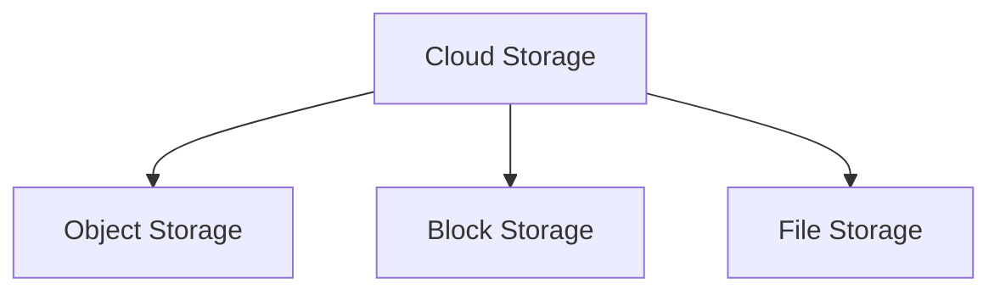

---

# Object Storage

Stores objects.

An object contains:

```text
Data

Metadata

Unique Identifier
```

Examples:

```text
Images

Videos

Documents

Backups

AI datasets
```

Popular services:

```text
Amazon S3

Google Cloud Storage

Azure Blob Storage
```

---

# Block Storage

Acts like a virtual SSD.

Examples:

```text
AWS EBS

Azure Managed Disk

Google Persistent Disk
```

Best for:

```text
Databases

VMs

High-performance applications
```

---

# File Storage

Shared filesystem.

Examples:

```text
AWS EFS

Azure Files

Google Filestore
```

Best for:

```text
Shared directories

CMS

User uploads

Shared assets
```

---

# Visual Comparison

```text
OBJECT STORAGE

Photo.jpg

↓

Object Store

-------------------

BLOCK STORAGE

Filesystem

↓

Blocks

↓

SSD

-------------------

FILE STORAGE

Shared Folder

↓

Multiple Systems
```

---

# Object Storage Deep Dive

Object storage does not have folders.

This surprises many engineers.

This:

```text
photos/2026/image.jpg
```

is actually:

```text
photos/2026/image.jpg
```

as one giant key.

There are no real folders.

Folders are illusions.

---

# Object Storage Mental Model

Think:

```text
Dictionary

Key → Value
```

Example:

```text
Key:

avatars/user123.png

Value:

Binary data
```

---

# Object Storage Architecture

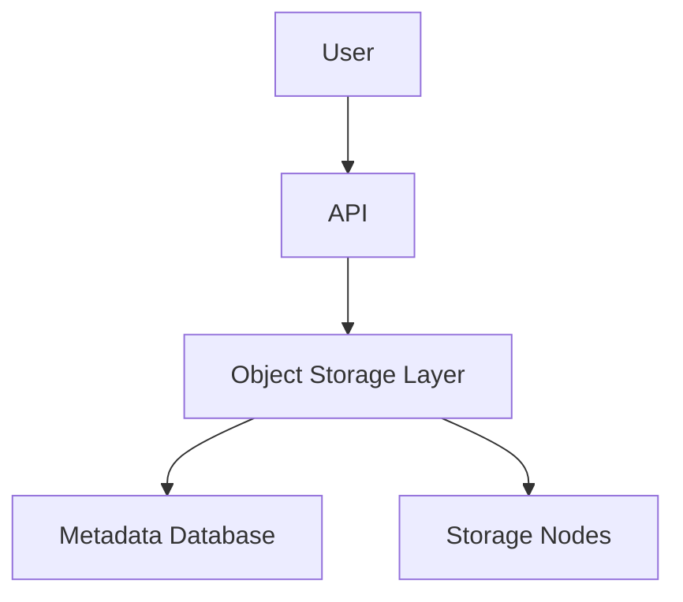

---

# Data Flow

Upload image.

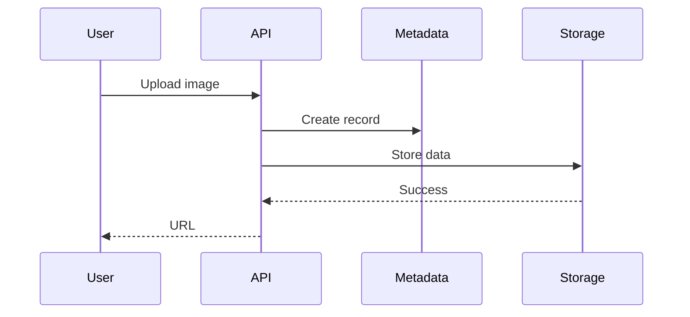

---

# Block Storage Deep Dive

Block storage is closest to Linux storage.

Cloud provider gives:

```text
Virtual SSD
```

Linux sees:

```bash
/dev/xvda
```

or

```bash
/dev/nvme0n1
```

Then Linux creates:

```text
Filesystem

↓

Mount point

↓

Usable storage
```

---

# Block Storage Architecture

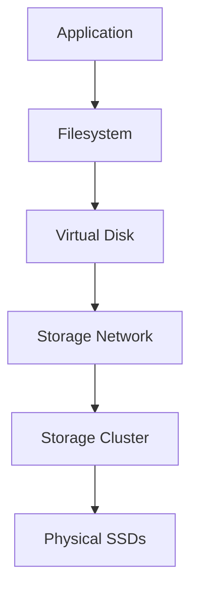

---

# File Storage Deep Dive

Think NFS.

Many servers.

One shared directory.

Visualization:

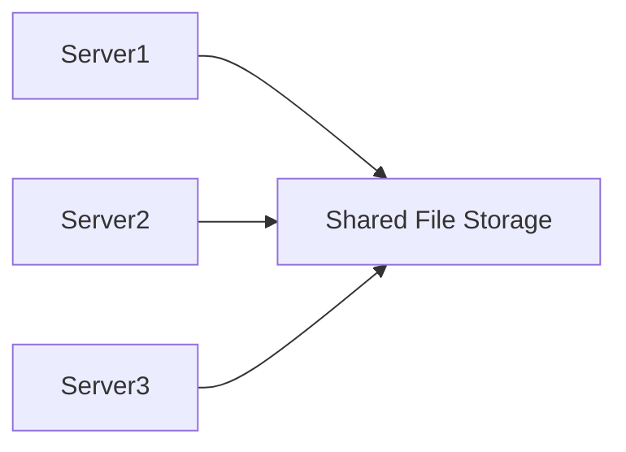

---

# The Hidden Secret

Cloud storage is network storage.

This is extremely important.

Your data path becomes:

```text
Application

↓

Kernel

↓

Network Stack

↓

Network

↓

Storage Cluster

↓

Physical Disk
```

Networking is now part of storage.

---

# Storage Latency Explosion

Traditional Linux:

```text
App

↓

SSD

↓

100 microseconds
```

Cloud:

```text
App

↓

Network

↓

Storage Server

↓

Disk

↓

Milliseconds
```

This changes architecture decisions.

---

# The Cloud Storage Hierarchy

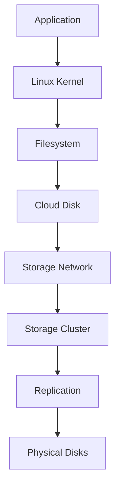

---

# Replication

One copy is dangerous.

Cloud systems create multiple copies.

Example:

```text
Copy 1

Node A

Copy 2

Node B

Copy 3

Node C
```

---

# Visual

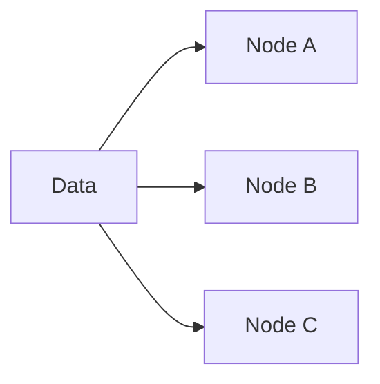

---

# Why Replication Exists

It protects against:

```text
Disk failures

Server failures

Rack failures

Datacenter failures
```

---

# Distributed Storage Clusters

Modern cloud systems look like:

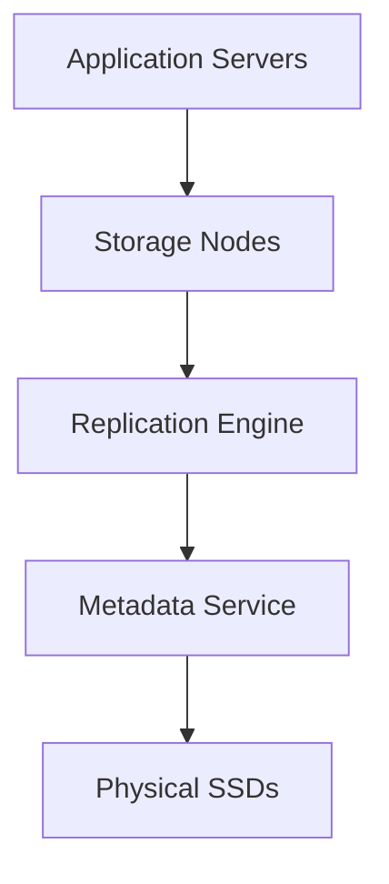

---

# The Hidden Metadata System

Data isn't enough.

Systems also track metadata.

Example:

```text
Owner

Size

Permissions

Location

Checksum

Replication count
```

Metadata often becomes the brain of storage systems.

---

# CAP Theorem Connection

Storage systems are distributed systems.

Three things exist:

```text
Consistency

Availability

Partition Tolerance
```

Cloud providers constantly balance these tradeoffs.

---

# Linux + Cloud Connection

Linux still exists.

Everything still becomes:

```text
Filesystem

↓

Block device

↓

SSD
```

Cloud simply adds many layers.

---

# Docker Connection

Docker volumes often use cloud disks.

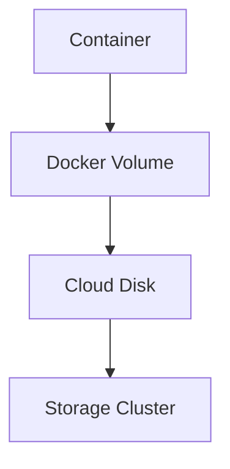

---

# Kubernetes Connection

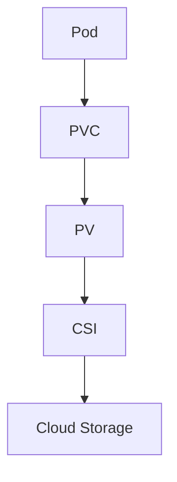

---

# AI Engineering Connection

AI systems consume enormous storage.

Examples:

```text
Training datasets

Checkpoints

Embeddings

Videos

Images

Logs
```

Storage becomes the bottleneck.

---

# Database Connection

Databases need:

```text
Low latency

High IOPS

Predictable performance
```

Databases usually prefer:

```text
Block Storage
```

instead of:

```text
Object Storage
```

---

# Storage Tiers

Companies separate storage.

---

# Hot Storage

Frequently accessed.

Fast.

Expensive.

```text
NVMe
```

---

# Warm Storage

Sometimes accessed.

Moderate cost.

---

# Cold Storage

Rarely accessed.

Cheap.

---

# Visual

```text
Hot

↓

Warm

↓

Cold

↓

Archive
```

---

# Performance Considerations

Always think about:

```text
Latency

Throughput

IOPS

Bandwidth

Replication overhead
```

---

# Security Considerations

Protect:

```text
Encryption at rest

Encryption in transit

IAM permissions

Secrets

Access policies
```

---

# Scaling Considerations

Scaling storage means scaling:

```text
Disks

Servers

Networks

Metadata systems

Replication systems
```

---

# Observability Considerations

Monitor:

```text
Capacity

Growth

Latency

IOPS

Throughput

Errors

Replication lag

Availability
```

Tools:

```text
Prometheus

Grafana

CloudWatch

Azure Monitor

Google Operations Suite
```

---

# Production Examples

## Netflix

```text
Videos

↓

Object Storage

↓

CDN

↓

Users
```

---

## Instagram

```text
Images

↓

Object Storage

↓

Global Delivery
```

---

## PostgreSQL

```text
Database

↓

Block Storage

↓

Replication
```

---

# Troubleshooting Flow

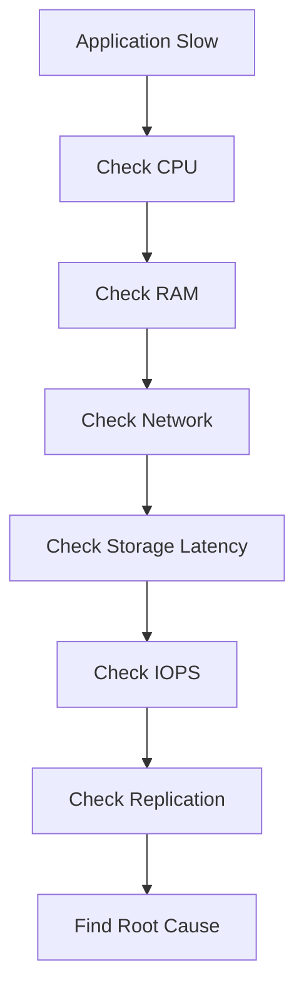

---

# Common Mistakes

### Mistake 1

Thinking cloud storage is a hard disk.

---

### Mistake 2

Ignoring network latency.

---

### Mistake 3

Using object storage for databases.

---

### Mistake 4

Ignoring replication costs.

---

### Mistake 5

Ignoring storage growth.

---

# Engineering Mindset

Beginners think:

> Cloud storage stores files.

Linux engineers think:

> Cloud storage stores blocks.

Cloud engineers think:

> Cloud storage is distributed Linux storage.

Platform engineers think:

> Cloud storage is a data availability system.

Architects think:

> Storage architecture determines business scalability.

---

# Interview Questions

### Beginner

1. What are the three types of cloud storage?

2. Difference between object and block storage?

3. Why is object storage scalable?

4. Why is block storage good for databases?

5. Why does cloud storage need replication?

### Intermediate

6. Why is networking part of cloud storage?

7. How does object storage work internally?

8. Why are metadata systems important?

9. How does Kubernetes connect to cloud storage?

10. Why is latency higher in cloud systems?

### Advanced

11. How would you build a cloud storage system?

12. How would you store petabytes of data?

13. How would you design a multi-region storage architecture?

14. How would you build durable storage?

15. How would you design storage observability for 10000 nodes?

---

# Cheat Sheet

```text
Storage Evolution

Linux Disk

↓

Docker Storage

↓

Kubernetes Storage

↓

Cloud Storage

↓

Distributed Storage


Three Types

Object Storage

Block Storage

File Storage


Golden Rule

Cloud storage

=

Linux storage

+

Networking

+

Replication

+

Distributed Systems
```

This is where storage learning changes from **technologies** into **architectural engineering thinking**.
