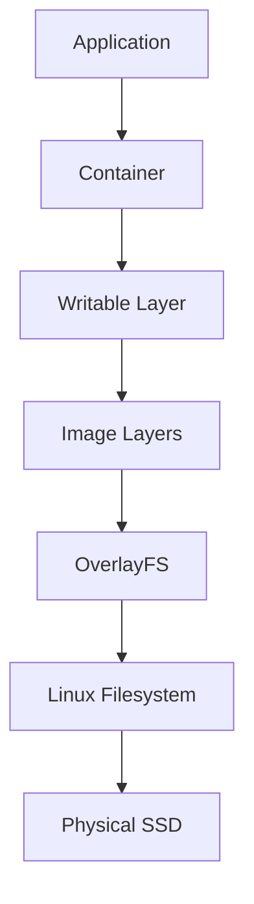
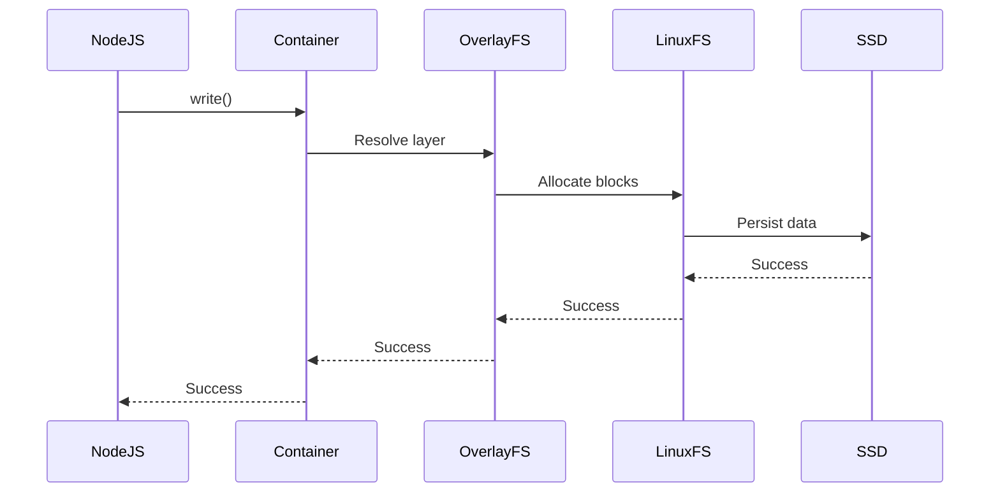
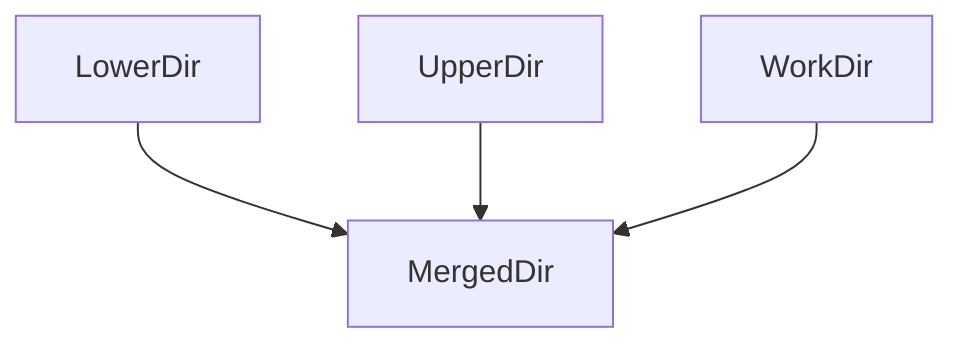
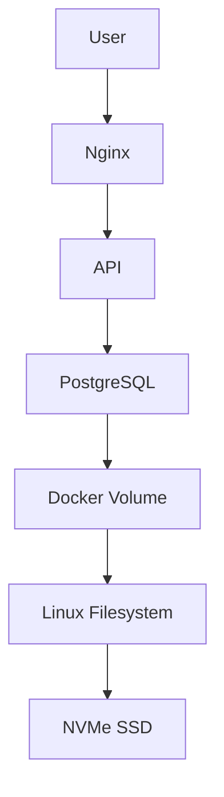
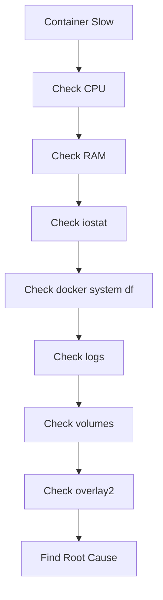

# Storage In Docker

# Why This Exists

Docker is often taught incorrectly.

People teach:

```text
Docker

↓

Images

↓

Containers

↓

Done
```

But engineers eventually discover:

> Docker is actually a Linux storage orchestration system disguised as a container platform.

Many production incidents are actually Docker storage incidents.

Examples:

```text
Disk full

↓

Containers restart

↓

Pods fail

↓

Database corruption

↓

Deployments fail

↓

Entire nodes become unhealthy
```

Storage engineering is one of the most important skills for container engineers.

---

# Problem It Solves

Imagine a world without Docker.

Suppose we have:

```text
100 NodeJS applications
```

Each application needs:

```text
Ubuntu

NodeJS Runtime

npm packages

Libraries

Application code
```

Without Docker:

```text
100 Ubuntu copies

100 NodeJS copies

100 Library copies
```

Huge waste.

Docker solves this by sharing storage.

---

# The Bigger Problem

Docker is trying to answer a difficult engineering question:

> How do we run thousands of isolated applications without duplicating thousands of operating systems?

This is fundamentally a storage optimization problem.

---

# Mental Model

# Think Of LEGO Blocks

Traditional VM:

```text
Application

↓

Full OS

↓

Hypervisor

↓

Hardware
```

Every VM owns everything.

Docker:

```text
Shared Base OS

↓

Shared Libraries

↓

Shared Runtime

↓

Application Layer

↓

Temporary Changes
```

Everything is shared whenever possible.

---

# Visual

```text
VM World

VM1 = Ubuntu + Python + App

VM2 = Ubuntu + Python + App

VM3 = Ubuntu + Python + App


Docker World

Ubuntu

↓

Python

↓

Shared Layer

↓

App1

App2

App3
```

Storage consumption drops dramatically.

---

# First Principles

Every application needs five categories of data.

```text
Executable code

Dependencies

Configuration

Temporary data

Persistent data
```

Docker must solve all five.

Question:

Where should each live?

---

# Temporary vs Persistent Data

This distinction is extremely important.

# Temporary

Lives with container.

Dies with container.

Examples:

```text
Cache

Temporary files

Intermediate data

Build artifacts
```

---

# Persistent

Must survive container death.

Examples:

```text
Database data

Uploads

Logs

Documents

Videos

User profiles
```

Golden rule:

> If users would be angry when data disappears, never store it inside the container layer.

---

# Docker Storage Architecture



This architecture is one of the most important diagrams in container engineering.

---

# Docker Is Linux

Many people think:

```text
Docker = magic
```

Wrong.

Docker is Linux.

Docker is built from Linux primitives.

Docker combines:

```text
Namespaces

cgroups

OverlayFS

iptables

Network namespaces

Bind mounts

Volumes
```

Storage is mostly powered by:

```text
OverlayFS
```

---

# The Real Storage Journey

Suppose NodeJS writes a file.

```javascript
fs.writeFile()
```

What happens?

---

# Internal Flow



Docker is not storing data.

Linux is.

Docker orchestrates Linux.

---

# What Is OverlayFS?

OverlayFS is a Linux union filesystem.

It merges multiple directories.

---

# Mental Model

Imagine transparent papers.

```text
Layer 4 -> Writable Layer

Layer 3 -> Application

Layer 2 -> Python

Layer 1 -> Ubuntu
```

Stack them.

Linux merges them.

Container sees:

```text
/
```

---

# Visual

```text
             Container

                  |

       ----------------------

      |     Writable Layer    |

       ----------------------

      |   Application Layer   |

       ----------------------

      |    Python Runtime     |

       ----------------------

      |      Ubuntu Base      |

       ----------------------

                  |

            OverlayFS

                  |

            Linux Filesystem

                  |

              SSD/NVMe
```

---

# Why OverlayFS Exists

Without it:

```text
Container 1 = 500 MB

Container 2 = 500 MB

Container 3 = 500 MB
```

Storage:

```text
1500 MB
```

With OverlayFS:

```text
Ubuntu = 200 MB

Python = 100 MB

Container 1 = 20 MB

Container 2 = 20 MB

Container 3 = 20 MB
```

Storage:

```text
360 MB
```

Massive savings.

---

# OverlayFS Internals

OverlayFS consists of four directories.

```text
LowerDir

UpperDir

WorkDir

MergedDir
```

---

# LowerDir

Read-only layers.

Contains:

```text
Ubuntu

Python

Libraries

Application code
```

---

# UpperDir

Container changes.

Contains:

```text
Logs

New files

Modified files
```

---

# WorkDir

Internal working directory.

Linux uses it during operations.

---

# MergedDir

Final filesystem.

Container sees this.

---

# OverlayFS Visual



---

# Copy-On-Write (COW)

One of Docker's biggest ideas.

Suppose Ubuntu image contains:

```text
/etc/passwd
```

Container wants to modify it.

Docker does NOT touch Ubuntu.

Instead:

```text
Copy file

↓

Move to UpperDir

↓

Modify copy
```

---

# Visual

```text
Ubuntu Image

/etc/passwd

↓

COPY

↓

UpperDir

↓

Modify

↓

Done
```

Original image remains untouched.

---

# Whiteouts

This is rarely taught.

Suppose container deletes a file.

Question:

Can Docker delete image files?

No.

Images are immutable.

Docker creates a special marker.

Called:

```text
Whiteout
```

Visualization:

```text
Layer1

config.txt

↓

Container deletes file

↓

Whiteout created

↓

File hidden
```

The file still exists underneath.

---

# Where Docker Stores Everything

Usually:

```text
/var/lib/docker
```

Important directories:

```text
overlay2

volumes

containers

image

buildkit

network
```

---

# Visual

```text
/var/lib/docker

├── overlay2

├── volumes

├── containers

├── image

├── buildkit

└── network
```

---

# Containers Directory

Stores:

```text
Logs

Metadata

Container configs
```

Example:

```text
/var/lib/docker/containers
```

---

# overlay2 Directory

Stores:

```text
Image layers

Container layers

Merged layers
```

---

# volumes Directory

Stores:

```text
Persistent storage
```

Example:

```text
postgres_data

mysql_data

uploads_data
```

---

# Docker Volumes

Volumes are Docker-managed storage.

Visualization:


Volumes survive container deletion.

---

# Bind Mounts

Bind mounts connect host folders directly.

Example:

```bash
docker run \
-v /host/uploads:/app/uploads
```

Visualization:

```mermaid
flowchart LR

A[/host/uploads]

B[/app/uploads]

A --> B
```

---

# Bind Mount vs Volume

| Feature             | Bind Mount | Volume |
| ------------------- | ---------- | ------ |
| Docker managed      | ❌          | ✅      |
| Portable            | ❌          | ✅      |
| Security            | Lower      | Higher |
| Production friendly | Medium     | High   |

---

# Anonymous Volumes

Avoid in production.

Example:

```bash
docker run -v /data nginx
```

Docker creates random volume IDs.

Hard to manage.

---

# Data Flow In Modern Applications

Suppose Instagram.



---

# Why Databases Hate Writable Layers

This is one of the most important engineering lessons.

Bad:

```text
PostgreSQL

↓

Writable Layer

↓

OverlayFS

↓

SSD
```

Too much overhead.

Good:

```text
PostgreSQL

↓

Docker Volume

↓

SSD
```

Always use volumes.

---

# Why OverlayFS Is Bad For Databases

Databases perform:

```text
Random reads

Random writes

fsync

WAL writes

Metadata updates
```

OverlayFS adds extra work.

Extra lookups.

Extra copying.

Extra metadata management.

Databases need predictable latency.

---

# Docker Logging Problem

Many engineers crash servers this way.

Logs accumulate here:

```text
/var/lib/docker/containers
```

Example:

```text
100 containers

↓

100 MB/hour

↓

240 GB/day
```

Node crashes.

---

# Configure Log Rotation

```json
{
 "log-driver":"json-file",

 "log-opts":{
   "max-size":"100m",
   "max-file":"3"
 }
}
```

---

# Docker Build Storage Problem

Many engineers ignore BuildKit.

Builds also consume storage.

```text
Source code

↓

Intermediate layers

↓

Caches

↓

Final image
```

Monitor:

```bash
docker builder prune
```

---

# Docker Storage Monitoring Commands

### Check disk usage

```bash
docker system df
```

---

### Detailed

```bash
docker system df -v
```

---

### Check volumes

```bash
docker volume ls
```

---

### Inspect

```bash
docker volume inspect volume_name
```

---

### Storage driver

```bash
docker info
```

Look for:

```text
Storage Driver: overlay2
```

---

### Disk size

```bash
du -sh /var/lib/docker
```

---

# Performance Considerations

Storage bottlenecks often come from:

```text
Millions of tiny files

Too many containers

Huge logs

Databases in writable layers

Slow HDDs

Large images
```

---

# Scaling Considerations

1 container:

```text
Easy
```

100 containers:

```text
Manageable
```

1000 containers:

```text
Storage becomes infrastructure
```

Now you need:

```text
Storage monitoring

Log rotation

Image management

Volume management

Disk alerting

Capacity planning
```

---

# Security Considerations

Never mount:

```text
/

/etc

/var/run/docker.sock
```

Be careful with:

```text
Host bind mounts
```

Because containers can access host files.

---

# Observability Considerations

Monitor:

```text
Volume growth

Image growth

Log growth

Disk latency

Container IOPS

Filesystem usage
```

Tools:

```text
docker system df

iostat

iotop

Prometheus

Grafana

cAdvisor
```

---

# Production Incident Example

Problem:

```text
Node NotReady
```

Investigation:

```text
Disk 100%
```

Cause:

```text
500 GB logs

inside

/var/lib/docker/containers
```

Root cause:

```text
No log rotation
```

---

# Troubleshooting Flow



---

# Engineering Mindset

Beginners think:

> Docker runs applications.

Linux engineers think:

> Docker orchestrates Linux primitives.

Platform engineers think:

> Docker orchestrates Linux storage.

SREs think:

> Every container is a storage consumer.

Architects think:

> Storage architecture determines scalability.

---

# Interview Questions

### Beginner

1. What is OverlayFS?

2. What is Copy-On-Write?

3. What is a Docker volume?

4. Difference between image and container?

5. Difference between bind mount and volume?

### Intermediate

6. Why do databases avoid writable layers?

7. What is `overlay2`?

8. What are whiteouts?

9. Why do Docker logs crash nodes?

10. What is BuildKit storage?

### Advanced

11. How does OverlayFS work internally?

12. How would you architect storage for 1000 containers?

13. How would you monitor Docker storage growth?

14. How would you optimize container storage performance?

15. How would you migrate Docker storage to Kubernetes?

---

# Cheat Sheet

```text
Container

↓

Writable Layer

↓

Image Layers

↓

OverlayFS

↓

Linux Filesystem

↓

SSD


Golden Rules

Never store databases inside writable layers

Always use volumes

Enable log rotation

Monitor /var/lib/docker

Monitor overlay2 growth

Monitor volume growth
```
n.
