# Storage In Kubernetes

> **Docker made storage a host problem. Kubernetes made storage a distributed systems problem.**

This file is one of the most important transitions in your Linux Engineering Handbook.

Many engineers understand:

```text
Linux Storage

↓

Docker Storage
```

Very few understand:

```text
Distributed Storage Engineering
```

Kubernetes storage is where Linux, cloud engineering, networking, distributed systems, reliability engineering, and platform engineering all meet together.

This file is not about memorizing Kubernetes objects.

This file is about learning **how data survives inside distributed systems.**

---

# Why This Exists

Containers are ephemeral.

Pods are even more ephemeral.

Pods are constantly:

```text
Created

Destroyed

Rescheduled

Moved

Replicated

Upgraded
```

Question:

If a PostgreSQL pod dies...

```text
Where does the data go?
```

If a Node crashes...

```text
Who owns the data?
```

If a pod moves to another machine...

```text
How does data follow it?
```

These are Kubernetes storage problems.

---

# The Core Problem Kubernetes Solves

Without Kubernetes:

```text
Server

↓

Application

↓

Local Disk
```

Simple.

But Kubernetes looks like:

```text
Cluster

↓

Multiple Nodes

↓

Multiple Pods

↓

Multiple Storage Systems
```

Now data has become a distributed systems problem.

---

# Mental Model

Think of Kubernetes as a hotel.

```text
Hotel = Cluster

Rooms = Nodes

Guests = Pods

Luggage = Data

Hotel Management = Kubernetes
```

Question:

If a guest changes rooms...

```text
Should luggage stay behind?

Or travel with the guest?
```

Answer:

Travel with the guest.

That's Kubernetes storage.

---

# First Principles

There are only 3 ways data can exist.

### 1. Inside Memory

Fastest.

Temporary.

Dies after restart.

```text
RAM
```

---

### 2. Inside Local Node Storage

Lives on one machine.

```text
Node SSD
```

Dies if node dies.

---

### 3. Inside Distributed Storage

Data survives node failures.

```text
Network Storage
```

This is Kubernetes' preferred solution.

---

# Kubernetes Changes The Storage Problem

Traditional server:

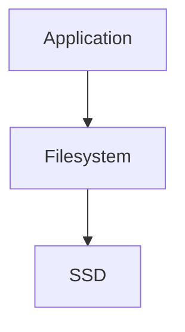

Kubernetes:

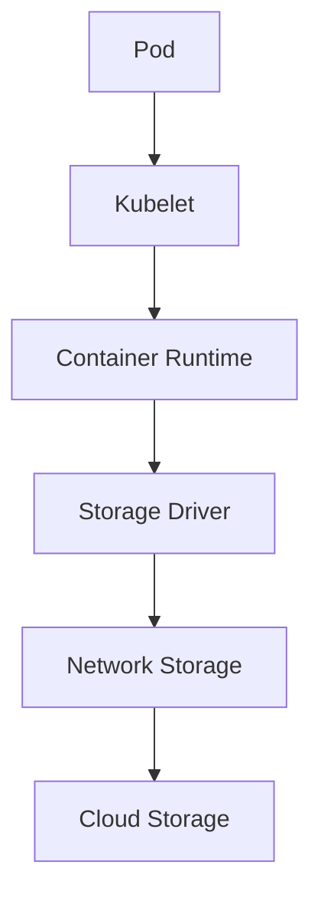

Many more layers exist.

More layers = more complexity.

---

# The Fundamental Rule

Pods are temporary.

Never trust pods.

Never trust containers.

Trust storage.

---

# Wrong Architecture

```text
Pod

↓

Container

↓

Database

↓

Local Filesystem
```

Pod deleted.

Data gone.

---

# Correct Architecture

```text
Pod

↓

Persistent Volume

↓

Storage System

↓

SSD
```

Pod can disappear.

Data survives.

---

# The Kubernetes Storage Stack

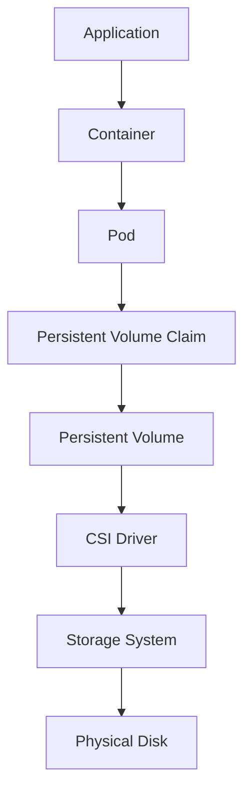

This diagram is extremely important.

Memorize the flow.

---

# The Four Main Components

There are four things every engineer must know.

```text
Pod

PVC

PV

CSI
```

---

# Pod

Temporary workload.

Examples:

```text
Nginx

NodeJS

Python

PostgreSQL

Redis
```

Pods do not own data.

---

# Persistent Volume Claim (PVC)

PVC is a request.

Mental model:

```text
Pod says:

I need 100GB storage.
```

PVC is not storage.

PVC is a request for storage.

---

# Persistent Volume (PV)

Actual storage.

Example:

```text
500GB SSD

AWS EBS

NFS Share

Ceph Storage
```

PV provides storage.

---

# CSI Driver

One of Kubernetes' most important inventions.

CSI:

```text
Container Storage Interface
```

It connects Kubernetes to storage systems.

---

# Mental Model For CSI

Think of a USB adapter.

```text
Laptop

↓

USB Adapter

↓

External SSD
```

CSI is that adapter.

```text
Kubernetes

↓

CSI

↓

Storage Provider
```

---

# Complete Storage Journey

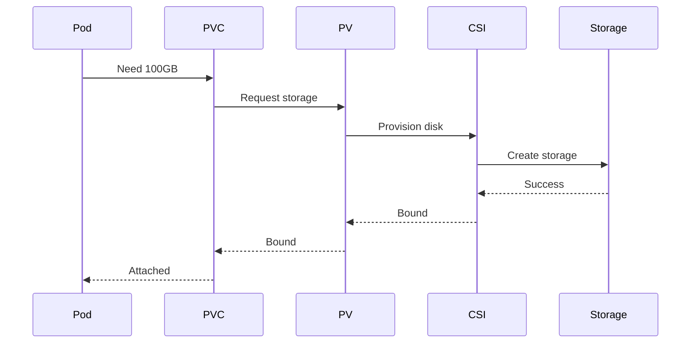

---

# Data Flow When A User Uploads A File

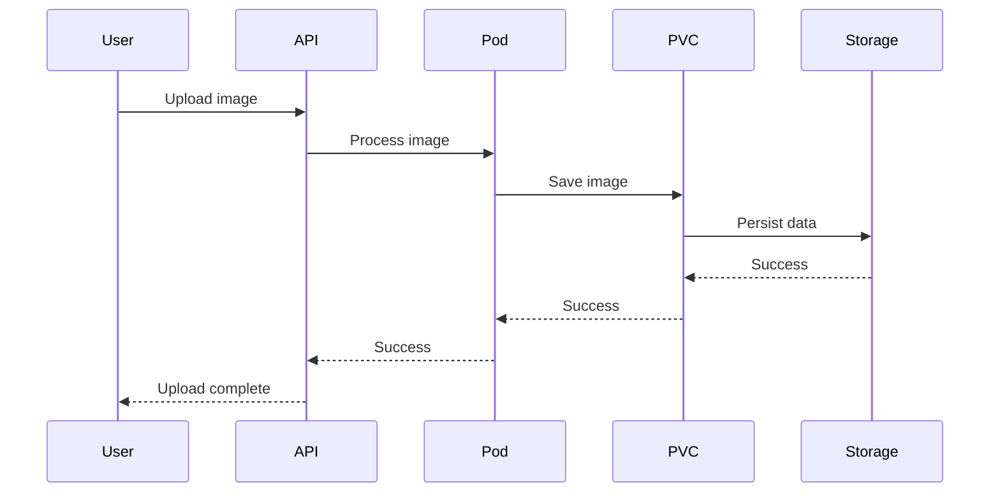

---

# Understanding Storage Classes

StorageClass automates storage creation.

Without StorageClass:

```text
Admin manually creates storage
```

With StorageClass:

```text
Storage created automatically
```

---

# StorageClass Architecture

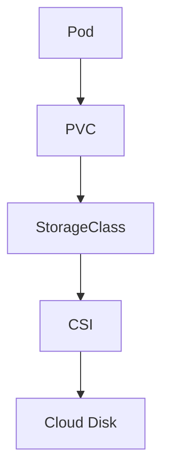

---

# Storage Types In Kubernetes

## 1. emptyDir

Temporary.

Lives only while pod exists.

```text
Pod dies

↓

Data dies
```

Good for:

```text
Cache

Temporary files

Scratch data
```

---

## 2. hostPath

Uses node filesystem.

```text
Pod

↓

Node Disk
```

Problem:

```text
Pod moves

↓

Data unavailable
```

Not recommended for production.

---

## 3. Persistent Volumes

Recommended.

```text
Pod

↓

Persistent Storage
```

---

# Kubernetes Storage Modes

There are three access patterns.

---

# ReadWriteOnce (RWO)

One node can write.

Example:

```text
Single PostgreSQL
```

---

# ReadOnlyMany (ROX)

Many nodes read.

Example:

```text
Static assets
```

---

# ReadWriteMany (RWX)

Multiple nodes read and write.

Example:

```text
Shared storage
```

---

# Kubernetes + Cloud Storage

AWS:

```text
Pod

↓

PVC

↓

EBS

↓

AWS SSD
```

Azure:

```text
Pod

↓

PVC

↓

Managed Disk
```

Google:

```text
Pod

↓

PVC

↓

Persistent Disk
```

---

# Distributed Storage Systems

Large companies rarely depend on single disks.

Common systems:

```text
Ceph

Longhorn

OpenEBS

GlusterFS

Portworx
```

---

# What Is Ceph?

Ceph is distributed storage.

Mental model:

```text
Many disks

↓

One giant storage pool
```

Visualization:

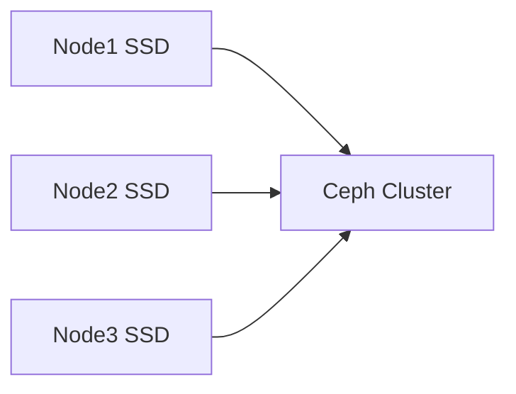

---

# The Three Data Paths In Kubernetes

# Control Plane Path

```text
API Server

↓

Scheduler

↓

PVC Binding
```

---

# Data Plane Path

```text
Application

↓

Pod

↓

Volume

↓

Disk
```

---

# Failure Recovery Path

```text
Node dies

↓

Pod recreated

↓

Volume reattached

↓

Application recovers
```

---

# Pod Rescheduling Visual

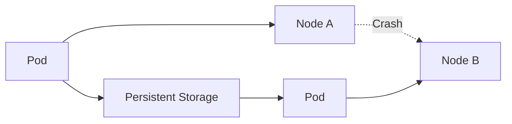

Data stays.

Pod moves.

---

# Why Databases Are Difficult In Kubernetes

Databases hate movement.

Databases want:

```text
Stable disks

Low latency

Predictable IOPS

High throughput
```

Kubernetes wants:

```text
Mobility

Flexibility

Rescheduling

Abstraction
```

These goals conflict.

This is why StatefulSets exist.

---

# StatefulSet

Stateful workloads need identity.

Example:

```text
postgres-0

postgres-1

postgres-2
```

Each pod gets:

```text
Stable identity

Stable storage
```

---

# StatefulSet Visualization

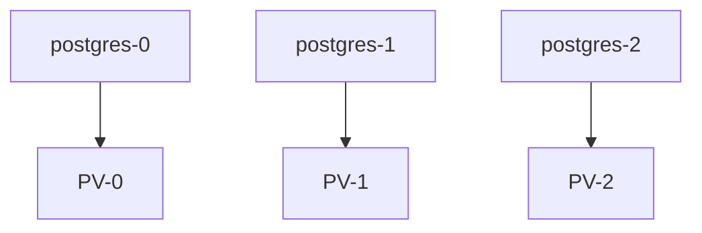

---

# Kubernetes Storage Bottlenecks

Many engineers monitor only CPU.

Wrong.

Storage often becomes the bottleneck.

Watch:

```text
Latency

IOPS

Throughput

Queue depth

Disk utilization
```

Symptoms:

```text
Slow APIs

Slow databases

Pod restarts

CrashLoopBackOff

Readiness failures
```

---

# Production Example: Log Explosion

Problem:

```text
1000 pods

↓

Huge logs

↓

Node disk full
```

Solution:

Centralized logging.

```text
Pods

↓

Fluent Bit

↓

Elasticsearch

↓

Storage Cluster
```

---

# Production Example: Image Pull Storm

Problem:

```text
50 nodes restart

↓

1000 pods scheduled

↓

1000 image pulls

↓

Storage overload
```

Symptoms:

```text
High IOPS

High latency

Pod startup delays
```

---

# Production Example: Database Cluster

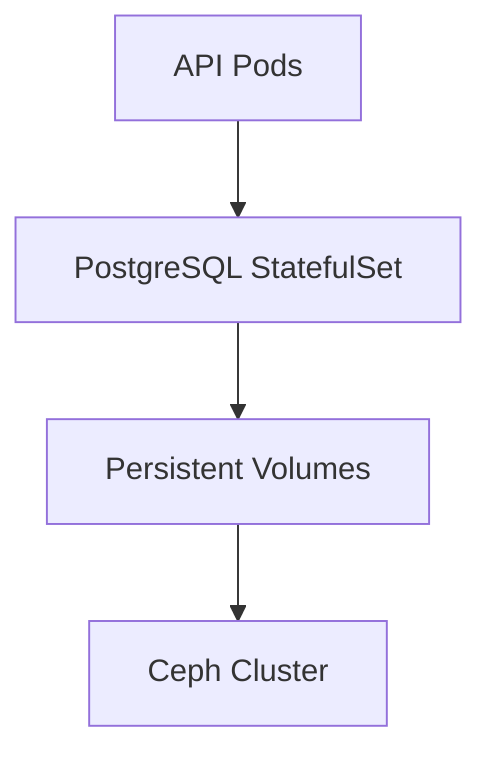

---

# Kubernetes Monitoring For Storage

Monitor:

```text
PVC usage

PV usage

Storage latency

Node disk utilization

StorageClass performance

Volume attachment failures

IOPS

Throughput
```

Tools:

```text
Prometheus

Grafana

Node Exporter

kube-state-metrics
```

---

# Observability Architecture

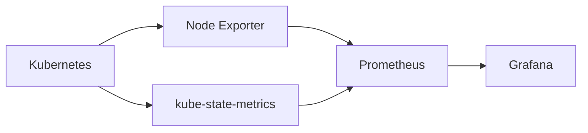

---

# Security Considerations

Avoid:

```text
hostPath

Privileged containers

Mounting root filesystem

Exposing storage credentials
```

Use:

```text
RBAC

Encrypted volumes

Secrets

Least privilege
```

---

# Performance Considerations

Storage decisions determine scalability.

Bad:

```text
Database

↓

Network HDD
```

Good:

```text
Database

↓

NVMe SSD
```

Optimize:

```text
StorageClass

Volume type

Replication strategy

Caching
```

---

# Troubleshooting Workflow

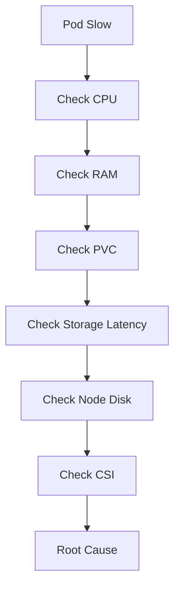

---

# Common Mistakes

### Mistake 1

Treating pods as permanent.

Never do this.

---

### Mistake 2

Using hostPath in production.

---

### Mistake 3

Ignoring storage latency.

---

### Mistake 4

Running databases without StatefulSets.

---

### Mistake 5

Ignoring node storage.

---

### Mistake 6

Not monitoring PVC growth.

---

# Engineering Mindset

Beginners think:

> Pods run applications.

Docker engineers think:

> Containers need storage.

Platform engineers think:

> Applications need persistent data.

Distributed systems engineers think:

> Data must survive infrastructure failures.

Architects think:

> Data ownership determines system design.

---

# Interview Questions

## Beginner

1. Why can't pods store important data?

2. What is a PVC?

3. What is a PV?

4. What is CSI?

5. What is a StorageClass?

---

## Intermediate

6. Difference between emptyDir and Persistent Volume?

7. Why are StatefulSets needed?

8. Why is hostPath dangerous?

9. What is RWO?

10. How do pods survive node failures?

---

## Advanced

11. How does CSI work internally?

12. How would you design storage for a Kubernetes database cluster?

13. How would you build storage observability for 1000 nodes?

14. How would you migrate petabytes of data across clusters?

15. How would you design multi-region Kubernetes storage?

---

# Cheat Sheet

```text
Storage Ownership Hierarchy

Application

↓

Container

↓

Pod

↓

PVC

↓

PV

↓

CSI

↓

Storage System

↓

Physical Disk


Golden Rules

Never trust pods

Never trust containers

Trust persistent storage

Use StatefulSets for databases

Monitor storage continuously
```


This is where Linux storage evolves into **planet-scale infrastructure storage engineering**.
