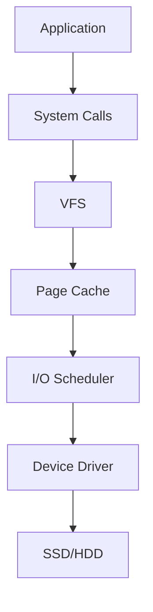
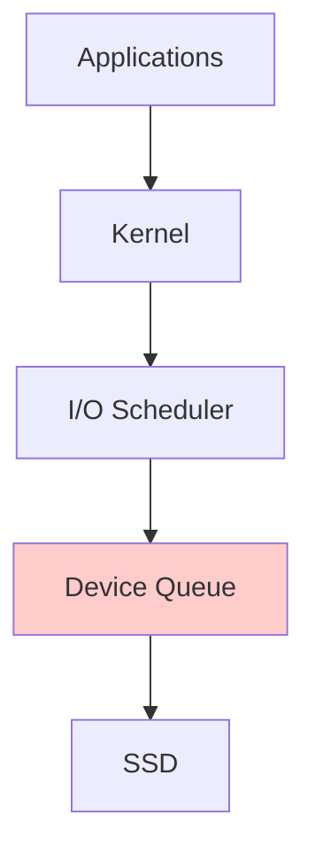
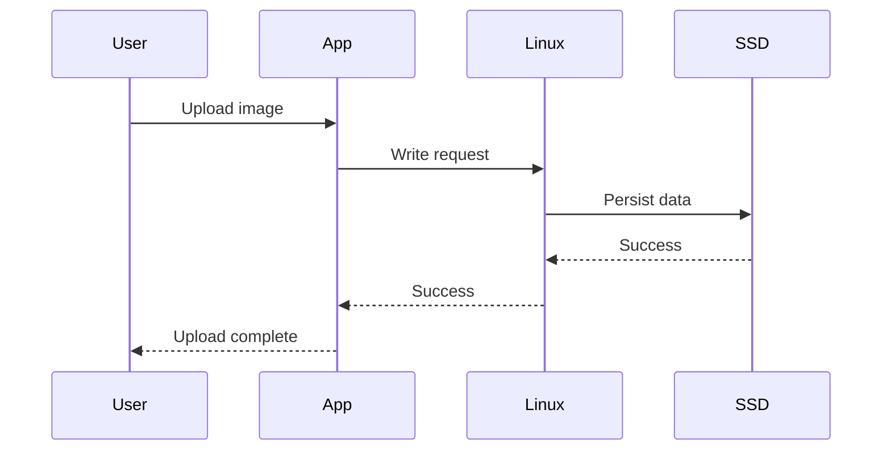
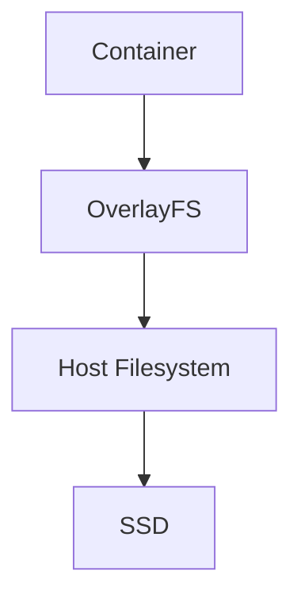
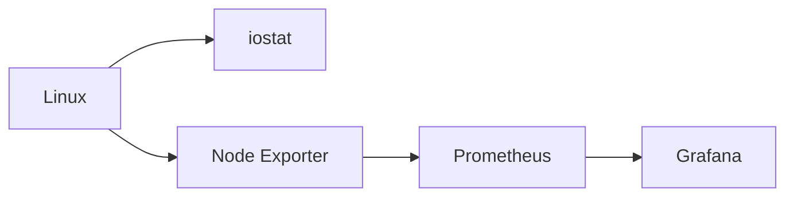
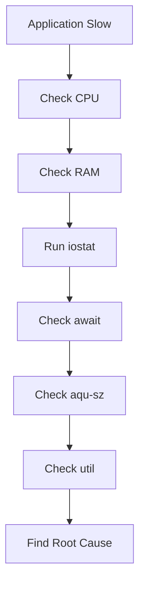

# Understanding iostat

> **The stethoscope of Linux storage systems**

---

# Why this exists

Many engineers troubleshoot systems incorrectly.

Their debugging process looks like this:

```text
Application slow

↓

CPU usage checked

↓

RAM usage checked

↓

Everything looks fine

↓

No idea what's wrong
```

Meanwhile, the real culprit is:

```text
Storage waiting
```

Storage problems are invisible.

Disks don't scream.

SSDs don't show warning popups.

Applications simply become slow.

Users complain.

Engineers panic.

This is why `iostat` exists.

`iostat` helps engineers answer:

```text
Is storage overloaded?

Is storage waiting?

How busy are disks?

Who is the bottleneck?

Is latency increasing?

Are we saturating devices?

Are we exceeding cloud limits?
```

`iostat` transforms invisible storage behavior into visible numbers.

---

# Problem It Solves

Without `iostat`:

```text
Application Slow

↓

Developer blames code

↓

Backend blames database

↓

Database blames infrastructure

↓

Infrastructure blames cloud provider

↓

Nobody checks disks
```

With `iostat`:

```text
Application Slow

↓

iostat

↓

Disk utilization = 100%

↓

await = 300 ms

↓

Root cause found
```

---

# Mental Model

Imagine a supermarket.

```text
Customers = Applications

Cashier = SSD/HDD

Checkout queue = Device Queue

Manager = I/O Scheduler

Shopping carts = Data blocks
```

When customers arrive faster than cashiers can process:

```text
Queue grows

↓

Customers wait

↓

Store slows
```

Same thing happens in Linux.

---

# What is iostat?

`iostat` stands for:

```text
Input Output Statistics
```

It is part of:

```text
sysstat package
```

Purpose:

```text
Monitor CPU

Monitor disk activity

Monitor storage performance
```

Install:

Ubuntu/Debian

```bash
sudo apt install sysstat
```

RHEL/CentOS

```bash
sudo yum install sysstat
```

Verify:

```bash
iostat
```

---

# First Principles

Storage is fundamentally a queueing problem.

Every storage device has limits.

Applications continuously generate requests.

```text
Read

Write

Delete

Flush

Sync
```

Linux places those requests into queues.

```text
Application

↓

Kernel

↓

Page Cache

↓

I/O Scheduler

↓

Device Queue

↓

SSD/HDD
```

iostat allows us to observe that pipeline.

---

# Linux Internals

Data path:



iostat gathers statistics from:

```text
/proc/diskstats

/sys/block

/proc/stat
```

Kernel continuously updates counters.

iostat simply reads and calculates them.

---

# Basic Usage

```bash
iostat
```

Example:

```text
Linux 6.x

avg-cpu:

%user

%nice

%system

%iowait

%steal

%idle

Device

tps

kB_read/s

kB_wrtn/s
```

---

# Real Engineers Rarely Use Plain iostat

Most common command:

```bash
iostat -x 1
```

Meaning:

```text
-x

Extended statistics

1

Refresh every second
```

---

# Most Important Command

```bash
iostat -xz 1
```

Flags:

```text
-x

Extended metrics

-z

Hide inactive devices

1

Refresh every second
```

This is the command used by most production engineers.

---

# Understanding CPU Metrics

Example:

```text
avg-cpu:

%user

%nice

%system

%iowait

%steal

%idle
```

---

## %user

CPU executing application code.

```text
Java

Python

Node.js

Go
```

---

## %system

CPU executing kernel code.

```text
Filesystem

Networking

Drivers

Scheduling
```

---

## %iowait

Extremely important.

Definition:

```text
CPU waiting for storage
```

Not:

```text
CPU busy
```

But:

```text
CPU idle because storage is slow
```

Example:

```text
%iowait = 30%
```

Means:

```text
30% of CPU time

spent waiting

for storage
```

Healthy:

```text
0%-5%
```

Concerning:

```text
10%-20%
```

Dangerous:

```text
30%+
```

---

# Device Metrics

Example:

```text
Device

r/s

w/s

rkB/s

wkB/s

await

aqu-sz

%util
```

These are the metrics engineers care about.

---

# r/s

Definition:

```text
Read requests per second
```

Example:

```text
2000
```

Means:

```text
2000 reads every second
```

---

# w/s

Definition:

```text
Write requests per second
```

Example:

```text
1500
```

Means:

```text
1500 writes every second
```

---

# rkB/s

Read throughput.

Example:

```text
50000
```

Means:

```text
50 MB/s reads
```

---

# wkB/s

Write throughput.

Example:

```text
100000
```

Means:

```text
100 MB/s writes
```

---

# await (VERY IMPORTANT)

Definition:

```text
Total average request latency
```

Includes:

```text
Queue wait

+

Device service time
```

Formula:

```text
await

=

waiting time

+

processing time
```

Healthy values:

NVMe

```text
0.1 - 1 ms
```

SSD

```text
1 - 5 ms
```

HDD

```text
5 - 20 ms
```

Danger:

```text
50 ms+

100 ms+

300 ms+
```

Users will notice slowness.

---

# aqu-sz

Definition:

```text
Average queue size
```

Mental model:

```text
People waiting in line
```

Healthy:

```text
0-2
```

Bad:

```text
10+

20+

50+
```

Large queues indicate overload.

---

# %util

One of the most misunderstood metrics.

Definition:

```text
How busy the device is
```

```text
0%

↓

100%
```

Healthy:

```text
20-70%
```

Warning:

```text
80%
```

Critical:

```text
95%
```

Emergency:

```text
100%
```

---

# Visualizing %util

```text
20% = Mostly idle

50% = Moderate load

70% = Heavy load

90% = Near saturation

100% = Fully occupied
```

---

# Reading iostat Like An Engineer

Suppose:

```text
Device:

await = 200 ms

aqu-sz = 50

%util = 100%
```

Interpretation:

```text
Disk overloaded

↓

Queue growing

↓

Requests waiting

↓

Applications slowing
```

---

# Storage Saturation Diagram



Queue growth is often the first sign of trouble.

---

# Data Flow Example

User uploads image.



If SSD slows:

```text
SSD

↓

Queue grows

↓

Linux waits

↓

Application waits

↓

User waits
```

---

# Production Example: PostgreSQL

Symptoms:

```text
Queries become slow
```

Check:

```bash
iostat -xz 1
```

Observe:

```text
await = 180 ms

aqu-sz = 40

%util = 100%
```

Root cause:

```text
Storage saturation
```

Solution:

```text
Move WAL to NVMe

Increase RAM

Optimize indexes

Reduce checkpoint spikes
```

---

# Production Example: Docker

Problem:

```text
Containers become slow
```

Check:

```bash
iostat -xz 1
```

Observe:

```text
High write throughput
```

Cause:

```text
Container logs
```

Check:

```bash
docker system df
```

---

# Production Example: Kubernetes

Problem:

```text
Pods restarting
```

Observe:

```text
High disk latency
```

Cause:

```text
Container runtime storage saturation
```

Directories:

```text
/var/lib/containerd

/var/lib/kubelet

/var/log
```

---

# Cloud Engineering Connection

Cloud disks have limits.

AWS EBS example:

```text
IOPS limits

Bandwidth limits

Burst credits
```

Symptoms:

```text
await rising

%util rising
```

Same for:

```text
Azure Managed Disk

Google Persistent Disk
```

---

# Database Connection

Databases are storage-intensive systems.

Monitor:

```text
PostgreSQL

MySQL

MongoDB

Elasticsearch
```

When storage degrades:

```text
Transactions slow

Queries slow

Replication slows

Checkpoints stall
```

---

# Docker Connection

Containers still use Linux storage.

Layers:



iostat sees host-level storage activity.

---

# Performance Considerations

Fast CPU cannot compensate for slow storage.

Bad:

```text
128 CPU cores

Slow HDD
```

Good:

```text
Balanced system
```

---

# Security Considerations

Abnormal iostat patterns may indicate attacks.

Examples:

Ransomware:

```text
Massive writes

100% utilization
```

Log flooding:

```text
Huge write spikes
```

Crypto miners:

```text
Continuous disk usage
```

Monitor sudden changes.

---

# Observability Considerations

iostat is one piece of observability.

Combine with:

```text
df

iotop

vmstat

dstat

Prometheus

Grafana

smartctl
```

Observability stack:



---

# Troubleshooting Workflow



---

# Common Mistakes

## Mistake 1

Looking only at CPU.

Wrong.

Storage often causes slowness.

---

## Mistake 2

Ignoring `await`.

This is one of the most important metrics.

---

## Mistake 3

Thinking `%util` equals performance.

100% utilization may be okay on fast NVMe under controlled workloads.

Always correlate with latency.

---

## Mistake 4

Ignoring queue size.

Queue growth predicts failures.

---

## Mistake 5

Monitoring only disk space.

Space is only one aspect.

---

# Engineering Mindset

Never ask:

> "Is the disk full?"

Ask:

```text
Is storage overloaded?

Is latency increasing?

Is queue growing?

Can storage sustain this workload?

What is the bottleneck?

Will this scale?
```

Great engineers monitor:

```text
Capacity

Latency

Throughput

Queue depth

Health

Growth
```

---

# Interview Questions

## Beginner

1. What is iostat?

2. What package provides iostat?

3. What is `%iowait`?

4. What is `%util`?

5. What is throughput?

---

## Intermediate

6. What is `await`?

7. What is queue depth?

8. Why does high iowait occur?

9. Why can CPU be idle while applications are slow?

10. How do databases affect storage?

---

## Advanced

11. How would you troubleshoot 100% disk utilization?

12. Why is latency more important than throughput?

13. How would you monitor Kubernetes storage?

14. How does Linux gather iostat metrics?

15. How would you build storage observability for a 1000-node cluster?

---

# Cheat Sheet

```text
Most Important Command

iostat -xz 1

Metrics To Watch

%iowait

await

aqu-sz

%util

r/s

w/s

rkB/s

wkB/s

Healthy Numbers

NVMe latency:
0.1-1 ms

SSD latency:
1-5 ms

HDD latency:
5-20 ms

Queue:
0-2

Utilization:
20-70%

Warning Signs

await > 50 ms

aqu-sz > 10

util > 95%

iowait > 20%
```
 after learning **"What storage is doing" (iostat)**, we learn **"Who is causing storage activity" (iotop)**.
