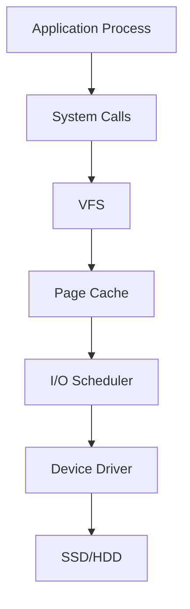
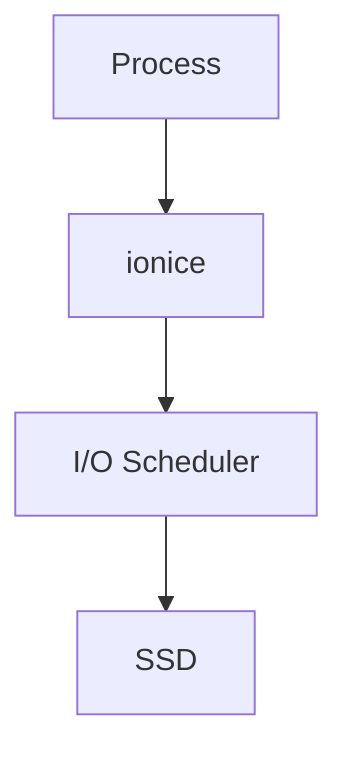
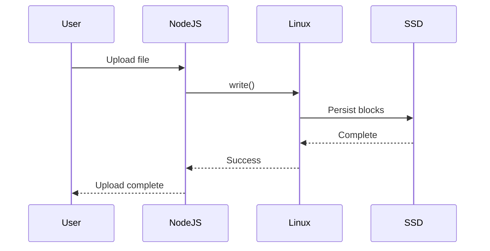
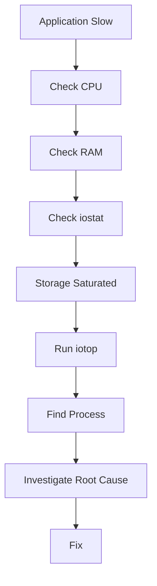

# iotop

## The Missing Link Between Slow Storage and the Process Causing It

---

# Why This Exists

Many engineers know **how to identify that a disk is overloaded**.

Few engineers know **who is overloading the disk**.

Suppose a production server becomes slow.

You execute:

```bash
iostat -xz 1
```

You see:

```text
await = 200ms

%util = 100%
```

Okay.

Now you know:

> **Storage is overloaded.**

But you still don't know:

> **Who is causing it?**

That's where `iotop` enters.

`iotop` answers the question:

> **Which process is generating storage I/O right now?**

This is one of the most important troubleshooting skills in Linux engineering.

---

# The Real Engineering Problem

Users report:

```text
Website slow

API slow

Database slow

Pods restarting

SSH lagging
```

The actual root cause could be:

```text
Database checkpoint

Log flood

Docker overlay writes

Backup job

Virus scan

Container image extraction

Ransomware

File indexing

Misconfigured application
```

Storage is a shared resource.

Everybody uses it.

Everybody can abuse it.

`iotop` lets us identify the culprit.

---

# Mental Model

Imagine a city.

```text
City = Linux system

Roads = Storage devices

Vehicles = Processes

Traffic = I/O operations

Traffic police = iotop
```

Without traffic police:

```text
Traffic jam

↓

Nobody knows who caused it
```

With traffic police:

```text
Truck #2345 causing congestion

↓

Identify

↓

Fix
```

Same thing happens inside Linux.

---

# First Principles

Every process interacts with storage.

Examples:

```text
Nginx

Read static files

↓

PostgreSQL

Read database pages

↓

Docker

Read image layers

↓

systemd-journald

Write logs

↓

Redis

Write snapshots

↓

Node.js

Write uploads
```

Eventually, every operation becomes:

```text
read()

write()

fsync()

open()

close()

mmap()
```

Linux translates those into block device operations.

---

# Where Does iotop Fit?

Storage observability is a layered system.

```text
Question                    Tool

Is CPU overloaded?          top

Is memory overloaded?       free

Is storage overloaded?      iostat

Who is causing storage?     iotop

Filesystem full?            df

Kernel waiting?             vmstat
```

Think of these tools as a complete toolkit.

---

# Linux Storage Architecture



`iotop` sits at the process layer.

It asks:

```text
Which process generated this I/O?
```

---

# Linux Internals: How iotop Works

Many engineers use tools.

Few understand their internals.

`iotop` relies on:

```text
Kernel task accounting

+

I/O accounting
```

Kernel tracks:

```text
Bytes read

Bytes written

Swap activity

Disk waits
```

Kernel exposes data through:

```text
/proc

/sys
```

Linux maintains counters per process.

Example:

```text
PID 5321

read bytes

write bytes

cancelled writes
```

`iotop` continuously reads those values.

---

# Kernel Requirement

Kernel must have:

```text
CONFIG_TASKSTATS

CONFIG_TASK_IO_ACCOUNTING
```

Verify:

```bash
grep TASK_IO_ACCOUNTING /boot/config-$(uname -r)
```

Example:

```text
CONFIG_TASK_IO_ACCOUNTING=y
```

---

# Install iotop

Ubuntu/Debian

```bash
sudo apt install iotop
```

RHEL/CentOS

```bash
sudo yum install iotop
```

Sometimes:

```bash
sudo dnf install iotop
```

Run:

```bash
sudo iotop
```

Root permissions are usually required.

---

# Basic Usage

```bash
sudo iotop
```

Refreshes continuously.

---

# Most Useful Command

```bash
sudo iotop -o
```

Option:

```text
-o

Only active processes
```

Without it:

```text
200 idle processes
```

With it:

```text
Only storage consumers
```

Much cleaner.

---

# Most Practical Production Command

```bash
sudo iotop -oPa
```

Flags:

```text
-o

Only active processes

-P

Show processes

-a

Accumulate values
```

This is commonly used in production debugging.

---

# Anatomy of iotop Output

Example:

```text
PID PRIO USER DISK READ DISK WRITE SWAPIN IO COMMAND

1350 be/4 postgres 20.0 M/s 100.0 M/s 0.00% 40.0% postgres

2450 be/4 docker 50.0 M/s 200.0 M/s 0.00% 80.0% dockerd

3130 be/4 node 5.0 M/s 10.0 M/s 0.00% 10.0% node
```

Let's understand every field.

---

# PID

Process ID.

```text
2450
```

Identify process:

```bash
ps -p 2450
```

---

# PRIO

I/O priority.

Example:

```text
be/4
```

Meaning:

```text
Best effort class

Priority 4
```

Linux I/O scheduler uses this.

---

# USER

Who owns the process?

Example:

```text
postgres

root

www-data
```

---

# DISK READ

Read throughput.

Example:

```text
20 M/s
```

Means:

```text
20 MB every second
```

---

# DISK WRITE

Write throughput.

Example:

```text
100 M/s
```

Means:

```text
100 MB every second
```

---

# SWAPIN

Percentage of time spent swapping.

Healthy:

```text
0%
```

Danger:

```text
10%+

20%+
```

High swap usually means memory pressure.

---

# IO%

Extremely important.

Definition:

```text
How much time

the process spends

waiting for storage
```

High values indicate storage dependency.

---

# Understanding I/O Priority

Linux has three classes.

```text
Real Time (rt)

Best Effort (be)

Idle (idle)
```

Visualization:

```text
Highest Priority

↓

Real Time

↓

Best Effort

↓

Idle

Lowest Priority
```

---

# Changing I/O Priority

Command:

```bash
ionice
```

Example:

```bash
sudo ionice -c3 backup.sh
```

Meaning:

```text
Run backup only when system idle
```

Very useful.

---

# The Relationship Between iotop and ionice



`iotop`

Observes.

`ionice`

Controls.

---

# How Engineers Actually Use iotop

Real workflow:

Step 1:

```bash
iostat -xz 1
```

Find:

```text
await = 300ms

util = 100%
```

Step 2:

```bash
sudo iotop -o
```

Find:

```text
postgres

250 MB/s writes
```

Step 3:

Investigate postgres.

---

# Data Flow Visualization



`iotop` observes NodeJS during this flow.

---

# Production Scenario 1: PostgreSQL Checkpoint Storm

Symptoms:

```text
Website slow

Queries hanging

Latency spikes
```

Observe:

```bash
iostat -xz 1
```

```text
await = 250ms
```

Now:

```bash
sudo iotop -o
```

Result:

```text
postgres

300 MB/s writes
```

Root cause:

```text
Checkpoint flush
```

Solution:

Tune:

```text
shared_buffers

checkpoint_timeout

max_wal_size
```

---

# Production Scenario 2: Docker Log Explosion

Symptoms:

```text
Node becomes slow
```

Find:

```bash
sudo iotop -o
```

Output:

```text
systemd-journald

150 MB/s writes
```

Cause:

```text
Container log flood
```

Check:

```bash
docker ps
```

```bash
docker logs container_id
```

Enable rotation.

```json
{
"log-driver":"json-file",
"log-opts":{
"max-size":"100m",
"max-file":"3"
}
}
```

---

# Production Scenario 3: Kubernetes

Symptoms:

```text
Pods restart

Nodes unhealthy
```

Observe:

```bash
sudo iotop -o
```

Output:

```text
containerd

250 MB/s writes
```

Cause:

```text
Large image pulls
```

Directories:

```text
/var/lib/containerd

/var/lib/kubelet

/var/log/pods
```

---

# Production Scenario 4: Ransomware

Symptoms:

```text
Sudden storage spike
```

Observe:

```bash
sudo iotop -o
```

Output:

```text
unknown process

500 MB/s writes
```

This is an immediate security event.

Investigate.

---

# The Complete Storage Troubleshooting Pipeline



---

# Modern Infrastructure Connections

# Docker

`iotop` helps identify:

```text
Image pulls

Container logs

OverlayFS writes

Volume usage
```

---

# Kubernetes

`iotop` helps identify:

```text
containerd

kubelet

journald

etcd

Database pods
```

---

# Databases

Useful for:

```text
PostgreSQL

MySQL

MongoDB

Elasticsearch

Cassandra
```

---

# Cloud Systems

Useful for:

```text
AWS EC2

Azure VM

Google Compute Engine
```

Especially when cloud disks throttle.

---

# Performance Engineering Mindset

Storage is not a disk problem.

Storage is a queueing system.

Always think:

```text
Process

↓

Kernel

↓

Scheduler

↓

Device

↓

Latency
```

The process is often the root cause.

---

# Common Mistakes

## Mistake 1

Using `iotop` before `iostat`.

Wrong order.

Always:

```text
iostat

↓

iotop
```

---

## Mistake 2

Ignoring page cache.

Applications may read from RAM instead of disk.

Not every read touches storage.

---

## Mistake 3

Ignoring background jobs.

Examples:

```text
Backups

Cron jobs

Log rotation

Database checkpoints
```

---

## Mistake 4

Ignoring swap.

Swap activity often indicates memory problems.

---

## Mistake 5

Only checking application code.

Infrastructure may be the bottleneck.

---

# Engineering Mindset

Beginners ask:

> Which application is slow?

Engineers ask:

> Which process is generating storage pressure?

Systems engineers ask:

> Why is this process generating storage pressure?

Architects ask:

> Why was the system designed to allow this bottleneck?

---

# Interview Questions

## Beginner

1. What is iotop?

2. Why do we use it?

3. What is the difference between iostat and iotop?

4. What is DISK READ?

5. What is DISK WRITE?

---

## Intermediate

6. What is IO%?

7. What is SWAPIN?

8. What is ionice?

9. Why do databases generate heavy I/O?

10. Why does Linux need I/O accounting enabled?

---

## Advanced

11. How would you troubleshoot a production storage bottleneck?

12. How would you identify a rogue container?

13. Why might iotop not show expected disk activity?

14. How does page cache affect iotop interpretation?

15. How would you design storage observability for a Kubernetes cluster?

---

# Cheat Sheet

```text
Storage Troubleshooting Pyramid

Application Slow

↓

iostat

Find overloaded disk

↓

iotop

Find process

↓

Investigate process

↓

Fix bottleneck

Important Commands

sudo iotop

sudo iotop -o

sudo iotop -oPa

Useful Pair

iostat + iotop

Related Tool

ionice
```

because this is where you'll start seeing **how containers fundamentally change Linux storage behavior**, and why storage engineering becomes much harder in modern infrastructure.
