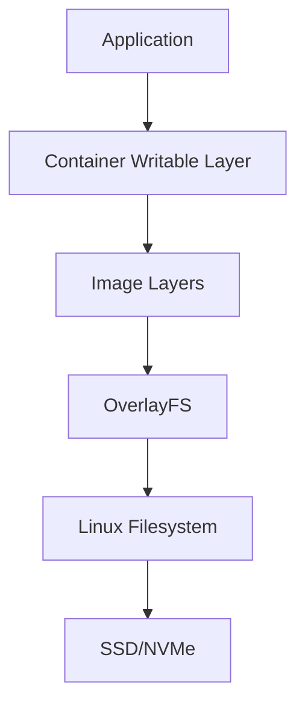
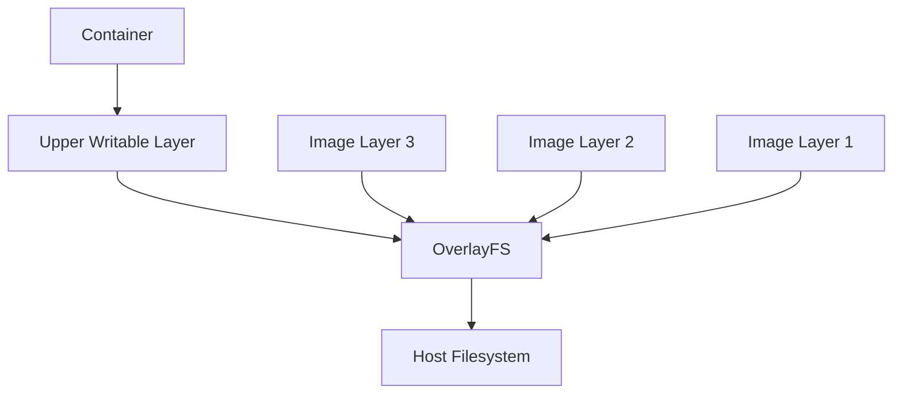
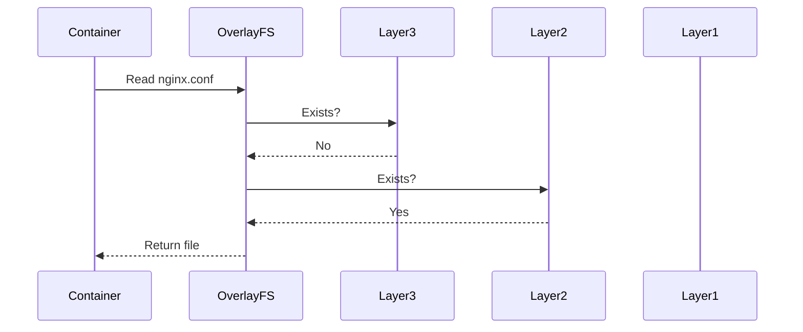
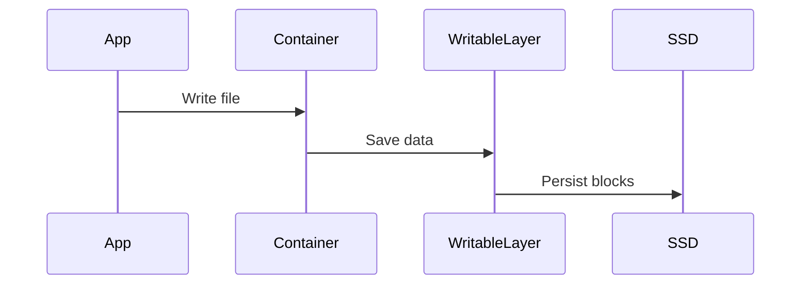
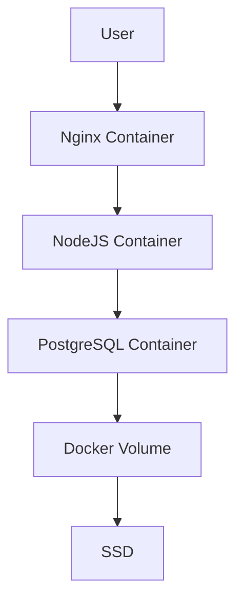

# Storage In Docker

> **Docker did not invent a new storage system.**
>
> Docker is fundamentally a sophisticated storage orchestration system built on top of Linux storage primitives.

This file is extremely important because **modern software engineering is impossible without understanding how containers consume storage.**

If you don't understand Docker storage, you will eventually encounter:

```text
Disk full incidents

Slow containers

Database corruption

Node crashes

Build failures

Log explosions

Storage bottlenecks

Unexpected cloud bills
```

---

# Why This Exists

Most developers learn Docker like this:

```bash
docker build

docker run

docker ps
```

And stop there.

They think:

> Containers are lightweight VMs.

This mental model is wrong.

A more accurate model is:

> **Containers are Linux processes with isolated views of storage, networking, and processes.**

Storage is one of the most complex parts.

---

# Problem It Solves

Without Docker storage systems:

Every application would require its own copy of:

```text
Ubuntu

NodeJS

Python

Java

Libraries

Dependencies
```

Imagine 100 applications.

Without layer sharing:

```text
100 x Ubuntu

100 x Python

100 x Node

100 x Libraries
```

Huge waste.

Docker solves this with layered storage.

---

# Mental Model

Imagine transparent sheets.

```text
Layer 1

Ubuntu

------------

Layer 2

NodeJS

------------

Layer 3

Application

------------

Layer 4

Container Changes
```

Each layer stacks together.

Container sees:

```text
Single filesystem
```

Reality:

```text
Many layers merged together
```

This is one of Docker's biggest engineering ideas.

---

# First Principles

Every container needs:

```text
Code

Dependencies

Configuration

Temporary data

Persistent data

Logs
```

The problem:

Containers are ephemeral.

Meaning:

```text
Can be destroyed anytime
```

Question:

Where should data live?

Docker solves this using multiple storage mechanisms.

---

# Fundamental Rule

There are **two categories of data**.

# Temporary Data

Dies with container.

Example:

```text
Cache

Temp files

Session data
```

# Persistent Data

Survives container deletion.

Example:

```text
Databases

Uploads

Configurations

Logs
```

This distinction is extremely important.

---

# The Storage Layers Inside Docker



---

# Docker Is Built On Linux Storage

Docker uses Linux technologies:

```text
Namespaces

cgroups

OverlayFS

Bind Mounts

Volumes

Union Filesystems
```

Storage is mostly:

```text
OverlayFS
```

---

# What Is OverlayFS?

OverlayFS is a Linux union filesystem.

It merges multiple directories.

Suppose:

Lower Layer:

```text
Ubuntu Filesystem
```

Middle Layer:

```text
Python Runtime
```

Upper Layer:

```text
Your Application
```

Docker combines them.

Result:

```text
One filesystem
```

---

# OverlayFS Mental Model

```text
Lower Layer

Ubuntu

------------------

Middle Layer

Python

------------------

Upper Layer

Application

------------------

Writable Layer

Container Changes
```

Linux merges them.

Container sees:

```text
/
├── app
├── bin
├── etc
├── home
├── usr
```

---

# OverlayFS Architecture



---

# Docker Image vs Container

Many beginners confuse these.

Docker Image:

```text
Read only

Template

Immutable
```

Docker Container:

```text
Image

+

Writable layer
```

Formula:

```text
Container

=

Image

+

Writable Layer
```

---

# Where Are Docker Files Stored?

Usually:

```text
/var/lib/docker/
```

Explore:

```bash
sudo ls /var/lib/docker
```

Example:

```text
buildkit

containers

image

network

overlay2

plugins

volumes
```

Each directory matters.

---

# overlay2

Most important directory.

```text
/var/lib/docker/overlay2
```

Contains:

```text
Layer data

Merged directories

Container changes
```

---

# volumes

```text
/var/lib/docker/volumes
```

Stores persistent volumes.

Example:

```text
postgres_data

mysql_data

redis_data
```

---

# containers

```text
/var/lib/docker/containers
```

Stores:

```text
Logs

Metadata

Container configs
```

---

# Docker Read Workflow

Suppose:

Container requests:

```text
/etc/nginx/nginx.conf
```

Workflow:



---

# Docker Write Workflow

Suppose:

```bash
echo hello > file.txt
```

Workflow:



The original image never changes.

---

# Copy-On-Write (COW)

One of Docker's biggest concepts.

Suppose Ubuntu image contains:

```text
/etc/passwd
```

Container modifies it.

Docker does NOT modify image.

Instead:

```text
Copy file

↓

Writable layer

↓

Modify copy
```

This is:

```text
Copy On Write
```

---

# Visualization

```text
Ubuntu Image

/etc/passwd

↓

Container wants to modify

↓

Copy created

↓

Writable Layer

↓

Modify copy
```

Original image remains untouched.

---

# Why Copy-On-Write Exists

Benefits:

```text
Fast startup

Layer reuse

Space savings

Immutability

Image sharing
```

Tradeoff:

```text
Extra lookup overhead
```

---

# Bind Mounts

Host directory directly exposed.

Example:

```bash
docker run \
-v /host/uploads:/app/uploads
```

Visualization:


Changes are reflected both ways.

---

# Docker Volumes

Docker-managed storage.

Example:

```bash
docker volume create postgres_data
```

Use:

```bash
docker run \
-v postgres_data:/var/lib/postgresql/data
```

---

# Bind Mount vs Volume

| Feature             | Bind Mount | Volume |
| ------------------- | ---------- | ------ |
| Managed by Docker   | ❌          | ✅      |
| Host dependent      | ✅          | ❌      |
| Portable            | ❌          | ✅      |
| Production friendly | Moderate   | High   |
| Security            | Lower      | Higher |

---

# Anonymous Volumes

Example:

```bash
docker run -v /app/data nginx
```

Docker creates random volume.

Not recommended for production.

Hard to manage.

---

# Docker Storage Drivers

Different Linux systems use different drivers.

Common:

```text
overlay2

aufs

btrfs

zfs

devicemapper
```

Today:

```text
overlay2
```

is the standard.

Check:

```bash
docker info
```

Look for:

```text
Storage Driver: overlay2
```

---

# Docker Storage Performance

Not all storage is equal.

Fast:

```text
NVMe

SSD
```

Slow:

```text
HDD
```

Databases especially need fast disks.

---

# Why Databases Hate Writable Layers

Bad:

```text
PostgreSQL

↓

Docker writable layer

↓

OverlayFS

↓

SSD
```

Extra overhead.

Better:

```text
PostgreSQL

↓

Volume

↓

SSD
```

Always use volumes.

---

# Production Example: PostgreSQL

Wrong:

```bash
docker run postgres
```

Good:

```bash
docker run \
-v pgdata:/var/lib/postgresql/data \
postgres
```

---

# Production Example: Upload Service

Wrong:

```text
Uploads inside container
```

Container deleted.

Uploads gone.

Correct:

```text
Container

↓

Volume

↓

Host Storage
```

---

# Production Example: Log Explosion

Problem:

```text
Container logs grow forever
```

Eventually:

```text
/var/lib/docker full
```

Entire node crashes.

Monitor:

```bash
docker system df
```

---

# Storage Monitoring Commands

Check Docker disk usage:

```bash
docker system df
```

Detailed:

```bash
docker system df -v
```

Check volumes:

```bash
docker volume ls
```

Inspect:

```bash
docker volume inspect volume_name
```

Check size:

```bash
du -sh /var/lib/docker
```

---

# Data Flow Of Modern Applications



---

# Docker In Cloud Systems

Cloud servers often have:

```text
Root Disk

+

Attached Volumes
```

Example:

AWS:

```text
EC2

↓

EBS Volume

↓

Docker Volumes
```

Same for:

```text
Azure Managed Disk

Google Persistent Disk
```

---

# Docker + Kubernetes Connection

Kubernetes builds on Docker concepts.

Docker:

```text
Volume
```

Kubernetes:

```text
Persistent Volume
```

Docker:

```text
Bind Mount
```

Kubernetes:

```text
hostPath
```

Docker knowledge directly transfers.

---

# Performance Considerations

Avoid:

```text
Huge images

Too many layers

Database on writable layer

Unlimited logs

Millions of tiny files
```

Optimize:

```text
Use volumes

Use SSD/NVMe

Enable log rotation

Reduce image size
```

---

# Security Considerations

Avoid:

```text
Mounting /

Mounting /etc

Mounting /var/run/docker.sock
```

Danger:

Container can compromise host.

Use:

```text
Read only mounts

Least privilege

Named volumes
```

---

# Troubleshooting

## Disk Full

Check:

```bash
docker system df
```

---

## Huge Logs

Check:

```bash
du -sh /var/lib/docker/containers/*
```

---

## Volume Explosion

Check:

```bash
docker volume ls
```

Remove unused:

```bash
docker volume prune
```

---

## Layer Explosion

Check:

```bash
docker image ls
```

Cleanup:

```bash
docker image prune
```

---

# Common Mistakes

### Mistake 1

Treating containers like VMs.

Wrong mental model.

---

### Mistake 2

Storing database data inside container.

Use volumes.

---

### Mistake 3

Ignoring logs.

Logs can crash nodes.

---

### Mistake 4

Ignoring `/var/lib/docker`.

Monitor it.

---

### Mistake 5

Using bind mounts everywhere.

Use volumes in production.

---

# Engineering Mindset

Beginners think:

> Docker runs applications.

Engineers think:

> Docker orchestrates Linux primitives.

Storage engineers think:

> Docker is a giant storage abstraction layer.

Platform engineers think:

> Every container is a storage consumer.

Architects think:

> Storage design determines scalability.

---

# Interview Questions

## Beginner

1. What is Docker storage?

2. What is OverlayFS?

3. What is Copy-On-Write?

4. Difference between image and container?

5. Difference between bind mount and volume?

---

## Intermediate

6. Why shouldn't databases use writable layers?

7. Why are Docker images layered?

8. Why is OverlayFS efficient?

9. What is `overlay2`?

10. Why can Docker fill disks quickly?

---

## Advanced

11. How does Docker implement storage internally?

12. How would you design persistent storage for containers?

13. How would you monitor Docker storage at scale?

14. How would you optimize storage for 1000 containers?

15. How does Kubernetes extend Docker storage concepts?

---

# Cheat Sheet

```text
Docker Storage Hierarchy

Application

↓

Container

↓

Writable Layer

↓

OverlayFS

↓

Host Filesystem

↓

SSD/NVMe


Important Directories

/var/lib/docker/overlay2

/var/lib/docker/volumes

/var/lib/docker/containers


Production Rules

Database -> Volume

Uploads -> Volume

Logs -> Rotation

Monitor -> docker system df

Avoid -> Writable layer persistence
```

This file will elevate storage thinking from **single-host Docker engineering** to **distributed cluster storage engineering**.
