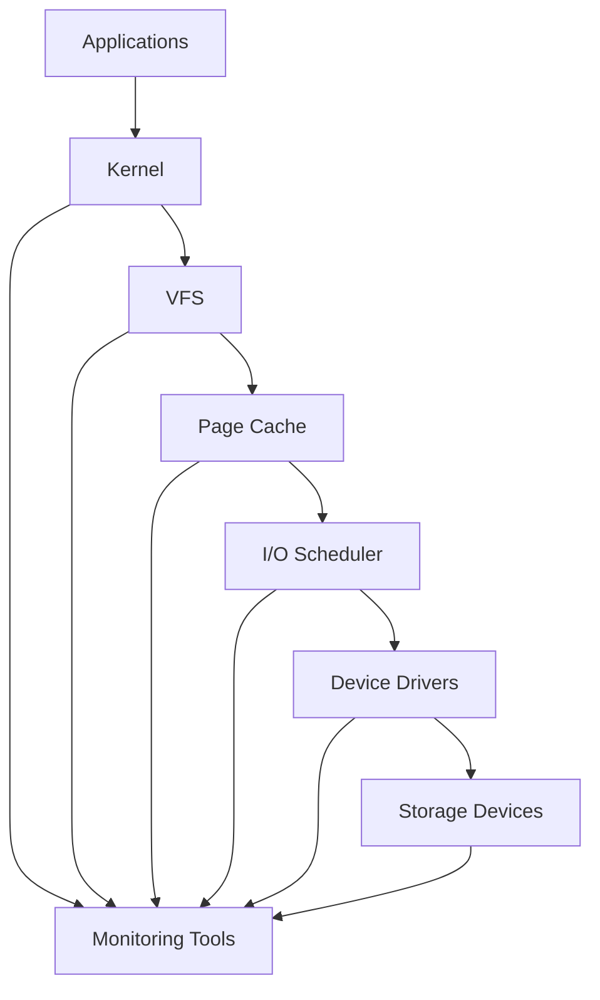
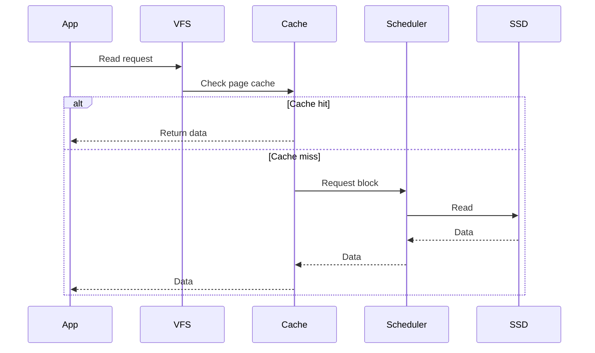
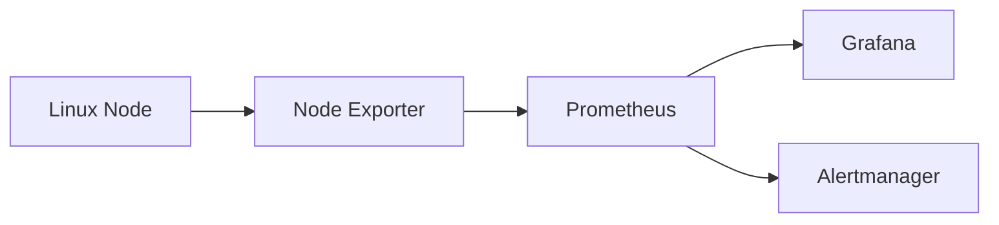
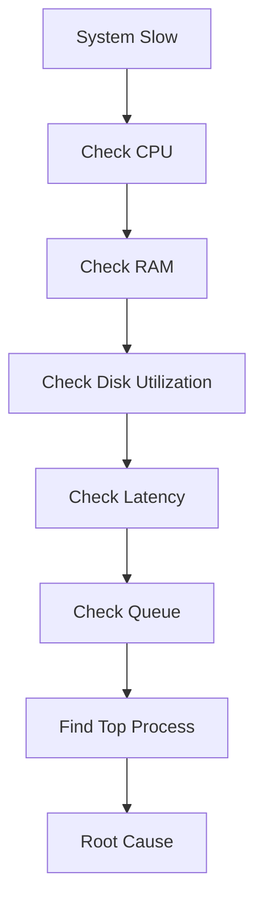

# Storage Monitoring


# Why this exists

Storage is one of the most misunderstood resources in systems engineering.

Most beginners think:

> "Storage is just disk space."

But engineers know:

> **Storage is a living system with latency, queues, caches, throughput limits, failures, and bottlenecks.**

A server can have:

* 80% CPU idle
* Plenty of RAM available
* Network underutilized

…and still become unusably slow.

Why?

Because storage became the bottleneck.

Storage monitoring exists because **storage failures rarely happen instantly.**

Systems usually degrade gradually.

If we monitor correctly, we can detect problems before users notice them.

Storage monitoring answers questions like:

* Why is my application slow?
* Is the disk overloaded?
* Is storage waiting for I/O completion?
* Is a database causing excessive disk activity?
* Is Docker filling storage?
* Is Kubernetes overwhelming disks?
* Are we approaching storage limits?
* Are SSDs wearing out?
* Is a cloud volume throttling performance?

---

# Problem it solves

Without monitoring:

```text
User:
Website is slow.

Developer:
CPU looks fine.

Admin:
RAM looks fine.

Database:
Queries seem okay.

Everyone:
???

Root cause:
Storage saturation.
```

Common hidden storage problems:

```text
High I/O wait

Disk queue buildup

Slow random reads

Slow writes

Too many tiny files

Filesystem fragmentation

Full disk

Inode exhaustion

Docker image accumulation

Kubernetes log explosion

Database checkpoint spikes

Cloud storage throttling
```

Storage monitoring makes invisible problems visible.

---

# Mental Model

Think of storage as a restaurant kitchen.

```text
Applications = Customers

Kernel = Waiter

I/O Scheduler = Kitchen Manager

Disk Queue = Order Queue

Storage Device = Chefs

Disk Blocks = Ingredients
```

Visualization:

```text
Applications
      |
      v

Kernel VFS Layer
      |
      v

Page Cache
      |
      v

I/O Scheduler
      |
      v

Device Queue
      |
      v

SSD/HDD
```

If chefs are overloaded:

```text
Customers wait

↓

Orders pile up

↓

Restaurant slows

↓

Complaints arrive
```

Same happens in Linux.

---

# First Principles

Storage is fundamentally about moving data.

Every operation costs time.

```text
CPU:
Nanoseconds

RAM:
100 nanoseconds

SSD:
100 microseconds

HDD:
10 milliseconds
```

Storage is millions of times slower than CPU.

That's why Linux aggressively optimizes storage.

---

# The 5 Things Engineers Monitor

Always monitor:

```text
Capacity

Latency

Throughput

IOPS

Utilization
```

---

# 1. Capacity

Question:

```text
How much storage is available?
```

Example:

```text
500GB total

450GB used

50GB free
```

Metrics:

```text
Used %

Free %

Reserved %

Growth rate
```

Commands:

```bash
df -h
```

```bash
df -i
```

Example:

```text
Filesystem      Size Used Avail Use%
/dev/sda1       100G 80G 20G 80%
```

Danger thresholds:

```text
80% → warning

90% → critical

95% → emergency
```

---

# 2. Latency

Question:

```text
How long does storage take to respond?
```

Example:

```text
Read request

↓

Disk

↓

Response
```

Measured in:

```text
milliseconds (ms)

microseconds (μs)
```

Healthy values:

SSD:

```text
<1 ms
```

NVMe:

```text
<0.5 ms
```

HDD:

```text
5-20 ms
```

Bad:

```text
50 ms+

100 ms+

500 ms+
```

Users begin noticing slowness.

---

# 3. Throughput

Question:

```text
How much data per second?
```

Units:

```text
MB/s

GB/s
```

Examples:

```text
100 MB/s

500 MB/s

2 GB/s
```

Command:

```bash
iostat -x 1
```

Metrics:

```text
rMB/s

wMB/s
```

---

# 4. IOPS

Question:

```text
How many operations per second?
```

Example:

```text
10,000 reads/sec

20,000 writes/sec
```

Different workloads:

Database:

```text
High IOPS
```

Video streaming:

```text
High throughput
```

---

# 5. Utilization

Question:

```text
How busy is the disk?
```

Metric:

```text
%util
```

```text
0%

↓

100%
```

Bad:

```text
95%+

99%

100%
```

---

# Storage Monitoring Architecture



---

# What Should Engineers Monitor?

# Layer 1: Capacity

```bash
df -h
```

Monitor:

```text
Filesystem size

Used

Available

Use %
```

---

# Layer 2: Inodes

```bash
df -i
```

Monitor:

```text
Inode usage
```

Problem:

```text
Disk has free space

But no inodes left
```

System breaks.

---

# Layer 3: Device Activity

```bash
iostat -x 1
```

Monitor:

```text
r/s

w/s

rMB/s

wMB/s

await

svctm

%util
```

---

# Layer 4: Process I/O

```bash
iotop
```

Monitor:

```text
Who is consuming disk?
```

Example:

```text
postgres

docker

mysqld

redis

java
```

---

# Layer 5: Kernel Metrics

```bash
vmstat 1
```

Important:

```text
bi

bo

wa
```

Where:

```text
bi = blocks in

bo = blocks out

wa = I/O wait
```

---

# Layer 6: Device Health

Monitor:

```text
Temperature

Wear level

Bad sectors

Life remaining
```

Commands:

```bash
smartctl -a /dev/sda
```

Install:

```bash
sudo apt install smartmontools
```

---

# Layer 7: Mount Health

Monitor:

```text
Read only remounts

Corruption

Errors
```

Command:

```bash
dmesg
```

Search:

```bash
dmesg | grep error
```

---

# Layer 8: Filesystem Health

Monitor:

```text
Fragmentation

Metadata usage

Journal issues
```

Commands:

```bash
tune2fs

xfs_info

xfs_repair
```

---

# Linux Storage Data Flow



---

# What Should Be Monitored in Production?

Always monitor these:

```text
Disk usage %

Inode usage %

Read latency

Write latency

IOPS

Throughput

Queue depth

Disk utilization

Filesystem errors

SMART health

Storage growth

Top I/O consumers
```

---

# Production Example: PostgreSQL

Problem:

```text
Database is slow.
```

Monitor:

```text
await

%util

queue depth
```

Found:

```text
await = 150ms

%util = 100%
```

Root cause:

```text
Disk saturation
```

Solution:

```text
Move WAL to NVMe

Increase RAM

Optimize indexes

Reduce checkpoint spikes
```

---

# Production Example: Docker

Problem:

```text
Disk fills every week.
```

Cause:

```text
Unused images

Unused volumes

Unused containers
```

Monitor:

```bash
docker system df
```

Cleanup:

```bash
docker system prune
```

---

# Production Example: Kubernetes

Problem:

```text
Node suddenly crashes.
```

Cause:

```text
Container logs
```

Monitor:

```text
/var/log

/var/lib/containerd

/var/lib/kubelet
```

Configure log rotation.

---

# Modern Monitoring Stack



---

# Important Storage Metrics Dashboard

Monitor these:

```text
Disk Space %

Inode %

Latency

Queue Depth

Utilization %

IOPS

Read MB/s

Write MB/s

Errors

Temperature

SMART Health
```

---

# Performance Considerations

Never optimize only CPU.

Storage often dominates performance.

Bad:

```text
Fast CPU

Slow HDD
```

Good:

```text
Balanced system
```

Remember:

```text
CPU speed cannot compensate for slow storage.
```

---

# Security Considerations

Monitor:

```text
Unauthorized mounts

Sudden data growth

Unexpected encryption

Suspicious file creation

Permission changes
```

Possible attacks:

```text
Ransomware

Crypto miners

Log flooding

Disk exhaustion attacks
```

---

# Observability Thinking

Observe four dimensions.

```text
Capacity

Performance

Health

Behavior
```

Questions:

```text
Can storage hold more?

Is storage fast?

Is storage healthy?

Is storage behaving normally?
```

---

# Troubleshooting Workflow



---

# Common Mistakes

### Mistake 1

Monitoring only disk space.

Wrong:

```text
Disk = Space
```

Correct:

```text
Disk = Space + Latency + IOPS + Throughput
```

---

### Mistake 2

Ignoring inode usage.

Very common.

---

### Mistake 3

Ignoring SSD wear.

SSDs have finite lives.

---

### Mistake 4

Ignoring queue buildup.

Queue growth predicts failures.

---

### Mistake 5

Ignoring Docker storage.

Containers silently consume storage.

---

# Engineering Mindset

Think like a systems engineer.

Never ask:

> "How much disk space is left?"

Always ask:

```text
How full is storage?

How fast is storage?

How healthy is storage?

How loaded is storage?

Who is using storage?

How fast is it growing?

Can it survive failures?
```

Storage engineers don't monitor disks.

**They monitor the entire data movement system.**

---

# Interview Questions

### Beginner

1. Difference between storage and memory?

2. What is IOPS?

3. What is throughput?

4. What is latency?

5. What is inode exhaustion?

---

### Intermediate

6. What does `await` mean in iostat?

7. What causes high I/O wait?

8. Why does SSD outperform HDD?

9. What is queue depth?

10. Why monitor SMART?

---

### Advanced

11. Why can CPU be idle while applications are slow?

12. How does Linux page cache improve performance?

13. How would you monitor Kubernetes storage?

14. How would you diagnose database storage bottlenecks?

15. How would you design storage observability for a 1000-node cluster?

---

# Cheat Sheet

```text
Storage Monitoring Pyramid

                Applications
                      |
             Process I/O (iotop)
                      |
             Device I/O (iostat)
                      |
            Filesystem (df)
                      |
             Kernel (vmstat)
                      |
          Device Health (smartctl)
                      |
              Physical Disk

Monitor:

Capacity

Latency

IOPS

Throughput

Queue Depth

Utilization

Errors

SMART Health

Growth Rate

Top Consumers
```
