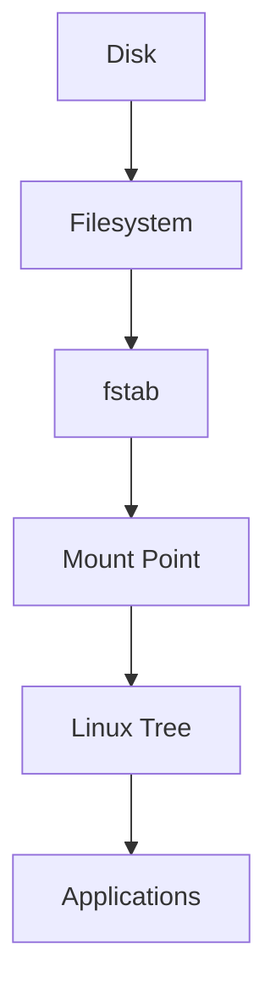
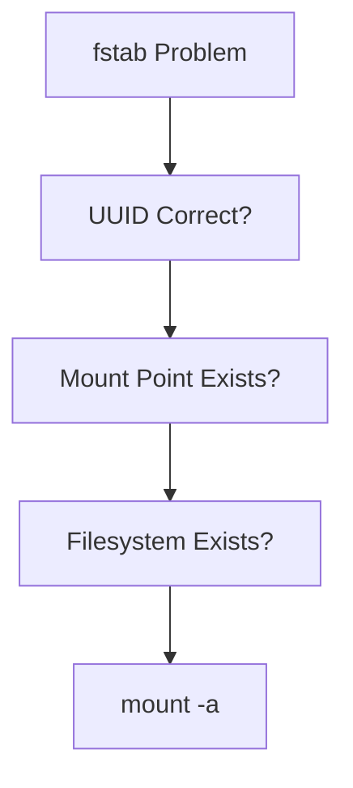

# fstab (Filesystem Table)

> `fstab` is Linux's storage memory system.
>
> Great Linux engineers don't think:
>
> "Mount storage after every reboot."
>
> They think:
>
> "Describe infrastructure once and let Linux rebuild it automatically."
>
> `fstab` is Infrastructure as Code for Linux storage.

---

# Why This File Exists

Imagine this.

You attach a new disk.

```text
Disk

↓

Filesystem

↓

Mount

↓

Works
```

Then you reboot.

```text
Disk

↓

Filesystem

↓

Not Mounted
```

Everything disappears.

Why?

Because Linux forgot.

Question:

```text
How does Linux remember storage?
```

Answer:

```text
/ etc / fstab
```

---

# Problem It Solves

This file answers:

```text
What is fstab?

Why does Linux need it?

How does Linux remember storage?

Why use UUID?

How does Linux boot using fstab?

How do production engineers use fstab?

How do Docker and Kubernetes relate to it?
```

---

# Mental Model: Startup Checklist

Imagine opening a restaurant every morning.

You have a checklist.

```text
Turn on lights

Open kitchen

Prepare tables

Start music
```

Linux also has a startup checklist.

```text
Mount root filesystem

Mount home

Mount logs

Mount backups
```

`fstab` is that checklist.

---

# First Principles

Question:

How does Linux boot?

```text
Power On

↓

BIOS / UEFI

↓

Bootloader

↓

Kernel

↓

Mount Filesystems

↓

Start Services
```

Without mounting filesystems:

```text
Linux cannot operate
```

---

# What Is fstab?

Definition:

> `fstab` is a configuration file that tells Linux which filesystems should be mounted and how they should be mounted.

Location:

```text
/etc/fstab
```

Simple definition:

```text
fstab = Storage Automation Configuration
```

---

# Where Does fstab Fit?

Memorize this.

```text
Disk

↓

Partition

↓

Filesystem

↓

Mount Point

↓

fstab

↓

Automatic Mounting

↓

Applications
```

---

# Big Picture Architecture



---

# Linux Boot Storage Flow

```text
Power On

↓

Firmware

↓

Bootloader

↓

Kernel

↓

Read fstab

↓

Mount Filesystems

↓

Start System
```

Memorize this.

---

# The fstab File

View it.

```bash
cat /etc/fstab
```

Example:

```text
UUID=7a9c2d10...   /          ext4   defaults        0 1

UUID=8f1a1b20...   /home      ext4   defaults        0 2

UUID=9a3f8c40...   /mnt/data  ext4   defaults        0 2
```

---

# Mental Model: Linux Storage Blueprint

Think:

```text
Architect Blueprint

↓

Building Instructions
```

Linux:

```text
fstab

↓

Storage Instructions
```

---

# Anatomy Of An fstab Entry

Every line has 6 fields.

```text
Device

Mount Point

Filesystem Type

Options

Dump

Pass
```

Visual:

```text
UUID=xxxx

↓

/

↓

ext4

↓

defaults

↓

0

↓

1
```

---

# Field 1: Device

What to mount.

Avoid:

```text
/dev/sda1
```

Prefer:

```text
UUID=xxxx
```

Why?

Because device names change.

---

# Why Not Use /dev/sda?

Today:

```text
SSD

↓

/dev/sda
```

Tomorrow:

```text
USB inserted

↓

SSD becomes /dev/sdb
```

System breaks.

Use UUID.

---

# Field 2: Mount Point

Where to attach it.

Examples:

```text
/

/home

/mnt/data

/backup
```

---

# Field 3: Filesystem Type

Examples:

```text
ext4

xfs

btrfs

vfat
```

Linux needs to know how to read it.

---

# Field 4: Mount Options

This is extremely important.

Examples:

```text
defaults

ro

rw

noexec

nodev

nosuid
```

We'll explain these later.

---

# Field 5: Dump

Old backup utility.

Usually:

```text
0
```

Modern systems rarely use it.

---

# Field 6: Pass

Filesystem check order.

```text
1

↓

Check first


2

↓

Check later


0

↓

Do not check
```

Usually:

```text
Root

↓

1


Others

↓

2
```

---

# The Golden Rule

Always use UUID.

Get UUID:

```bash
sudo blkid
```

Example:

```text
UUID="7fa29f1a-5e74-4a57-bc76-6d1a43c8d761"
```

---

# The Storage Workflow Engineers Use

Memorize this.

```text
New Disk

↓

lsblk

↓

fdisk

↓

mkfs

↓

blkid

↓

mount

↓

fstab

↓

Verify
```

---

# Example: Add New Storage

Step 1

Find disk.

```bash
lsblk
```

Step 2

Partition.

```bash
sudo fdisk /dev/sdb
```

Step 3

Create filesystem.

```bash
sudo mkfs.ext4 /dev/sdb1
```

Step 4

Get UUID.

```bash
sudo blkid
```

Step 5

Create mount point.

```bash
sudo mkdir -p /mnt/data
```

Step 6

Add to fstab.

```text
UUID=xxxx /mnt/data ext4 defaults 0 2
```

Step 7

Test.

```bash
sudo mount -a
```

---

# NEVER Reboot Immediately

This is a huge engineering rule.

Always test.

```bash
sudo mount -a
```

If no errors:

```text
Good
```

If errors:

```text
Fix first
```

---

# Why mount -a Is Important

`mount -a` means:

```text
Read fstab

↓

Mount everything
```

without rebooting.

This prevents disasters.

---

# Common Mount Options

## defaults

Standard Linux options.

```text
rw

suid

dev

exec

auto

nouser

async
```

---

## ro

Read only.

Useful for:

```text
Backups

Archives
```

---

## noexec

Do not execute programs.

Useful for:

```text
User uploads

Temporary directories
```

---

## nodev

Ignore device files.

Improves security.

---

## nosuid

Ignore SUID permissions.

Reduces privilege escalation risks.

---

# Linux Tree Example

Visual:

```text
/

├── home

├── var

├── backup

└── mnt

    └── data
```

Each can come from different storage devices.

---

# Production Example: Developer Laptop

```text
512 GB SSD

↓

1 GB EFI

↓

100 GB /

↓

350 GB /home

↓

61 GB free
```

---

# Production Example: Docker Host

Separate:

```text
/

/var
```

Because Docker stores:

```text
/var/lib/docker
```

which grows rapidly.

---

# Production Example: Database Server

Good architecture:

```text
Disk 1

↓

/


Disk 2

↓

Database Data


Disk 3

↓

Logs


Disk 4

↓

Backups
```

All automated with fstab.

---

# Production Example: AI Server

Separate:

```text
/

/datasets

/models

/cache

/backups
```

Very common.

---

# Why Cloud Engineers Care

Cloud systems frequently attach new disks.

Automation is essential.

Examples:

```text
AWS EBS

Azure Managed Disk

Google Persistent Disk
```

Eventually:

```text
Cloud Disk

↓

Filesystem

↓

fstab
```

---

# Docker Connection

Containers don't directly use fstab.

But Docker depends on Linux storage.

Visual:

```text
Container

↓

Docker Volume

↓

Filesystem

↓

Mount

↓

Linux Storage
```

---

# Kubernetes Connection

Kubernetes also depends on Linux mounts.

Visual:

```text
Pod

↓

Persistent Volume

↓

Filesystem

↓

Linux Mount
```

---

# Performance Considerations

Questions engineers ask:

```text
Should logs be isolated?

Should databases be isolated?

Should backups be isolated?

Should containers be isolated?
```

Usually:

```text
Yes
```

---

# Security Considerations

Protect these locations.

```text
/var

/tmp

/backups
```

Useful options:

```text
ro

nodev

nosuid

noexec
```

---

# Troubleshooting Workflow

System boot issue?

Ask:

```text
fstab edited?

↓

UUID valid?

↓

Mount point exists?

↓

Filesystem exists?

↓

mount -a works?
```

Visual:



---

# Common Mistakes

## Mistake 1

Using `/dev/sda`.

Wrong.

Use:

```text
UUID
```

---

## Mistake 2

Rebooting without testing.

Always:

```bash
sudo mount -a
```

first.

---

## Mistake 3

Typos in mount points.

Linux will fail to mount.

---

## Mistake 4

Deleting mount directories.

Linux needs them.

---

## Mistake 5

Using desktop storage layouts for servers.

Requirements differ.

---

# Engineering Mindset

Don't think:

```text
fstab = configuration file
```

Think:

```text
fstab = Linux storage infrastructure blueprint
```

That's how Linux engineers think.

---

# Interview Questions

## Beginner

1. What is fstab?

2. Why does Linux need it?

3. Why use UUID?

4. Why not use /dev/sda?

---

## Intermediate

5. Explain the six fields.

6. Explain mount options.

7. Explain Linux boot storage.

8. Explain mount -a.

---

## Advanced

9. Design fstab for a database server.

10. Design storage for a Docker host.

11. Explain cloud storage automation.

12. Explain production storage architecture.

---

# Cheat Sheet

```text
Storage Workflow

Disk

↓

Filesystem

↓

Mount

↓

fstab

↓

Automatic Mounting


Useful Commands

cat /etc/fstab

blkid

mount -a


Golden Rules

Use UUID

Test before reboot

Always verify mount points
```
