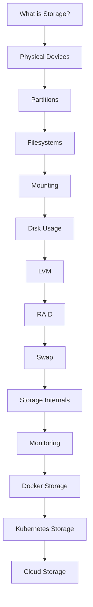
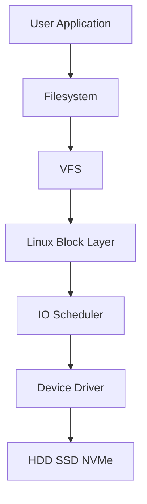
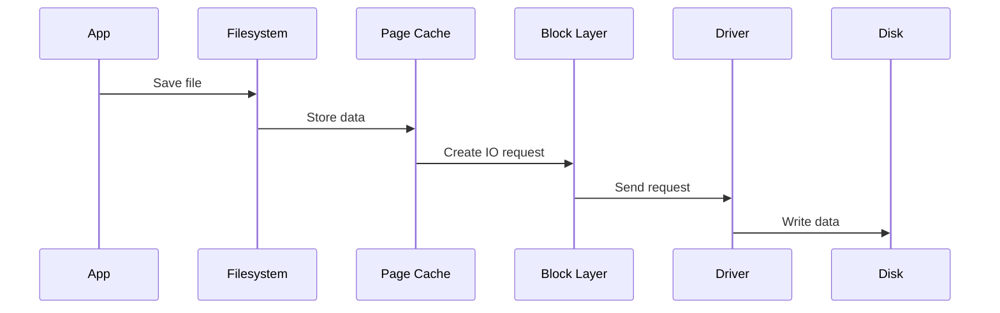
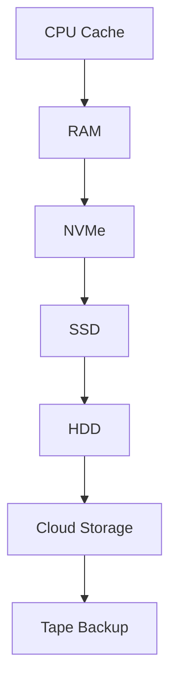
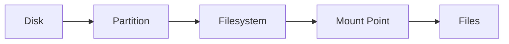
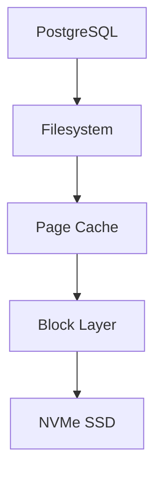

# Storage Management

> Storage is where Linux permanently stores data, but Linux storage is far more than "hard disks".
>
> Modern storage systems involve filesystems, block devices, caches, schedulers, virtual layers, containers, cloud infrastructure, databases, and distributed systems.

This chapter teaches **how Linux stores, moves, organizes, protects, and retrieves data** from first principles to production systems.

By the end of this chapter, you'll understand storage from:

- Beginner perspective
- Linux engineer perspective
- DevOps perspective
- Cloud engineer perspective
- SRE perspective
- System design perspective

---

# Why Storage Exists

RAM is temporary.

If electricity disappears, RAM loses everything.

Storage exists to preserve data permanently.

Think of storage as Linux's long-term memory.

```text
Human Brain

Short Term Memory
↓
RAM

Long Term Memory
↓
Storage
```

---

# Big Picture

Most people think storage is:

```text
Disk
↓
Files
```

But Linux storage is an entire system.

```text
Application

↓

Filesystem

↓

Virtual Filesystem

↓

Block Layer

↓

IO Scheduler

↓

Device Driver

↓

Physical Device
```

---

# Storage Learning Journey



---

# The Linux Storage Stack



Every layer has a responsibility.

| Layer | Responsibility |
|------|---------------|
| Application | Reads and writes data |
| Filesystem | Organizes files |
| VFS | Creates a common filesystem interface |
| Block Layer | Manages IO requests |
| IO Scheduler | Optimizes disk operations |
| Device Driver | Communicates with hardware |
| Physical Disk | Stores data |

---

# Storage Mental Model

Think of storage as a warehouse.

```text
Warehouse

Building
↓
Disk

Rooms
↓
Partitions

Shelves
↓
Filesystem

Boxes
↓
Directories

Documents
↓
Files
```

---

# How Linux Sees Storage

Windows:

```text
C:
D:
E:
```

Linux:

```text
Everything is attached to one root system.
```

```text
/

├── home
├── var
├── boot
├── etc
├── usr
```

Storage devices appear under:

```text
/boot

/dev
```

Example:

```text
/dev/sda
/dev/sda1

/dev/sdb
/dev/nvme0n1
```

---

# Data Journey Inside Linux

What happens when you save a file?



---

# Storage Hierarchy

Different storage technologies have different speeds.



As we go down:

```text
Speed ↓

Latency ↑

Capacity ↑

Cost ↓
```

---

# Physical Storage Technologies

Linux commonly uses:

### HDD

```text
Mechanical Disk

Cheap

Large capacity

Slower
```

### SSD

```text
Flash memory

Fast

Reliable

No moving parts
```

### NVMe

```text
Flash memory

PCIe communication

Extremely fast
```

---

# Storage Components

Linux storage consists of multiple building blocks.



---

# Core Topics Covered

## Foundations

Learn:

- Storage mental models
- Linux storage architecture
- Linux internals
- Data flow inside Linux

---

## Disk Management

Learn:

- Physical disks
- Partitions
- GPT
- MBR
- Device naming

Tools:

```text
lsblk

fdisk

parted

blkid
```

---

## Filesystems

Learn:

```text
ext4

xfs

btrfs
```

Concepts:

```text
inode

superblock

journaling

metadata

data blocks
```

---

## Mounting

Learn:

```text
mount

umount

fstab
```

Questions answered:

```text
How does Linux attach storage?

How does Linux remember storage after reboot?
```

---

## Disk Usage

Tools:

```text
df

du
```

Learn:

```text
Available space

Used space

Inode usage

Directory growth
```

---

## Advanced Storage

Learn:

### LVM

Logical Volume Manager.

```text
Physical Disk

↓

Volume Group

↓

Logical Volume

↓

Filesystem
```

---

### RAID

Redundant Array of Independent Disks.

Goals:

```text
Performance

Redundancy

Fault tolerance
```

---

### Swap

Temporary disk space used as RAM extension.

```text
RAM Full

↓

Swap Used
```

---

# Linux Storage Internals

This repository also teaches internals.

Topics:

```text
Page Cache

IO Scheduler

Writeback Mechanism

Block Layer

Kernel IO Path
```

---

# Modern Infrastructure Storage

Storage today is everywhere.

You'll learn storage in:

### Docker

```text
Bind Mounts

Volumes

tmpfs

OverlayFS
```

### Kubernetes

```text
PV

PVC

StorageClass
```

### Cloud

```text
Object Storage

Block Storage

File Storage
```

---

# Production Data Flow

Imagine a database server.



If any layer becomes slow:

```text
Application becomes slow.
```

---

# Storage Performance Bottlenecks

Common issues:

```text
Disk Full

Slow Disk

High IO Wait

Inode Exhaustion

Filesystem Corruption

Container Volume Issues

Database Latency

Swap Thrashing
```

---

# Real World Examples

## Example 1

Web Server

```text
Nginx

↓

Logs

↓

Filesystem

↓

SSD
```

---

## Example 2

Database Server

```text
PostgreSQL

↓

Write Ahead Logs

↓

NVMe
```

---

## Example 3

Docker Host

```text
Container

↓

OverlayFS

↓

Host Disk
```

---

## Example 4

Kubernetes Cluster

```text
Pod

↓

PVC

↓

PV

↓

Cloud Disk
```

---

# Storage Engineering Mindset

Do not memorize commands.

Always ask:

### Question 1

Where is data physically stored?

### Question 2

Which filesystem stores it?

### Question 3

Which device stores it?

### Question 4

Is page cache involved?

### Question 5

Is storage becoming a bottleneck?

### Question 6

Can this storage survive reboot?

### Question 7

Can this storage survive disk failure?

---

# Learning Outcome

After completing this chapter, you'll be able to:

✅ Understand Linux storage architecture

✅ Create and manage partitions

✅ Mount storage systems

✅ Configure persistent storage

✅ Analyze disk usage

✅ Build LVM systems

✅ Build RAID systems

✅ Understand Linux storage internals

✅ Troubleshoot production storage problems

✅ Understand Docker storage

✅ Understand Kubernetes storage

✅ Understand cloud storage fundamentals

---

# Chapter Files

```text
09-storage-management/

README.md

storage-mental-models.md

how-linux-sees-storage.md

storage-stack.md

storage-first-principles.md

hdd-vs-ssd-vs-nvme.md

disks-and-partitions.md

lsblk.md

blkid.md

fdisk.md

parted.md

filesystems-overview.md

ext4.md

xfs.md

btrfs.md

filesystem-internals.md

mounting.md

fstab.md

disk-usage.md

df.md

du.md

lvm.md

raid.md

swap.md

linux-block-layer.md

io-scheduler.md

page-cache.md

writeback-mechanism.md

storage-monitoring.md

iostat.md

iotop.md

storage-in-docker.md

storage-in-kubernetes.md

cloud-storage-fundamentals.md

storage-troubleshooting.md

storage-security.md

storage-patterns.md

visuals.md

interview-questions.md

references.md
```

---

# Golden Rule

> Great Linux engineers don't memorize storage commands.

> They understand how data flows through the entire Linux storage system.
