# Storage Engineering Visual Atlas

> **This file is a visual-first storage handbook.**

Do not memorize diagrams.

Learn to see systems.

---

# 1. The Entire Storage Journey

This is the most important diagram of the entire storage section.

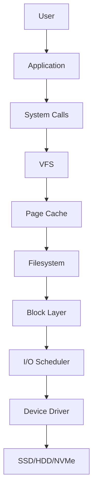

Think:

> User → Software → Kernel → Hardware

---

# 2. Linux Storage Stack

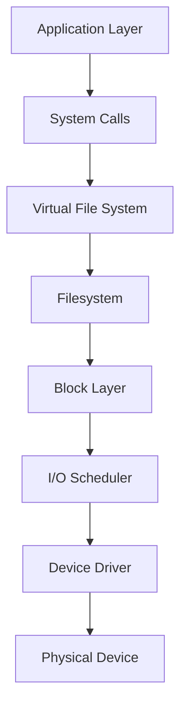

---

# 3. Linux Is A Giant Translation Machine


Example:

```text
save file

↓

write()

↓

filesystem

↓

block writes

↓

SSD
```

---

# 4. File Write Journey

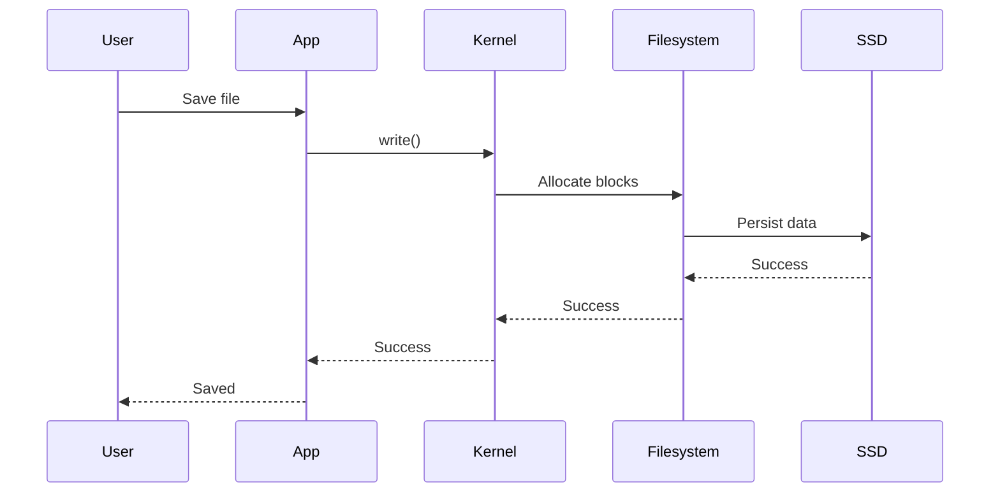

---

# 5. File Read Journey

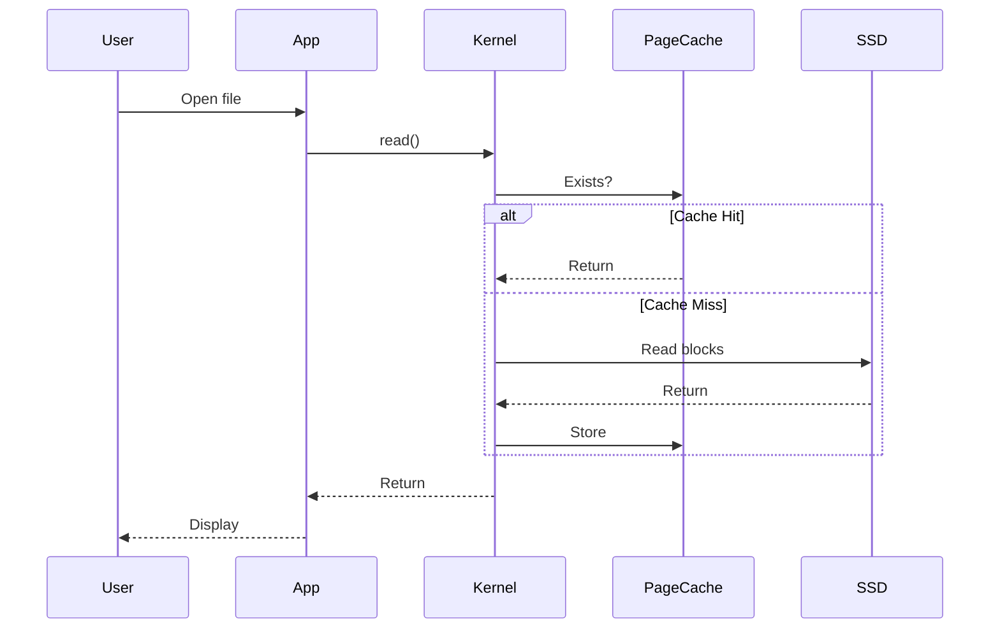

---

# 6. Page Cache Architecture

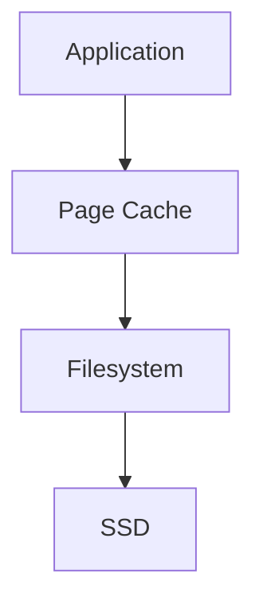

Remember:

> RAM protects storage.

---

# 7. Storage Bottleneck Visualization


When requests exceed disk capacity:

```text
Applications

↓

Queue grows

↓

Latency grows

↓

Users complain
```

---

# 8. Queue Depth Visualization

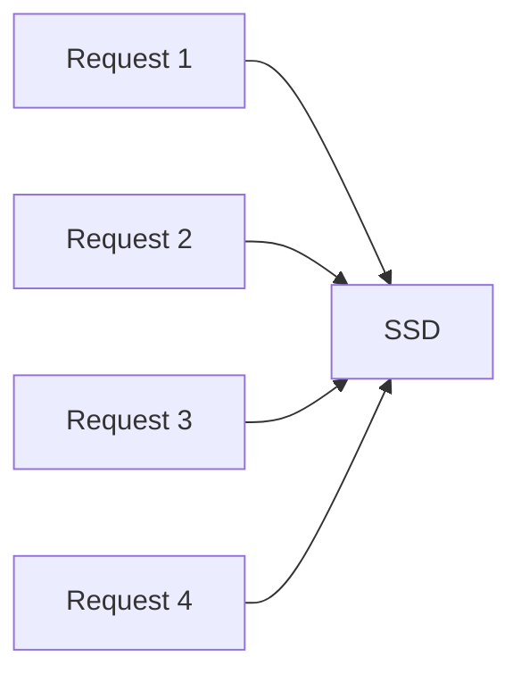

Many requests.

One device.

---

# 9. IOPS Visualization

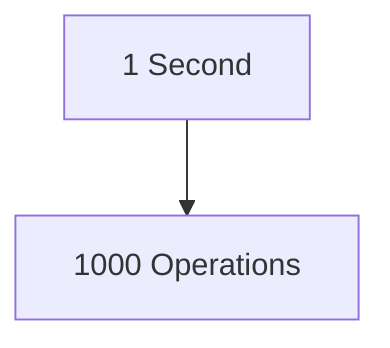

Think:

> IOPS = How many operations can storage perform every second?

---

# 10. Throughput Visualization

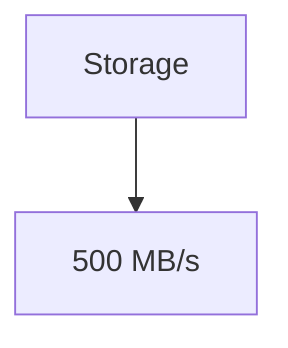

Think:

> Throughput = Amount of data moved.

---

# 11. Latency Visualization


Think:

> Latency = Time to finish one request.

---

# 12. The Relationship Between Storage Metrics

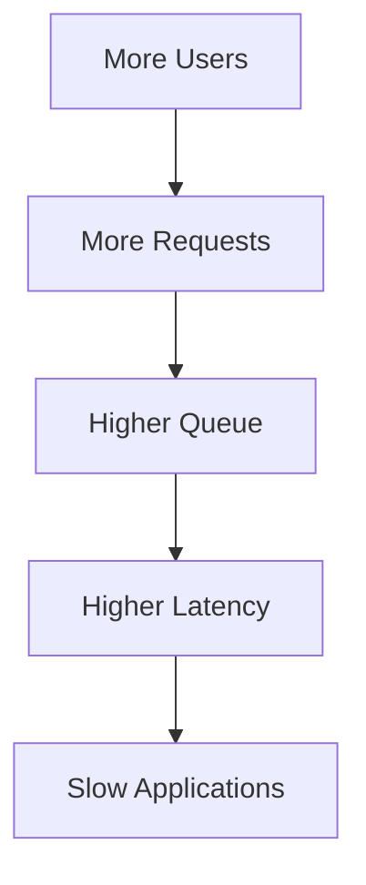

---

# 13. Filesystem Architecture

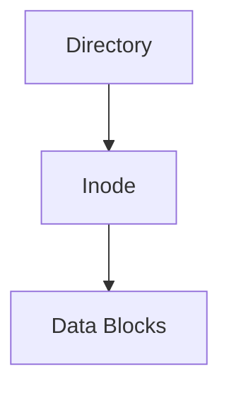

---

# 14. Linux Inode Relationship


---

# 15. Storage Capacity vs Inodes

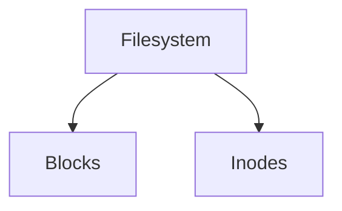

A filesystem can fail in two ways.

```text
No Space

or

No Inodes
```

---

# 16. Filesystem Mount Architecture

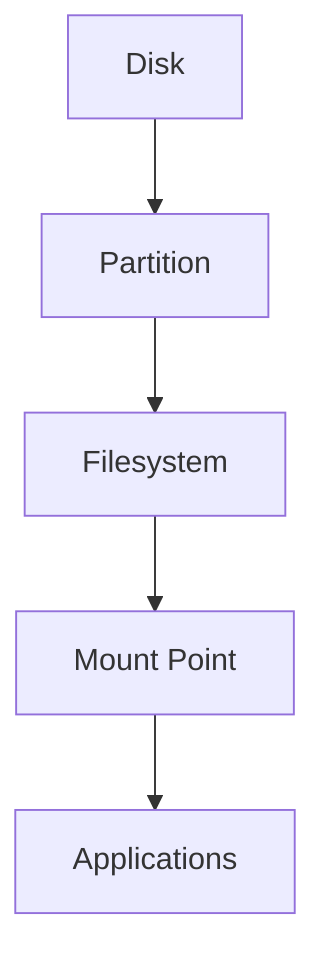

---

# 17. RAID Architecture

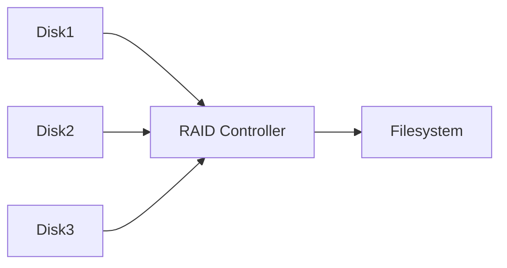

---

# 18. Docker Storage Architecture

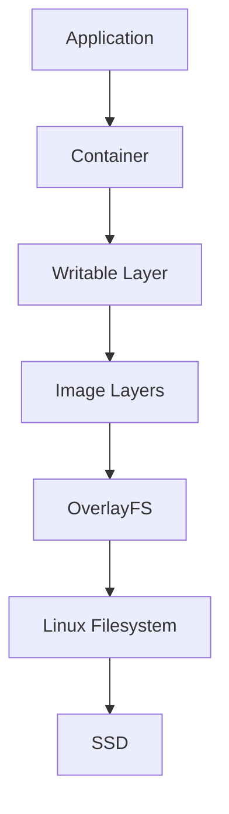

---

# 19. OverlayFS Architecture

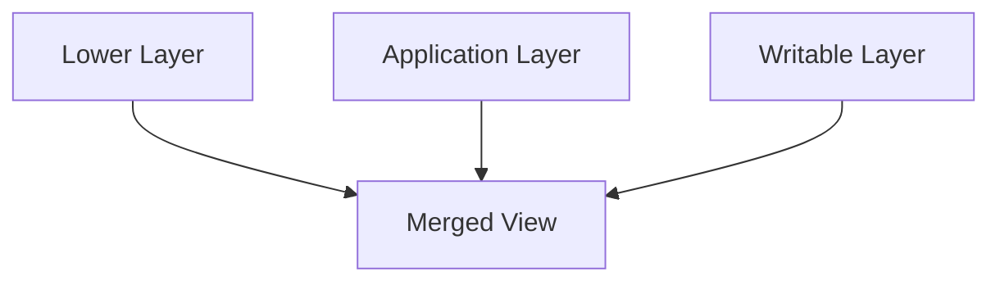

---

# 20. Docker Volume Architecture

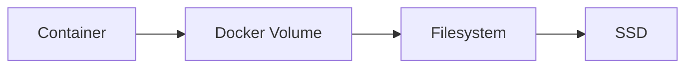

---

# 21. Kubernetes Storage Architecture

```mermaid
flowchart TD

A[Pod]

B[PVC]

C[PV]

D[CSI]

E[Storage System]

F[SSD]

A --> B

B --> C

C --> D

D --> E

E --> F
```

---

# 22. Kubernetes Data Recovery Visualization

```mermaid
flowchart LR

A[Node A]

B[Persistent Storage]

C[Node B]

D[Pod]

E[Pod]

D --> A

D --> B

A -.Crash.-> C

B --> E

E --> C
```

Data survives.

Pod moves.

---

# 23. Cloud Storage Architecture

```mermaid
flowchart TD

A[Application]

B[Network]

C[Storage Cluster]

D[Replication]

E[Physical Disks]

A --> B

B --> C

C --> D

D --> E
```

---

# 24. Object Storage Architecture

```mermaid
flowchart TD

A[User]

B[API]

C[Metadata Service]

D[Storage Nodes]

A --> B

B --> C

B --> D
```

---

# 25. Distributed Storage Architecture

```mermaid
flowchart LR

A[Node 1]

B[Node 2]

C[Node 3]

D[Storage Cluster]

A --> D

B --> D

C --> D
```

---

# 26. Data Replication Architecture

```mermaid
flowchart LR

A[Primary]

B[Replica 1]

C[Replica 2]

A --> B

A --> C
```

---

# 27. Backup Architecture

```mermaid
flowchart TD

A[Production]

B[Local Backup]

C[Cloud Backup]

A --> B

A --> C
```

---

# 28. Hot-Warm-Cold Storage Architecture

```mermaid
flowchart TD

A[Hot]

B[Warm]

C[Cold]

D[Archive]

A --> B

B --> C

C --> D
```

---

# 29. Modern Infrastructure Storage Stack

```mermaid
flowchart TD

A[Users]

B[Applications]

C[Containers]

D[Kubernetes]

E[Cloud Storage]

F[Distributed Storage]

G[Physical Disks]

A --> B

B --> C

C --> D

D --> E

E --> F

F --> G
```

---

# 30. Storage Troubleshooting Pyramid

```mermaid
flowchart TD

A[User Symptoms]

B[Applications]

C[Containers]

D[Databases]

E[Filesystem]

F[Kernel]

G[Disk]

A --> B

B --> C

C --> D

D --> E

E --> F

F --> G
```

---

# 31. Storage Observability Architecture

```mermaid
flowchart LR

A[Applications]

B[Linux Metrics]

C[Prometheus]

D[Grafana]

A --> B

B --> C

C --> D
```

---

# 32. Complete Storage Engineering Map (Master Diagram)

This is the diagram that connects the entire `09-storage-management` folder.

```mermaid
flowchart TD

A[Users]

B[Applications]

C[Linux Kernel]

D[Filesystems]

E[Storage Devices]

F[Docker]

G[Kubernetes]

H[Cloud Storage]

I[Distributed Storage]

J[Monitoring]

K[Security]

L[Troubleshooting]

A --> B

B --> C

C --> D

D --> E

B --> F

F --> G

G --> H

H --> I

I --> J

J --> K

K --> L
```

# How To Read This Visual Atlas

Read these visuals in this order:

```text
1. Linux Storage Journey

2. Page Cache

3. Filesystems

4. Storage Metrics

5. RAID

6. Docker Storage

7. Kubernetes Storage

8. Cloud Storage

9. Distributed Storage

10. Security

11. Observability
