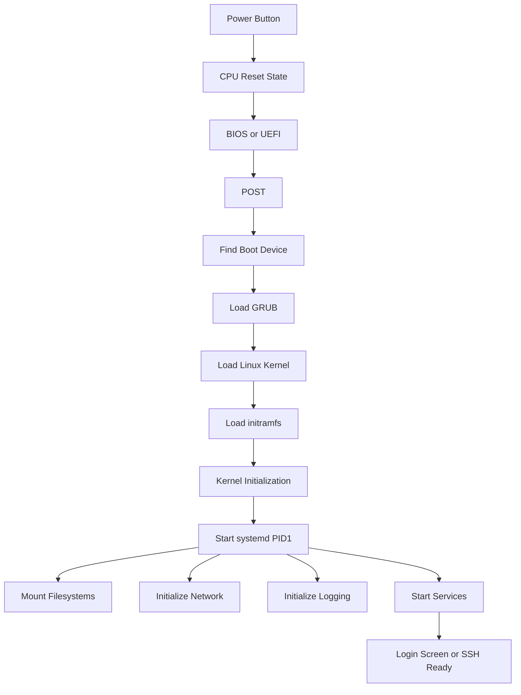
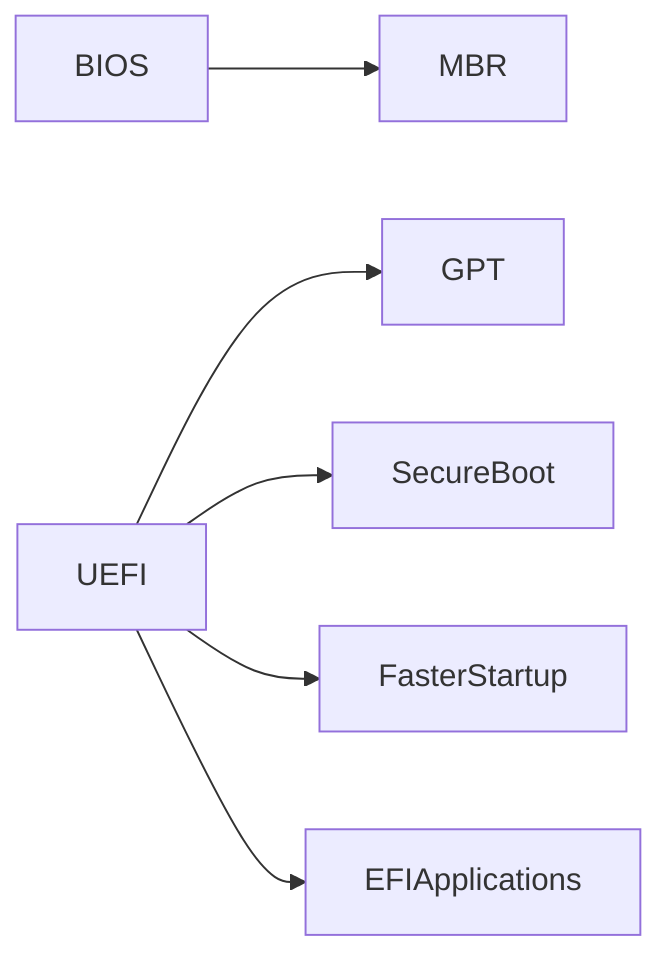
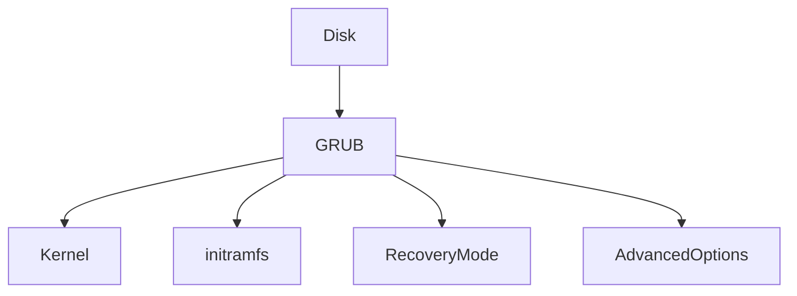
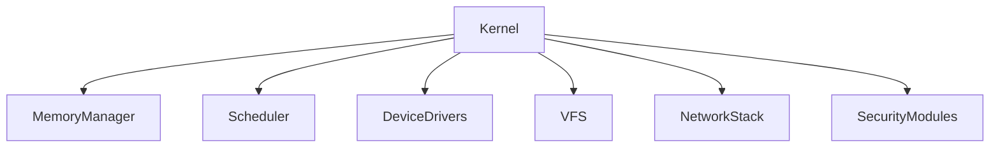
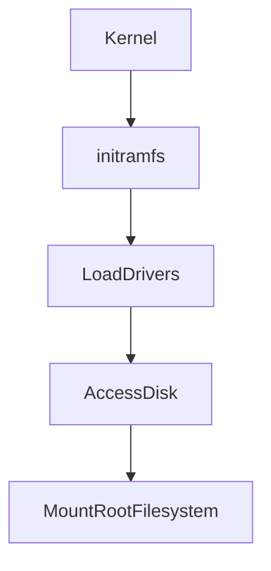
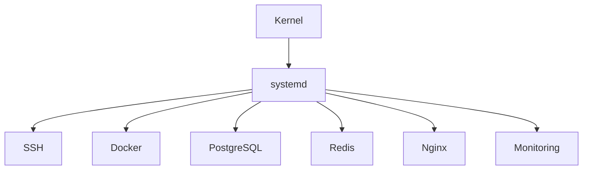
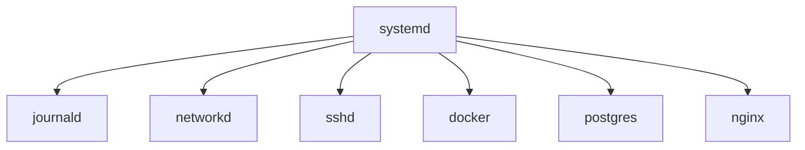
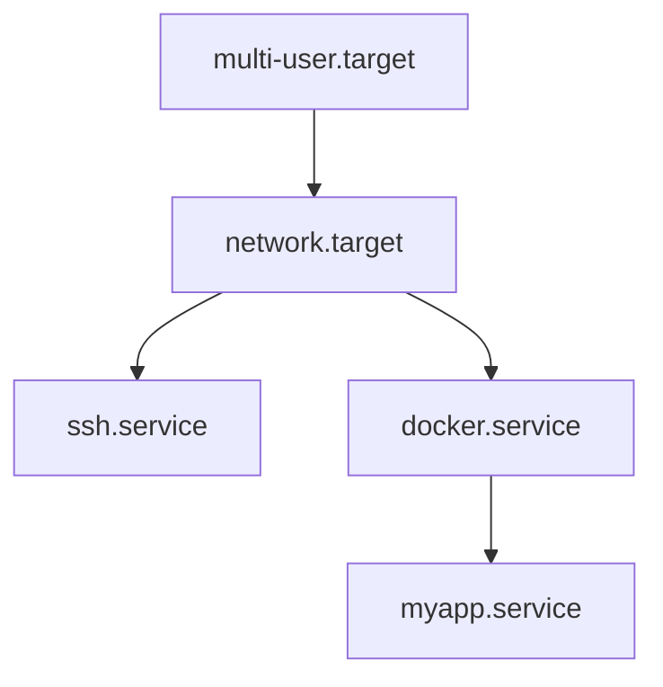
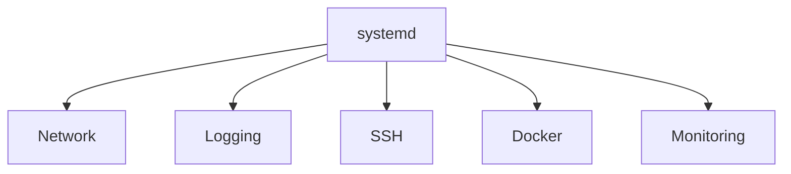

# Linux Boot Process & systemd Deep Fundamentals

> Understanding how a machine transforms from dead silicon into a fully functioning Linux operating system.

---

# Learning Goals

By the end of this file, you will understand:

- What happens after pressing the power button
- BIOS vs UEFI
- POST process
- How bootloaders work
- What GRUB actually does
- What initramfs is
- How Linux kernel initializes itself
- How systemd becomes PID 1
- How userspace is created
- How services start
- Modern Linux boot architecture
- Production boot troubleshooting

---

# The Biggest Misconception

Most people think:

```text
Power ON

↓

Linux starts
```

This is wrong.

Linux startup is one of the most sophisticated orchestration systems ever built.

More accurate:

```text
Power ON

↓

Hardware initialization

↓

Firmware execution

↓

Bootloader

↓

Kernel initialization

↓

Temporary filesystem

↓

PID1 systemd

↓

Userspace initialization

↓

Dependency graph resolution

↓

Services startup

↓

Operating system ready
```

---

# The Entire Journey



---

# Think Like An Engineer

Imagine you're building an operating system.

Question:

> How do we go from a powerless machine to a working server?

There are many problems.

## Problem 1

CPU has no idea what Linux is.

CPU only understands machine instructions.

Someone must tell it what to execute.

---

## Problem 2

RAM is empty.

Programs disappear after shutdown.

Someone must load Linux into memory.

---

## Problem 3

The disk contains many files.

Who knows which file to execute first?

Someone must choose.

---

## Problem 4

Linux kernel cannot immediately understand every hardware device.

Drivers must initialize.

---

## Problem 5

Applications cannot start randomly.

Dependencies exist.

Example:

```text
Nginx

depends on

↓

Network

↓

Filesystem

↓

Kernel
```

Someone must orchestrate this.

That orchestrator is systemd.

---

# Stage 0 : Hardware Exists

Components:

```text
CPU

RAM

SSD/HDD

Motherboard

GPU

Network Card

Storage Controllers

USB Controllers
```

Everything is powered off.

Nothing exists in memory.

---

# Stage 1 : Power Button Pressed

Electricity flows.

CPU resets itself.

CPU enters a known state.

This location is predetermined by hardware manufacturers.

CPU asks:

> Where is my first instruction?

Motherboard firmware answers.

---

# Stage 2 : BIOS or UEFI Starts

This firmware lives inside motherboard memory.

Responsibilities:

```text
Initialize hardware

Detect RAM

Detect CPU

Detect disks

Detect keyboard

Detect USB

Find boot device
```

---

# BIOS vs UEFI

## BIOS

Legacy system.

Characteristics:

```text
16-bit

Older

Slower

MBR based

Limited features
```

---

## UEFI

Modern firmware.

Characteristics:

```text
64-bit

Fast

Secure Boot

GPT support

Large disks support

Better interfaces
```

---

# BIOS vs UEFI Visual



---

# Stage 3 : POST

POST means:

```text
Power On Self Test
```

Checks:

```text
RAM

CPU

Storage

Keyboard

Fans

Basic hardware
```

If hardware fails:

Boot stops.

Example:

```text
RAM Failure

↓

Beep Codes

↓

No Linux
```

---

# Stage 4 : Locate Boot Device

Firmware searches for bootable devices.

Order may look like:

```text
1 SSD

2 HDD

3 USB

4 Network PXE
```

Chosen device contains bootloader.

---

# Stage 5 : GRUB Starts

GRUB means:

```text
Grand Unified Bootloader
```

GRUB is NOT Linux.

GRUB is a launcher.

Think:

```text
Netflix App

↓

Choose Movie

↓

Play Movie
```

GRUB:

```text
Choose Kernel

↓

Load Kernel

↓

Play Linux
```

---

# GRUB Responsibilities

GRUB does:

```text
Kernel selection

Recovery mode

Kernel parameters

Multiple operating systems

Load initramfs
```

---

# GRUB Visual



---

# Where Is GRUB Stored?

Depends on system.

Legacy BIOS:

```text
MBR

Boot partition
```

UEFI:

```text
EFI System Partition

/boot/efi
```

Example:

```bash
ls /boot
```

Example:

```text
vmlinuz

initrd.img

grub
```

---

# Stage 6 : Linux Kernel Loads

Kernel is the core of Linux.

Kernel responsibilities:

```text
Memory management

CPU scheduling

Process management

Filesystem management

Device drivers

Networking

Security
```

Kernel file:

```text
vmlinuz
```

---

# Kernel Is Not The Operating System

This is important.

Many people say:

```text
Linux = Operating System
```

Actually:

```text
Linux = Kernel
```

The operating system is:

```text
Kernel

+

Userspace

+

Libraries

+

Services

+

Applications
```

---

# Kernel Initialization

Kernel initializes subsystems.



---

# Stage 7 : initramfs Loads

initramfs means:

```text
Initial RAM Filesystem
```

Question:

Why?

Because kernel may not yet know how to access the real disk.

Problem:

```text
Kernel

↓

Needs drivers

↓

Drivers stored on disk

↓

Kernel can't access disk yet
```

Circular dependency.

initramfs solves this.

---

# initramfs Visual



---

# initramfs Responsibilities

Contains:

```text
Storage drivers

Filesystem drivers

Recovery tools

Encryption tools

Scripts
```

Then it mounts:

```text
/
```

The root filesystem.

---

# Stage 8 : Root Filesystem Mounted

Linux finally gains access to:

```text
/etc

/home

/var

/usr

/bin

/lib
```

Now Linux can become a full OS.

---

# Stage 9 : Kernel Creates PID 1

The kernel asks:

> Which process should manage everything?

Default answer:

```text
systemd
```

Kernel executes:

```text
/sbin/init
```

Usually linked to:

```text
/lib/systemd/systemd
```

Verify:

```bash
ls -l /sbin/init
```

Example:

```text
/ sbin/init -> /lib/systemd/systemd
```

---

# Why PID 1 Is Special

PID1 has superpowers.

Responsibilities:

```text
Create userspace

Start services

Monitor processes

Handle shutdown

Handle reboot

Adopt orphan processes
```

---

# PID 1 Visualization



---

# Stage 10 : systemd Builds Userspace

systemd starts:

```text
Logging

Networking

Mounts

Services

Timers

User sessions
```

systemd builds the operating system.

---

# Userspace Visualization



---

# systemd Does NOT Start Randomly

Everything is a dependency graph.

Example:



---

# Parallel Boot

Older Linux:

```text
A

↓

B

↓

C

↓

D
```

Modern Linux:



---

# Production Example

Imagine Ubuntu server.

Applications:

```text
Nginx

Docker

Redis

PostgreSQL

SSH

Prometheus
```

Power restored after outage.

Who coordinates startup?

systemd.

---

# Boot Timing Analysis

Useful command:

```bash
systemd-analyze
```

Example:

```text
Startup finished in

2.1s firmware

1.5s loader

4.0s kernel

3.2s userspace
```

---

# Boot Critical Path

Useful:

```bash
systemd-analyze critical-chain
```

Shows:

```text
What delayed boot?
```

Example:

```text
network.target

↓

docker.service

↓

application.service
```

---

# Boot Visualization Command

```bash
systemd-analyze plot > boot.svg
```

Produces:

```text
Boot timeline graph
```

---

# Troubleshooting Boot Problems

## Problem 1

System stuck at black screen.

Investigate:

```bash
journalctl -b
```

---

## Problem 2

Slow boot.

Investigate:

```bash
systemd-analyze blame
```

---

## Problem 3

Failed services.

Investigate:

```bash
systemctl --failed
```

---

## Problem 4

Dependency failures.

Investigate:

```bash
systemctl list-dependencies
```

---

# Engineering Mindset

Do not memorize:

```bash
systemctl start nginx
```

Instead understand:

```text
Power

↓

Firmware

↓

Bootloader

↓

Kernel

↓

systemd

↓

Dependency Graph

↓

Operating System
```

This is how Linux actually comes alive.

---

# The Mental Model To Remember Forever

```text
Hardware gives birth to Firmware

Firmware gives birth to Bootloader

Bootloader gives birth to Kernel

Kernel gives birth to systemd

systemd gives birth to Linux
```

That sentence alone explains the entire Linux boot process.
