# Service Lifecycle Deep Fundamentals

> Understanding how applications are born, live, evolve, fail, recover, and die inside a Linux operating system.

---

# Learning Goals

By the end of this file, you will understand:

- What a service lifecycle is
- Why lifecycle management exists
- How systemd thinks
- Service state transitions
- Service activation process
- Service monitoring
- Failure detection
- Recovery mechanisms
- Shutdown process
- Reload process
- Restart strategies
- Signal handling
- Resource cleanup
- Production lifecycle design
- Modern infrastructure lifecycle management

---

# First Principles

Imagine Linux boots.

Question:

> How does an application become a production service?

Many beginners think:

```text
Application

↓

Running
```

Wrong.

There are many stages.

A production service has an entire life.

---

# Human Life Analogy

Think of services like humans.

```text
Birth

↓

Preparation

↓

Start

↓

Work

↓

Health Monitoring

↓

Failure

↓

Recovery

↓

Shutdown

↓

Death
```

Services have the exact same lifecycle.

---

# The Biggest Idea

A service is not a process.

A service is a continuously managed living entity.

systemd continuously asks:

```text
Is it running?

↓

Is it healthy?

↓

Did it fail?

↓

Should I restart it?

↓

Should I stop it?

↓

Should I reload configuration?

↓

Should I log everything?
```

---

# High Level Lifecycle

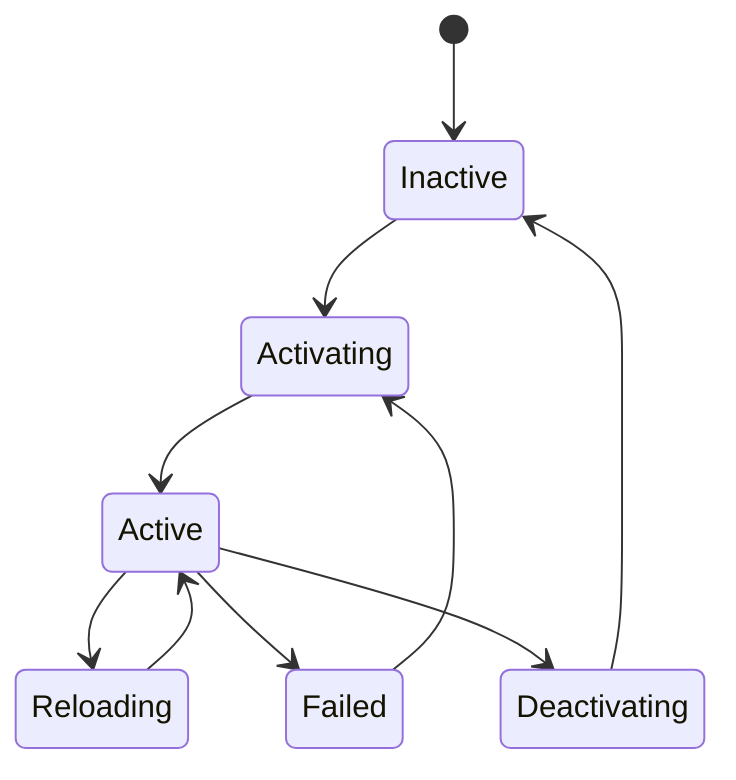

---

# The Linux Boot Perspective

Remember:

```text
Power On

↓

Firmware

↓

Bootloader

↓

Kernel

↓

systemd

↓

Services
```

After systemd starts, the service lifecycle begins.

---

# How systemd Thinks

systemd behaves like a manager.

```text
Read Unit

↓

Resolve Dependencies

↓

Start Application

↓

Monitor Health

↓

Handle Signals

↓

Recover Failures

↓

Shutdown Cleanly
```

---

# Lifecycle Architecture

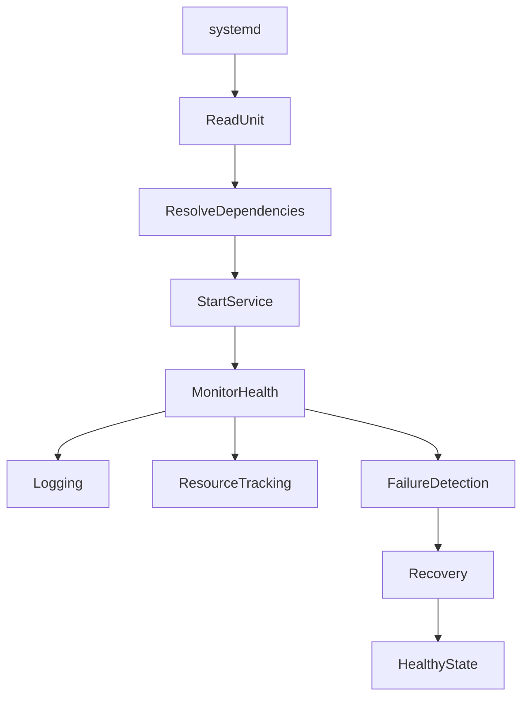

---

# Stage 1 : Inactive

State:

```text
Inactive
```

Nothing is running.

Example:

```bash
systemctl status nginx
```

Output:

```text
inactive (dead)
```

This means:

```text
Unit exists

↓

Process does not exist
```

---

# Visual

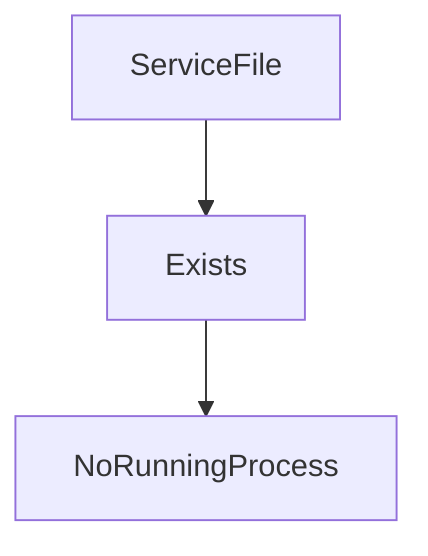

---

# Stage 2 : Activation

Systemd starts preparing.

Tasks:

```text
Read unit file

↓

Resolve dependencies

↓

Allocate resources

↓

Prepare environment

↓

Execute startup commands
```

---

# Activation Visualization

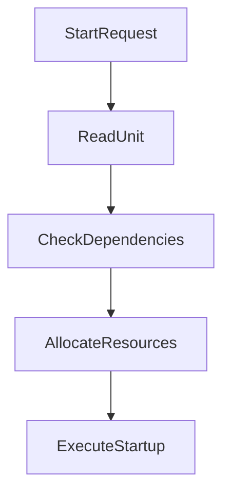

---

# Stage 3 : Active State

This is the healthy state.

Characteristics:

```text
Process exists

↓

Resources allocated

↓

Monitoring active

↓

Logging active

↓

Ready for requests
```

---

# Active State Visual

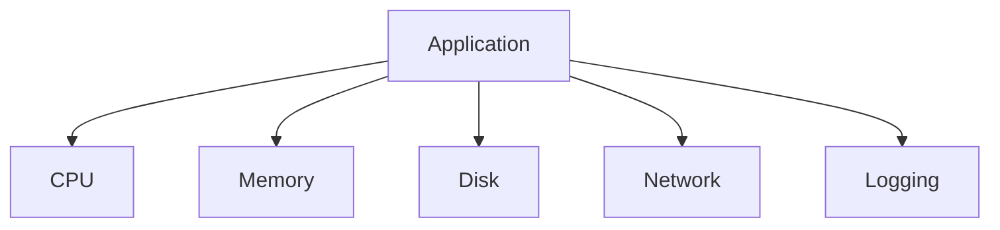

---

# Example

Nginx.

```text
nginx.service

↓

Master Process

↓

Worker Processes
```

Visual:

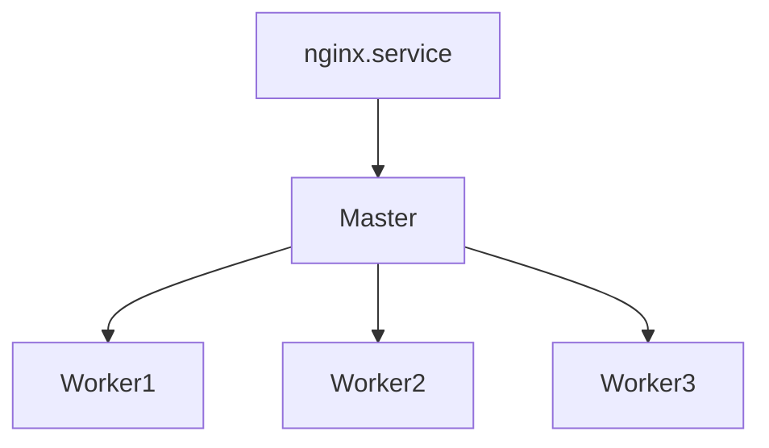

---

# Stage 4 : Monitoring

This is systemd's superpower.

systemd continuously watches:

```text
PID

CPU

Memory

Failures

Signals

Timeouts

Logs
```

---

# Monitoring Visual

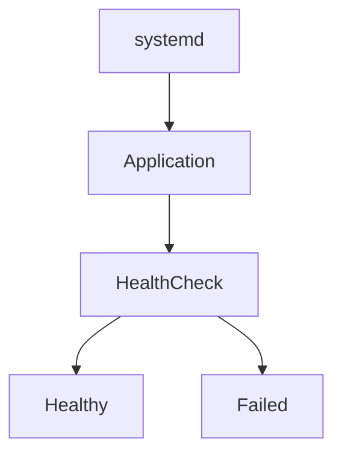

---

# Stage 5 : Reload

Question:

Can we apply new configuration without stopping the application?

Yes.

This is reload.

Examples:

```bash
systemctl reload nginx
```

Configuration changes.

Users are unaffected.

---

# Reload Visual

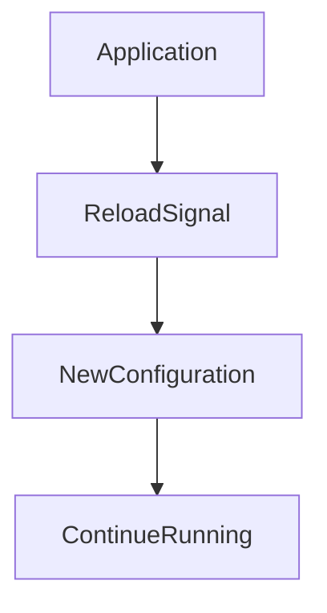

---

# Stage 6 : Failure Detection

Question:

How does systemd know something broke?

Several ways.

---

# Method 1

Process exits unexpectedly.

```text
Segmentation Fault

↓

Crash
```

---

# Method 2

Watchdog timeout.

```text
Application stops responding
```

---

# Method 3

Startup timeout.

```text
Application takes too long
```

---

# Failure Visual

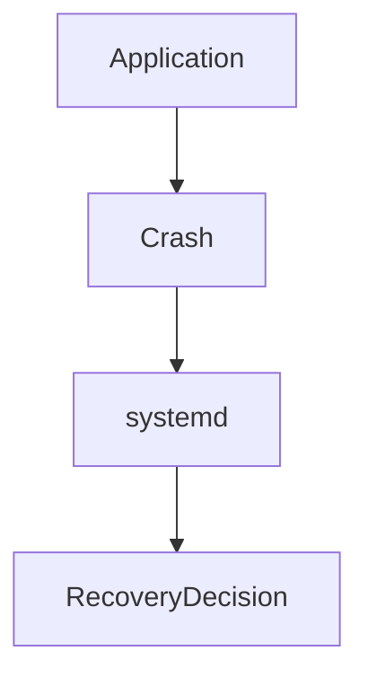

---

# Stage 7 : Recovery

Systemd can heal services.

Example:

```ini
Restart=always
```

Visual:

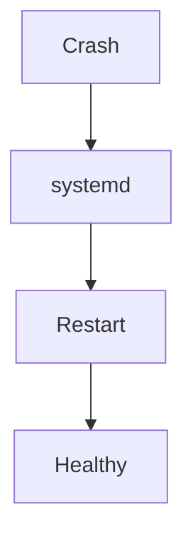

---

# Recovery Policies

---

# Restart=no

Never restart.

---

# Restart=always

Always restart.

---

# Restart=on-failure

Restart only after failures.

---

# Restart=on-abnormal

Restart after abnormal exits.

---

# Restart=on-watchdog

Restart watchdog failures.

---

# Restart Delay

```ini
RestartSec=5
```

Visual:

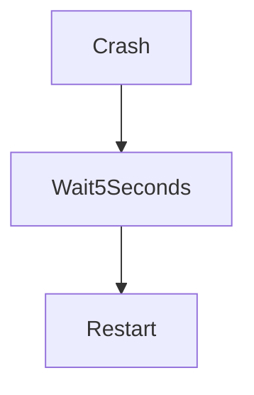

---

# Stage 8 : Shutdown

Systemd gracefully stops applications.

Question:

Why graceful?

Because applications may need cleanup.

Examples:

```text
Save data

Close database connections

Flush logs

Release memory

Close sockets
```

---

# Shutdown Visual

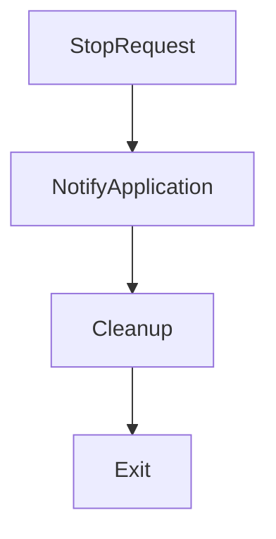

---

# Signal Flow

Linux uses signals.

Common ones:

```text
SIGTERM

SIGKILL

SIGHUP
```

---

# Signal Lifecycle

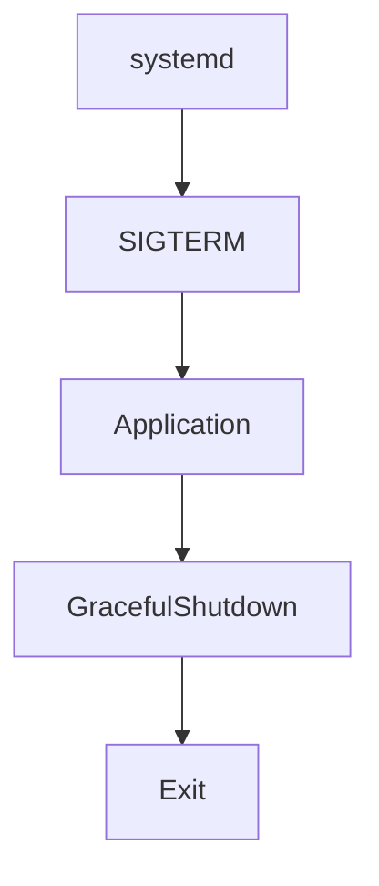

---

# SIGTERM

Polite request.

```text
Please stop
```

Applications should clean up.

---

# SIGKILL

Force stop.

```text
Stop immediately
```

Cannot be ignored.

---

# SIGHUP

Reload configuration.

```text
Reload yourself
```

Commonly used by:

```text
nginx

apache
```

---

# Timeout Handling

What if application ignores SIGTERM?

systemd escalates.

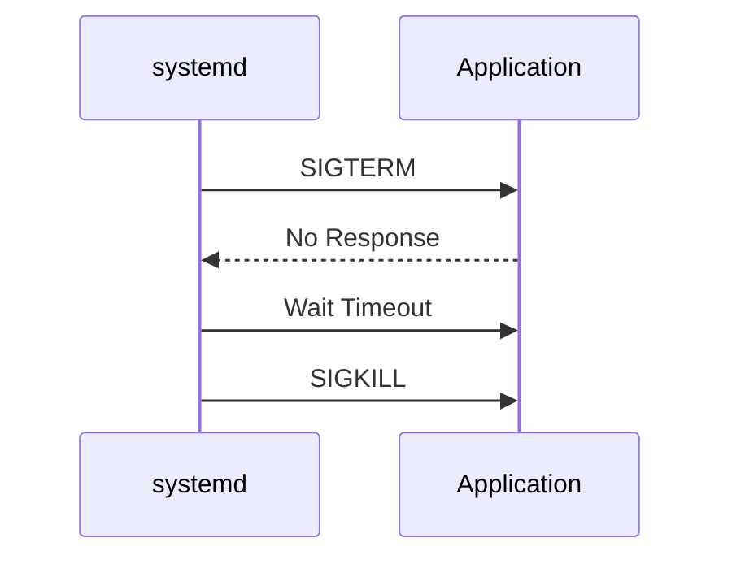

---

# Timeout Configuration

```ini
TimeoutStartSec=30

TimeoutStopSec=20
```

Meaning:

```text
Start timeout

↓

Stop timeout
```

---

# Lifecycle + Dependencies

Applications don't exist alone.

Example:

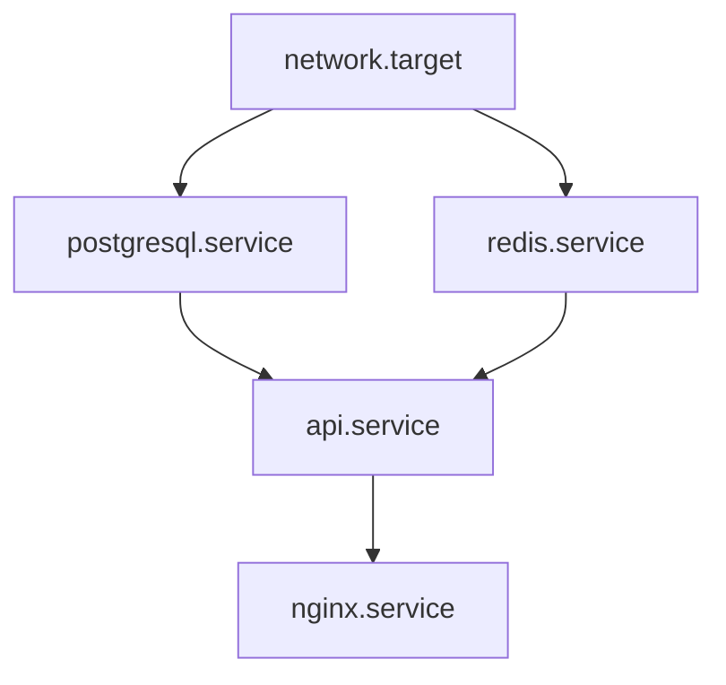

The lifecycle of one service affects others.

---

# Service State Machine Internals

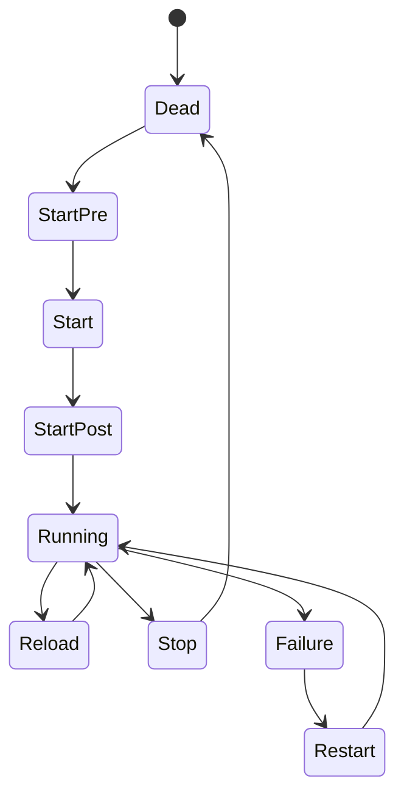

---

# What Happens During Start?

systemd executes directives.

Order:

```text
ExecStartPre

↓

ExecStart

↓

ExecStartPost
```

Visual:


---

# Resource Lifecycle

Services also have resource lifecycles.

Resources:

```text
CPU

Memory

Sockets

Threads

File Descriptors

Disk I/O
```

---

# Resource Visualization

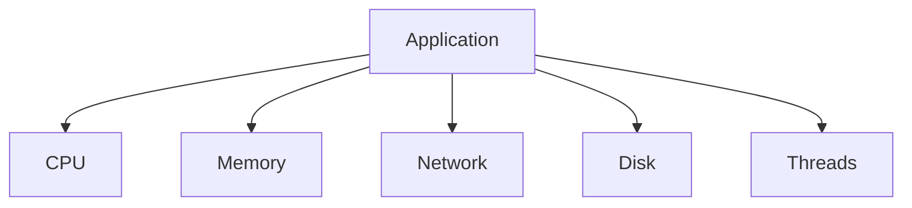

---

# cgroups Relationship

systemd uses cgroups.

Why?

To track every resource.

Visual:

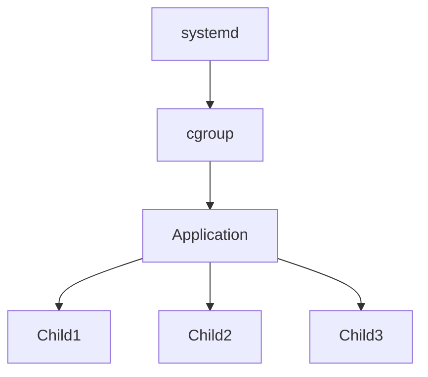

---

# Docker Relationship

Docker itself is a service.

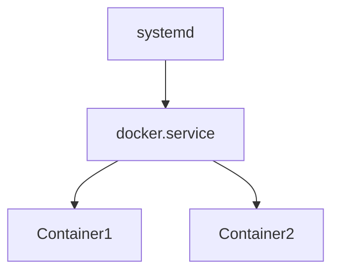

Docker lifecycle depends on systemd.

---

# Kubernetes Relationship

```mermaid
flowchart TD

systemd

systemd --> containerd.service

systemd --> kubelet.service

kubelet.service --> Pods
```

---

# Production Example

Imagine:

```text
Node API

Redis

PostgreSQL

Nginx

Prometheus
```

Lifecycle:

```mermaid
flowchart TD

Network

Network --> Redis

Network --> PostgreSQL

Redis --> API

PostgreSQL --> API

API --> Nginx

Nginx --> Monitoring
```

---

# Lifecycle Troubleshooting Workflow

Question:

Service unhealthy.

Step 1

Status.

```bash
systemctl status service-name
```

Step 2

Logs.

```bash
journalctl -u service-name
```

Step 3

Inspect properties.

```bash
systemctl show service-name
```

Step 4

Dependencies.

```bash
systemctl list-dependencies service-name
```

Step 5

Failed services.

```bash
systemctl --failed
```

---

# Common Beginner Mistakes

## Mistake 1

Thinking services are processes.

Wrong.

Services manage processes.

---

## Mistake 2

Ignoring restart policies.

Bad for production.

---

## Mistake 3

Using SIGKILL first.

Never do this.

Prefer:

```text
SIGTERM

↓

Cleanup

↓

SIGKILL if necessary
```

---

## Mistake 4

Ignoring dependencies.

Services are connected.

---

# Engineering Mindset

Do not think:

```text
Applications run
```

Think:

```text
Applications live inside an operating system lifecycle
```

That is how systemd thinks.

---

# The Mental Model To Remember Forever

```text
Application

↓

Lifecycle

↓

systemd

↓

Observability

↓

Recovery

↓

Healthy Infrastructure
```

Or:

```text
systemd does not run applications.

systemd manages their entire life.
```

That single sentence explains service lifecycle management.
