# Service Units Deep Fundamentals

> Understanding how systemd turns ordinary applications into self-healing, observable, production-grade operating system services.

---

# Learning Goals

By the end of this file, you will understand:

- What service units are
- Why service units exist
- How services differ from processes
- Service lifecycle
- Service anatomy
- Service states
- Service types
- Restart policies
- Execution flow
- Resource management
- Security hardening
- Production service design
- Docker and Kubernetes relationships
- Troubleshooting methodology

---

# First Principles

Imagine Linux boots.

Question:

Who starts:

```text
SSH

Docker

PostgreSQL

Nginx

Redis

Prometheus
```

Nobody manually logs in and types:

```bash
systemctl start nginx

systemctl start docker

systemctl start redis
```

Linux must automatically create its own environment.

That is the job of service units.

---

# The Biggest Idea

A service unit is not an application.

It is a blueprint.

Think:

```text
Application = Worker

Service Unit = Employment Contract

systemd = Manager
```

The contract says:

```text
How to start

↓

When to start

↓

How to stop

↓

What resources to use

↓

How to recover

↓

What to do on failure
```

---

# Official Definition

A service unit is:

> A configuration object that describes how a background process or application should be executed and managed by systemd.

---

# Mental Model

Think of Linux as a company.

```text
Linux = Company

systemd = CEO

Services = Employees

Dependencies = Departments

Logs = Reports

Timers = Schedules
```

Employees don't randomly appear.

The CEO manages them.

---

# Everything Is Built On Services

Modern Linux servers:

```text
Ubuntu

↓

systemd

↓

SSH

Docker

PostgreSQL

Redis

Nginx

Monitoring

Applications
```

---

# Architecture Overview

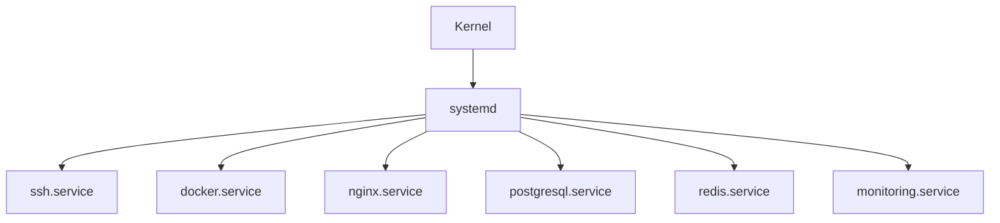

---

# Service Units Are NOT Processes

This is one of the most important concepts.

People confuse them.

They are different.

## Process

A running program.

Example:

```text
PID 3421
```

---

## Service Unit

A blueprint.

Example:

```text
nginx.service
```

---

# Relationship

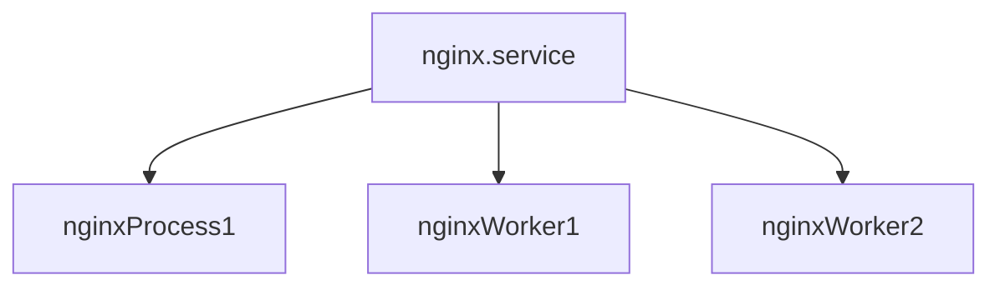

One service can create many processes.

---

# Service Unit Naming

Convention:

```text
name.service
```

Examples:

```text
docker.service

nginx.service

sshd.service

redis.service

postgresql.service

containerd.service
```

---

# Where Service Files Live

Three important places.

## Package Installed

```text
/usr/lib/systemd/system
```

or

```text
/lib/systemd/system
```

---

## Administrator Created

```text
/etc/systemd/system
```

---

## Runtime Generated

```text
/run/systemd/system
```

---

# Search Priority

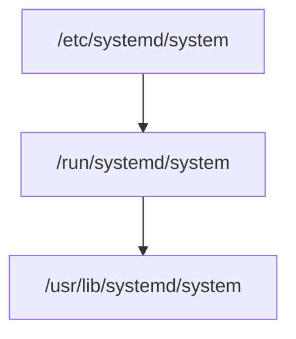

Highest priority:

```text
/ etc

↓

/ run

↓

/ usr/lib
```

---

# Anatomy Of A Service File

Example:

```ini
[Unit]

Description=My Application

After=network.target

[Service]

ExecStart=/usr/bin/myapp

Restart=always

User=appuser

[Install]

WantedBy=multi-user.target
```

Three sections exist.

---

# Section 1 : [Unit]

This is metadata.

Example:

```ini
[Unit]

Description=My Application

After=network.target

Requires=postgresql.service
```

Questions answered:

```text
Who am I?

↓

What do I need?

↓

What order should I start?
```

---

# Section 2 : [Service]

Behavior.

Questions answered:

```text
How do I run?

↓

How do I stop?

↓

How do I recover?
```

---

# Section 3 : [Install]

Boot integration.

Question:

```text
When should I start?
```

---

# Service Lifecycle

Every service follows a lifecycle.

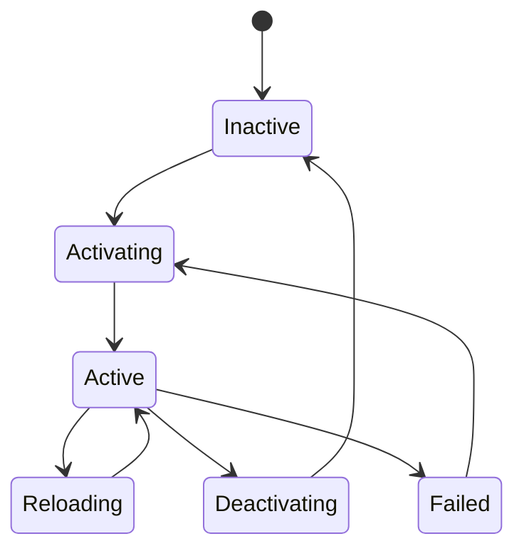

---

# State Meanings

## Inactive

```text
Not running
```

---

## Activating

```text
Starting
```

---

## Active

```text
Running
```

---

## Reloading

```text
Applying configuration
```

---

## Deactivating

```text
Stopping
```

---

## Failed

```text
Something broke
```

---

# Service Types

Very important.

Many engineers ignore these.

```ini
Type=
```

tells systemd how the application behaves.

---

# Type=simple

Default.

Systemd assumes:

```text
Process starts

↓

Process is running
```

Example:

```ini
Type=simple
```

Visual:

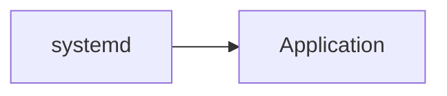

---

# Type=forking

Old daemons.

Application forks.

```text
Parent exits

↓

Child continues
```

Example:

```ini
Type=forking
```

Visual:

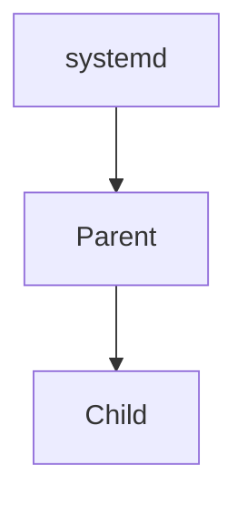

Examples:

```text
Old Apache

Old MySQL
```

---

# Type=oneshot

Run once.

Exit.

Examples:

```text
Backups

Setup scripts

Initialization tasks
```

---

# Visual

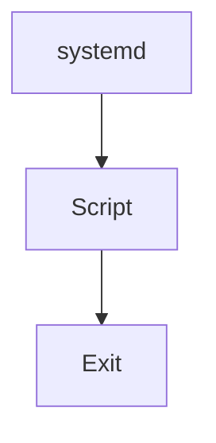

---

# Type=notify

Application notifies systemd.

Example:

```text
I'm ready.
```

Visual:

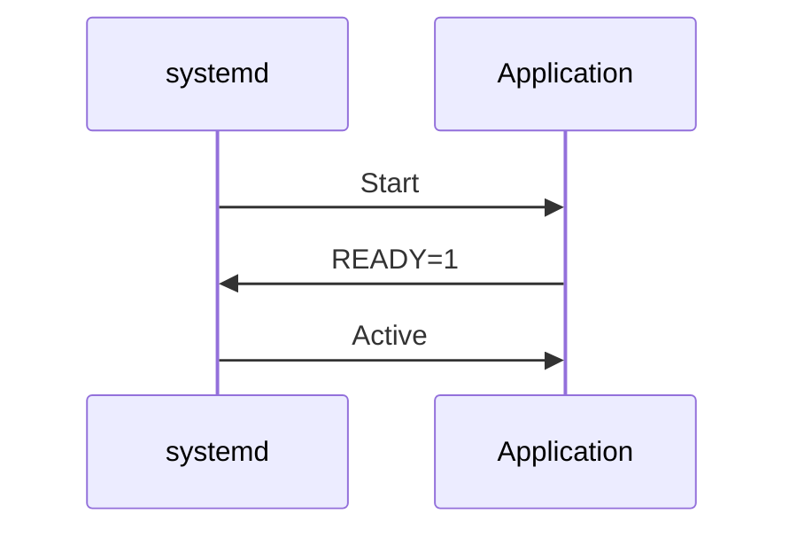

---

# Type=idle

Delayed startup.

Starts after other jobs.

Rarely used.

---

# Service Execution Flow

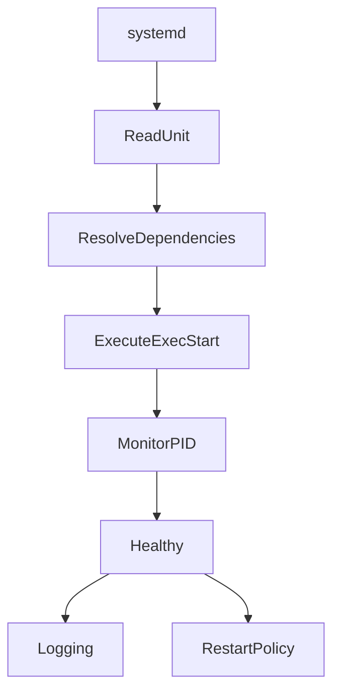

---

# Exec Directives

These are extremely important.

---

# ExecStart

Main command.

```ini
ExecStart=/usr/bin/myapp
```

---

# ExecStartPre

Runs before startup.

```ini
ExecStartPre=/usr/bin/check-db
```

---

# ExecStartPost

Runs after startup.

```ini
ExecStartPost=/usr/bin/notify
```

---

# ExecStop

Graceful shutdown.

```ini
ExecStop=/usr/bin/cleanup
```

---

# ExecReload

Reload configuration.

```ini
ExecReload=/bin/kill -HUP $MAINPID
```

---

# Execution Visual

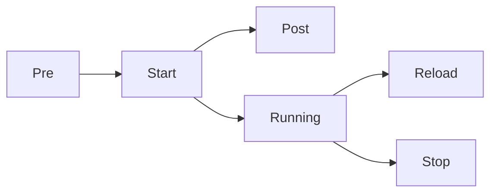

---

# Restart Policies

One of systemd's superpowers.

Directive:

```ini
Restart=
```

---

# Restart=no

Never restart.

---

# Restart=always

Always restart.

---

# Restart=on-failure

Only restart on errors.

---

# Restart=on-abnormal

Restart on crashes.

---

# Restart=on-watchdog

Restart watchdog failures.

---

# Visual

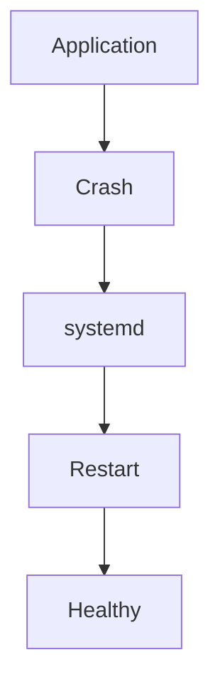

---

# Restart Delay

```ini
RestartSec=5
```

Wait:

```text
5 seconds

↓

Restart
```

---

# Process Supervision

systemd continuously watches processes.

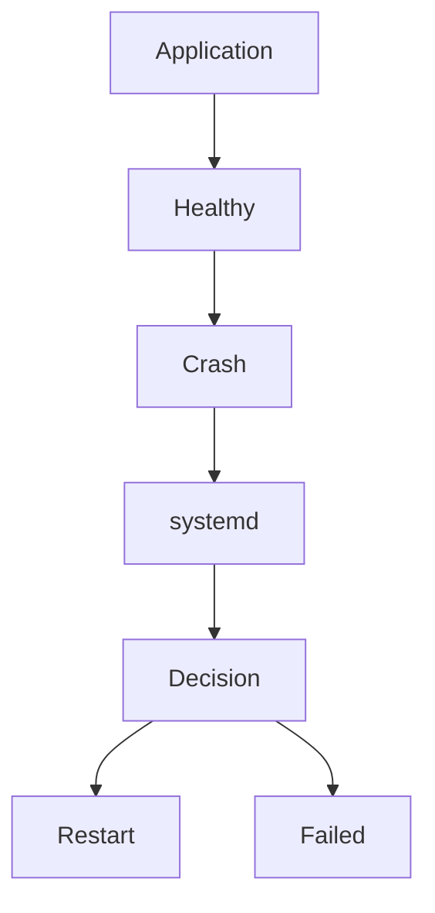

---

# Service Resource Management

systemd integrates with cgroups.

You can control:

```text
CPU

Memory

I/O

Processes
```

---

# CPU Limits

```ini
CPUQuota=50%
```

Maximum:

```text
Half CPU
```

---

# Memory Limits

```ini
MemoryMax=512M
```

Maximum:

```text
512 MB
```

---

# Process Limits

```ini
TasksMax=100
```

Maximum:

```text
100 processes
```

---

# Resource Visualization

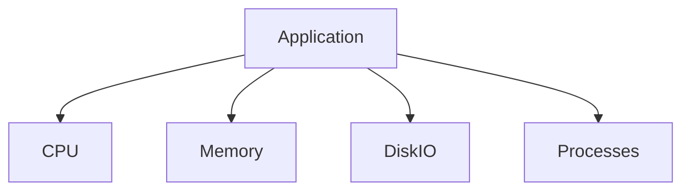

---

# Security Hardening

One of the most underrated systemd features.

---

# Run As User

```ini
User=myapp
```

Never run as root.

---

# Group

```ini
Group=mygroup
```

---

# Private Tmp

```ini
PrivateTmp=true
```

Own temporary directory.

---

# Protect System

```ini
ProtectSystem=strict
```

Read only system files.

---

# Protect Home

```ini
ProtectHome=true
```

Blocks home directory access.

---

# No New Privileges

```ini
NoNewPrivileges=true
```

Prevents privilege escalation.

---

# Security Visualization

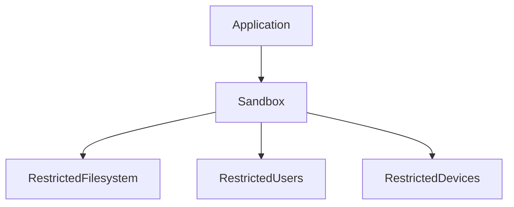

---

# Boot Integration

Two different concepts.

---

# Start

```bash
systemctl start nginx
```

Run now.

---

# Enable

```bash
systemctl enable nginx
```

Run during boot.

---

# Visual

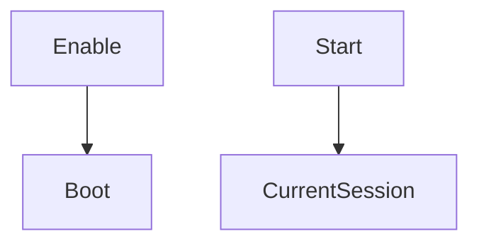

---

# Production Example

Imagine:

```text
NodeJS API

↓

Redis

↓

PostgreSQL

↓

Nginx
```

Dependencies:

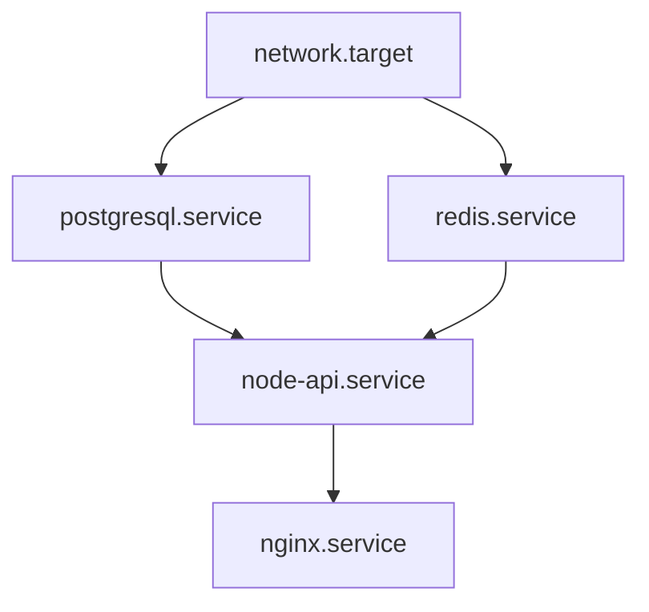

---

# Docker Relationship

Docker is itself a service.

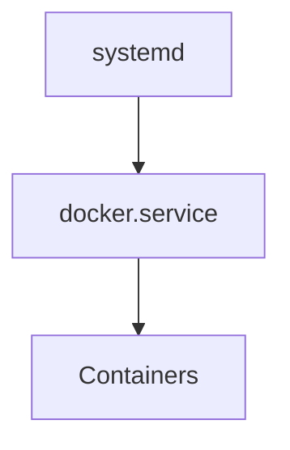

---

# Kubernetes Relationship

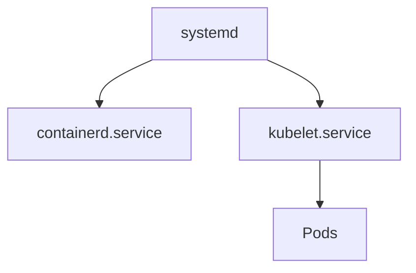

---

# Inspect Services

Status:

```bash
systemctl status nginx
```

---

# List Failed

```bash
systemctl --failed
```

---

# Show Properties

```bash
systemctl show nginx
```

---

# Show Dependencies

```bash
systemctl list-dependencies nginx
```

---

# Logs

```bash
journalctl -u nginx
```

---

# Troubleshooting Workflow

Question:

Service failed.

Step 1

```bash
systemctl status service-name
```

Step 2

```bash
journalctl -u service-name
```

Step 3

```bash
systemctl list-dependencies service-name
```

Step 4

```bash
systemctl show service-name
```

---

# Common Beginner Mistakes

## Mistake 1

Thinking services are processes.

Wrong.

Services manage processes.

---

## Mistake 2

Running everything as root.

Very dangerous.

---

## Mistake 3

Ignoring restart policies.

Bad for production.

---

## Mistake 4

Ignoring resource limits.

Can crash servers.

---

# Engineering Mindset

Do not think:

```text
systemd starts applications
```

Think:

```text
systemd creates self-healing applications
```

That mindset separates beginners from engineers.

---

# Mental Model To Remember Forever

```text
Application

↓

Service Unit

↓

systemd

↓

Operating System
```

Or:

```text
Service Unit = Operating System Contract
```

That sentence alone explains modern Linux service management.
