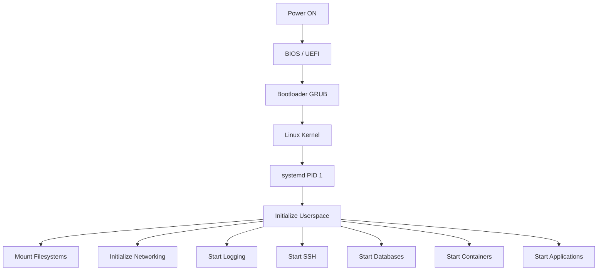
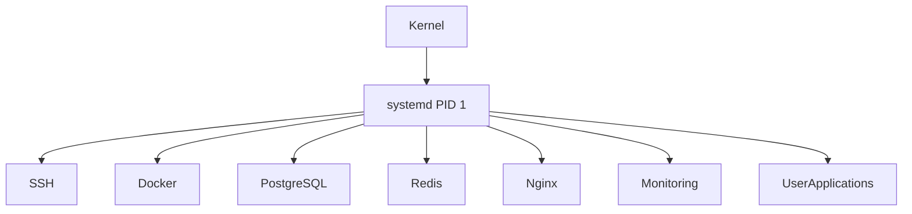
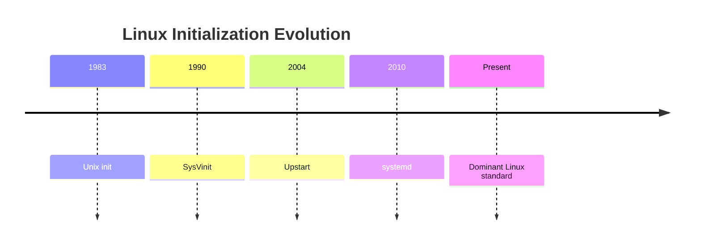
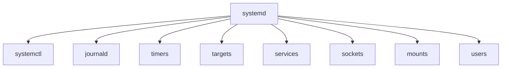
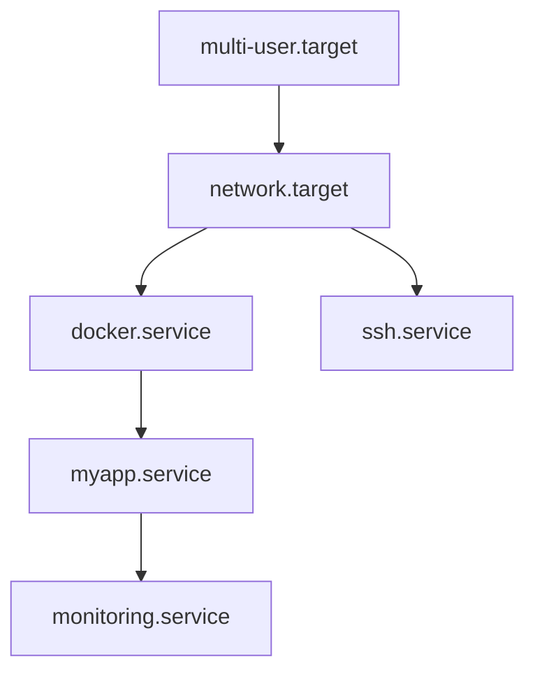
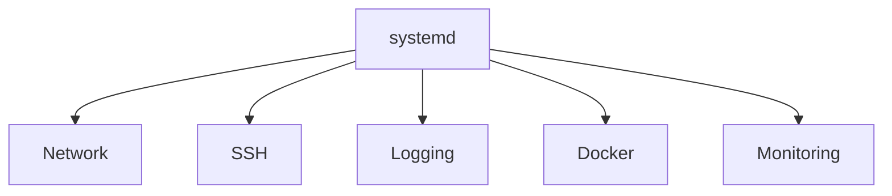
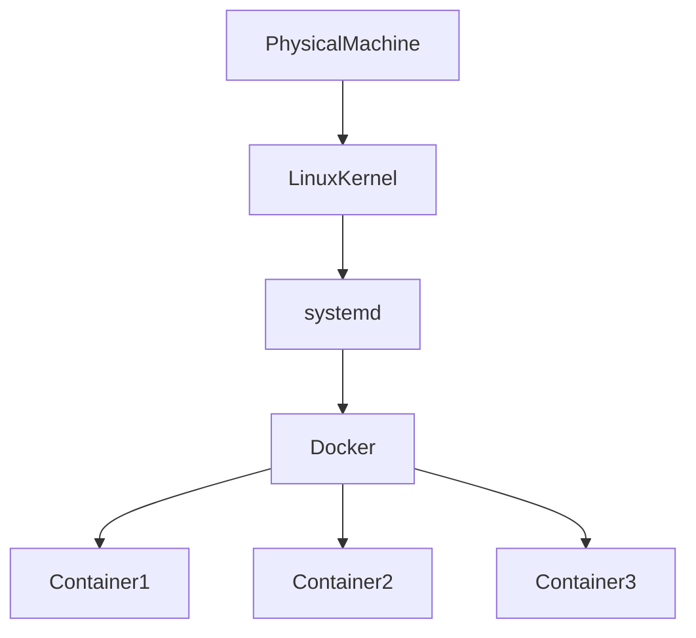
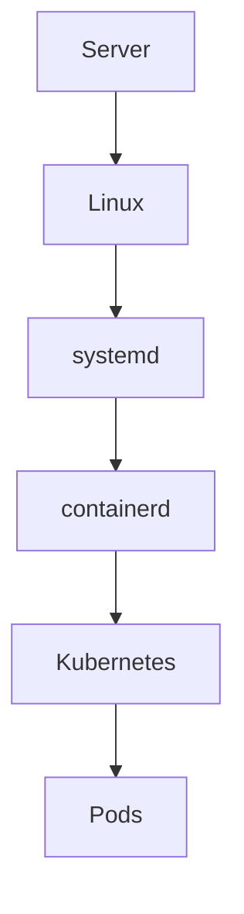
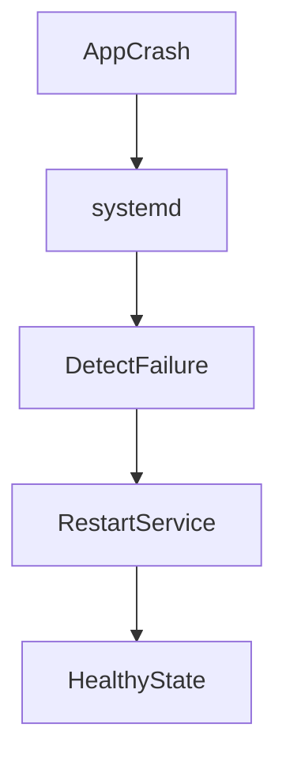

# systemd Deep Overview

> Understanding the brain that orchestrates an entire Linux operating system.

---

# Learning Goals

By the end of this file you should understand:

- Why systemd exists
- Problems it solved
- How Linux used to work before systemd
- What systemd actually does
- Why systemd became so important
- What happens after Linux boots
- systemd architecture
- Core components
- systemd's role in modern infrastructure
- How cloud, Docker and Kubernetes relate to systemd

---

# First Principles

Ask yourself:

> How does an operating system come alive?

Imagine a machine is completely powered off.

Nothing is running.

No SSH.

No Docker.

No Database.

No Network.

No Monitoring.

No Users.

No Applications.

Then someone presses:

```text
POWER BUTTON
```

How does Linux become a fully functioning operating system?

Something must coordinate everything.

That something is systemd.

---

# The Big Idea

Think of Linux as a city.

```text
Linux = City

systemd = Mayor

Services = Buildings

Processes = Workers

Dependencies = Roads

Logs = Newspapers

Timers = Schedules

Recovery Policies = Emergency Services
```

Without a mayor, the city becomes chaos.

Without systemd, Linux becomes chaos.

---

# What is systemd?

Officially:

> systemd is an init system and service manager.

But that's incomplete.

A better definition:

> systemd is an operating system orchestrator that initializes, manages, supervises, and recovers the entire userspace of Linux.

systemd is responsible for:

- Bringing Linux to life
- Starting services
- Managing dependencies
- Scheduling tasks
- Collecting logs
- Recovering crashed applications
- Managing user sessions
- Coordinating shutdown

---

# High Level Architecture



---

# The Linux Boot Journey

Linux startup occurs in stages.

## Stage 1

Hardware powers on.

```text
CPU

RAM

Disk

Motherboard
```

become available.

---

## Stage 2

BIOS or UEFI starts.

Responsibilities:

```text
Initialize hardware

Perform POST checks

Locate boot device

Load bootloader
```

---

## Stage 3

GRUB starts.

Responsibilities:

```text
Load Linux kernel

Load initramfs

Pass kernel parameters
```

---

## Stage 4

Linux kernel initializes.

Responsibilities:

```text
Memory management

CPU scheduler

Device drivers

Filesystem initialization
```

Then kernel asks:

> Who should manage the entire operating system now?

Answer:

```text
PID 1
```

That process is systemd.

---

# Why PID 1 Matters

Every Linux system has exactly one PID 1.

Verify:

```bash
ps -p 1
```

Example:

```text
PID TTY TIME CMD

1 ? 00:00:05 systemd
```

PID 1 is special.

Responsibilities:

```text
Start everything

Monitor everything

Recover everything

Shutdown everything
```

Everything eventually depends on PID 1.

---

# Visualizing PID 1



---

# Why Was systemd Created?

Before systemd there was SysVinit.

SysVinit had many problems.

## Problem 1

Sequential startup.

```text
Service A

↓

Service B

↓

Service C

↓

Service D
```

Very slow.

---

## Problem 2

Poor dependency handling.

Example:

Nginx starts before network.

Result:

```text
Failure
```

---

## Problem 3

No centralized logging.

Every application wrote logs separately.

```text
App A → File A

App B → File B

App C → File C
```

Difficult to troubleshoot.

---

## Problem 4

Weak recovery.

If services crashed:

```text
Administrator manually fixes it
```

No automatic healing.

---

# systemd Solves This

systemd introduced:

```text
Parallel startup

Dependency graphs

Central logging

Automatic recovery

Unified management

Scheduling

Observability
```

---

# Evolution of Linux Init Systems



---

# What Does systemd Actually Manage?

Everything is represented as a unit.

Examples:

```text
nginx.service

docker.service

network.target

backup.timer

tmp.mount

var.mount
```

systemd treats the operating system as objects.

---

# Core Components



---

# Understanding Each Component

| Component | Purpose |
|-----------|---------|
| systemd | Main orchestrator |
| systemctl | Management interface |
| journald | Logging system |
| service units | Applications |
| target units | System states |
| timers | Scheduling |
| mount units | Filesystems |
| socket units | Socket activation |

---

# Everything Is A Dependency Graph

This is one of the most important concepts.

Linux is not a list.

Linux is a graph.

Example:



systemd continuously solves this graph.

---

# Parallel Startup

Older systems:

```text
A

↓

B

↓

C

↓

D
```

systemd:



This is why boot became faster.

---

# How systemd Thinks

systemd continuously asks itself:

```text
What target should I reach?

↓

What dependencies exist?

↓

What can run in parallel?

↓

What failed?

↓

Should I restart it?

↓

Should I log it?

↓

Should I notify administrators?
```

This is orchestration.

---

# Modern Infrastructure Depends On systemd

Many engineers think Docker replaced systemd.

That's incorrect.

Docker often runs on top of systemd.

Example:



Docker itself often runs as:

```text
docker.service
```

managed by systemd.

---

# Cloud Infrastructure Also Uses systemd

Cloud VMs rely heavily on systemd.

Examples:

```text
AWS EC2

Azure VM

Google Compute Engine

DigitalOcean Droplets
```

All commonly use systemd.

---

# Kubernetes Relationship

Kubernetes does not replace systemd.

Relationship:



systemd often manages:

```text
containerd.service

kubelet.service
```

---

# systemd Recovery System

Imagine nginx crashes.

Without systemd:

```text
Application crashes

↓

Human intervention
```

With systemd:



Configuration:

```ini
Restart=always
```

---

# systemd Logging Architecture


This centralization changed Linux observability.

---

# Engineering Mindset

Do not think:

> How do I restart nginx?

Think:

> How does an operating system orchestrate thousands of moving parts?

That question leads to systemd.

---

# Common Beginner Mistakes

## Mistake 1

Thinking systemd is a command.

Wrong.

```text
systemctl = command

systemd = orchestrator
```

---

## Mistake 2

Thinking systemd only starts services.

Wrong.

It manages:

```text
Logging

Scheduling

Users

Mounts

Dependencies

Sockets

Shutdown

Recovery
```

---

## Mistake 3

Thinking Linux starts things automatically.

Nothing is automatic.

systemd coordinates everything.

---

# Key Takeaways

```text
systemd is PID 1

systemd is an orchestrator

systemd manages userspace

systemd solves dependency graphs

systemd supervises services

systemd recovers failures

systemd centralizes logging

systemd enables modern infrastructure
```

---

# Mental Model To Remember Forever

```text
Power ON

↓

BIOS

↓

Bootloader

↓

Kernel

↓

systemd

↓

Everything Else
```

Or even simpler:

```text
Kernel creates systemd

systemd creates Linux
```

That single sentence explains why systemd is so important.
