# systemd Unit Dependencies Deep Fundamentals

> Understanding how systemd orchestrates an entire operating system using dependency graphs instead of startup scripts.

---

# Learning Goals

By the end of this file, you will understand:

- Why dependencies exist
- Why Linux is a graph and not a list
- How systemd solves dependencies
- Ordering vs Requirement dependencies
- After=
- Before=
- Requires=
- Wants=
- BindsTo=
- PartOf=
- Conflicts=
- Requisite=
- PropagatesReloadTo=
- How boot orchestration works
- Production dependency design
- Common mistakes
- Real world examples

---

# First Principles

Imagine you own a restaurant.

Things cannot start randomly.

Wrong:

```text
Serve Food

↓

Cook Food

↓

Buy Ingredients
```

Correct:

```text
Buy Ingredients

↓

Cook Food

↓

Serve Food
```

This is dependency management.

Linux has the exact same problem.

---

# Linux Is Not A List

Beginners think Linux is:

```text
Nginx

Docker

Redis

PostgreSQL

Application
```

Wrong.

Linux is this:

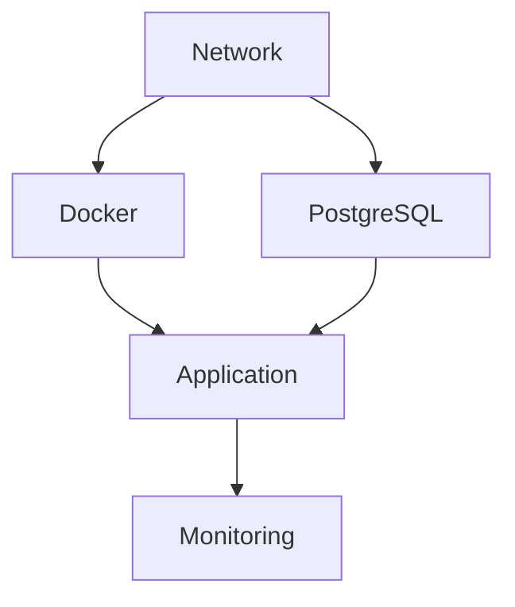

Linux is a dependency graph.

---

# The Biggest Idea Of systemd

systemd is not a service manager.

systemd is a graph solver.

Its job is:

```text
Read unit files

↓

Build dependency graph

↓

Determine startup order

↓

Determine requirements

↓

Start everything safely

↓

Recover failures
```

---

# Visualizing systemd Brain

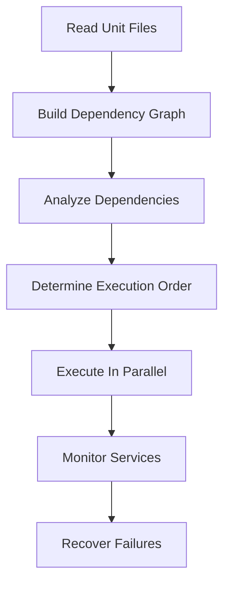

---

# Why Dependencies Exist

Question:

Can nginx start first?

No.

Why?

Because nginx needs:

```text
Filesystem

↓

Network

↓

DNS

↓

SSL certificates
```

Dependencies exist everywhere.

---

# Real Production Example

Imagine this stack:

```text
Ubuntu

Docker

PostgreSQL

Redis

Nginx

Application
```

Dependencies:

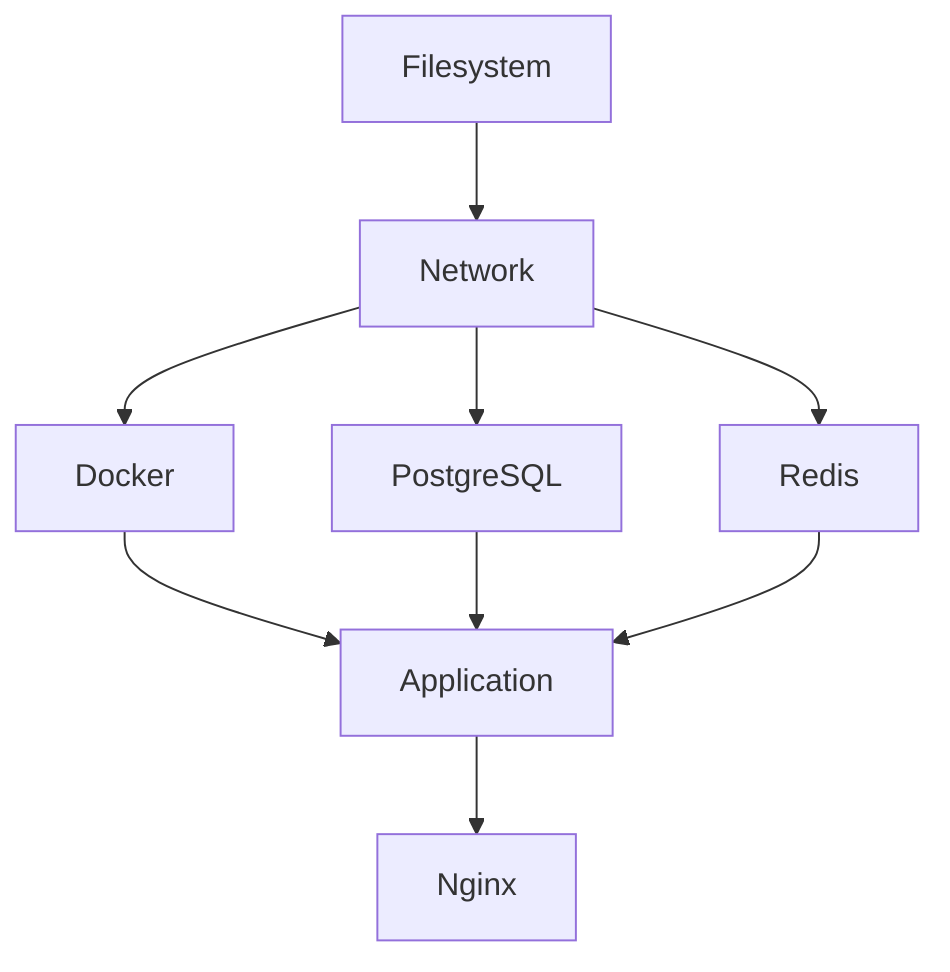

systemd automatically solves this graph.

---

# Two Dependency Categories

This is extremely important.

systemd dependencies belong to two categories.

# 1 Ordering Dependencies

Question:

> Who starts first?

Examples:

```text
After=

Before=
```

---

# 2 Requirement Dependencies

Question:

> Who must exist?

Examples:

```text
Requires=

Wants=

BindsTo=

Requisite=
```

---

# Visual

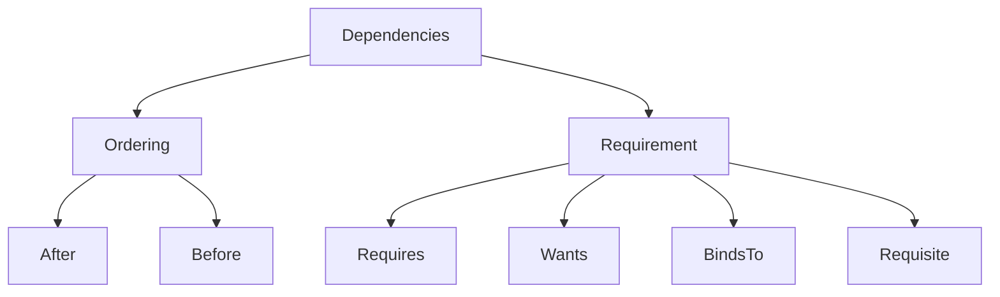

---

# Understanding After=

This is the most misunderstood directive.

People think:

```ini
After=network.target
```

means:

```text
Start network
```

Wrong.

It only means:

```text
If both exist

↓

Network first

↓

Then me
```

It DOES NOT start network.

---

# Visual

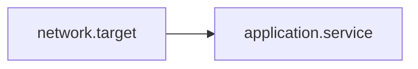

---

# Example

```ini
[Unit]

After=network.target
```

Meaning:

```text
Network first

↓

Application second
```

---

# Important Rule

```text
After=

is ordering

NOT requirement
```

Memorize this forever.

---

# Understanding Before=

Opposite of After.

Example:

```ini
Before=application.service
```

Meaning:

```text
Start me first

↓

Application later
```

---

# Visual

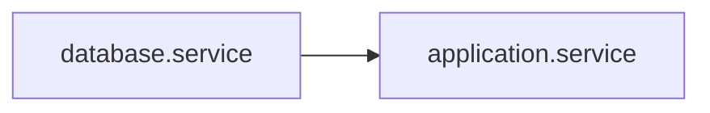

---

# Understanding Requires=

Requires means:

```text
I absolutely need this
```

If dependency fails:

```text
I fail too
```

---

# Visual

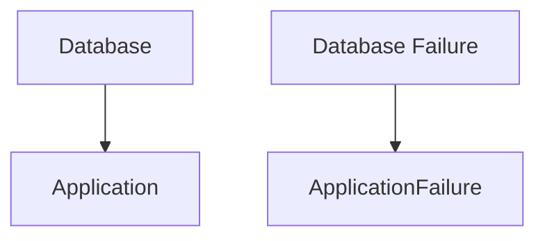

---

# Example

```ini
[Unit]

Requires=postgresql.service
```

Meaning:

```text
Application

↓

Needs PostgreSQL

↓

No PostgreSQL

↓

Application fails
```

---

# Understanding Wants=

This is a softer Requires.

Meaning:

```text
I would like this

↓

But I can survive without it
```

Example:

```ini
Wants=monitoring.service
```

Monitoring fails.

Application still runs.

---

# Visual

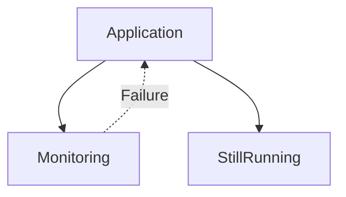

---

# Requires vs Wants

This difference is extremely important.

| Requires | Wants |
|----------|-------|
| Mandatory | Optional |
| Failure propagates | Failure ignored |
| Hard dependency | Soft dependency |

---

# Understanding BindsTo=

This is stronger than Requires.

Meaning:

```text
If dependency disappears

↓

I disappear too
```

Dynamic coupling.

---

# Example

```ini
BindsTo=dev-sdb.device
```

USB removed.

Application stops immediately.

---

# Visual

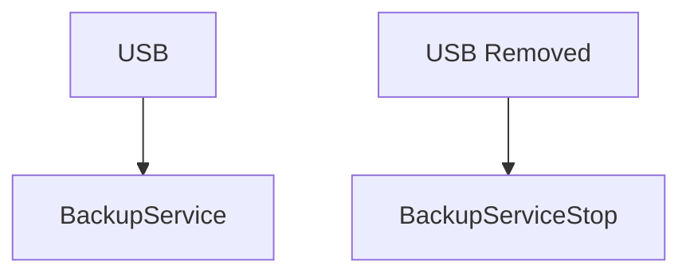

---

# Understanding PartOf=

This is propagation.

Meaning:

```text
If parent stops

↓

Child stops too
```

---

# Example

```ini
PartOf=my-stack.service
```

Visual:

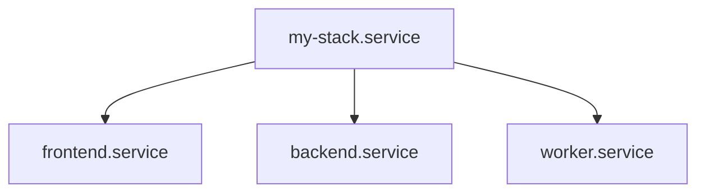

Stop parent.

Everything stops.

---

# Understanding Requisite=

Requires without auto-start.

Requires:

```text
Start dependency
```

Requisite:

```text
Dependency must already exist
```

Example:

```ini
Requisite=database.service
```

Database absent.

Immediate failure.

---

# Understanding Conflicts=

Mutual exclusion.

Meaning:

```text
These cannot run together
```

Example:

```ini
Conflicts=rescue.target
```

---

# Visual

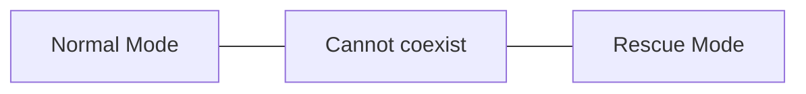

---

# Understanding PropagatesReloadTo=

Useful in production.

Example:

```ini
PropagatesReloadTo=nginx.service
```

Reload parent.

Nginx reloads too.

---

# Dependency Summary Table

| Directive | Purpose |
|-----------|---------|
| After | Ordering |
| Before | Reverse ordering |
| Requires | Mandatory dependency |
| Wants | Optional dependency |
| BindsTo | Lifecycle coupling |
| PartOf | Stop/restart propagation |
| Requisite | Must already exist |
| Conflicts | Mutual exclusion |
| PropagatesReloadTo | Reload propagation |

---

# The Golden Rule

Never do this:

```ini
After=network.target
```

and assume network will start.

Wrong.

Correct:

```ini
Wants=network.target

After=network.target
```

or

```ini
Requires=network.target

After=network.target
```

---

# Why Combine Directives?

Very common pattern.

```ini
[Unit]

Requires=postgresql.service

After=postgresql.service
```

Question:

Why both?

Because they solve different problems.

```text
Requires

↓

Must exist

---------------

After

↓

Execution order
```

---

# Visual

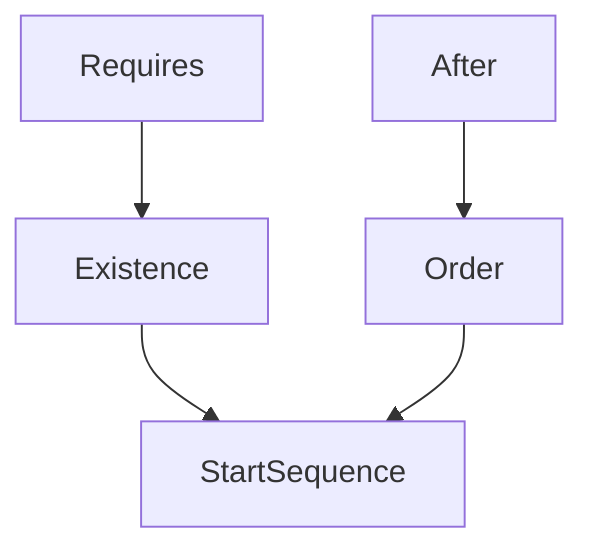

---

# Production Web Application Example

System:

```text
Nginx

↓

Application

↓

PostgreSQL

↓

Redis

↓

Network
```

Unit:

```ini
[Unit]

Description=MyApp

Requires=postgresql.service

Requires=redis.service

After=network.target

After=postgresql.service

After=redis.service
```

---

# Docker Example

Docker itself is a dependency.

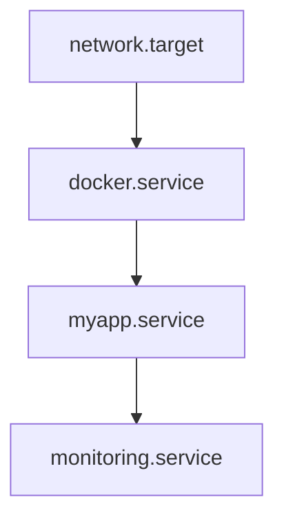

---

# Kubernetes Example

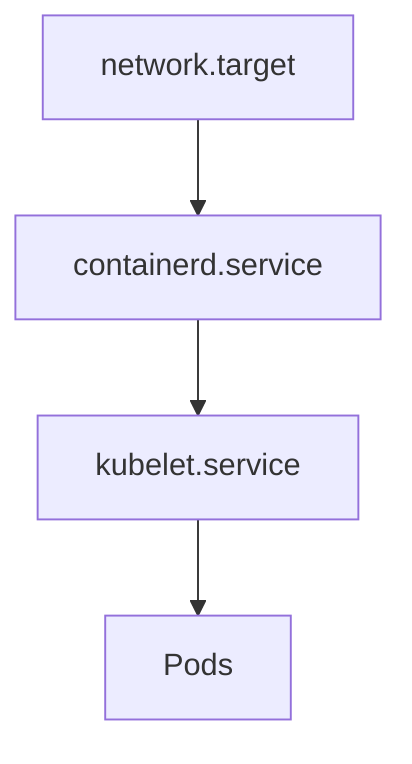

---

# Startup Algorithm Inside systemd

systemd internally does something similar.

```text
Read Unit Files

↓

Build Directed Graph

↓

Detect Cycles

↓

Topological Sort

↓

Parallel Execution

↓

Monitor Health

↓

Recover Failures
```

---

# Circular Dependencies

This is dangerous.

Wrong:

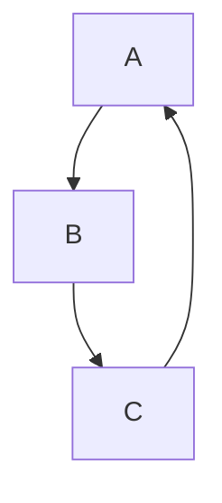

Impossible.

systemd will fail.

---

# Detect Cycles

Commands:

```bash
systemctl list-dependencies nginx.service
```

or

```bash
systemd-analyze verify myapp.service
```

---

# Useful Commands

## Show dependencies

```bash
systemctl list-dependencies nginx
```

---

## Reverse dependencies

```bash
systemctl list-dependencies --reverse nginx
```

---

## Show graph

```bash
systemd-analyze dot
```

Generate graph:

```bash
systemd-analyze dot > graph.dot
```

Convert:

```bash
dot -Tpng graph.dot -o graph.png
```

---

# Troubleshooting Workflow

Question:

> Application won't start.

Step 1

Check status.

```bash
systemctl status myapp
```

Step 2

Inspect logs.

```bash
journalctl -u myapp
```

Step 3

Inspect dependencies.

```bash
systemctl list-dependencies myapp
```

Step 4

Find failures.

```bash
systemctl --failed
```

---

# Common Beginner Mistakes

## Mistake 1

Thinking:

```ini
After=
```

starts services.

Wrong.

---

## Mistake 2

Using only Requires.

Missing order.

Wrong:

```ini
Requires=postgresql.service
```

Correct:

```ini
Requires=postgresql.service

After=postgresql.service
```

---

## Mistake 3

Building circular graphs.

Very dangerous.

---

# Engineering Mindset

Do not think:

```text
Linux starts services
```

Think:

```text
Linux solves dependency graphs
```

That is exactly what systemd does.

---

# The Mental Model To Remember Forever

```text
systemd

↓

Reads Units

↓

Builds Graph

↓

Solves Graph

↓

Creates Linux
```

Or even simpler:

```text
Operating System = Dependency Graph

Dependency Graph = systemd

systemd = Graph Solver
```

Once you understand this, many advanced Linux concepts become much easier.
