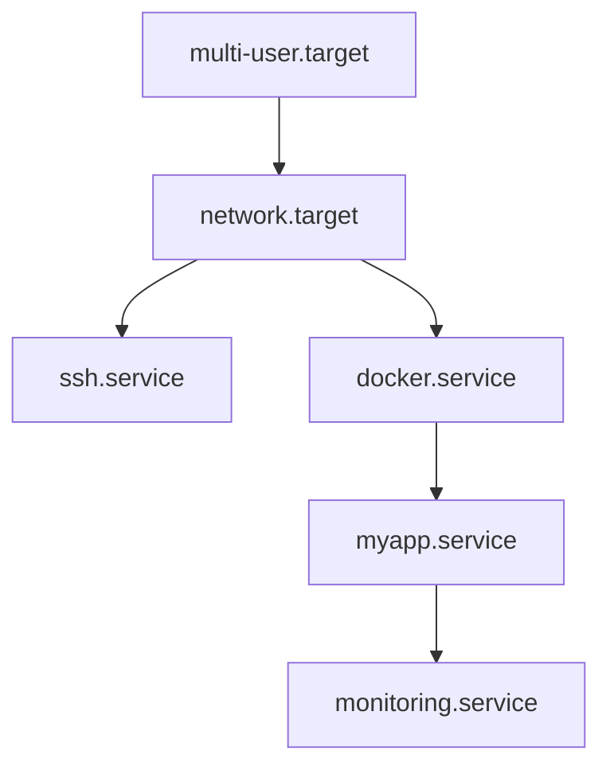
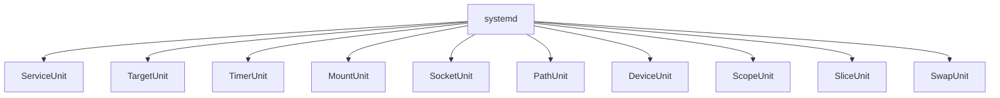
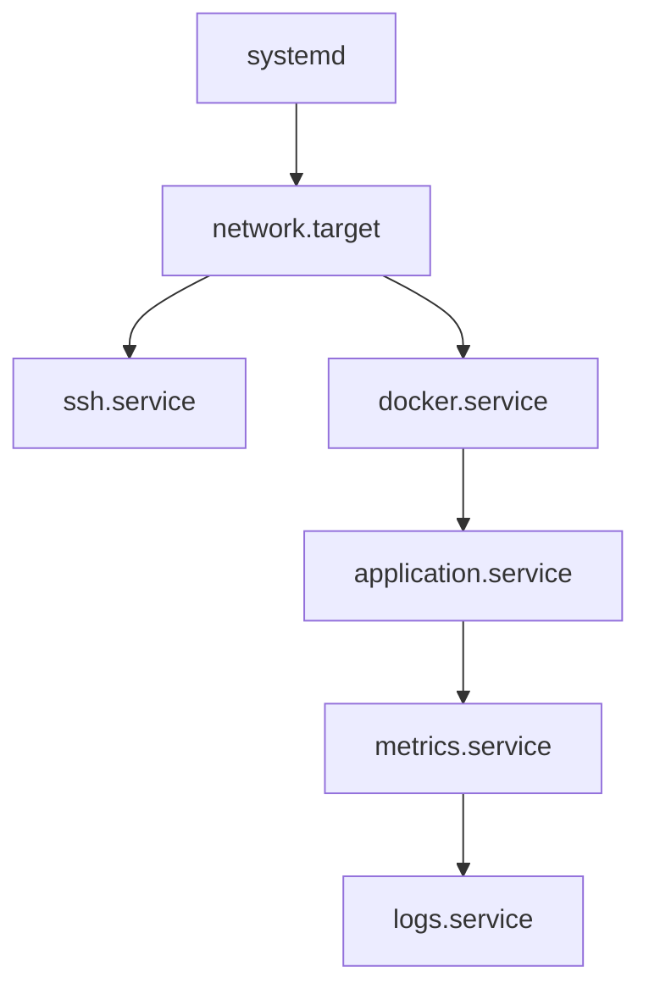
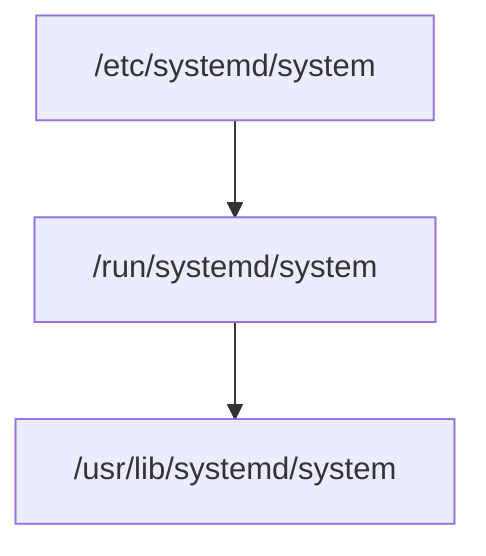
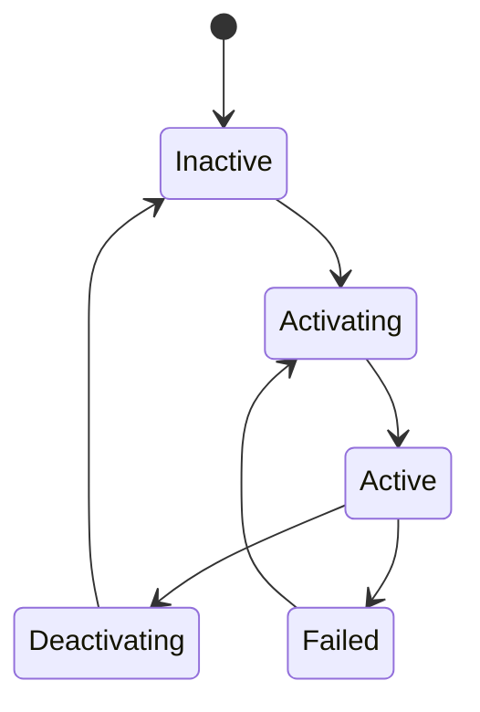
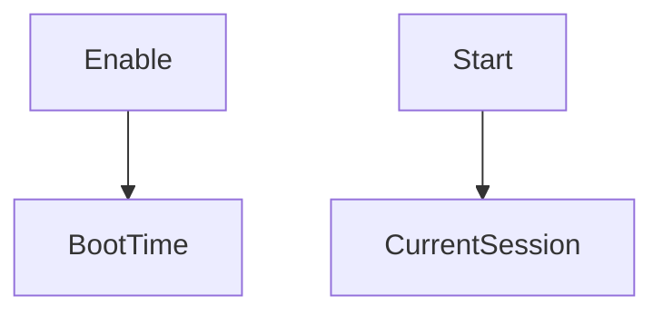
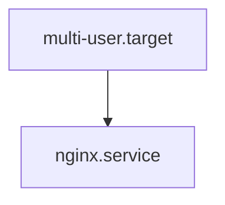
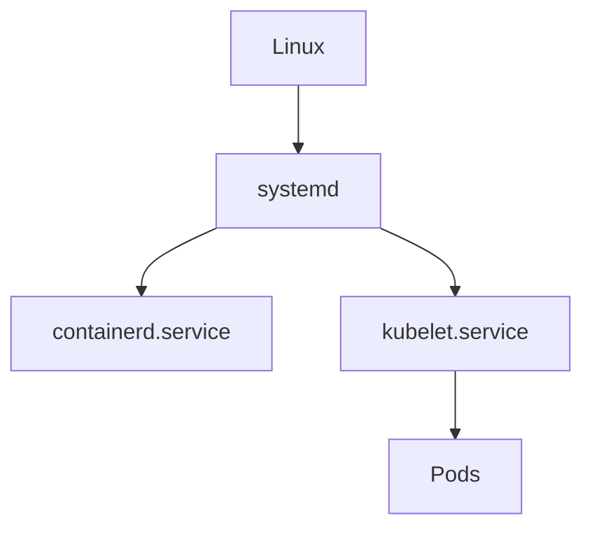

Excellent. This file is **EXTREMELY IMPORTANT**.

Most tutorials teach:

```bash
nginx.service
docker.service
```

and move on.

That's wrong.
# systemd Units Deep Fundamentals

> Understanding how systemd models an entire operating system as interconnected objects.

---

# Learning Goals

By the end of this file you will understand:

- What units are
- Why units exist
- How systemd thinks
- Why Linux is actually a dependency graph
- Different unit types
- Unit anatomy
- Unit states
- Unit lifecycle
- Unit dependencies
- Unit locations
- Production examples
- Troubleshooting units
- How cloud infrastructure relies on units

---

# First Principles

Imagine you're building an Operating System.

Question:

> How do we represent thousands of things that exist inside Linux?

Linux contains:

```text
Applications

Networks

Filesystems

Users

Schedules

Disks

Containers

Databases

Sockets

Hardware
```

You need a standard way to represent all these things.

systemd solved this problem.

It created:

```text
Units
```

---

# The Biggest Idea

Everything in Linux becomes an object.

Examples:

```text
Nginx

↓

nginx.service

----------------

Docker

↓

docker.service

----------------

Network

↓

network.target

----------------

Backup Schedule

↓

backup.timer

----------------

Filesystem

↓

home.mount
```

Everything is a unit.

---

# Official Definition

A unit is:

> A configuration object managed by systemd.

But for engineers:

> A unit is a blueprint that describes something systemd can create, manage, monitor, or orchestrate.

---

# The Mental Model

Think of Linux as a city.

```text
Linux = City

systemd = Mayor

Units = Buildings

Dependencies = Roads

Processes = Workers

Logs = Newspapers
```

systemd doesn't manage processes directly.

systemd manages units.

---

# Linux Is Not A List

Most beginners think:

```text
Application A

Application B

Application C

Application D
```

Wrong.

Linux is a graph.



This graph is composed entirely of units.

---

# Why Units Exist

Before systemd:

```text
Shell scripts

↓

Manual startup

↓

Sequential execution

↓

Difficult management
```

Problems:

```text
Slow

No dependencies

Poor monitoring

No recovery

Difficult automation
```

Units solve this.

---

# Unit Philosophy

Every unit answers these questions:

```text
What am I?

↓

When should I start?

↓

What do I depend on?

↓

Who depends on me?

↓

How should I behave?

↓

How do I stop?

↓

What if I fail?
```

---

# Unit Architecture



---

# Unit Naming Convention

Units have two parts.

```text
name.type
```

Examples:

```text
nginx.service

docker.service

ssh.service

backup.timer

network.target

home.mount
```

---

# Anatomy

```text
name

↓

suffix
```

Example:

```text
docker.service
```

docker = name

service = type

---

# The 11 Important Unit Types

# 1 Service Units

Purpose:

```text
Applications

Daemons

Background processes
```

Examples:

```text
nginx.service

docker.service

ssh.service

postgresql.service
```

---

# 2 Target Units

Purpose:

```text
Group multiple units
```

Examples:

```text
multi-user.target

graphical.target

network.target
```

Think:

```text
Folders for services
```

---

# 3 Timer Units

Purpose:

```text
Scheduling
```

Examples:

```text
backup.timer

cleanup.timer
```

Cron alternative.

---

# 4 Socket Units

Purpose:

```text
Listen for network requests
```

Examples:

```text
ssh.socket
```

Socket activation is very efficient.

---

# 5 Mount Units

Purpose:

```text
Mount filesystems
```

Examples:

```text
home.mount

var.mount
```

---

# 6 Automount Units

Purpose:

```text
Mount only when needed
```

Examples:

```text
home.automount
```

---

# 7 Path Units

Purpose:

```text
Watch files/directories
```

Example:

```text
uploads.path
```

---

# 8 Device Units

Purpose:

```text
Hardware devices
```

Examples:

```text
dev-sda.device
```

---

# 9 Swap Units

Purpose:

```text
Manage swap spaces
```

Example:

```text
swap.swap
```

---

# 10 Slice Units

Purpose:

```text
Resource grouping
```

Think:

```text
CPU groups

Memory groups

Cgroups
```

Example:

```text
system.slice
```

---

# 11 Scope Units

Purpose:

```text
External processes
```

Example:

```text
session.scope
```

---

# Visualizing Unit Relationships



---

# Where Unit Files Live

There are three important locations.

# System Units

```text
/usr/lib/systemd/system
```

or

```text
/lib/systemd/system
```

Installed by packages.

Examples:

```text
apt install nginx

↓

nginx.service created
```

---

# Administrator Units

```text
/etc/systemd/system
```

Highest priority.

Custom services go here.

---

# Runtime Units

```text
/run/systemd/system
```

Temporary.

Disappear after reboot.

---

# Unit Search Order



Priority:

```text
/etc

↓

/run

↓

/usr/lib
```

---

# Unit File Anatomy

Example:

```ini
[Unit]
Description=My Application
After=network.target

[Service]
ExecStart=/usr/bin/myapp
Restart=always

[Install]
WantedBy=multi-user.target
```

---

# Section 1 : Unit

Metadata.

Example:

```ini
[Unit]

Description=Application

After=network.target
```

Questions answered:

```text
Who am I?

What do I depend on?
```

---

# Section 2 : Service

Execution behavior.

Example:

```ini
[Service]

ExecStart=/usr/bin/myapp

Restart=always
```

Questions answered:

```text
How do I run?

How do I recover?
```

---

# Section 3 : Install

Startup integration.

Example:

```ini
[Install]

WantedBy=multi-user.target
```

Question:

```text
When should I start?
```

---

# Unit States

Every unit has a state machine.



---

# State Meanings

## Inactive

```text
Not running
```

---

## Activating

```text
Starting
```

---

## Active

```text
Running successfully
```

---

## Deactivating

```text
Stopping
```

---

## Failed

```text
Error occurred
```

---

# List Units

Command:

```bash
systemctl list-units
```

Example:

```text
docker.service active

ssh.service active

nginx.service active
```

---

# List All Units

```bash
systemctl list-unit-files
```

---

# Check Specific Unit

```bash
systemctl status docker
```

---

# Dependency Visualization

```bash
systemctl list-dependencies docker.service
```

---

# Observe Unit Internals

```bash
systemctl show docker.service
```

Very useful.

Shows:

```text
Dependencies

Memory limits

CPU limits

States

Timers

Restart policies
```

---

# Unit Enable vs Start

This confuses beginners.

These are different.

# Start

```bash
systemctl start nginx
```

Means:

```text
Run now
```

---

# Enable

```bash
systemctl enable nginx
```

Means:

```text
Start during boot
```

---

# Visual



---

# How Enabling Works

systemd creates symbolic links.

Example:

```text
multi-user.target

↓

wants

↓

nginx.service
```

Visual:



---

# Production Example

Imagine a web server.

Components:

```text
Network

Docker

Application

Database

Monitoring
```

Units:

```text
network.target

docker.service

myapp.service

postgresql.service

prometheus.service
```

systemd orchestrates them.

---

# Cloud Example

AWS VM boots.

systemd starts:

```text
cloud-init.service

sshd.service

docker.service

containerd.service

monitoring.service
```

---

# Kubernetes Example

Kubernetes also relies on units.



---

# Troubleshooting Workflow

Question:

> Something is broken. Where do we start?

Step 1

Failed units.

```bash
systemctl --failed
```

Step 2

Inspect.

```bash
systemctl status service-name
```

Step 3

Logs.

```bash
journalctl -u service-name
```

Step 4

Dependencies.

```bash
systemctl list-dependencies service-name
```

---

# Common Beginner Mistakes

## Mistake 1

Thinking units are services.

Wrong.

Services are one type of unit.

---

## Mistake 2

Ignoring dependencies.

Everything has dependencies.

---

## Mistake 3

Memorizing commands.

Learn architecture instead.

---

# Engineering Mindset

Do not think:

```text
Linux runs processes
```

Think:

```text
Linux runs units

Units create processes
```

That is how systemd thinks.

---

# The Mental Model To Remember Forever

```text
Kernel creates systemd

↓

systemd creates units

↓

Units create Linux
```

Or:

```text
Linux = Dependency Graph

Dependency Graph = Units

Units = systemd Objects
```

This is one of the most important concepts in modern Linux engineering.
````
