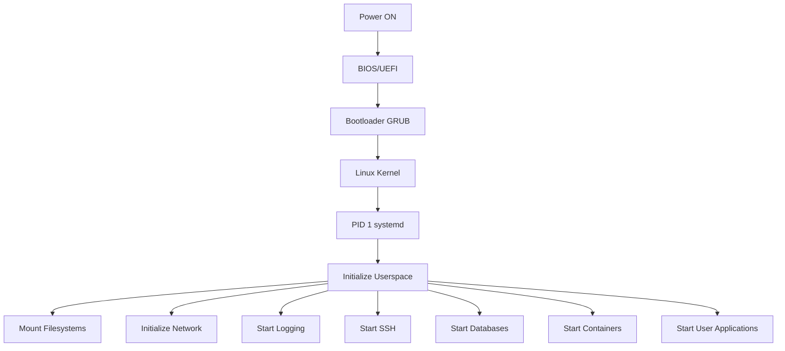
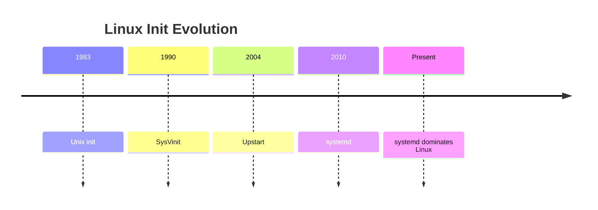
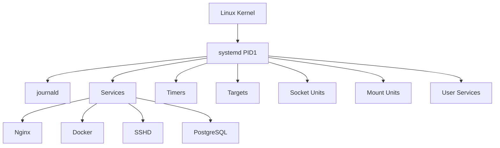
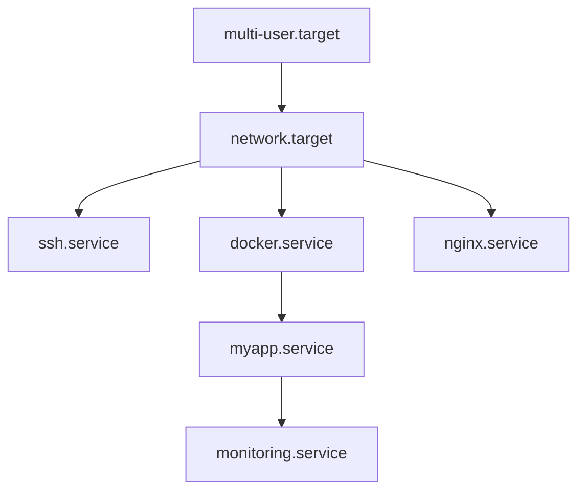
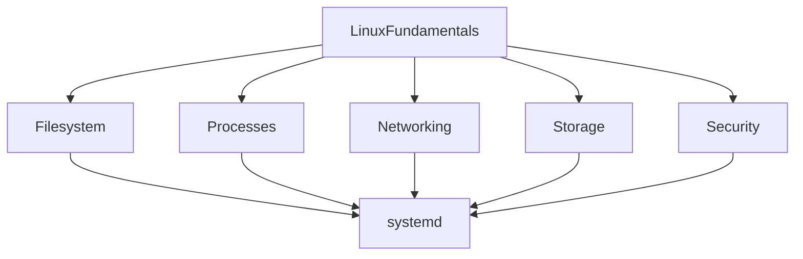

# Linux Services & systemd Deep Fundamentals

> Understanding how Linux boots, orchestrates, supervises, monitors, heals, and manages an entire operating system.

---

# Philosophy

Most tutorials teach systemd like this:

```text
systemctl start nginx

systemctl stop nginx

systemctl restart nginx
```

This is command memorization.

Professional engineers think differently.

They ask:

> How does an operating system bring itself to life?

How does Linux know:

* what to start
* when to start
* what order to start things
* what to do if something crashes
* where logs go
* how to recover from failures

This entire orchestration system is called:

# systemd

Think of it as:

> The Operating System Manager.

---

# Learning Objectives

By the end of this module you should understand:

✅ Linux boot orchestration

✅ PID 1 responsibilities

✅ systemd architecture

✅ Unit files

✅ Service management

✅ Dependency graphs

✅ Logging architecture

✅ Service recovery

✅ Service creation

✅ Scheduling jobs

✅ Production troubleshooting

✅ Observability mindset

---

# Big Picture



---

# Why systemd Exists

Older Linux systems used:

```text
SysVinit
```

Problems:

```text
Sequential startup

Slow boot

Weak dependency handling

Weak logging

Poor service monitoring

No automatic recovery

No unified management
```

systemd solved this.

---

# Evolution



---

# The Mental Model

Think of Linux like a city.

```text
City = Operating System

Mayor = systemd

Buildings = Services

Roads = Dependencies

Citizens = Processes

Emergency Services = Recovery Policies

Newspaper = Logs

Schedules = Timers
```

---

# systemd Responsibilities

# 1. System Boot

Starts entire OS.

```text
Kernel

↓

systemd

↓

Userspace

↓

Services
```

---

# 2. Service Orchestration

Starts:

```text
SSH

Network

Databases

Containers

Monitoring agents

Cron replacements

Web servers
```

---

# 3. Dependency Management

Example:

Nginx needs network.

```text
Network

↓

Nginx
```

Database may need storage.

```text
Storage

↓

Database
```

systemd understands these relationships.

---

# 4. Process Supervision

If process crashes:

```text
App crashes

↓

systemd detects

↓

systemd restarts
```

Example:

```ini
Restart=always
```

---

# 5. Logging

Applications write logs.

systemd centralizes them.

```text
Application

↓

journald

↓

Storage
```

---

# 6. Scheduling

Cron alternative.

```text
Timer

↓

Service

↓

Execution
```

---

# Architecture Overview



---

# What is PID 1?

PID 1 is special.

```text
Every Linux system has exactly one PID 1.
```

Verify:

```bash
ps -p 1
```

Example:

```text
PID TTY TIME CMD

1 ? 00:00:05 systemd
```

PID1 responsibilities:

```text
Adopt orphan processes

Initialize system

Manage services

Monitor failures

Handle shutdown

Coordinate startup
```

---

# Core Components

| Component | Responsibility        |
| --------- | --------------------- |
| systemd   | Main manager          |
| systemctl | Control interface     |
| journald  | Logging               |
| logrotate | Rotate logs           |
| rsyslog   | Traditional logging   |
| timers    | Scheduling            |
| targets   | Group services        |
| units     | Configuration objects |

---

# What is a Unit?

Everything in systemd is a unit.

Examples:

```text
nginx.service

docker.service

home.mount

tmp.mount

backup.timer

network.target
```

---

# Unit Types

| Unit      | Purpose            |
| --------- | ------------------ |
| service   | Applications       |
| socket    | Network sockets    |
| mount     | Filesystems        |
| automount | Automatic mounts   |
| target    | Grouping           |
| timer     | Scheduling         |
| path      | Watch files        |
| device    | Hardware           |
| swap      | Swap space         |
| scope     | External processes |

---

# System Startup Dependency Graph



---

# How Linux Thinks During Boot

```text
Question 1

What target should I reach?

↓

Question 2

What dependencies are needed?

↓

Question 3

What can run in parallel?

↓

Question 4

What failed?

↓

Question 5

Should I retry?

↓

Question 6

Should I log everything?
```

This is what systemd continuously does.

---

# Folder Learning Roadmap

## 1. systemd-overview.md

Understand architecture.

---

## 2. boot-process-and-systemd.md

Understand:

```text
Power On

↓

BIOS/UEFI

↓

GRUB

↓

Kernel

↓

systemd

↓

Userspace
```

---

## 3. units.md

Learn all systemd objects.

---

## 4. service-units.md

Learn service internals.

---

## 5. target-units.md

Understand runlevels.

---

## 6. timers.md

Cron replacement.

---

## 7. systemctl.md

Management interface.

---

## 8. journalctl.md

Central logging.

---

## 9. logs.md

Linux logging architecture.

---

## 10. rsyslog.md

Traditional logging systems.

---

## 11. logrotate.md

Log retention management.

---

## 12. creating-services.md

Build production services.

---

## 13. dependency-management.md

Master orchestration.

---

## 14. troubleshooting-services.md

Production debugging.

---

# Production Scenario

Imagine a server running:

```text
Ubuntu

Docker

Nginx

Redis

PostgreSQL

Monitoring Agent

SSH
```

Who starts all these?

```text
systemd
```

Who restarts crashed services?

```text
systemd
```

Who collects logs?

```text
journald
```

Who rotates logs?

```text
logrotate
```

Who ensures startup order?

```text
systemd dependencies
```

---

# Engineering Mindset

Do not think:

> "How do I start nginx?"

Think:

> "How does an operating system orchestrate itself?"

That question is the entire purpose of this folder.

---

# Prerequisites

Complete these sections first:

```text
01-linux-introduction

02-filesystem

03-processes

04-users-permissions

05-storage

06-networking

07-shell

08-packages

09-security
```

because systemd sits on top of all of them.



---

# Final Mental Model

```text
systemd is NOT a command.

systemd is NOT a service.

systemd is NOT a daemon.

systemd is an Operating System Orchestrator.
```
