# Creating Linux Services Deep Fundamentals

> Understanding how to transform ordinary applications into self-healing, observable, production-grade operating system services.

---

# Learning Goals

By the end of this file, you will understand:

- Why services are created
- How applications become operating system citizens
- Service creation workflow
- Service anatomy
- Production design principles
- Dependencies
- Security
- Resource management
- Logging integration
- Reliability patterns
- Real-world examples

---

# First Principles

Imagine you've built:

```text
NodeJS API

Python AI Service

Go Worker

Java Application
```

Question:

How do we convert this:

```text
Application

↓

Executable

↓

Manual startup
```

into:

```text
Production Infrastructure
```

That is the job of service creation.

---

# The Biggest Idea

Creating a service means:

> Teaching Linux how your application should live.

Linux needs answers.

```text
Who are you?

↓

How do I start you?

↓

What do you depend on?

↓

How do I stop you?

↓

What if you fail?

↓

What resources can you consume?

↓

How secure should you be?
```

---

# Human Analogy

Imagine hiring an employee.

You don't say:

```text
Go work
```

You create a contract.

The contract contains:

```text
Role

Responsibilities

Working hours

Manager

Rules

Emergency procedures
```

A service file is that contract.

---

# Mental Model

```text
Application = Employee

Service Unit = Employment Contract

systemd = Manager

Linux = Company
```

---

# The Journey

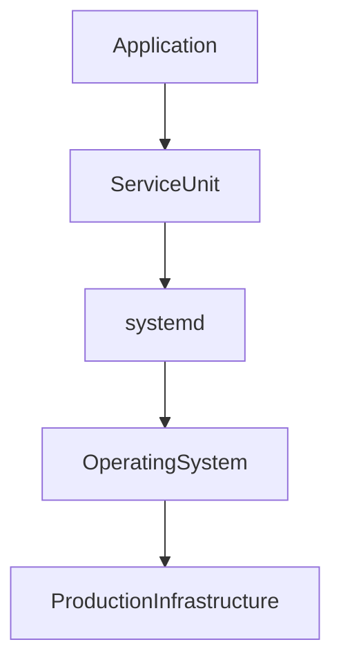

---

# Service Creation Pipeline

Every service follows the same journey.


---

# Before Creating Services

Ask these questions.

---

# Question 1

How is the application started?

Examples:

```text
node server.js

python app.py

java -jar app.jar

./worker
```

---

# Question 2

What dependencies exist?

Examples:

```text
Database

Redis

Docker

Network
```

---

# Question 3

Which user should run it?

Never default to:

```text
root
```

---

# Question 4

What should happen on failure?

Options:

```text
Restart

Alert

Exit

Recover
```

---

# The Service Creation Architecture

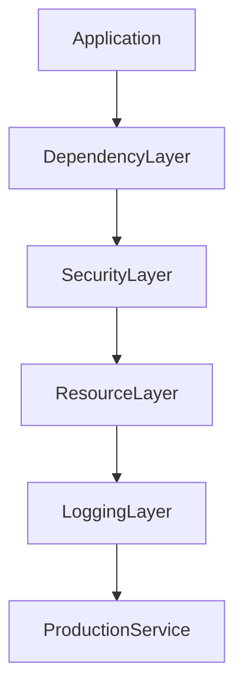

---

# Step 1 : Create Dedicated User

Never run production apps as root.

Create:

```bash
sudo useradd -r -s /usr/sbin/nologin myapp
```

Options:

```text
-r

System account

-s

No login shell
```

Visual:

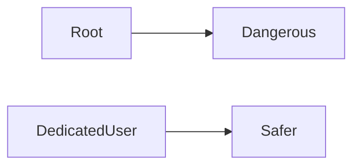

---

# Step 2 : Organize Application

Example:

```text
/opt/myapp/

├── app.js
├── config.json
├── logs/
└── package.json
```

---

# Recommended Directory Layout

```text
/opt/myapp/

├── app/
├── config/
├── scripts/
├── data/
└── logs/
```

---

# Why /opt?

Convention:

```text
/opt

↓

Optional software

↓

Third-party applications
```

---

# Step 3 : Create Service File

Location:

```text
/etc/systemd/system
```

Example:

```bash
sudo nano /etc/systemd/system/myapp.service
```

---

# Service File Architecture

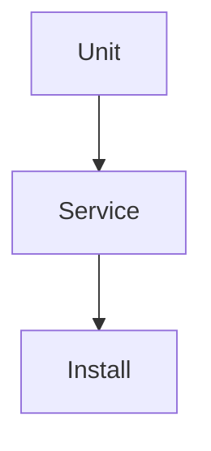

---

# Anatomy

Three sections exist.

```ini
[Unit]

[Service]

[Install]
```

---

# Section 1 : Unit

Metadata.

Questions answered:

```text
Who am I?

↓

What do I depend on?

↓

What order should I start?
```

Example:

```ini
[Unit]

Description=My Application

After=network.target

Requires=postgresql.service
```

---

# Unit Visualization

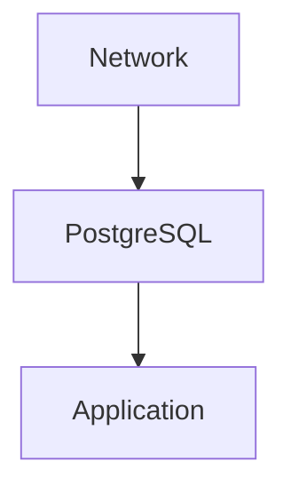

---

# Section 2 : Service

Behavior.

Questions answered:

```text
How do I run?

↓

How do I recover?

↓

How do I stop?
```

---

# Section 3 : Install

Boot integration.

Question:

```text
When should I start?
```

---

# The Simplest Service

```ini
[Unit]

Description=My Application

After=network.target

[Service]

ExecStart=/usr/bin/python3 /opt/myapp/app.py

[Install]

WantedBy=multi-user.target
```

---

# Production Service Template

```ini
[Unit]

Description=Production API

After=network.target

Requires=network.target

[Service]

Type=simple

User=myapp

Group=myapp

WorkingDirectory=/opt/myapp

ExecStart=/usr/bin/node server.js

Restart=on-failure

RestartSec=5

Environment=NODE_ENV=production

TimeoutStartSec=30

TimeoutStopSec=20

[Install]

WantedBy=multi-user.target
```

---

# Startup Visualization

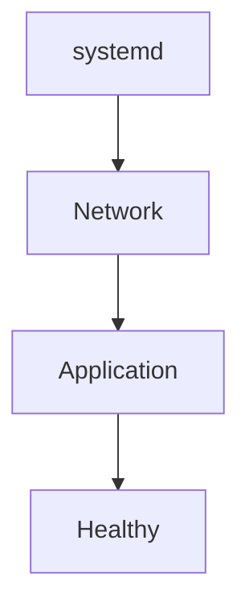

---

# WorkingDirectory

Question:

Where should the application execute?

Example:

```ini
WorkingDirectory=/opt/myapp
```

Without it:

```text
Relative paths break
```

---

# Environment Variables

Production applications need configuration.

Example:

```ini
Environment=NODE_ENV=production

Environment=PORT=3000
```

Multiple variables:

```ini
Environment=NODE_ENV=production

Environment=DB_HOST=localhost
```

---

# Environment File

Better.

```ini
EnvironmentFile=/etc/myapp.env
```

Example:

```text
PORT=3000

DB_HOST=localhost
```

---

# Restart Policies

Very important.

```ini
Restart=on-failure
```

Options:

```text
no

always

on-failure

on-abnormal

on-watchdog
```

---

# Failure Recovery Visualization

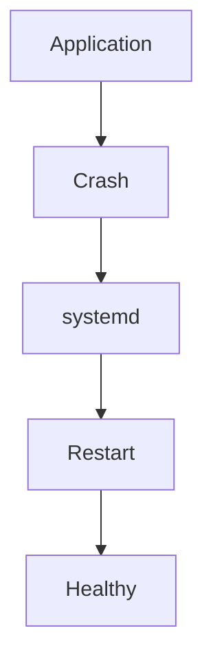

---

# Timeouts

Startup timeout:

```ini
TimeoutStartSec=30
```

Shutdown timeout:

```ini
TimeoutStopSec=20
```

---

# Logging Integration

This is one of systemd's superpowers.

Everything automatically goes to:

```text
journald
```

Visual:

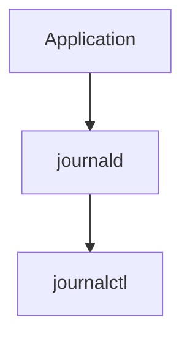

Inspect:

```bash
journalctl -u myapp
```

---

# Resource Management

systemd integrates with cgroups.

You can limit:

```text
CPU

Memory

Processes
```

---

# CPU Limit

```ini
CPUQuota=50%
```

---

# Memory Limit

```ini
MemoryMax=512M
```

---

# Process Limit

```ini
TasksMax=100
```

---

# Resource Visualization

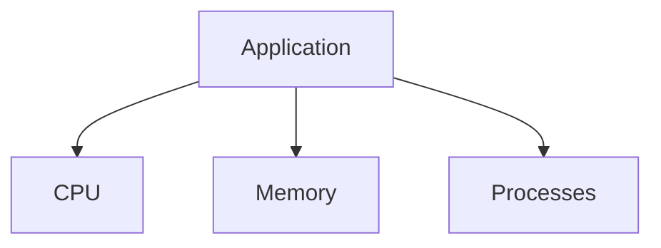

---

# Security Hardening

Very important.

---

# Run As User

```ini
User=myapp
```

---

# No New Privileges

```ini
NoNewPrivileges=true
```

---

# Private Tmp

```ini
PrivateTmp=true
```

---

# Protect System

```ini
ProtectSystem=strict
```

---

# Protect Home

```ini
ProtectHome=true
```

---

# Security Visualization

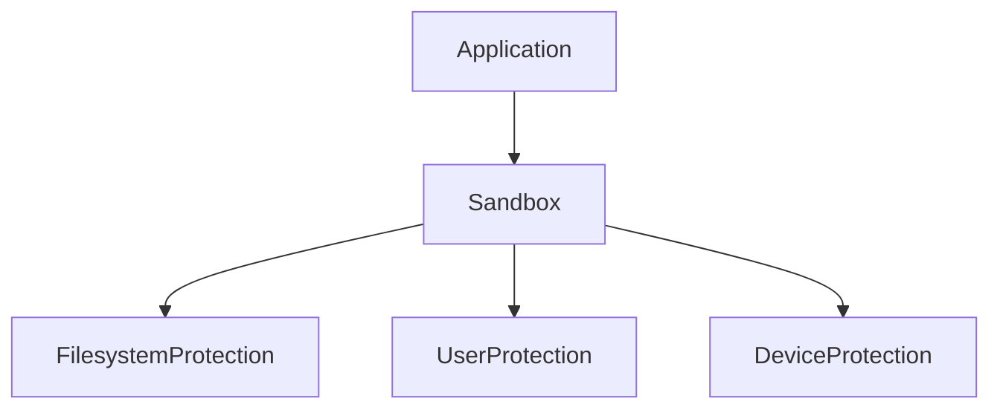

---

# Production Example 1 : NodeJS API

```ini
[Unit]

Description=Node API

After=network.target

[Service]

User=nodeapi

WorkingDirectory=/opt/node-api

ExecStart=/usr/bin/node server.js

Restart=on-failure

RestartSec=5

Environment=NODE_ENV=production

[Install]

WantedBy=multi-user.target
```

---

# Production Example 2 : Python AI Service

```ini
[Unit]

Description=AI Detection Service

After=network.target

[Service]

User=aiuser

WorkingDirectory=/opt/ai

ExecStart=/usr/bin/python3 app.py

Restart=on-failure

[Install]

WantedBy=multi-user.target
```

---

# Production Example 3 : Go Worker

```ini
[Unit]

Description=Background Worker

After=network.target

[Service]

User=worker

WorkingDirectory=/opt/worker

ExecStart=/opt/worker/worker

Restart=always

[Install]

WantedBy=multi-user.target
```

---

# Service Deployment Workflow

After creating service.

Step 1

Reload systemd.

```bash
sudo systemctl daemon-reload
```

Step 2

Enable service.

```bash
sudo systemctl enable myapp
```

Step 3

Start service.

```bash
sudo systemctl start myapp
```

Step 4

Verify.

```bash
sudo systemctl status myapp
```

---

# Deployment Visualization

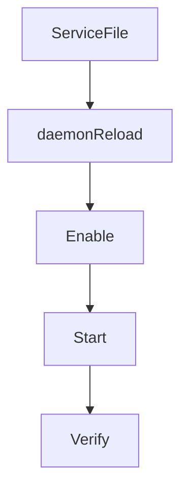

---

# Dependency Example

Imagine:

```text
PostgreSQL

Redis

API

Nginx
```

Visual:

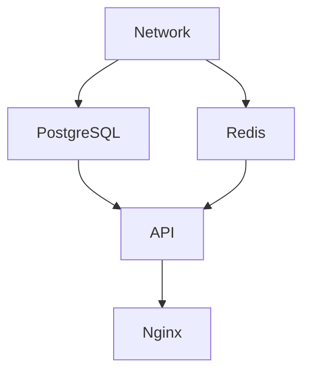

---

# Production Infrastructure Example

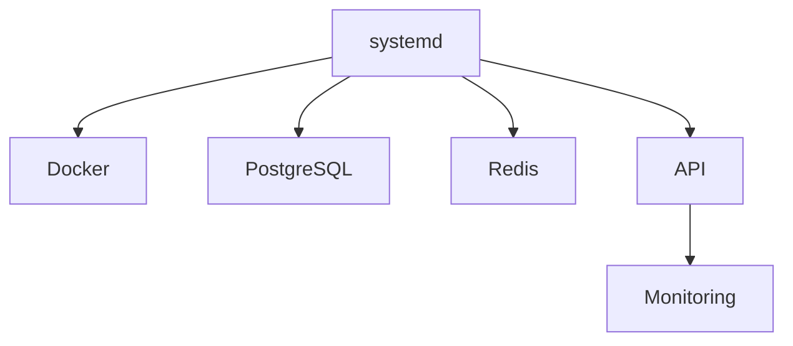

---

# Troubleshooting Workflow

Question:

Service won't start.

Step 1

Inspect status.

```bash
systemctl status myapp
```

Step 2

Inspect logs.

```bash
journalctl -u myapp
```

Step 3

Check dependencies.

```bash
systemctl list-dependencies myapp
```

Step 4

Verify file.

```bash
systemd-analyze verify myapp.service
```

---

# Common Beginner Mistakes

## Mistake 1

Running applications as root.

Very dangerous.

---

## Mistake 2

Forgetting:

```bash
daemon-reload
```

after edits.

---

## Mistake 3

Ignoring restart policies.

---

## Mistake 4

Ignoring security directives.

---

## Mistake 5

Putting secrets directly inside service files.

Bad practice.

Use:

```ini
EnvironmentFile=
```

---

# Engineering Mindset

Do not think:

```text
Creating a service means starting an application
```

Think:

```text
Creating a service means integrating an application into the operating system lifecycle
```

That is much closer to reality.

---

# Mental Model To Remember Forever

```text
Application

↓

Service Unit

↓

systemd

↓

Operating System

↓

Production Infrastructure
```

Or even simpler:

```text
Applications are programs.

Services are operating system citizens.
```

That single sentence explains why service creation exists.
