# Linux Dependency Management Deep Fundamentals

> Understanding how Linux transforms thousands of independent components into a single functioning operating system.

---

# Learning Goals

By the end of this file, you will understand:

- Why dependency management exists
- Why Linux is a dependency graph
- How systemd orchestrates dependencies
- Hard vs soft dependencies
- Ordering vs requirement dependencies
- Boot dependency management
- Failure propagation
- Dependency trees
- Circular dependency problems
- Parallel execution
- Production dependency design
- Cloud infrastructure dependency management

---

# First Principles

Imagine Linux boots.

Question:

Can applications start randomly?

Imagine:

```text
Nginx

↓

API

↓

PostgreSQL

↓

Network
```

If nginx starts first:

```text
Nginx

↓

Cannot reach API

↓

Website fails
```

Dependencies exist everywhere.

---

# The Biggest Idea

Linux is not:

```text
1000 independent programs
```

Linux is:

> A dependency graph.

Everything depends on something else.

---

# Human Analogy

Imagine a restaurant.

You cannot do this:

```text
Serve food

↓

Cook food

↓

Buy ingredients
```

Correct:

```text
Buy ingredients

↓

Cook food

↓

Serve food
```

Linux works exactly the same way.

---

# Mental Model

```text
Linux = City

systemd = Mayor

Services = Buildings

Dependencies = Roads
```

Without roads:

```text
Chaos
```

---

# The Dependency Problem

Linux contains:

```text
Kernel

Networking

Docker

Redis

PostgreSQL

Nginx

Applications

Monitoring
```

Question:

Who coordinates everything?

Answer:

```text
systemd
```

---

# Linux Is A Graph

Not a list.

Wrong:

```text
Nginx

Docker

Redis

PostgreSQL
```

Correct:

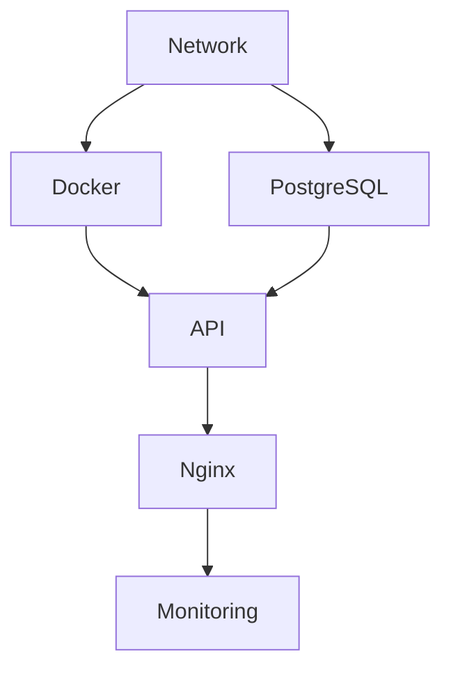

---

# The Dependency Solver

systemd acts like a graph solver.

Its job:

```text
Read unit files

↓

Build dependency graph

↓

Detect relationships

↓

Resolve order

↓

Execute services

↓

Monitor failures
```

---

# Architecture

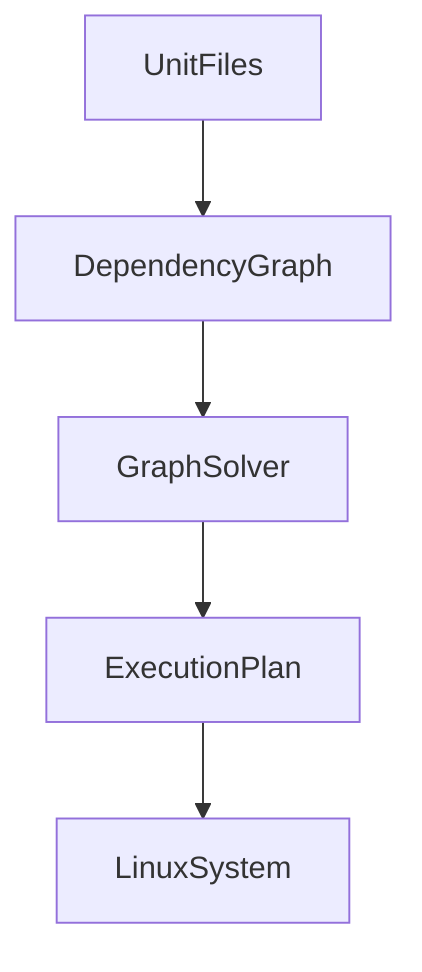

---

# Dependency Categories

There are two major categories.

```text
Ordering Dependencies

Requirement Dependencies
```

---

# Ordering Dependencies

Question:

> Who goes first?

Examples:

```text
After=

Before=
```

---

# Requirement Dependencies

Question:

> Who must exist?

Examples:

```text
Requires=

Wants=

BindsTo=

Requisite=
```

---

# Visualization

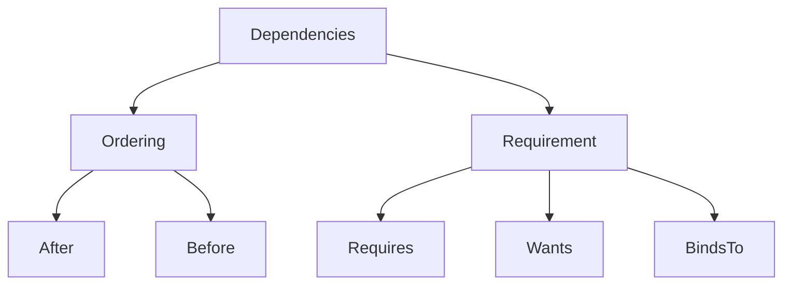

---

# Layered Linux Architecture

Linux boots in layers.

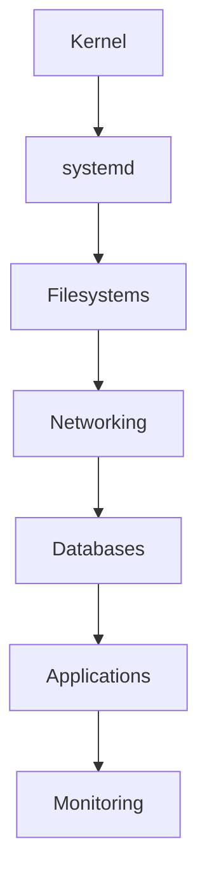

---

# Dependency Types

There are four major concepts.

```text
Ordering

Requirement

Propagation

Exclusion
```

---

# Ordering

Question:

Who starts first?

Example:

```ini
After=network.target
```

---

# Requirement

Question:

Who is mandatory?

Example:

```ini
Requires=postgresql.service
```

---

# Propagation

Question:

What else should stop?

Example:

```ini
PartOf=application-stack.target
```

---

# Exclusion

Question:

Who cannot coexist?

Example:

```ini
Conflicts=rescue.target
```

---

# Hard Dependencies

Hard means:

```text
Must exist
```

Visual:

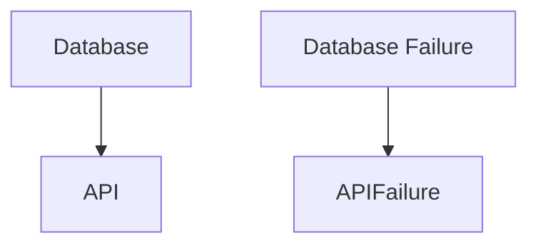

---

# Soft Dependencies

Soft means:

```text
Useful but optional
```

Visual:

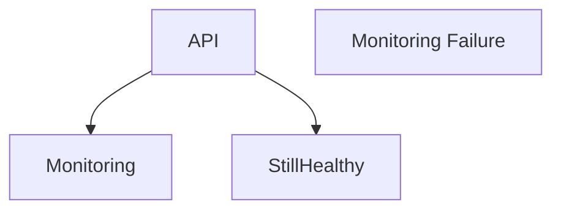

---

# Dependency Directives

Important directives.

| Directive | Purpose |
|-----------|---------|
| After | Ordering |
| Before | Reverse ordering |
| Requires | Mandatory |
| Wants | Optional |
| BindsTo | Lifecycle coupling |
| PartOf | Propagation |
| Requisite | Must already exist |
| Conflicts | Mutual exclusion |

---

# The Golden Pattern

Very common.

```ini
[Unit]

Requires=postgresql.service

After=postgresql.service
```

Why both?

Because they solve different problems.

```text
Requires

↓

Existence

---------------

After

↓

Order
```

---

# Visual

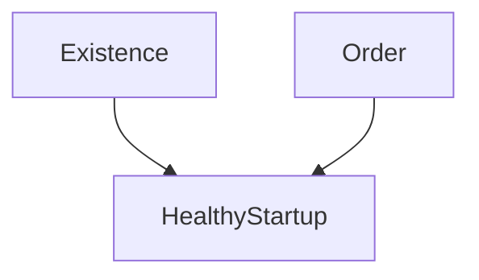

---

# Boot Dependency Management

Boot is a giant dependency graph.

Visual:

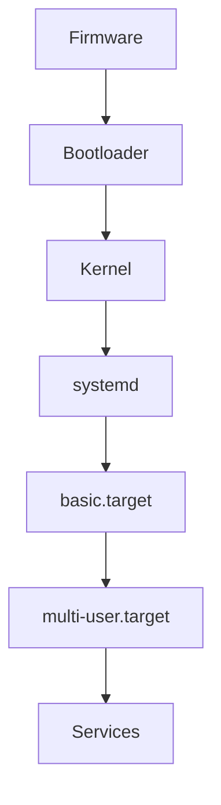

---

# Production Web Stack Example

Components:

```text
Network

PostgreSQL

Redis

API

Nginx
```

Visual:

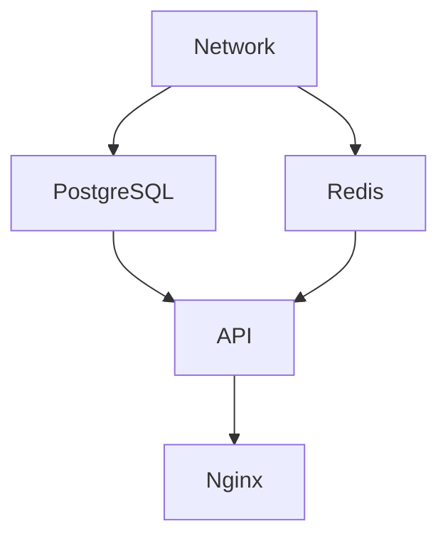

---

# Dependency Trees

Every service belongs to a tree.

Example:

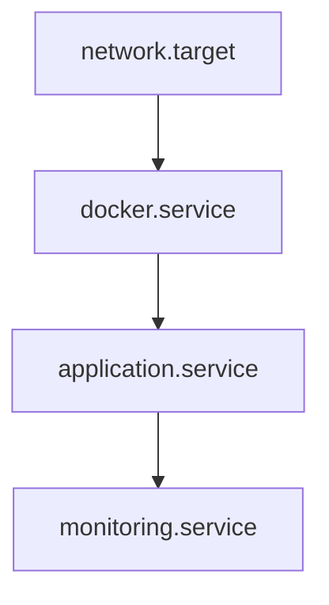

---

# Reverse Dependencies

Question:

Who needs nginx?

Visual:

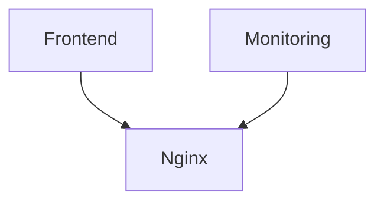

Commands:

```bash
systemctl list-dependencies nginx
```

Reverse:

```bash
systemctl list-dependencies --reverse nginx
```

---

# Failure Propagation

Question:

What happens when databases fail?

Visual:

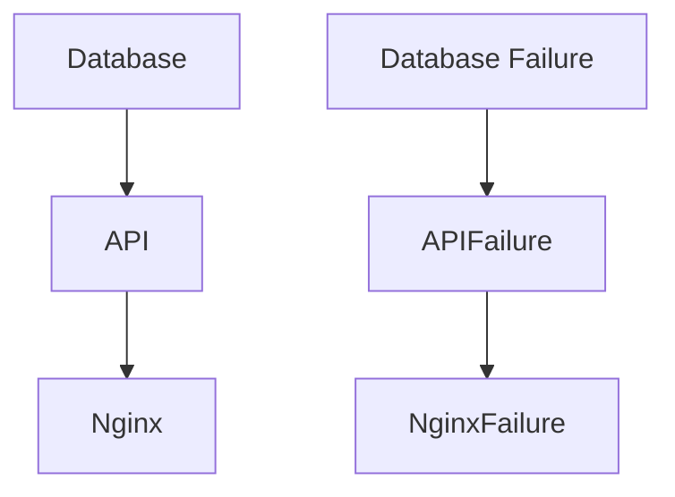

This is cascading failure.

---

# Cascading Failures

One broken dependency can destroy systems.

Visual:

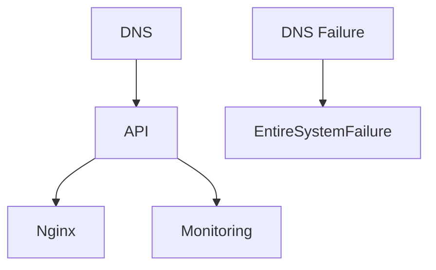

---

# Parallel Execution

Old systems:

```text
A

↓

B

↓

C
```

Modern systemd:

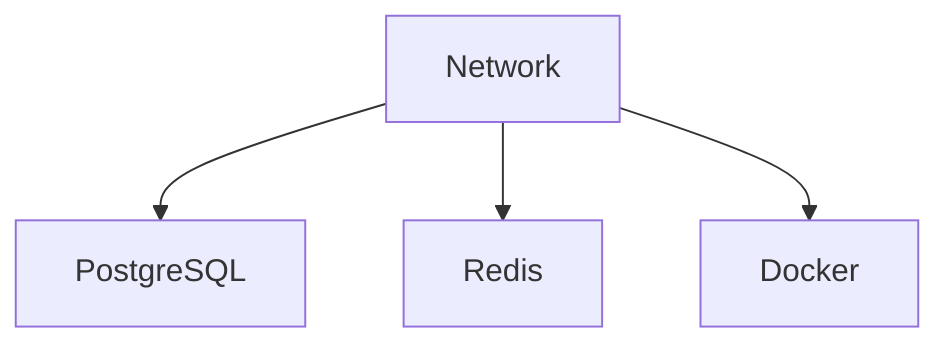

Independent services start simultaneously.

---

# Why Parallelization Matters

Benefits:

```text
Faster boot

Better scalability

Higher efficiency
```

---

# Circular Dependencies

Dangerous.

Wrong:

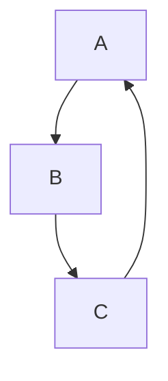

Impossible to solve.

---

# Detect Cycles

Useful command:

```bash
systemd-analyze verify myapp.service
```

---

# Visualize Entire System

```bash
systemd-analyze dot
```

Export:

```bash
systemd-analyze dot > graph.dot
```

Convert:

```bash
dot -Tpng graph.dot -o graph.png
```

---

# Cloud Infrastructure Example

AWS VM.

Visual:

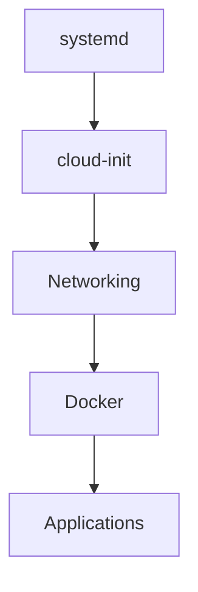

---

# Kubernetes Example

Kubernetes itself relies on dependency management.

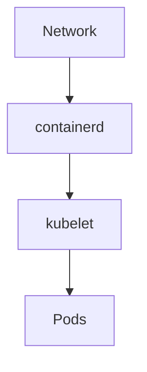

---

# Production Stack Example

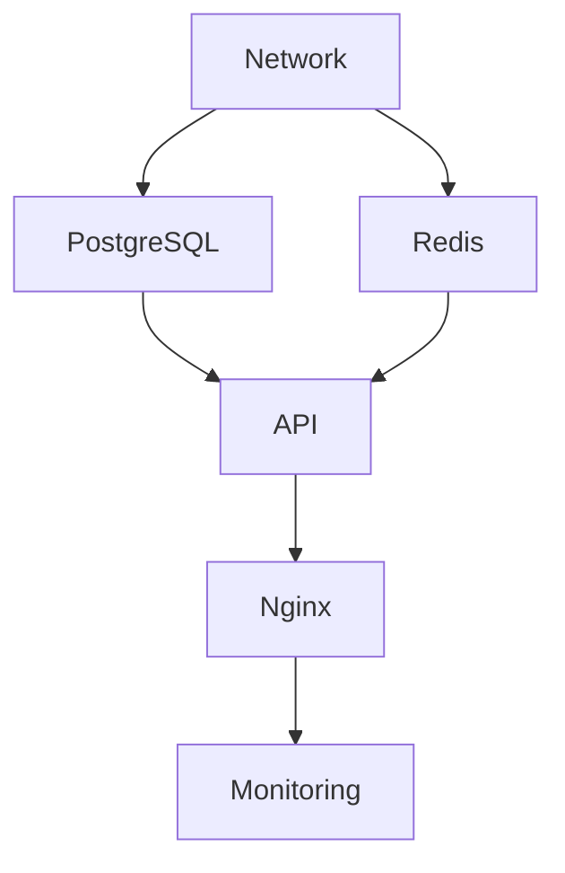

---

# Troubleshooting Workflow

Question:

Application won't start.

Step 1

Inspect.

```bash
systemctl status app
```

Step 2

Dependencies.

```bash
systemctl list-dependencies app
```

Step 3

Reverse dependencies.

```bash
systemctl list-dependencies --reverse app
```

Step 4

Logs.

```bash
journalctl -u app
```

Step 5

Find failures.

```bash
systemctl --failed
```

---

# Dependency Design Principles

Good systems should be:

```text
Simple

Loose coupled

Observable

Recoverable

Predictable
```

---

# Common Beginner Mistakes

## Mistake 1

Thinking Linux is a list.

Wrong.

Linux is a graph.

---

## Mistake 2

Using only:

```ini
After=
```

Wrong.

It does not create requirements.

---

## Mistake 3

Building circular dependencies.

Very dangerous.

---

## Mistake 4

Making everything mandatory.

Creates fragile systems.

---

# Engineering Mindset

Do not think:

```text
Linux starts services
```

Think:

```text
Linux solves dependency graphs
```

That is much closer to reality.

---

# Mental Model To Remember Forever

```text
Unit Files

↓

Dependency Graph

↓

systemd

↓

Execution Plan

↓

Linux
```

Or even simpler:

```text
Operating systems are dependency graphs.

systemd is the graph solver.
```

That single sentence explains modern Linux orchestration.
